# Self-Supervised Learning

## What is Self-Supervised Learning?

**Self-Supervised Learning:** A machine learning approach where a model learns from **unlabeled data** by generating its own **pseudo-labels**, without humans labeling the data first.

Then using the pseudo labels, solve problems traditionally solved by Supervised Learning.

Widely used in NLP (to creare the BERT and GPT models for example) and in image recognition tasks

### Why Self-Supervised Learning?

- Labeling data manually can be **very expensive** because humans have to label large amounts of data.
- Self-supervised learning avoids the need to label all the data first.
- The data is used to create its own labels.
- The model can learn useful patterns from a huge amount of unlabeled data.

### Self-Supervised vs Unsupervised Learning

Self-supervised learning may look similar to unsupervised learning because both can start with unlabeled data.

However, the important difference is:

- In **self-supervised learning**, the model creates labels from the data itself.
- These labels are called **pseudo-labels**.
- The model then uses these labels to solve learning tasks similar to supervised learning.
- Therefore, it is not simply unsupervised learning because labels are actually being generated and used.

| Learning Type | Data | Labels |
|---|---|---|
| Supervised Learning | Labeled data | Provided by humans or existing sources |
| Unsupervised Learning | Unlabeled data | No labels are generated for a supervised-style task |
| Self-Supervised Learning | Unlabeled data | Model/data automatically generates pseudo-labels |

## Intuitive Example: Learning from Text

1. Create "pre-text tasks" to have the model solve simple tasks and learn patterns in the dataset.

For example, we have Unlabeled data,

> Amazon Web Services, AWS, is a subsidiary of Amazon that provides on demand computing platform and ...

The text already contains useful structure useful grammar, prper sentence structure, etc

Using self-supervised learning, we can create tasks from this text so that the model learns these patterns **without humans explicitly explaining the language**.

The model learns the patterns by solving automatically generated tasks.

**Pre-text Tasks**

A key idea in self-supervised learning is the use of **pre-text tasks**.

**Pre-text Task:** A simple task created from unlabeled data that allows the model to learn useful patterns without requiring human-generated labels.

The pre-text task itself may not be the final useful task we care about. Instead, it helps the model learn an internal understanding of the data.

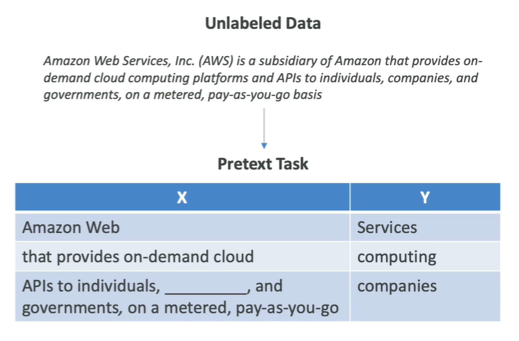

The model is learning from the existing structure of the text. The important point is that **the computer generates the labels**, rather than a human manually labeling each example.

### How Pre-text Tasks Are Created

From a large amount of unlabeled data, we can automatically create many pre-text tasks.

For example, the model can be asked to predict:

- The **next word**
- A **missing word**
- One part of an input from another part
- The **future from the past**
- The **masked part from the visible part**
- An **occluded part from the available parts**

The labels used for these tasks are generated automatically by the computer from the original data.

Therefore, humans do not need to manually create labels for every training example.

### Why Predicting Words Is Useful

At first, predicting the next word may not seem very useful. The final goal may not be to build a system that simply predicts the next word.

The important part is that, while solving many simple pre-text tasks, the model learns deeper patterns in the data.

For text, it can learn:

- English language structure
- Grammar
- Meaning of words
- Relationships between words
- General patterns in text

So the simple pre-text task is mainly a way to make the model **learn useful representations of the data**.

## Internal Representation

After solving many pre-text tasks, the model develops its own **internal representation** of the data.

**Internal Representation:** The useful information and patterns that the model learns internally about the input data.

The model can also create its own **pseudo-labels** as part of this process.

This means that the model has learned useful information from the original unlabeled data without humans having to manually label everything.

## Downstream Tasks

Once the model has learned useful representations through pre-text tasks, we can use it for more useful tasks.

These are called **downstream tasks**.

**Downstream Task:** A useful task that is performed after the model has learned general patterns from pre-text tasks.

For example, after learning a general understanding of text, the model can be used for:

- Text summarization
- Other supervised learning tasks
- Other useful language-related tasks

The overall idea is:

```text
Large unlabeled dataset
          ↓
Create pre-text tasks
          ↓
Generate pseudo-labels automatically
          ↓
Train model on simple tasks
          ↓
Model learns patterns and representations
          ↓
Use learned representation
          ↓
Solve downstream tasks
```

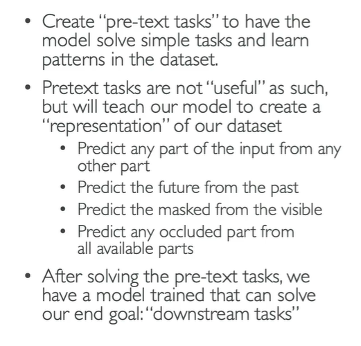

- **Self-Supervised Learning →** Learns from unlabeled data by generating its own pseudo-labels.
- **Pseudo-labels →** Labels automatically generated from the data instead of being manually created by humans.
- **Pre-text Task →** A simple automatically created task used to make the model learn patterns from data.
- **Downstream Task →** A useful task performed after the model has learned general representations.
- **Unlabeled Data →** Data that does not have human-provided labels.
- **Internal Representation →** Patterns and useful information learned internally by the model.

---
---

# Reinforcement Learning

## What is Reinforcement Learning?

**Reinforcement Learning (RL):** A type of machine learning where an **agent** learns to make decisions by performing **actions** in an **environment** and trying to maximize the **cumulative reward** over time.

A simple example is training an AI robot to find the exit of a maze.

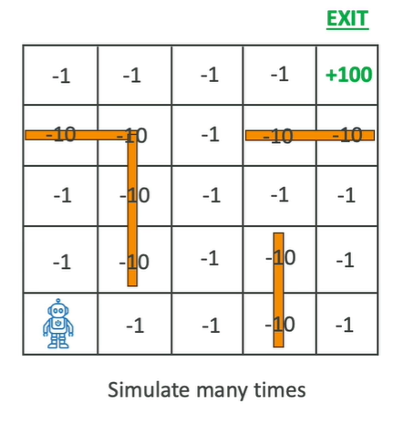

The agent repeatedly interacts with the environment, learns from the rewards it receives, and improves its decisions over time.

## Key Concepts of Reinforcement Learning

There are several important concepts in reinforcement learning:

| Concept | Meaning | Maze Example |
|---|---|---|
| **Agent** | The learner or decision maker | Robot |
| **Environment** | The external system the agent interacts with | Maze |
| **Action** | The choices made by the agent | Go up, down, left, or right |
| **Reward** | Feedback provided by the environment after an action | -1, -10, or +100 |
| **State** | The current situation of the environment | Robot's current position and what is available |
| **Policy** | Strategy the agent uses to decide what action to take based on the state | Which direction the robot should move |

The robot should try to:
- Find the exit.
- Find it using a short path.
- Avoid unnecessary steps.
- Avoid walking into walls.
Because the longer it takes to find the exit, the more points it loses.

The robot is going to do many simulations.

## Reinforcement Learning Process

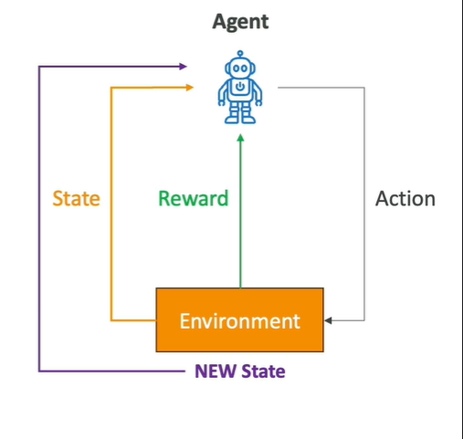

1. **Observe the state**
   - The agent looks at the current situation of the environment.

2. **Choose an action**
   - The agent uses its current policy to decide what to do.
   - For example: go up, down, left, or right.
   - The action changes the environment (takes an action)

3. **Receive a reward**
   - The environment provides feedback based on the action.
   - In the maze example, the reward could be `-1`, `-10`, or `+100`.
   - After the action, the environment is now in a new state.

4. **Update the policy**
   - The agent learns from what happened and improves its policy for future decisions.

5. **Repeat**
   - The process continues again and again.

The agent does not become good immediately. At first, the robot may move randomly through the maze. It then performs many simulations and learns from its mistakes.

The agent may run **thousands or even millions of simulations**. Over time, it learns how to properly navigate the environment.

The **main goal** is to **Maximize the cumulative reward over time.**

The agent is not simply trying to get a reward from one individual action. It learns which sequence of actions will produce the best overall result.

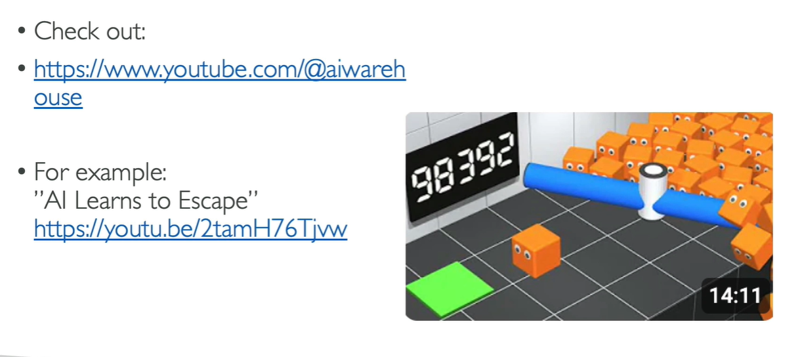

YouTube channel: **AI Warehouse**, where reinforcement learning is demonstrated visually.

## Applications of Reinforcement Learning

Reinforcement learning can be used in many areas.

| Area | Use Case |
|---|---|
| **Gaming** | Teach AI to play complex games such as chess and Go |
| **Robotics** | Teach robots to navigate and manipulate objects in dynamic environments |
| **Finance** | Portfolio management and training strategies |
| **Healthcare** | Optimize treatment plans |
| **Autonomous Vehicles** | Path planning and decision-making |

**Reinforcement Learning = Agent takes actions in an environment, receives rewards, learns from experience, and improves its policy to maximize cumulative reward.**

---
---

# Reinforcement Learning from Human Feedback (RLHF)

## What is RLHF?

**Reinforcement Learning from Human Feedback (RLHF):** A technique where **human feedback is used to help machine learning models learn more efficiently.**

In normal reinforcement learning, the agent learns using a **reward function**.

With RLHF, we incorporate **human feedback into the reward function** so that the model's behavior is better aligned with what humans prefer.

## RLHF in Generative AI

RLHF is widely used in **Generative AI applications**, including **Large Language Models (LLMs)**.

It can significantly enhance model performance by helping the model understand what humans consider a better response.

For example: Grading text translations from "technically correct" to "human"

## RLHF Example:

Imagine a company wants to build an **internal company knowledge chatbot**. The company wants the chatbot to provide responses that are aligned with human preferences.

RLHF can be used to achieve this.

### Step 1: Data Collection

First, collect **human-generated prompts and ideal responses**.

For example:

```text
Human Prompt:
"Where is the location of the HR department in Boston?"

Human Response:
[Ideal response created by a human]
```

These examples provide the model with information about what humans consider a good response.

### Step 2: Supervised Fine-Tuning

Next, start with an existing **base language model**.

The model is then **supervised fine-tuned** using the company's internal data. The purpose is to allow the model to work with the company's internal knowledge.

The model can then generate responses for the **same human prompts** collected in Step 1.

Now we have:

- A human-generated answer
- A model-generated answer

Now, Model generated responses are mathematically compared to human-generated answers.

However, mathematical comparison alone may not fully capture **human preference**.

A response can be technically correct but still be less natural or less useful to a human.

This is why RLHF introduces a separate **reward model**.

### Step 3: Build a Separate Reward Model

The next step is to build a **separate reward model**.

**Reward Model:** An AI model designed specifically to represent human preferences and provide a reward signal for reinforcement learning.

We will get two responses from a model for the **same prompt** (same prompt but different responses) and we will indicate which one we prefer from the same prompt.

The human does not necessarily write a new response. Instead, the human indicates **which response they prefer**. Many such comparisons are collected.

Over time, the reward model learns to fit **human preferences**. The reward model learns how a human would likely choose between responses.

## Step 4: Optimize the Language Model Using the Reward Model

Once the reward model has learned human preferences, it can be used as the **reward function for reinforcement learning**.

This part can be fully automated. Instead of requiring humans to judge every response during the entire training process, the reward model can automatically judge the responses.

Therefore, we can optimize the initial language model.

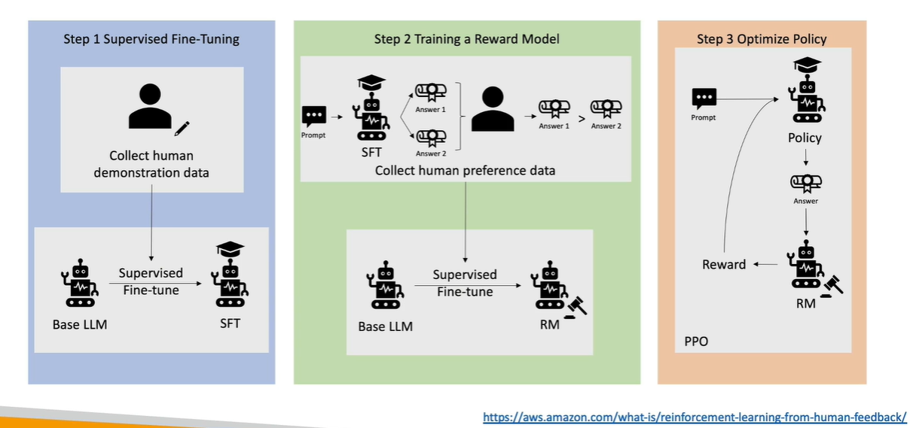

**Base LLM:** The original language model before the additional fine-tuning described in the process.

## RLHF vs Traditional Reinforcement Learning

| Concept | Traditional Reinforcement Learning | RLHF |
|---|---|---|
| **Reward** | Defined reward function | Reward incorporates human preferences |
| **Feedback** | Comes from the environment/reward function | Human feedback is used to train the reward model |
| **Goal** | Maximize cumulative reward | Maximize reward while aligning with human preferences |
| **Reward Model** | Not necessarily required | Separate reward model is trained |
| **Use in GenAI** | General RL approach | Commonly used for GenAI and LLMs |

---
---

# Model Fit, Bias, and Variance

## Model Fit

When a machine learning model has **poor performance**, there can be different reasons. One important thing to examine is the **fit of the model**.

### 1. Overfitting

**Overfitting:** When a model performs very well on the **training data** but performs poorly on **unseen/evaluation data**.

The model is trying too hard to reduce the error on the training data.

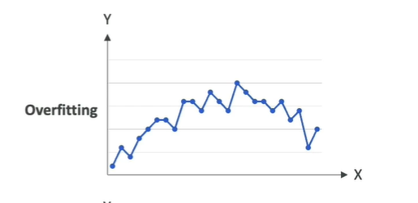

Here, Instead of finding the general trend, the model creates a line/curve that tries to connect or match almost every individual training point.

**Overfitting = Good on training data + Poor on unseen data**

### 2. Underfitting

**Underfitting:** When a model performs **poorly even on the training data**.

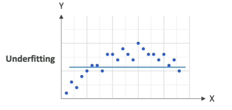

For example, the data points follow a clear trend, but the model uses a simple horizontal line. The model does not properly capture the shape or trend of the data.

Underfitting can happen because:

- The model is **too simple**.
- The data does not have good enough **features**.

**Underfitting = Poor performance on training data**

### 3. Balanced Fit

The goal is to have a **balanced model**. A balanced model is neither overfitting nor underfitting.

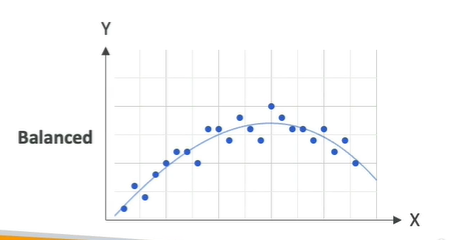

It should:

- Follow the general trend of the data.
- Have some error on the training data.
- Generalize reasonably well to new data.

A model will normally have some error because a model cannot predict everything perfectly.


## Bias and Variance

These help us understand why a model may underfit or overfit.

## Bias

**Bias:** The error or difference between the model's predicted values and the actual values.

Bias can occur when the machine learning process makes a poor choice, such as choosing a model that is too simple for the dataset.

A model will normally have some bias because no model is perfect.

### Example of High Bias

Suppose we have data points that follow a non-linear pattern, but we use a horizontal line to predict them. The model does not closely match the training data.

Therefore:

```text
Poor model choice
      ↓
Large prediction error (Underfitting)
      ↓
High Bias
```

#### High Bias and Underfitting

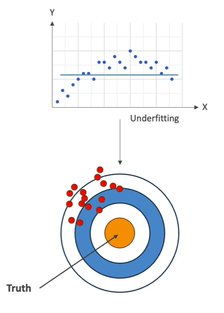

Here, The model doesn't closely match the training data. A model with **very high bias** is typically underfitting.

For example, a linear regression model may underfit when the dataset follows a **non-linear** trend.

Bias can also be understood using a dartboard. Imagine that the **center of the dartboard represents the truth**. With high bias, the predictions are consistently far away from the truth. The predictions are not close to the center.

**High Bias = Predictions are far from the truth on average.**

Bias means error in predicted value and actual value. As bias increases, error increases and the model tends to underfit.

#### How to Reduce Bias

To reduce bias, we can improve the model.

- Use a **more complex model** that fits the dataset better.
- Increase the **number of features** when the data is not prepared well enough.

## Variance

**Variance:** Represents how much a model's performance changes when it is trained on a different dataset wich has a similar distribution.

> **Variance tells us how sensitive the model is to changes in the training data.**

### High Variance

Consider an overfitting model that tries to match every training point. If we change the training dataset slightly, the model can change significantly.

```text
Small change in data
       ↓
Large change in model
       ↓
High Variance
```

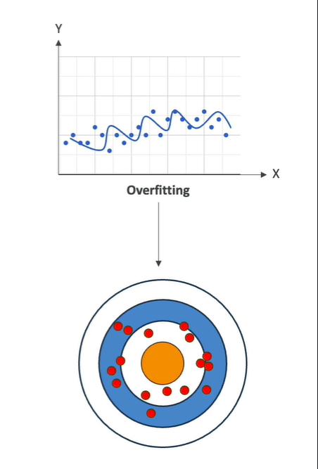

Your data is all over the place. It could be that on average, things converge to center, could be a low bias

This is why overfitting is associated with **high variance**.

### Overfitting and High Variance

When a model overfits:

- It performs very well on training data.
- It performs poorly on unseen test data.
- It is highly sensitive to changes in the training dataset.
- Its variance is very high.

**High Variance = Model changes a lot when the training data changes**

### How to Reduce Variance

- Featur selection
Instead of using many features, consider only the **more important features**.

- Split into training and test datasets multiple times.

The goal is to have **low bias and low variance**.

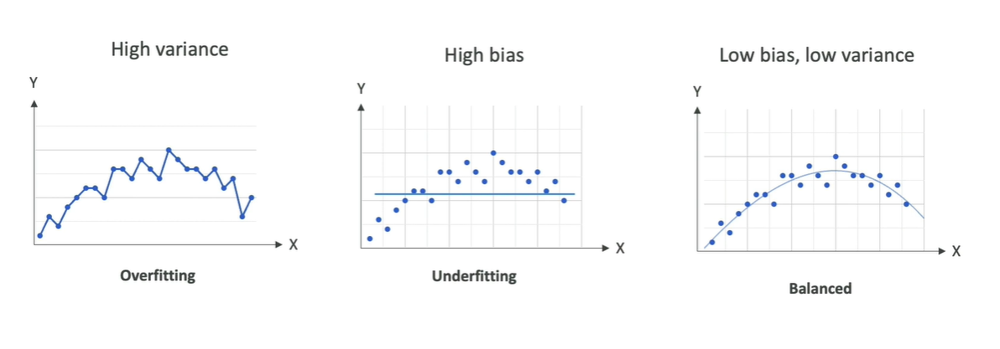

There will still be some bias and variance because no model is perfect. The goal is to find a good balance.

---

## Bias-Variance Matrix

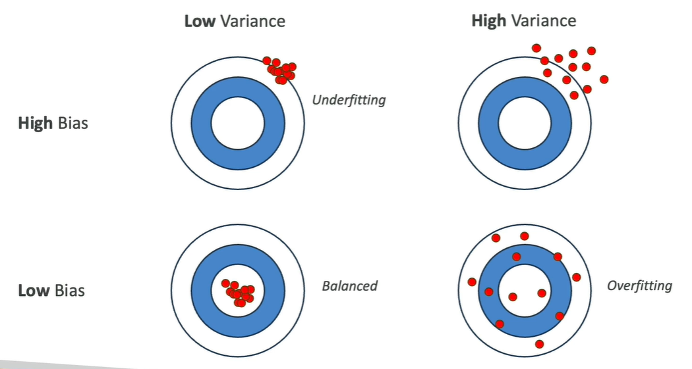

### 1. Low Bias + Low Variance → Balanced

- Predictions are close to the truth.
- Predictions are well-centered.
- The model does not change significantly when the training data changes.

### 2. High Bias + Low Variance → Underfitting

- Predictions are wrong on average.
- The model does not change much when the training dataset changes.
- The model is too simple or does not capture the data properly.

### 3. Low Bias + High Variance → Overfitting

- Predictions can be close to the truth on average.
- The model changes tremendously when the training dataset changes.
- The model is too sensitive to the training data.

### 4. High Bias + High Variance → Poor Model

- The model has high error.
- The model is also highly sensitive to changes in the training data.
- This is not a desirable model.

NOTE : 
High bias = High Error = High Underfit model
Low bias = Low error = High Variance = Overfit model

Variance = Changes in predictions from trained or new dataset. Even you asked same questions.

Variance is depneds on trained data (it is sensitive to training data) , not able to learn predictions, so when you give new data, it will not predict correclty but when you ask questions on trained data, it will give accurate ans but it has not understood the pattern, logic.

Low bias = Low error = high variance. = overfit
High bias = more error = low variance = underfit

---
---

# Model Evaluation Metrics

Model evaluation metrics help us understand how well a machine learning model performs. The metrics we use depend on the type of machine learning problem.

```text
                 Model Evaluation
                        ↓
              ┌─────────┴─────────┐
              ↓                   ↓
        Classification         Regression
              ↓                   ↓
     Confusion Matrix       MAE / MAPE / RMSE
     Precision              R²
     Recall
     F1
     Accuracy
     AUC-ROC
```

## Classification Metrics

For classification, the model predicts a **category**.

We have:

- The **true value**, which comes from our labeled data.
- The **predicted value**, which comes from our model.

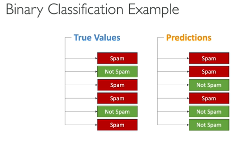

We can compare the true value and predicted value using a **confusion matrix**.

### 1. Confusion Matrix

**Confusion Matrix:** A table used to evaluate the performance of a classification model by comparing the model's predicted values with the actual values.

For binary classification, there are two possible classes. here,

- **Positive = Spam**
- **Negative = Not Spam**

The confusion matrix has four possible outcomes:

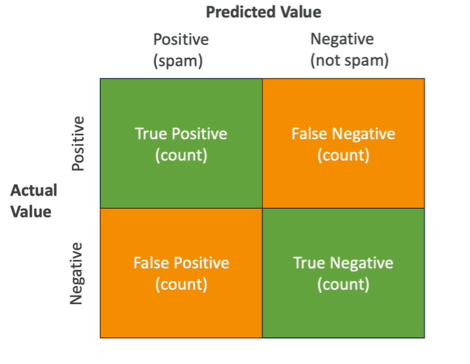

**True Positive (TP)**

The model predicted **positive**, and the actual value was also **positive**.

**False Negative (FN)**

The model predicted **negative**, but the actual value was **positive**.

**False Positive (FP)**

The model predicted **positive**, but the actual value was **negative**.

**True Negative (TN)**

The model predicted **negative**, and the actual value was also **negative**.

Ideally, we want to:

- **Maximize True Positives & True Negatives**
- **Minimize False Positives & False Negatives**

For example, if we have 10,000 predictions, we simply count how many predictions fall into each of the four categories.

#### More in confusion matrix

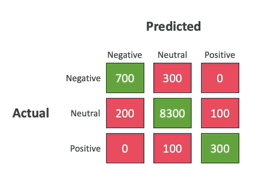

- Confusion Matrixes can be multi-dimensions too (multiple categories)
- It is best way to **evaluate the performance of a model that does classification**

### 2. Precision

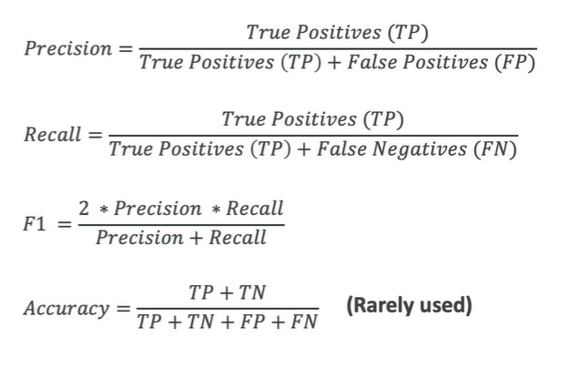

**Precision:** Measures how precise the model is when it predicts the positive class.

The formula is:

```text
Precision = TP / (TP + FP)
```

> When the model says something is positive, how often is it actually correct?

Precision is especially useful when **false positives are costly**.

### 2. Recall

**Recall:** Measures how well the model finds the actual positive cases.

The formula is:

```text
Recall = TP / (TP + FN)
```

> Of all the things that were actually positive, how many did the model correctly identify?

Recall is especially useful when **false negatives are costly**.

### 3. F1 Score

**F1 Score:** A metric that provides a balance between **precision and recall**.

The formula is:

```text
F1 = 2 × Precision × Recall
     -------------------------
       Precision + Recall
```

F1 is widely used with confusion matrices. It is especially useful when the dataset is **imbalanced** and you want a balance between precision and recall.

### 4. Accuracy

**Accuracy:** Measures how correctly the model classifies the data overall. It is **rarely used**.

It is mainly useful for **balanced datasets**.

**Balanced Dataset:** A dataset where the classification categories have a balanced level of representation.

For example, if the classes are:

```text
Class A → 50%
Class B → 50%
```

the dataset is balanced.

In contrast, a spam/not-spam dataset may not be balanced.

For example:

```text
Not Spam → Very large number
Spam     → Much smaller number
```

In such a situation, accuracy may not be the best metric.

### 5. AUC-ROC

**AUC-ROC:** Area Under the Curve for the Receiver Operator curve

It is another metric used for evaluating **binary classification models**.

The AUC value ranges from 0 to 1. where, 1 = Perfect model

#### ROC Curve

The ROC curve compares:

- **Sensitivity**, which is the **True Positive Rate**
- **1 - Specificity**, which is the **False Positive Rate**

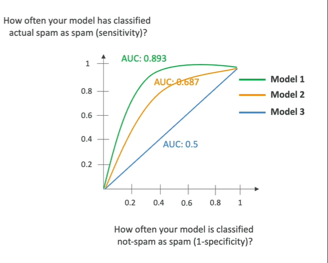

#### AUC

**AUC:** Area Under the Curve. The AUC represents the area underneath the ROC curve.

A straight diagonal line represents a **random model**. The better the model, the more the ROC curve tends to move toward the **top-left**.

-> AUC-ROC shows what the curve for true positive compared to false positive looks like at various  thresholds, with multiple confusion matrixes.

### How is the ROC Curve Created?

To create the ROC curve:

1. Look at different **thresholds** used by the model.
2. Vary the threshold.
3. Each threshold produces a different confusion matrix.
4. Calculate the corresponding rates.
5. Plot the results to create the ROC curve.
6. Calculate the area under the curve to obtain AUC.

So when you want to compare what is the right threshold and what is the right model for you, AUC-ROC can be useful.

**AUC-ROC curves** are looked at heavily when **choosing the best model** for binary classification.

---

## Regression Metrics

Regression is different from classification. In regression, the model predicts a **continuous value**.

A linear regression model tries to find a line that represents the data points. To evaluate the model, we measure its **error**.

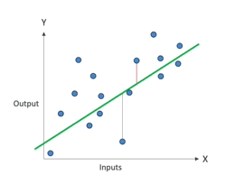

The error is the **sum of the distance** between :

- The predicted value
- The actual value

### 1. MAE

**MAE:** Mean Absolute Error.

MAE measures the average absolute difference between the predicted values and the actual values. MAE tells us, on average, how far the predictions are from the actual values.

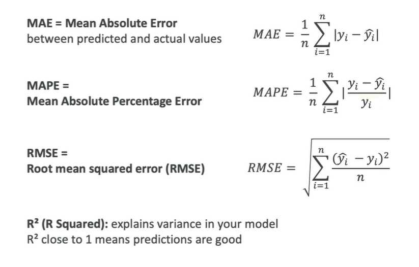

### 2. MAPE

**MAPE:** Mean Absolute Percentage Error.

Instead of computing the actual difference of values, MAPE computes how far the predictions are from the actual values as a **percentage**. (compute avg of these percentages)

### 3. RMSE

**RMSE:** Root Mean Squared Error. It is used to **smooth out the error**.

### 4. R² (R Squared)

**R² (R Squared):** Explains variance in your model

It indicates how much of the variance in the target can be explained by the input features.

R² close to 1 -> Predictions are good

A very good R² value close to 1 means that the input features can explain almost all of the variance in the target variable.

## Example: Predicting Student Test Scores

Suppose we want to predict how well students perform on a test based on how many hours they study.

MAE, MAPE, RMSE - measure the error : how "accurate" the model is

Suppose RMSE is 5, This means that, on average, the model's predictions are about **5 points away** from the actual student scores.

So RMSE provides an easy way to quantify the prediction error.

Suppose R² = 0.8 (measures variance), This means that approximately **80% of the changes in the test scores can be explained by how much the students studied**, which is the input feature in this example.

The remaining **20%** may be due to other factors, such as: Natural ability, Luck, Other factors that are not included as features in the model. Therefore, these factors may not be captured by the model.

If **R² is very close to 1**, This means the model can explain almost everything about the variance of the target variable using the input features available to it.

### More on regression metrics

MAE, MAPE, and RMSE are **error metrics**.

From a model optimization perspective, we generally try to **minimize these error metrics** so that the model's predictions are more accurate.

```text
MAE / MAPE / RMSE
        ↓
Lower error
        ↓
Better prediction accuracy
```

R² is interpreted differently:

```text
Higher R²
     ↓
More variance in the target
is explained by the input features
```

A value close to 1 is considered very good.

---
---

# Machine Learning Inferencing

## What is Inferencing?

**Inferencing** is when a trained model makes predictions on **new data**.

## 1. Real-Time Inferencing

The computer needs to make decisions **very quickly as data arise**.

#### Example: Chatbot

When a user enters a prompt into a chatbot. The user expects the response quickly.

> **Speed is preferred over perfect accuracy.**

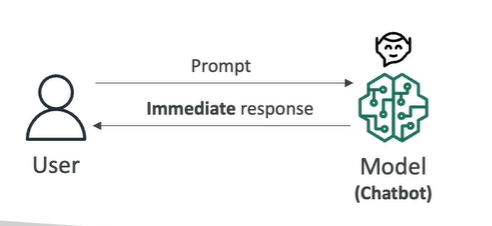

## 2. Batch Inferencing

**Batch inferencing** is when a **large amount of data** needs to be analyzed **all at once**.

For example,
You provide the whole data, wait for the processing to finish. The results are obtained when the processing is finished.

Batch inferencing is often used for **Data analysis**

> **Maximum accuracy is more important than speed.**

You still want the processing to be fast, but you **can wait** for the results. This means there is less pressure for an immediate response.

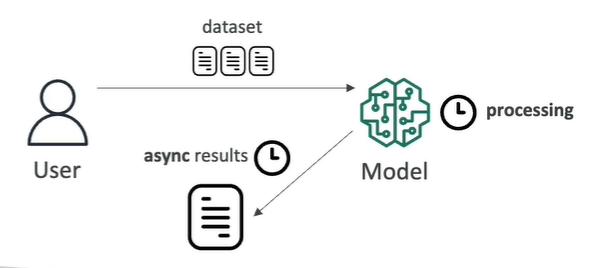

## 3. Inferencing at the Edge

### What is the Edge?

**Edge devices** are usually devices that:

- Have less computing power
- Are close to where the data is being generated
- In places where internet connections can be limited

Examples can include:

- Phones (but modern phones can be quite powerful)
- Other devices located far away from world

### Small Language Models on Edge Devices

Running a full **Large Language Model (LLM)** on an edge device can be difficult because the device may not have enough computing power.

Therefore, there is a popular trend toward **Small Language Models (SLMs)**.

A **Small Language Model (SLM)** is a smaller language model designed to work with more limited resources & on edge devices.

For example, an SLM can be loaded onto a:

**Raspberry Pi**

which is an example of an edge device.

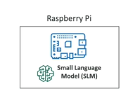

#### Advantages of Local SLMs

When the model is loaded directly onto the edge device:

1. Very Low Latency

Because The edge device can invoke the model **locally**. (There is no need to send a request to a remote server and wait for the response.)

2. Low Compute Footprint

A small model requires fewer computing resources than a large model.

3. Offline Capability

The device can perform **local inference without an internet connection**.


### LLM on a Remote Server

If you want to use a more powerful model, such as an **LLM**, running it directly on an edge device may be very difficult because the edge device may not have enough computing power.

One alternative is to run the LLM on a **remote server**.

For example, the model could be deployed using a service such as **Amazon Bedrock**. The edge device then makes API calls over the internet to the server (model or wherever its deployed)

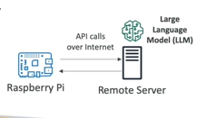

#### Advantages

The main advantage is **You can use a more powerful model because the model runs somewhere else.** The edge device does not need to have enough computing power to run the LLM itself.

#### Disadvantages

1. Higher Latency

The call needs to be made over the internet to get the results back. This takes more time than running the model locally.

2. Internet Required

The edge device must be  Connected to the internet in order to access the remote LLM.

## Local Edge Model vs Remote LLM

| Feature | Local SLM on Edge | Remote LLM |
|---|---|---|
| Model location | Edge device | Remote server |
| Model size | Small | Large / more powerful |
| Computing requirement on edge device | Low | Lower because model is remote |
| Latency | Very low | Higher |
| Internet | Not necessarily required | Required |
| Offline capability | Yes | No |
| Model power | More limited | More powerful |
| Main advantage | Fast local inference | Access to powerful models |

---
---

# Phases of a Machine Learning Project

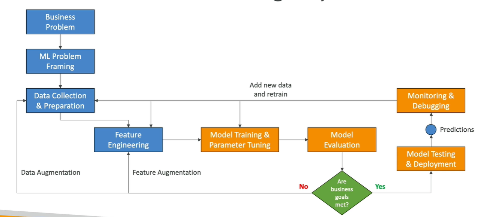

The process is **iterative**, meaning we may go through these phases multiple times.

## 1. Define the Business Goals

First, identify the **business problem** that needs to be solved.

The stakeholders of the project should define:

- The **value** of the project
- The **budget**
- The **success criteria**
- A **KPI (Key Performance Indicator)** that is critical to the project

A **Key Performance Indicator (KPI)** is an important measurement used to determine whether the project is achieving its goal.

## 2. ML Problem Framing

Frame the Problem as a Machine Learning Problem

Once the business problem is defined, we need to determine, Can this business problem be converted into a machine learning problem?

Determine whether **machine learning is actually an appropriate solution**. Because sometimes it is not.

Here, Different people can collaborate to convert the business problem into an ML problem:

- Data scientists
- Data engineers
- Machine learning architects
- Subject matter experts

## 3. Data Processing

Once we decide that machine learning is appropriate, we need to work with the data.

First, collect the required data. The data needs to be converted into a **usable format**.

The data should be made **centrally accessible** in one place so that it can be analyzed together.

Before applying a machine learning algorithm, we need to understand the data.

This includes:

- Pre-processing the data
- Visualizing the data
- Understanding the type of data

**Feature engineering:** Create, transform, extract variables from data. The goal is to transform the data into features that are useful from a **machine learning perspective**.

## 5. Model Development

Once the data is ready, we move into **model development**.

1. Train the model
2. Tune the model (tune hyperparameters)
3. Evaluate the model (eg. against test datasets)

Model development is not a one-time process. As we develop the model, we may discover that the data needs improvement. Therefore, **model development and data processing are very intertwined**.

If the model evaluation shows that model doesn't meet the expectations, then

- If we need to improve data, we can do Data Augmentation.

**Data augmentation** means improving the available data by adding more data when more data is needed.

- If we need to improve features, we can do Feature Engineering

**Feature engineering** means improving the features when the existing features need to be improved.

The overall idea is to repeat this process until a **satisfactory model** is achieved.

For example, model development may lead us to:

- Perform additional feature engineering
- Improve the data
- Tune the model's hyperparameters

---

## Exploratory Data Analysis (EDA)

An important phase at the beginning of a machine learning project is **Exploratory Data Analysis (EDA)**.

EDA means exploring the data to understand it before building the model.

During EDA, we can:

- Explore the data
- Compute statistics
- Visualize the data using graphs
- Understand the shape of the data
- Understand how influential different variables/features may be

One useful tool during EDA is a **correlation matrix**. A correlation matrix looks at the variables/features and calculates **how linked they are**.

For example, We can compare how strongly these variables are related.

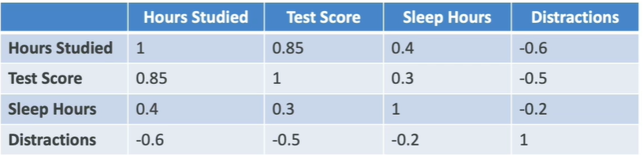

- Hours studied ↔ Test score = 0.85. A correlation of **0.85** means that when hours studied increase, test scores also tend to increase significantly. This is called a **positive correlation**.

It is not 1 because a value of 1 would represent a perfect relationship.

A correlation matrix helps us understand:

- Which features may be important to model
- How strongly features are related
- Relationships between variables

---

## 6. Retraining

- Look at data and features to improve the model
- Adjust the model training hyperparameters

## 7. Deployment

Once the model produces satisfactory results, we test it. If the results are good, the model is **deployed** & ready to make **inferences**, meaning predictions for users.

We select deployment models on the use case:

- Real-time
- Batch
- Serverless
- Asynchronous
- On-premises

## 8. Monitoring

Monitoring means deploying a system that checks whether the model is operating at the **desired level of performance**.

Monitoring helps with:

- Early detection & mitigation of problems
- Debugging issues
- Understanding model behavior after deployment

## 9. Iteration and Continuous Improvement

A machine learning model must be **continuously improved and refined** as new data becomes available. Because the requirements of the problem may also change over time.

Predictions made by the deployed model can generate new data.

If predictions are correct, this data can be added to the original datasets to make the datasets better and help retrain the model.

This creates a continuous feedback loop.

**Example: Clothing Prediction**

Imagine a model that predicts something related to clothing. What is true about clothing trends today may not be true in 10 years. People may wear different types of clothes in the future.

Therefore the model needs to be monitored and retrained so that it remains Accurate, Relevant, Useful over time

---
---

# Hyperparameter Tuning

## What is a Hyperparameter?

A **hyperparameter** is a setting that defines the Model structure, Learning algorithm & process. Hyperparameters are set **before training begins**.

They control **how the model learns**, rather than being learned directly from the training data.

-> Hyperparameters don't have anything to do with the data. Its just about the algorithm you are using to train the model.

### Why is Hyperparameter Tuning Important?

To get the **best model performance**, we need to find best values for the hyperparameters. This process is called **hyperparameter tuning**.

The goals of tuning include:

- Improve model accuracy
- Reduce overfitting
- Improve generalization

**Generalization** means how well a model performs on **new, unseen data**, rather than only on the training data.

### How to do it?

Use:
- Algorithms: Grid search, Random search, ...
- Services such as SageMaker Automatic Model Tuning (AMT)

There is generally **no single universally correct value** for a hyperparameter. The correct value depends on The model, The dataset, desired performance etc.

## Important Hyperparameters

### 1. Learning Rate

The **learning rate** represents how large or small the steps are when updating the model's weights during training.

> Learning rate controls **how quickly the model learns from new information**.

#### High Learning Rate

A higher learning rate means:

- Larger updates
- Faster convergence

However, there is a risk of **overshooting the optimal solution** because the model is taking very large steps.

#### Low Learning Rate

A lower learning rate means:

- Smaller updates
- More precise movement toward the optimal solution
- But Slower convergence

### 2. Batch Size

Batch size tells us **how many training examples are used to update the model weights in one iteration**.

For example, if you have 1,000 training examples and use a batch size of 100:

```text
1,000 training examples
        ↓
100 examples at a time
        ↓
Model update
        ↓
100 more examples
        ↓
Model update
        ↓
...
```

#### Smaller Batch Size

A smaller batch size can:

- Lead to a more stable learning experience
- Require more computation time

#### Larger Batch Size

A larger batch size may:

- Be faster to process
- Lead to less stable updates

### 3. Number of Epochs

An **epoch** is one complete pass through the **entire training dataset**. The **number of epochs** tells us how many times the model iterates over the entire training dataset.

The model goes through the entire dataset many times during training.

#### Too Few Epochs

If the model is trained for too few epochs:

```text
Too few epochs
      ↓
Not enough learning
      ↓
Underfitting
```

#### Too Many Epochs

If the model is trained for too many epochs:

```text
Too many epochs
      ↓
Model tries very hard to fit training data
      ↓
Risk of overfitting
```

### 4. Regularization

**Regularization** adjusts the balance between a **simple model and a complex model**.

> **To reduce overfitting, increase the amount of regularization.**

## What to do if Overfitting

**Overfitting** happens when a model performs very well on the **training dataset** but performs poorly on **new data in production**.

Overfitting can occur for several reasons.

1. Training data size is too small

If the training dataset is too small and does not represent all the possible values that may occur in production.

2. Training for Too Long

Training for too many epochs on a single sample set of data can lead to overfitting.

3. Model Complexity is Too High

A highly complex model may learn:

- Important features
- Noise in the training data

When the model learns the noise as well as the useful patterns, it can overfit.

### How to Prevent Overfitting

1. Increase Training Data Size

A very effective way to reduce overfitting is to **increase the training data size**. The larger dataset can be more representative of the possible values that will occur in production. **increasing the training data size is often the best answer** when asked how to prevent overfitting.

2. Use Early Stopping

If the model is already learning well, continuing training for more epochs may make overfitting worse. Therefore, **early stopping** can be used.

> More epochs do not always mean a better model.

3. Data Augmentation

If the training dataset does not have enough diversity, **data augmentation** can be used. The goal is to improve the diversity of the training data so that it better represents possible production data.

4. Adjust Hyperparameters (but you can't "add" them)

Hyperparameters can also be adjusted to help reduce overfitting.

However,

> Adjusting hyperparameters is usually **not the primary answer** when asked how to prevent overfitting.

The best answer is generally to **increase the training data size**.

Also, you cannot simply add new hyperparameters. The model/algorithm has its available hyperparameters, and you tune their values.

5. Ensembling

Another approach is **ensembling**. Ensembling combines multiple models to produce more accurate results.

```text
Model 1 ──┐
Model 2 ──┼──→ Combined result
Model 3 ──┘
```

---
---

# When is Machine Learning Not Appropriate?

A common question is **When should you NOT use machine learning?**

The key idea is that **ML is not always the best solution**. If a problem can be solved exactly and easily with normal computer code, then traditional programming is usually better.

### Example: Probability of Drawing a Blue Card

Consider this problem, A deck contains five red cards, three blue cards, and two yellow cards. What is the probability of drawing a blue card?

There are **10 cards in total**. Therefore:

```text
Probability of blue card = Number of blue cards / Total number of cards
                         = 3 / 10
```

## Deterministic Problems

A **deterministic problem** is a problem where the solution can be computed very easily.

It is better to write **traditional computer code** that is specifically adapted to the problem.

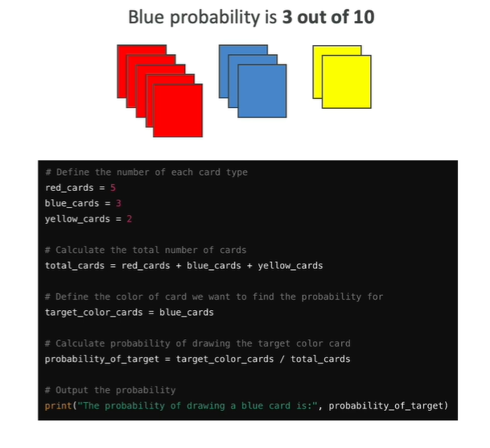

### Why Machine Learning Is Not Appropriate Here

Machine learning techniques such as:

- **Supervised learning**
- **Unsupervised learning**
- **Reinforcement learning**

may produce an **approximation** of the result. That means there can be some error. This is why we use **error metrics** when evaluating machine learning models.

But in the card problem, we do not want an answer with error. We want the **exact answer**.

## What About Large Language Models?

Modern **Large Language Models (LLMs)** have good reasoning capabilities and may be able to solve problems like this correctly.

However, their solution is **not guaranteed to be perfect**. we may have a **worse solution**.

> **The best solution for a very well-defined problem is to write code.**