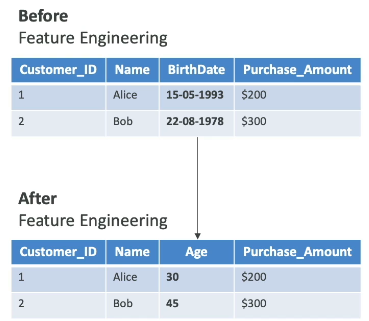

AI Components
---

- **Data Layer** - colect vast amount of data

- **ML Framwork and Algorithm Layer** - Data scientists and engineer work together to understand use cases, requirements, and framworks that can solve them

- **Model Layer** - Model will train , and deploy model. We have the structure , the parameters and functions, optimizer functions

- **Application Layer** - Serve this model , so we create what's we called `Application Layer` and so this is where we expose our model.

What is Machine Learning ?
---

- ML is a type of AI for building methods that allow machine to learn.

- Data is leveraged to improve computer performance on a set of work.

- Make predictions based on data used to train the model

- No explicit programmning of rules.

What is Deep Learning ?
---

- Deep learning is a subset of machine learning.

- We uses concept of `neurons` and `synapses` to train a model

- By using DL you are able to process more complex patterns in the data than traditional ML.

- **Deep Learning** because there's more than one layer of learning.

- EX. `Computer Vision` - Image classification, object detection, Image segmentations.

- Ex. `Natural Language Processing (NLP)` - text classifications, sentiment analysis, machine translation, language generations.

What is the Transformer Model ? (LLM)

- It;s process `a sentences as whole` instead of `word by word`.

- which is faster and more efficient text processing 

**Transformer based LLMs**

- Powerful models that can understand and generate human-like text

- **Transformer LLM** has trained on vast amount of text data from the internet, books, and other sources, and learn patterns and relationships between words and phrases.

- **Transfomer LLM** process `a sentence as whole line` instead of word by word.

- Ex. ChatGPT, Google BERT.

ML Tearms You May Encounter in the Exam
---

- **GPT (Generative Pre-Trained Transformer) - Generate human text or computer code based on input prompts

- **BERT (Bidirectional Encoder Representations from Trnasformers)** - Similar to GPT, but it reads the text in two directions

- **RNN (Residual Network)** - Deep Convolutional Neural Network used for **Img recognition tasks**, **Object detections** **Facial recognitions**

- **SVM (Support Vector Machine)** - ML algorithms for classification and regressions.

- **WaveNet** - model to **generate raw audio waveform**, used in **Speech Synthesis**.

- **GAN (Generative Adversarial Network)** - models used to generate synthetic data such as **Image**, **Videos** , **Sounds** that resemble the training data. Helpful for **Data Augmentations**.

- **XGBoost (Extreme Gradient Boosting)** - an implementations of gradient boosting.

Training Data
---

### Labeled Data

- Data includes both input features and output labels.

Features - We are giving data as img as `input features` and otput label corresponds to what the image is. dogs or cats.

- Ex. Dataset with images of animals where each image is labeled with the animal types (cat, dog)

- When we have `labeled data` we called **Supervised Learning**, where the model is trained to map inputs (image of animals) to known outputs.

- Output = This img should have a predicted value of dog.

### UnLabeled Data

- Data only includes `input featurs` `without any output labels`.

- Ex. A collection of images without any associated labels.

- We have images of dogs and cats **without labels** and We will give images of dogs and cats only.

- We will not say to alogrithms that this is dogs or cats.

- **UnSupervised Learning**, `Where the model tries to find unique or complex patterns or structures in the data and making group of patterns.

- So when we provides unlabeled data to ai, it will find pattern and creates cluster of that unique pattern data. 

- Like 2 img of dog - find patterns , put it into one cluster or group of dogs.

- Rest of 4 img of cat - find pattern , put it into another cluster or group of cats.

### Structured Data

- Data in strctured formate like rows and columns.

#### 1. Tabular Data

  - Data is arranged in a table with **rows** `representing Records` and **columns** `representing Features`.

| Customer_ID | Name | Age | Purchase_Amount |
| --- | --- | --- | --- |
| 1 | Alice | 30 | $200 |
| 2 | Bob | 45 | $300 |

### UnStructructure Data

- Data doesn't follow a structure like table and it is often `texy-heavy` or `multimedia` content.

- Text , Post, Reviews, articles, Images etc.

ML Algorithms for Supervised Learning
---

- ML requires labeled data. But if you have 1 Million unlabeled data, you want to labele all this 1 M Data, Its difficult by manually.

- So we will labele only 20% of data, ML will learn from this 20% labeled data, and rest of 80% unlabeled data will be predict.

### 1. Regressions - Supervised Learning

- Used to predict a **numeric value** bbased on input data.

- Output variable is **continuous**, means it can take any value within a range.

- Ex. Predcit a Real Value, Live Value.

- Ex. Predicting House Prices - features like size, location, number of bedrooms

- Stock Price Prediction , Weather forecasting

### 2. Classifications - Supervised Learning

- Used to predict **Categorical label of input data**.

- Output variable is **Discrete**, which will fall into a specific category or class.

- **Use Cases** - Where decision or predictions need to be made between distinct categories (`Fraud`, `Img classification`, diagnostics)

- Ex. `Binary Classifications` - calssify email as spam, not spam

- `Multiple Classification` - Classify animals in a zoo as `mammal`, `bird`, `reptile`.

- `Multii-Lable Classification` - You don't want to have one label attached to an output but want to attach labele to multiple once. Like Movie like `action` and `comedy`.

Training vs Validation vs Test Set
---

**Training Set**
  - 80% of data will used for training the model to learn pattern, structure.

  - (e.g., 800 labeled images out of 1,000).

**Validation Set**
  - **How to know model is worknig correctly or not ?**

  - Used to tune model hyperparameters and evaluate performance during training without exposing the model to test data (e.g., 100 labeled images used to fine-tune settings).

**Test Set**
 
  - Rest of 10% of remaining images that have not been used for training or for validations. So we can evaluate accuracy of model.

  - Used at the very end as unseen data to evaluate how well the final model generalizes to real-world scenarios.

Feature Engineering
---

- The process of using domain knowledge to select and transform raw data into meaningful feature.

- For instance, There is one table for customer id, name, birth date, purchase amount.

- Birth data columns has date formate which is not understand and useful for machine learning model.

- So, By using feature engineering , birth date column will converted into Age columns which will has only digit like 20, 40 age.

- **Techniques**

  - **Feature Extarctions** - extract useful info from raw data, such as deriving age from date of birth.

  - **Feature Selection** 

  - **Feature Transformations** - Transform data for better model performance, like normalizing numerical data

**Feature Engineering on Unstructure Data**

- **Text Data** - Converting text into numerical features using `TF-IDF` or word embeddings

- **Image Data** - Extract edges or textures using CNNs.

AWS AI Practitioner - Unsupervised Learning
ML Algorithms – Unsupervised Learning
---

Core Concepts:

  - Definition: Algorithms designed to discover inherent patterns, structures, or relationships within input data without ground-truth labels.
  - Labeling: The machine uncovers and creates the groups/clusters itself on unlabeled data, though humans may still assign labels or interpretations to the output groups.

Common Techniques:

  - **1. Clustering**: Grouping similar data points together.
  - Association Rule Learning: Finding relationships between variables.
  - Anomaly Detection: Identifying outliers or unusual patterns in data.

Practical Use Cases:

  - Customer segmentation
  - Targeted marketing
  - Recommender systems

  - **2. Association Rule Learning**
  - Identify relationship between 2 variables, products
  
  - Data: transcation records from customer purchase

  - If customer buy milk , which other procut they must buying with milk. like butter, bread.

  - This relationship can be identify by using **Apriori alogrithm**.

  - **Anaomaly Detections** - Use for **Fraud Detections**

  - Use to detect **faudulent credit card transactions**

  - We want to see **Which trans is very diff from typical behavior.

  - We use **Isolation Forest Techniques**.

  - **3. Semi-Supervised Learning**

  - Use small amount of data like 20% of data of unlabeld data to train model.

  - This 20% trained data will be used to labeled the rest of unlabeled data.

  - This is called **Pseudo labeling**.