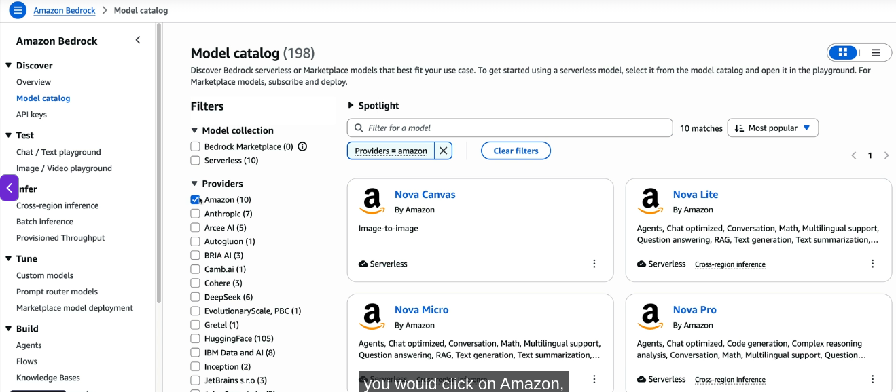
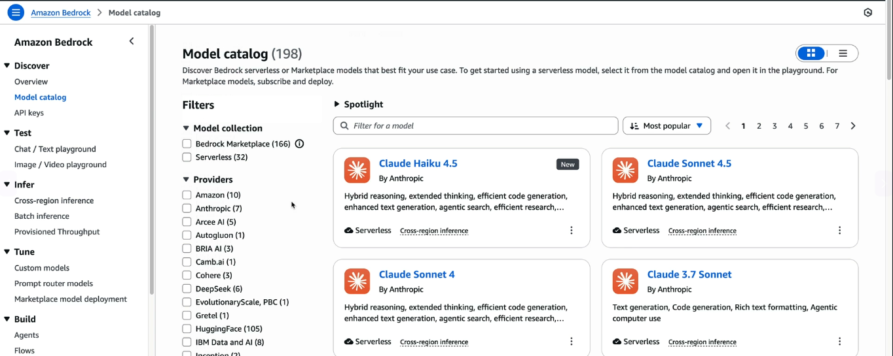
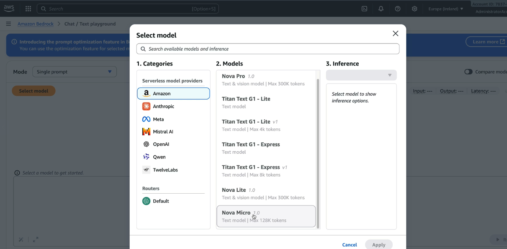
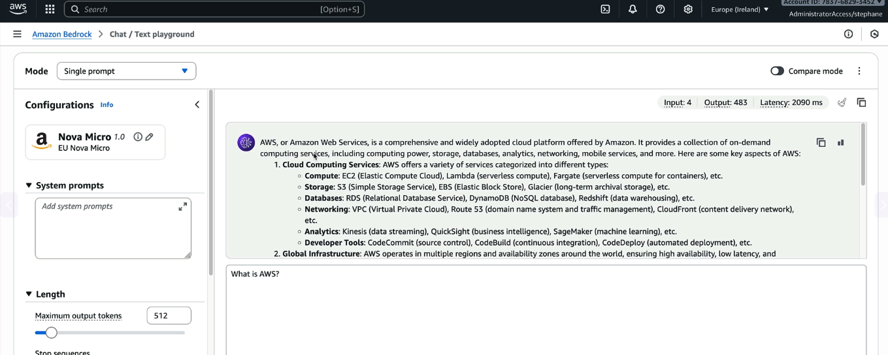
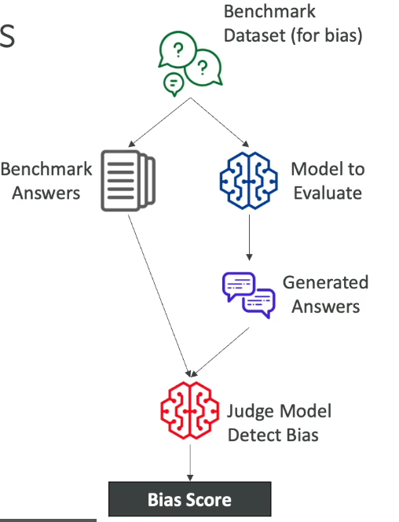
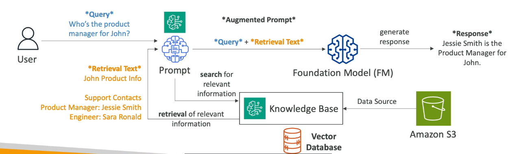
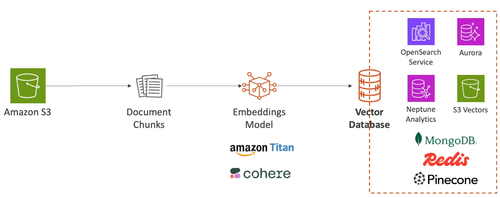
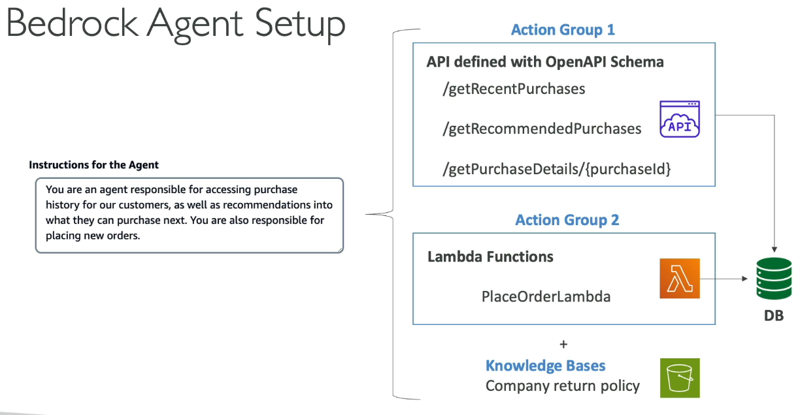

ML Types
---

**1. Supervised ML**

- We provides feature about product or data and also give labele to predict output about what is this ?

**2. UnSupervised ML**

**3. Semi-Supervised ML**

**4. ReInforcement ML**

Amazon Badrock
---

- It is fully managed service where we can build generative ai applications, we can train the model.

- We can use feature like RAG, LLM Agents etc.

- `Customer Responsibility` - Control your data from your side to train the modle.

Amazon Bedrock - Foundation Models
---

- What type of foundation modle we have to access in bedrock , to train model, publish model.

  - AI21labs,
  - cohere,
  - stability.ai,
  - amazon,
  - ANTHROP\c,
  - Meta,
  - MISTRAL AI

- Whenever you will use this models in bedrock - Aws will makes a copy of this foundation model, which is available only to you.

- You can fine-tune with your own data later.

- If you are using aws bedrock to build, train your modle , using your data, it **will never use your data to train this Foundation model back**.

- That's for aws bedrock makes a copy of this foundation model , and in this copy model you can train, build your model.

- Foundation model of AWS

- Foundation model of claude

- `Test a model`

- Ask Prompt

Amazon Bedrock - Base Foundation Model
---

**How to choose Foundation Model ?**

  - Model types, performance requirement, compliance.

  - Level of customizations - how much can you customize this aws bedrock foundation model as per your requirement.

  - MultipModel

**What's Amazon Titan ?**

  - It's High-Performing Foundation Model

  - It supports to create Image, Text, Multimodel choices
  - It can be customized with your own data
  

Amazon Bedrock - Fine-Tuning a Model
---

- **Supervised Fine-Tuning**

  - It improves the performance of a Model on a Specific tasks.

  - `Supervised Fine-Tuning` uses **labeled examples** that are **input-output pairs**.

- **Reinforcement Fine-Tuning**

  - Improves your Model by using **feedback-based learning**

  - You provide the `Input Data`

  - Model will gives output, You will define a **Reward Functions** to evaluate responses output of Model and judge which responses are good.

  - This is called `feedback`.

  - This feedback goes to the Model and model will re-train/fine-tuning.

  - Ex. 1. Techincal customer support chatbot, 2. Sample customer prompt.

- **Fine-Tuning: Good to Know**

  - Re-training a Foundation Model requires a Higher budget.
  - Supervised Fine-Tuning is usually cheaper as computations are less intese and less data is usually required.

  - It also requires experienced ML engineers to perform the task.
  - You must prepare the data, do the fine-tuning, evaluate the model.
  - Running a fine-tuned model is also more expensive

    - Option 1: Run the custom model "On-Demand" (Price per tokens)
    - Option 2: Purchase provisioned throughput (Billed per month)

FM Evalutaions
---

**1. Automating Evaluations**

- When evaluating FMs in Bedrock, you generally choose between two primary methods:

* **Automatic Evaluation**: Fast, programmatic, and low operational effort.
* **How it works:** You submit benchmark questions to the model. A **Judge Model** (another GenAI model) or an automated script compares the generated responses to your "ideal" **benchmark answers**.
* **Use Cases:** Evaluating text summarization, Q&A, classification, or checking for model bias and toxicity quickly.
* **Datasets:** You can use AWS-curated benchmark datasets or bring your own domain-specific dataset.

* **2. Human Evaluation**: Essential for subjective quality, alignment, and nuanced business logic.
* **How it works:** Real humans (internal employees, domain experts, or AWS Managed Teams) review the model outputs side-by-side.
* **Evaluation Methods:** Thumbs up/down, Likert scale ratings (1 to 5 stars), or pairwise ranking (choosing which of two model responses is better).

### **2. Key Automated Evaluation Metrics**

For the AWS AI Practitioner exam and real-world deployment, you must match the right evaluation metric to the right task:

| Metric | Full Name | Primary Focus | How it Works |
| --- | --- | --- | --- |
| **ROUGE** | Recall-Oriented Understudy for Gisting Evaluation | **Summarization** & Machine Translation | Measures overlapping **n-grams** (word sequences) or longest common subsequences (**ROUGE-L**) between the reference text and generated output. |
| **BLEU** | Bilingual Evaluation Understudy | **Machine Translation** | Measures precision of n-gram matches. Penalizes responses that are too short (brevity penalty). |
| **BERTScore** | BERT-based Semantic Evaluation | **Semantic Similarity** (Meaning & Context) | Converts words into vector embeddings and measures **cosine similarity**. It evaluates context rather than exact word matches. |
| **Perplexity** | N/A | **Model Confidence** & Next-Token Prediction | Measures how uncertain a model is when predicting the next token. **Lower perplexity = higher model confidence.** |

### **3. Business & Operational Metrics**

While algorithmic metrics measure output accuracy, real-world AWS AI solutions must also deliver business value:

* **Conversion Rate & Revenue:** Measuring if GenAI features (e.g., dynamic product descriptions) increase user purchases or average revenue per user (ARPU).
* **Efficiency & Cost:** Balance model response speed (latency) and token cost against performance.
* **User Satisfaction:** Collecting implicit feedback (click-through rates) or explicit feedback (thumbs up/down) directly in your application.

### **Exam & Practical Key Takeaways**

* **Bias Detection:** Use built-in AWS benchmark datasets in Automatic Evaluation for rapid, low-effort detection of potential bias or toxic outputs.
* **Exact Words vs. Meaning:** Use **ROUGE/BLEU** for word-level precision tasks (summaries, literal translations) and **BERTScore** when the *meaning* matters more than the exact wording.
* **Feedback Loops:** Use evaluation metrics to drive continuous model refinement, prompt engineering adjustments, or fine-tuning pipelines.

Would you like to explore how to set up an Automatic Evaluation job step-by-step inside the Amazon Bedrock Console, or walk through a few AWS AI Practitioner-style practice questions on this topic?

Amazon Bedrock - RAG & Knowledge Base
---

**RAG** = Retrieval-Augmented Generations

**RAG** allows a FM Model to Reference a data source outside of its training data.

We have **Knowledge Base** which is built and managed by AWS Bedrock.

**Knowledge Base** is must relies on a data source like S3.

**User** will ask questions to your foundation model like `Who's the product manager for John ?`

**Your Foundation Model** doesn't know about this data, bcz its not included in FM Model's training data.

Your FM Model doesn't know anything about `Johns`.

So there's going to be something called a `search` and this query/prompt will going to be serach in `Knowledge Base` automatically.

`Knowledge Base` is backed by **Vector DB** for **Vector Embedding** Purpose to generate relevent data.

**Bedrock** will take care of creating vector embeddings in the database of your choice based on your data.

Now It will retrive data and send back to your FM Model with this retrived data.

**User Query + Retrived Text** == **Augemented Prompt**.

This `Augemented Prompt` will goes to your FM Model.

Your prompt/data source will deviced into small chuncks is called `Embedded`. This embedded data will going to `Embeddings Model` and after that going to **Vector DB** like **OpenSearch Service**, **Aurora**, **Neptune Analytics**, **S3 Vectors**, **MongoDB**, **Redis**, **Pinecone**.

**What type of Vector Databse to choose ?**

* **1. Amazon Aurora PostgreSQL**  - Relational DB

* **2. Amazon Neptune Analytics** - If you wanna to have graph analytics and graph based RAG called `GraphRAG` solutions.

* **3. Amazon S3 Vectors** - If you wanna very cost effective and durable stotrage with sub-second query performance

**4. Amazon OpenSearch Service** - 

Amazon Bedrock - RAG Data Sources
---

- S3
- Confluence
- Microsoft SharePoint
- Salseforce
- Web Pages ( Your Website, Your 
social media feeds etc)

Amazon Bedrock - GuardRails
---

- You can control the interaction between users and Foundation Models.

- You can filter `Undesirable` and `Harmful` Content.

- Ex. Your business is related to food and recipes.

- Customer / User entered prompt "Hey! Can you give me recipe to cook burger ?"

- `GuardRails` will restrict this topic bcz you restricted to this topic by Gaurdrails.

- Remove Persionally Identifiable Informations (PII)

- You can Enhanced Privacy

- You can Reduce Hallucinations

- You can create `Multiple Gaurdrails` and monitor and analyze user inputs that can violate the Guardrails.

- You can configure Guardrail to Restrict below topics.

  - Content Filters
    - A. Harmful Categories
      - a. `No Hate`
      - b. `No Insult`
      - c. `No Sexual`
      - d. `No Violence`
      - e. `No Miscounduct`
    - B. Prompt Attacks
  - Denied topics
  - Word Filters
  - Sensitive Informations filters
  - Contextual Grounding Check

Amazon Bedrock - Agents
---

- Instead of asking questions to a model, Now the model will going to think to perform multistep tasks.

- So Agent can create Infrastructure, Deploy applications and Ops activities.

- Agent will look into tasks and perform tasks in the correct order and ensure informations is passede correctly between the tasks even if we haven't programmed the agent to do so.

- We will createe `Action Group` - Agent will configured to to understand what these action groups do.

- We can integrat agent with other systems, services, databases and APIs to exchange data or initiate actions.

- If informations / data is out of training data it will look for RAG to retrieve informations when required.

## **Agent Setup**

### 1. We will Define Instructions for the Agent which tells to agent what to do , what is responsible for agent.

  - "You are an agnet responsible for accessing purchase history for our customer, as well as recommendatinos into what they can purchase next. You are also responsible for placing new orders".

### 2. Define Action Group 1

  - We will define action group so that agent can know how to do for particular APIs to Get histroy, get purchase details etc.

  - So all documentations around it, what these APIs are do, what is expected input from user , all thise provided by `OpenAPI Schema`.

  

Amazon Bedrock & CloudWatch
---

### 1. Model Invocation Logging

- We can Integrate CloudWatch with BedRock to Send all Invocations of BedRock Agents, All logs by using CloudWatch Insights to Amazon S3.

- This can include text, images and embeddings

- So we can analyze the logs in real time from cloudwatch logs.

- We can get full tracing and monitoring of Bedrock.

### 2. CloudWatch Metrics

- Amazon Bedrock is going to publish a lot of different metrics to CloudWatch.

- We can build CloudWatch Alarms on top of this metrics.

Amazon Bedrock - Pricing
---

**On-Demand**

  - Pay as you go
  - Text Models - Charged for every input/output token processed

  - Embedding Models - Charged for every input token processed

  - Image Models - Charged for every image generated

  - Works with Base Models and Custom Models

**Batch for Cost Optimizing**

  - In this Batch Mode, You can make multiple prediction at a time, and the output is going to be in a single file in S3.

  - You can get discount of up to 50%.

**Provisioned Throughput**

  - **Purchase model units for 1 month, 6 month** is guarrenty, that means, You are going to get a max  number of Input/Output tokens processed per minutes.

  - This Must Requires `You have a Fine-Tuning Model` or `Custom Model` or `Imported Model`.

  - **You can't use On-Demand Model, If you want to use Provision Throughput**.

Model Improvement Techniques Cost Order
---

- `Very chipest` - Prompt Engineering

  - No model training required. 
  - No additional computations or fine-tuning.

- `low chipest compaire to Prompt Engineering` - Retrieval Augemented Generations 

  - Use Exteranal Knowledge Base.

  - No FM Changes.
  - This is little bit cost rather than to Prompt Engineering bcz you will requires to use Vactor DB.

- `Costly` - Instruction-based Fine-Tunging
  - FM is fine-tuned with specific instructions which requires additional computations.

- `Very High Costly` - Domain Adaption Fine-Tuning

  - Model is trained on a domain-specific dataset.

  -This requires Intensive Computations.

  - Here you will adopt a FM Model.
  - You will train this model for your domain, for your specific tasks.

  - This will generate a lot of data.

  - Again , Re-Train this model.

**Cost Saving How to do ?**

* **1. On-Demand** - Great for Unpredictable workload.

* **2. Batch** - Provides upto 50% discount. You have to wait little bit for your result.

* **3. Provisioned Throughput** - Greate to **Reserve for 1 month, 6 month , 1 year**, But **This is not Cost-Saving Stretagy**.

* **4. Model Size** - Smaller model is cheaper but this is depends on which is provider.

* **5. Temperature, Top K, Top P** - If you set this parameters it will not impact on Pricing.

* **6. Number of Input / Output Tokens** - This is main driver of cost saving.

  - Try to get your prompt as efficiently written as possible and get output as short as possible 

To pass the **AWS Certified AI Practitioner (AIF-C01)** exam, you don't need to know how to code these models from scratch, but you **must know how to match the right Amazon Nova model to the specific scenario or prompt in the exam question.**

### What is Amazon Nova?

**Amazon Nova** is AWS’s own proprietary family of **Foundation Models (FMs)**, accessible via **Amazon Bedrock**.

In exam scenarios, AWS will test your ability to balance **Cost, Latency (speed), and Accuracy** by choosing the correct model category.

### Key Exam Distinctions (By Category)

#### 1. Understanding Models (Text & Multimodal Input)

These models answer questions, analyze data, and summarize inputs.

| Model | Exam Keywords & Core Purpose | Best Exam Scenario |
| --- | --- | --- |
| **Nova Micro** | • **Text-only** 

 • Lowest latency (fastest) 

 • Lowest cost | High-volume simple text processing, basic text classification, fast translation, basic chat where speed/cost matters most. |
| **Nova Lite** | • Low-cost **multimodal** (Text + Image + Video input) 

 • Fast speed | Processing high-volume images or video content alongside text at a very low budget. |
| **Nova Pro** | • Balanced accuracy, speed, and cost 

 • Complex tasks & agentic workflows | General enterprise workloads, software development/coding, video summarization, multi-step AI agents. |
| **Nova Premier** | • Most capable / highest reasoning 

 • **Teacher model for Model Distillation** | Extremely complex reasoning tasks, or generating synthetic data/logs to train smaller models. |

#### 2. Creative Models (Visual Generation Output)

These models generate visual media based on prompts.

| Model | Output Type | Best Exam Scenario |
| --- | --- | --- |
| **Nova Canvas** | **Images** | Generating marketing visuals, product mockups, or image editing (inpainting/outpainting/background removal). |
| **Nova Reel** | **Videos** | Generating short videos, studio-quality motion clips, or animated commercial content. |

#### 3. Speech Models (Audio Output/Input)

This model handles voice interactions.

| Model | Output Type | Best Exam Scenario |
| --- | --- | --- |
| **Nova Sonic** | **Speech-to-Speech** (+ Text) | Real-time conversational voice agents, interactive customer support hotlines, multi-lingual audio responses. |

### 💡 Exam Cheatsheet Tricks

* **Need image/video processing at a low budget?** $\rightarrow$ Choose **Nova Lite** (it's multimodal, unlike Micro).
* **Need the absolute lowest latency and text-only?** $\rightarrow$ Choose **Nova Micro**.
* **Question mentions "Model Distillation" or "Teacher Model"?** $\rightarrow$ Choose **Nova Premier**.
* **Question asks to generate realistic images?** $\rightarrow$ Choose **Nova Canvas**.
* **Question asks to generate realistic videos?** $\rightarrow$ Choose **Nova Reel**.
* **Question asks for real-time speech/voice dialogue?** $\rightarrow$ Choose **Nova Sonic**.

**Amazon Nova 2** is the second-generation upgrade to the Nova foundation model family on **Amazon Bedrock**.

For the **AWS AI Practitioner (AIF-C01)** exam, the main upgrade theme for Nova 2 is: **Larger Context Windows (1M tokens), Advanced Reasoning, Multi-Modal Embeddings, and All-in-One Capabilities**.

### Core Upgrades & New Models in Nova 2

Here is the cleaned-up and properly formatted Markdown table.

The HTML line breaks (` `, `  `) have been removed to fix the layout issues, and bullet points are aligned cleanly for quick exam review.

### Core Upgrades & New Models in Nova 2

Yes. The main issue is that the **bullet points are breaking the Markdown table structure**. Each model should have all its information inside the same table cell.

For **AWS Certified AI Practitioner exam preparation**, I would structure it like this:

| **Nova 2 Model**                 | **What It Does — Core Concept**                                                                                                                                                                          | **Exam Keywords / When to Use**                                                                                                                                                                                                    |
| -------------------------------- | -------------------------------------------------------------------------------------------------------------------------------------------------------------------------------------------------------- | ---------------------------------------------------------------------------------------------------------------------------------------------------------------------------------------------------------------------------------- |
| **Nova 2 Lite**                  | • Low-cost, fast reasoning model for everyday workloads. • Supports **multimodal inputs** such as text, images, video, and documents. • **1 million-token context window**.                        | • **Low cost + fast reasoning** • Analyze **massive documents or long videos** without exceeding context limits. • Everyday chatbots • Automated document processing • Agentic workflows where cost efficiency matters |
| **Nova 2 Sonic**                 | • Next-generation **speech-to-speech** foundation model. • Designed for natural, real-time voice conversations. • Optimized for **low-latency audio interaction**.                                 | • **Speech-to-Speech** • **Real-time voice** • **Low latency** • Voice-first applications • Call-center / conversational voice bots • Real-time audio interaction                                                   |
| **Nova 2 Multimodal Embeddings** | • Converts **text, images, videos, and documents** into high-dimensional **vectors/embeddings**. • Enables different types of content to be represented in a common vector space.                     | • **Embeddings** • **Multimodal search** • **Semantic search** • **Agentic RAG** • Search images using text queries • Retrieve relevant information across mixed media                                              |
| **Nova 2 Omni**                  | • **All-in-one multimodal model**. • Processes **text, images, video, and speech**. • Can generate **text and images**. • Useful when multiple modalities need to be handled by a single model. | • **Multimodal input + multimodal output** • One model instead of stitching multiple specialized models together. • Applications involving voice/video/text understanding with **text + image generation**                   |

### Easy exam memory trick

| Model                            | Remember                                      |
| -------------------------------- | --------------------------------------------- |
| **Nova 2 Lite**                  | 💰 **Cheap + Fast + Long Context**            |
| **Nova 2 Sonic**                 | 🎙️ **Voice → Voice**                         |
| **Nova 2 Multimodal Embeddings** | 🔎 **Convert content → Vectors → Search/RAG** |
| **Nova 2 Omni**                  | 🧠 **Everything together → Text + Images**    |

**Most important distinction for the exam:**

> **Lite = reasoning/workloads**
> **Sonic = speech**
> **Embeddings = vector representation + search/RAG**
> **Omni = broad multimodal understanding + generation**

### Key Takeaways for Exam Questions

1. **Context Window Upgrade (1M Tokens):**
* If an exam question asks about processing **extremely long documents or hours of video** using a budget-friendly model, look for **Nova 2 Lite** (upgraded to 1M tokens).

2. **RAG / Vector Database Search:**
* If a question asks how to perform **semantic search** or **RAG** across non-text files (like photos, PDFs, or videos), the correct choice is **Nova 2 Multimodal Embeddings**.

3. **All-in-One Multimodal Processing:**
* If a scenario needs **one single model** to handle input (text, speech, image, video) and produce output (text, images), select **Nova 2 Omni**.

4. **Speech Capabilities:**
* If the question asks for low-latency **voice-to-voice** interaction without converting text back and forth, select **Nova 2 Sonic**.

In the **AWS Certified AI Practitioner (AIF-C01)** exam, AWS tests your ability to **select the right model based on technical requirements (cost, latency, modality, and context size)**.

  
### Realistic Exam Questions & Answers

#### Question 1

**Scenario:** A financial company wants to build a chatbot that scans **1,000-page PDF financial reports and 2-hour earnings call video recordings** to summarize company risks. They need a **low-cost model** capable of processing massive documents and long video clips. Which Amazon Nova model should they use?

* A) Nova Micro
* B) Nova Canvas
* C) Nova 2 Lite
* D) Nova Sonic

**Answer:** **C) Nova 2 Lite**

* **Why:** The question mentions **long documents, long video**, and **low cost**. **Nova 2 Lite** features a massive **1 Million Token Context Window** and processes multimodal inputs (text, images, video) at low cost.
* *Why others are wrong:* Nova Micro is text-only; Nova Canvas creates images; Nova Sonic handles voice.

#### Question 2

**Scenario:** A company is implementing a Retrieval-Augmented Generation (RAG) system in Amazon Bedrock to let users search through a corporate repository containing PDF manuals, diagrams, and product training videos. They need a model to **convert both text and media into vector representations** for semantic search. Which model fits best?

* A) Nova 2 Multimodal Embeddings
* B) Nova 2 Omni
* C) Nova Premier
* D) Nova Reel

**Answer:** **A) Nova 2 Multimodal Embeddings**

* **Why:** Whenever an exam question mentions **RAG, semantic search, or vector conversion** for mixed media (text + images + video), the answer is an **Embedding model**.
* *Why others are wrong:* Nova 2 Omni generates content; Nova Premier is for high-level reasoning/distillation; Nova Reel generates videos.

#### Question 3

**Scenario:** An e-commerce platform wants to build a single interactive model that can take a customer's voice or photo upload and immediately generate both a text response and a custom image mockup of a product in real time. They want to avoid chaining multiple separate AI models together. Which model meets this requirement?

* A) Nova Pro
* B) Nova 2 Omni
* C) Nova Canvas
* D) Nova Lite

**Answer:** **B) Nova 2 Omni**

* **Why:** The keyword is **single, all-in-one model** that processes multiple input formats (voice/photo/text) and generates multiple output formats (text/image) simultaneously.
* *Why others are wrong:* Nova Canvas only generates images; Nova Pro and Lite do not generate audio/images natively out-of-the-box in one pipeline like Omni.

### When to Pick Nova (Gen 1) vs. Nova 2

AWS exam questions will use specific "trigger keywords" to guide you toward either Nova (Gen 1) or Nova 2:

| Requirements / Keywords | Choose Nova (Gen 1) | Choose Nova 2 | Why? |
| --- | --- | --- | --- |
| **Simple text classification, basic chat, lowest latency** | **Nova Micro** | — | Micro is optimized for pure text speed and lowest cost. |
| **Model Distillation / Teacher Model** | **Nova Premier** | — | Premier is explicitly designed as a "Teacher Model" to train smaller student models. |
| **Image Generation / Video Generation** | **Nova Canvas / Reel** | — | Canvas generates static images; Reel generates motion/video clips. |
| **Massive context documents (up to 1M tokens) or long video analysis on a budget** | — | **Nova 2 Lite** | Nova 2 Lite expands the context window up to 1M tokens. |
| **Vector Search / RAG with Images & Video** | — | **Nova 2 Multimodal Embeddings** | Specifically designed for generating embeddings for non-text media in RAG systems. |
| **All-in-One Model (Multimodal Input $\rightarrow$ Multimodal Output)** | — | **Nova 2 Omni** | Combines processing and multi-media generation into a single model. |
| **Real-time Speech-to-Speech Voice Assistant** | **Nova Sonic** | **Nova 2 Sonic** | Choose **Nova 2 Sonic** if the question asks for next-gen/enhanced multi-lingual capabilities. |