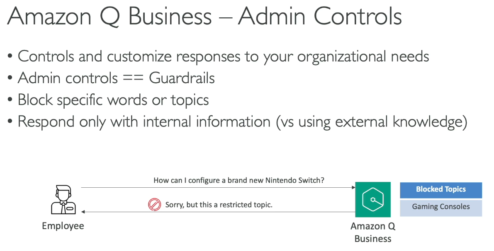
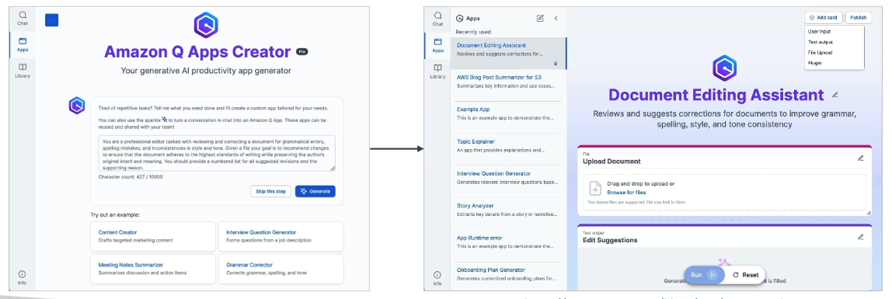
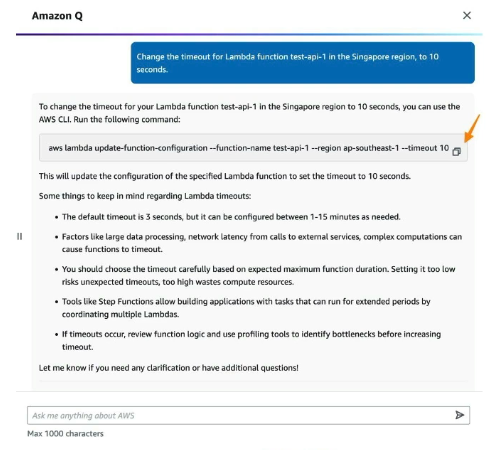
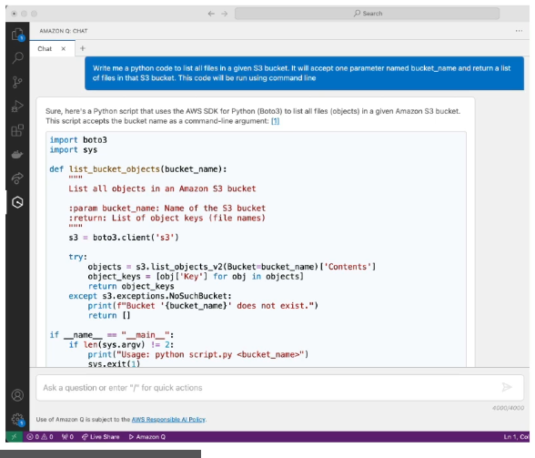
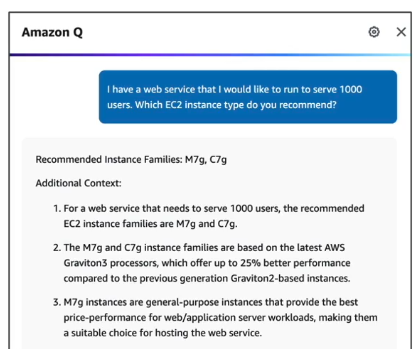

Amazon Q Business
---

Think of **Amazon Q Business** as a **smart AI assistant built specifically for a company's office employees**.

**What is Amazon Q Business?**

* **Your Private Office AI:** Instead of using general public AI, this AI is trained on **your company's private files and documents**.

* **No Model Tuning Needed:** Behind the scenes, it runs on Amazon Bedrock, but AWS handles all the hard AI stuff for you. You cannot pick or change the underlying AI model.

**What Can It Do? (3 Main Things)**

1. **Answer Questions with Sources (Managed RAG)**
* You can ask it internal questions like: *"What is discussed in our team notes?"* or *"What is our health insurance limit?"*

* It checks your internal PDFs or documents and gives you the exact answer along with a link to the document it used.

2. **Connect to Your Tools (Data Connectors)**
* It links directly to storage like **Amazon S3, database tools (RDS/Aurora)**, and regular tools like **Google Drive, Gmail, Slack, and Microsoft 365** to read data.

3. **Take Actions for You (Plugins)**
* It doesn't just read data; it can do tasks for you.

* For example, you can tell it: *"Create a ticket for this issue,"* and it will use a **Jira** or **ServiceNow** plugin to create that ticket automatically.

**Important Exam Points to Remember**

* **User Security (IAM Identity Center):** Employees must log in. The AI will **only show answers from files that the user has permission to read**. A junior employee will not see secret manager files.

* **Admin Controls:** Company admins can block topics (like stopping employees from asking about video games) or force the AI to *only* use company documents instead of internet knowledge.

Amazon Q Apps
---

- Amazon Q Apps used to create Gen AI powered apps without coding by using NLP , By giving prompt.

- You will create apps based on your gievn prompt, "Hey! I want to create this kind of apps". 

- Amazon Q Apps will automatically going to generate web applications where we can upload docs and then upload prompts .

- Your user can use this apps.

- **Amazon Q Apps will create Your Company's Internal data sources (S3, Sakesfircem SharePoint, ServiceNow, or Internal Docs) Based Gen AI Applications**.

- Possibility to leverage plugins (Jira etc)

Amazon Q Developer (Aamazon Kiro)
---

- Amazon Q Kiro has 2 sides, 

  - **1. About answering questions about AWS Documentaions and How to select AWS Service **

  - . It can also answer questions about resources available in your AWS Account.

- Ex. "Hey! List all of my lambda functions".
- "Amazon Q or Kiro will say, "Yes! There are 5 lambda functions in region `ap-south-1`".

- On top of Amazon Q Kiro , It suggest CLI to run or make changes to your account resources.

- `Amazon Q Kiro` - Helps you to **Do bill analysis**, **Resolve errors**,**Troubleshooting**

  - **2. Help you to write code for new applications similar to `Github Copilot`**.

  

- You can **Generate Documents**, **Scan your code for security vulnerabilities**, **Debugging**, **Optimizations**, **Improvement**.

Amazon Q for QuickSight
---

- **Amazon Q QuickSight** is used to **Visualize your data** , **create dashboards** 

- **Amazon Q** can understand your NLP Query on your visualized data and you can ask questinos about your data.

Amazon Q EC2
---

- Provides **Guidence for Selections for EC2 Instance Type** that are best suited for your workload.

- You can ask questions for which ec2 type is best for my workload by giving prompt.

Amazon PartyRock
---

- We want to build Gen AI based application by giving promp. But I don't have AWS Account to use aws ai services, So i can use **PartyRock**  which is service hosted provided by Amazon Bedrock.

- You can't use **Your company's internal data**, but you can experiment different widgets