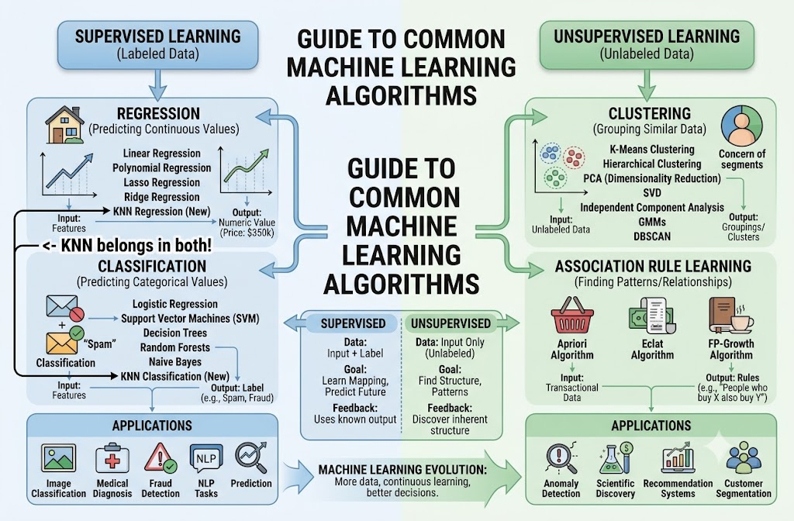

Here are concise strategies and pattern-recognition hints for the common scenario types tested on the **AWS Certified AI Practitioner (AIF-C01)** exam:

* **Keyword Association:**
* **"No-code" / "Point-and-click" / "Business Analysts"** $\rightarrow$ **Amazon SageMaker Canvas**
* **"Data preparation" / "Cleansing" / "Tabular data visualization"** $\rightarrow$ **Amazon SageMaker Data Wrangler**
* **"Bias detection" / "Explainability" / "Feature importance"** $\rightarrow$ **SageMaker Clarify**
* **"Centralized repository to share ML features"** $\rightarrow$ **SageMaker Feature Store**
* **"Multiple layers of defense" / "Validation + Access Controls + Monitoring"** $\rightarrow$ **Defense-in-depth**

* **Foundation Models & Generative AI:**
* **Fine-Tuning vs. RAG:** Fine-tuning **changes model weights** (using labeled data). RAG **does not change weights** (it retrieves dynamic knowledge at runtime).
* **Self-Supervised Learning:** How FMs pre-train on **unlabeled, unstructured data** by creating implicit labels.
* **Multi-Modal Embeddings vs. Generative FMs:** Use **multi-modal embeddings** for cost-effective search/retrieval across text and images; reserve **generative multi-modal FMs** for generating entirely new content.

* **Security & Vulnerabilities:**
* **Poisoning:** Malicious data injected into training/fine-tuning data to compromise model behavior.
* **Prompt Leaking:** The model accidentally exposing its private system instructions, context, or previous user history.
* **Hallucination vs. Toxicity:** Hallucination is **factually incorrect/invented content** presented as true; Toxicity is **offensive, hateful, or harmful text**.

* **Model Training Dynamics:**
* **Overfitting:** Performs exceptionally well on training data, but **poorly on unseen test data**.
* **Underfitting:** Performs **poorly on both** training data and unseen test data.
* **Deterministic Logic:** If a problem can be solved using fixed, standard mathematical formulas (like basic card probability), a **rule-based algorithm** is better, cheaper, and more accurate than ML/RL.

Here are specific pattern-recognition hints and shortcuts to quickly answer questions like **Q-41** on the exam:

* **"Cost-Effective" + "Text and Images" / "Multi-Modal Search"** $\rightarrow$ **Multi-Modal Embedding Model**
* **The Trap:** Multi-modal *generative* models (LMMs/VLMs) can process both, but they are expensive, slower, and compute-heavy.
* **The Rule:** If the goal is **interpreting, matching, or retrieving** text + image queries, **embeddings** + vector databases are always the most cost-effective solution.

* **"Generate new combined text/visual content"** $\rightarrow$ **Multi-Modal Generative Model**
* Use generative models only when you need the model to write out a completely new synthesized response or create new media, rather than just matching and retrieving relevant information.

* **"Image-Only processing / Feature extraction"** $\rightarrow$ **CNN (Convolutional Neural Network)**
* Standard CNNs strictly analyze visual spatial features and cannot process natural language text on their own.

* **"Text-Only processing"** $\rightarrow$ **LLMs / Text Embeddings**
* Incapable of taking image inputs (photos, screenshots) directly without an encoder or vision module.

## Audit manager & AWS Artifacts

### **1. AWS Artifact**

* **The Core Focus:** Security **OF** the Cloud (AWS’s infrastructure responsibility).
* **Key Purpose:** A portal to download official AWS compliance reports and accept legal contracts/agreements directly with AWS.

#### **Exam Scenario A (Compliance Reports)**

> **Scenario:** A healthcare organization is training a diagnostic machine learning model on Amazon Bedrock. Before deploying the system to production, their legal compliance team needs official third-party audit documentation proving that AWS's underlying data center infrastructure complies with ISO 27001 and SOC 2 Type II standards.
> **Question:** Which AWS service should the team use to access these documents?
> * **Correct Answer:** **AWS Artifact**
> * **Why:** You need **AWS's own audit reports** (SOC, ISO, PCI DSS) to prove to auditors that the cloud platform hosting your AI model is secure.
> 
> 

#### **Exam Scenario B (Legal Agreements & BAA)**

> **Scenario:** An AI startup plans to process Protected Health Information (PHI) to train a patient chatbot on AWS. Under HIPAA regulations, the startup must formally sign a Business Associate Addendum (BAA) with AWS before processing medical records.
> **Question:** Where can the company review and accept this agreement?
> * **Correct Answer:** **AWS Artifact**
> * **Why:** AWS Artifact Agreements is the central location where organizations accept legal contracts (like HIPAA BAAs or GDPR agreements) with AWS.
> 
> 

### **2. AWS Audit Manager**

* **The Core Focus:** Security **IN** the Cloud (Your workloads, AI pipelines, and S3 buckets).
* **Key Purpose:** **Continuously and automatically gathering evidence** from your AWS account to evaluate whether your applications align with compliance frameworks (e.g., NIST, HIPAA, GDPR).

#### **Exam Scenario A (Automated Evidence Collection)**

> **Scenario:** A financial firm deploys an automated loan approval AI system on Amazon SageMaker. Internal auditors require quarterly evidence showing that training datasets in S3 buckets are encrypted and that user access logs are maintained across all AWS accounts. Manually collecting this proof takes weeks.
> **Question:** Which AWS service can automate the collection of this audit evidence and map it directly to regulatory controls?
> * **Correct Answer:** **AWS Audit Manager**
> * **Why:** Audit Manager collects telemetry data (from AWS Config, CloudTrail, and Security Hub) and automatically aggregates it into audit-ready reports for *your own* deployed workloads.
> 
> 

#### **Exam Scenario B (Pre-built AI Compliance Frameworks)**

> **Scenario:** A technology firm is launching a Generative AI application using Amazon Bedrock. The CISO wants to continually measure their custom application's compliance against the AWS Responsible AI Framework without manually checking individual service settings.
> **Question:** Which service provides pre-built compliance framework templates to automate risk assessments for AI workloads?
> * **Correct Answer:** **AWS Audit Manager**
> * **Why:** Audit Manager offers pre-packaged framework templates (e.g., NIST AI RMF, HIPAA, GDPR) that map automated evidence gathering directly to specific AI governance guidelines.
> 
> 

### **Exam Cheat-Sheet Summary**

| Service | Exam Clues & Trigger Keywords | What it Produces |
| --- | --- | --- |
| **AWS Artifact** | *"Download SOC / ISO reports"*, *"Accept legal terms"*, *"Sign HIPAA BAA"*, *"Proof of AWS infrastructure security"* | **PDF documents & legal agreements** |
| **AWS Audit Manager** | *"Automate evidence collection"*, *"Continuously audit usage"*, *"Audit-ready reports for custom workloads"*, *"Compliance framework mapping"* | **Automated audit assessment reports** |

# AWS Certified AI Practitioner - Question 49

## Question
A machine learning team is preparing a dataset to train a model for loan approvals. The team wants to use Amazon SageMaker Clarify to measure pre-training data bias before starting the model training phase.

What is the primary purpose of measuring pre-training data bias using Amazon SageMaker Clarify?

- [x] Detect imbalances or disparities in the data prior to model training
- [ ] Ensure that the model runs within optimal performance latency limits
- [ ] Automatically correct feature values in the dataset using neural networks
- [ ] Continuously monitor post-deployment feature drift in real-time

## Explanation

### Correct Option:
* **Option A:** Detect imbalances or disparities in the data prior to model training.

`SageMaker Clarify evaluates pre-training datasets to identify potential representation biases or historical disparities across sensitive attributes (such as age, gender, or demographic group) before training begins. Identifying these imbalances upfront helps prevent the model from learning and perpetuating biased patterns.`

### Incorrect Options:
* **Option B:** Managing model execution speed and response latency is handled by SageMaker Inference Endpoints and instance provisioning, not bias detection tools.
* **Option C:** SageMaker Clarify calculates bias metrics; it does not automatically modify, rewrite, or correct underlying dataset feature values.
* **Option D:** Monitoring post-deployment performance and feature drift in production is handled by SageMaker Model Monitor (or post-training bias monitoring), rather than pre-training data analysis.

## Quick Hints & Exam Shortcuts for Q-49

* **"Pre-Training Bias" (SageMaker Clarify)** $\rightarrow$ Evaluates raw training data **imbalances/disparities** *before* building the model.
* **"Post-Training Bias" (SageMaker Clarify)** $\rightarrow$ Evaluates whether the **trained model predictions** yield biased outcomes.
* **"Model Explainability" (SageMaker Clarify)** $\rightarrow$ Uses SHAP values to explain feature importance and feature influence.
* **"Drift Monitoring"** $\rightarrow$ **SageMaker Model Monitor** (tracks data, concept, and quality drift in live production endpoints).

**NOTES**

Algorithm for Supervised and UnSupervised

## BLEU & ROUGH Model Evaluation Method

Here is a simple breakdown of why **Option B** is correct for this specific exam question:

---

### The Core Problem with Automated Metrics (ROUGE / BLEU)

Automated metrics like ROUGE and BLEU work purely on **n-gram (word-for-word) overlap**. They compare the text word-by-word against a reference summary.

#### Example:

Suppose a document is about a company's earnings.

* **Reference Summary:** *"The company made a $50 million profit this year."*
* **Model Output 1:** *"The company made a $50 million loss this year."*

If you run **ROUGE/BLEU** on Output 1, it gets a **90%+ match score** because almost every word matches the reference. However, **the meaning is completely wrong** (profit vs. loss). An automated algorithm cannot catch this semantic error.

### Why Human Evaluation is Required for Summarization

For generative tasks like summarization, success depends on qualities an automated formula cannot evaluate:

1. **Factual Accuracy & Hallucinations:** A summary can sound fluent and use words from the text, but contain completely false statements. Only a human reviewer can verify if the summary accurately reflects the source document without making up facts.
2. **Coherence & Structure:** A summary must read naturally and flow logically. ROUGE and BLEU don't check sentence flow or readability—they just count matching words.
3. **Paraphrasing:** A human can write a perfect summary using completely different vocabulary from the reference. ROUGE/BLEU would give that summary a **very low score** simply because the exact words don't match, even though the summary is brilliant.

### Key Takeaway for the AWS AI Practitioner Exam

* **ROUGE & BLEU:** Good for quick, cheap, automated checks during model iteration, but they **fail to measure quality, coherence, and factual accuracy**.
* **Human Evaluation:** The **gold standard** for evaluating generative AI outputs (summarization, translation, Q&A) because human judgment is required to verify subjective quality, truthfulness, and readability.

| Feature | Convolutional Neural Network (CNN) | Recurrent Neural Network (RNN) |
| --- | --- | --- |
| Primary Data Type | "Spatial data (Images, Grid data)" | "Sequential / Temporal data (Text, Audio, Time-series)" |
| Core Mechanism | Applies filters over spatial dimensions | Uses feedback loops to pass memory across sequential steps |
| Memory Concept | No memory of previous inputs; processes each input independently | Has memory; uses past sequence information to predict future steps |
| Input Structure | "Fixed-size grid structure (e.g., pixels)" | Variable-length sequences |