Amazon Comprehend
---

- Its for **NLP** and Its fully managed and serverless svc.

- Uses ML to find insights aned relationships in text.

- Its useful to find insgights from text like:

  - Lang of text,
  - Extracts key phrases, places, people, brands or events.

  - **How positive or negative the text is**

**Use Cases**

  - Analyze customer emails to find what leads to a positive or negative exp.

  - Create and group articles by topics.

## 1.Comprehend - Custom Classfications

- Organize docs into categories that you defines.

- Ex. Categorize customer emails so that you can provide guidence based on the type of the customer request.

- We have customer emails, we have to provide serveral kind of categories based on the type of customer request. like Support request or billing request.

- This supports many diff types of documents such as `Text`, `Pdf`, `Word`, `Img`.

- So we will `Create Training Data` , put it into S3 and feed it into Amazon Comprehend which will **Going to build and train internally a custom cliassifier.

- Whenever you receive email with such docs like pdf, text etc, **Custom Classifier in Comprehend** will say , this docs is complient or not.

- By saying **It is complient of not**, **Its categorizing your docs**

- **You can Analyze Real Time Single Docs - Synchronous**.

- **Async Analysis - Multiple Docs you can analyse - Asynchronous**.

## 2. Named Entity Recognitions

- **NER - Extract entity like `People`, `place`, `Organizations`, `dates`** from text.

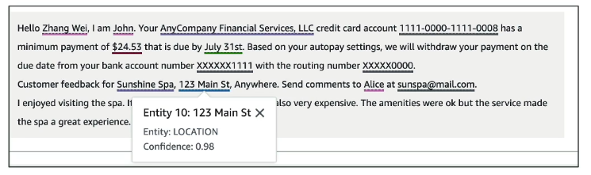

## 3. Csutomer Entity Recognitions

- Analyze text for specific terms and non-based phrases.

- Extract terms like `policy numbers` etc.

- You will train the model with `custome data for custom entity and docs that contain them.

- It support both Real-Time - Synchronous and Multi-Docs - Asynchronous.

Amazon Translate
---

- It is language translations.

- It allows you to localize content - like web and applications for **international users** to translate large volume of text.

- Convert doc into diff languages.

A company would like to convert its documents into different languages, with natural and accurate wording. What should they use?

Amazon Transcribe
---

- It allows you to automatically **Convert Speech into Text**.

- You pass some audio and it will goint to be transcribed into text.

- **Transcirbe uses `Deep Learning` Process called `ASR (Automatic Speech Recognitions)`**

**Feature of Amazon Transcribe**

- It will automatically remove PII (Persional Identity Informations) from Audio using **Redactions**.

**Use cases of Amazon Transcribe**

- Transcribe customer service calls
- Automate closed captioning and subtitling
- Generate metadata for media assets to create a fully searchable archive.

**How we can improve accuracy of Amazon Transcribe**

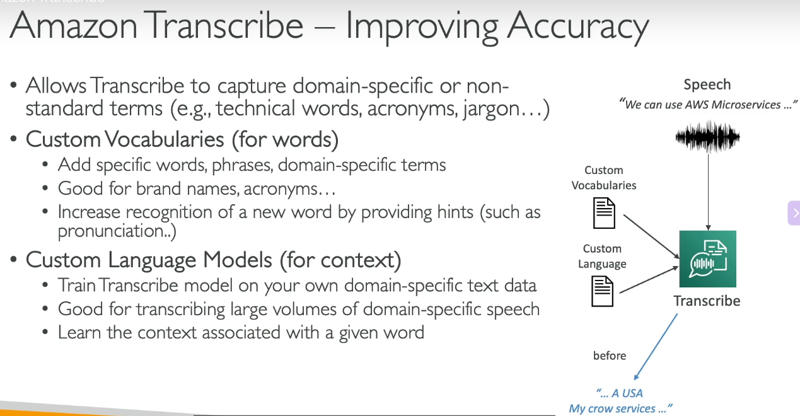

### Transcribe - Toxicity Detections

- Detach how much your speech or audio has used toxic word which may laed to `Insulting`, `Violence` , `Threat`, `Hate speech`, `Harassment` , `Abusive`.

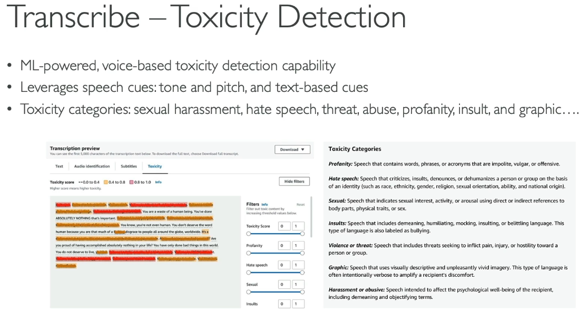

Amazon Polly
---

- It convert `Text` into `Lifelike speech` using deep learning.

`Lifelike Speech` - Audio generated by artificial or compter-generated audio.

- It allows you to create audio in your website, application so web or apps can talk.

**Polly – Advanced Features** covers the following topics:

* **Lexicons:**
* Define how to read certain specific pieces of text (e.g., AWS $\rightarrow$ "Amazon Web Services", W3C $\rightarrow$ "World Wide Web Consortium").

* **SSML – Speech Synthesis Markup Language:**
* Markup for your text to indicate how to pronounce it (e.g., `"Hello, <break> how are you?"`).
* Includes a reference table on the right mapping actions to SSML tags (such as `<break>`, `<emphasis>`, `<lang>`, `<mark>`, `
`, `<phoneme>`, `<prosody>`, etc.).

* **Voice engine:** Generative, long-form, neural, standard, etc.
* **Speech mark:**
* Encode where a sentence/word starts or ends in the audio.
* Helpful for lip-syncing or highlighting words as they are spoken.

Amazon Rekognitions
---

- Find **Objects**, **People**, **Text**, **Scenes** in `Images` and `Videos` using ML.

- **Facial Analysis** and **Facial Search** to do user verification, people counting.

- It create a database of **familiar faces** against celebrities or 

**Use Cases of Amazon Rekognitions**

- Labeling
- Content Moderations
- Text Detections
- Face liveness - Detect real users
- Face Detections and Analysis (Gender, Age,Range, Emotions)

- Face search and verifications
- Celebrity Recognitions

- Pathing for Sport game analysis

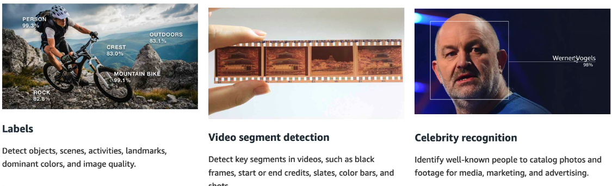

- `Exam perspective scenarios`

### Amazon Rekognitions - Custom Labels

"Find your logo in social media posts, Identify your  products on stores shelves"

- To find their own logo in picture of amazon rekognitions, We label your training  images and upload them to Amazon Rekognitions.

- You needs only a few hundred images or less

- Amazon Rekognitions will creates a custom model for your image set and this model will be recognizing for what your product look like , what your logo look like.

- So new images will be analyze by this **Custom labele** feature of Amazon Rekognitions.

**Process for Custom Labels**

- You will label your imagesand store into S3.

- You go to `Amazon Rekognitions` to tarin model to `Create Custom Labels`.

- Whenever you post story on web app, You will analyze this img, You will be able to say "Yes! Logo is appearing in that img".

### Amazon Rekognitions - Content Moderations

- Automatically detect `Inappropriate`, `Unwanted`, `Offensive` Content from Image.

- To filter out harmful img in social media, broadcast media, advertising.

- You will not requires to review all the things manually from images, This will automatically review.

- If you want to Review by human for all things, You can use **Amazon Augmented AI (Amazon A2I)**

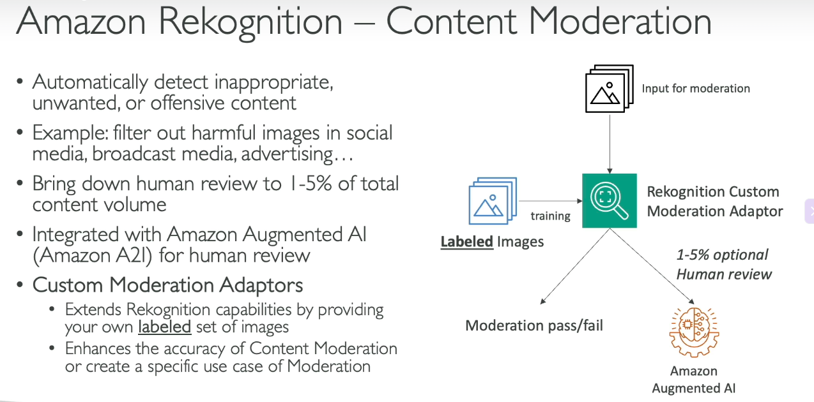

### Amazon Moderation API - Diagram

- You have chatbot to generate Img.

- You gave prompt to Chatbot - It will generate Images. 

- Now Chatbot doesn't know this generated image is safe for user or not. It is integrated with Amazon Rekognitions.

- Amazon Rekognitions will review img and create labels for your img.

- If labels is safe for user then Chatbot will return your img.

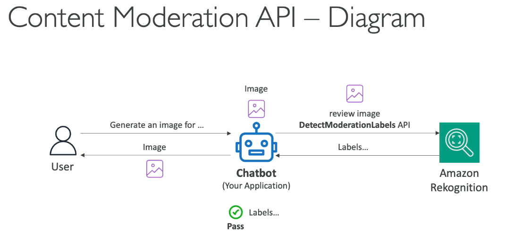

Amazon Lex
---

- Let you build Chatbot quickly for your application using `Voice` and `Text`.

- Lex will understand `intention` of customer.

- Ex. Allows you to do:
  
  - Hotel booking,
  - Order pizza

- `Amazon Lex` supports multiple language.

- **Amazon Lex** has integrated with **Lambda**, **Connect**, **Comprehend**, **Kendra**.

- Ex. A company would like to implement a chatbot that will convert speech-to-text and recognize the customers' intentions. What service should it use?

Amazon Personalize
---

- It is fully managed ML service to build apps with real-time persionalized recommendations.

Amazon Textract
---

- `Amazon Textract` used to `automatically extracts text, handwriting, and data` **from any scanned docs using AI ML**.

- **Extract data from forms and tables**.

- `Read` and `Process` any type of docs like PDFs, Imgs.

- **USE CASE**:
  
  - Financial Svc (Invoices, Reports)
  - Healthcare (Medical records, Insurance claims)
  - Public Sector (Tax forms, ID Docs)

  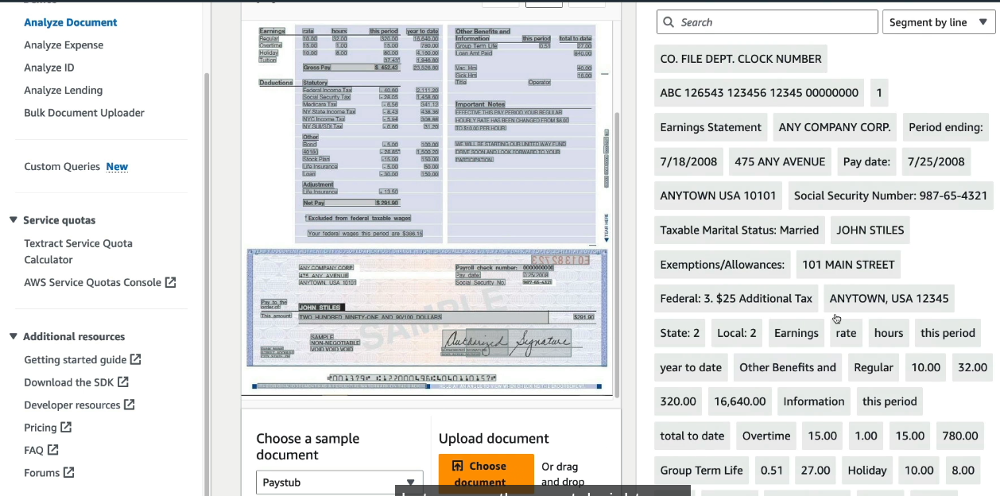

- You can extract text , data from img, scanned docs in a many ways like:
  
  - Raw Text( Just above )
  - Layout
  - Forms, 
  - Tables,
  - Queries (You can run queries to ask questions about anything from your scanned docs)

- `Tables`

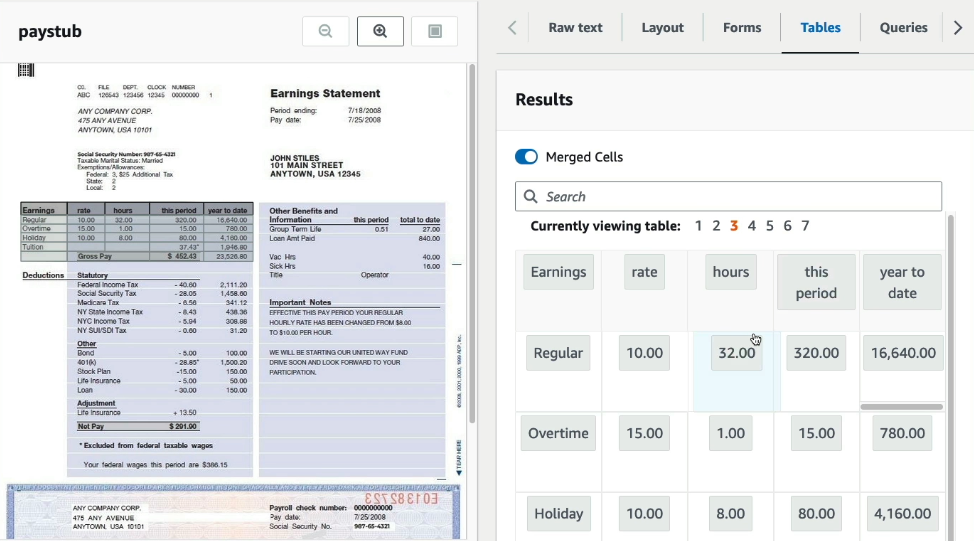

- Query

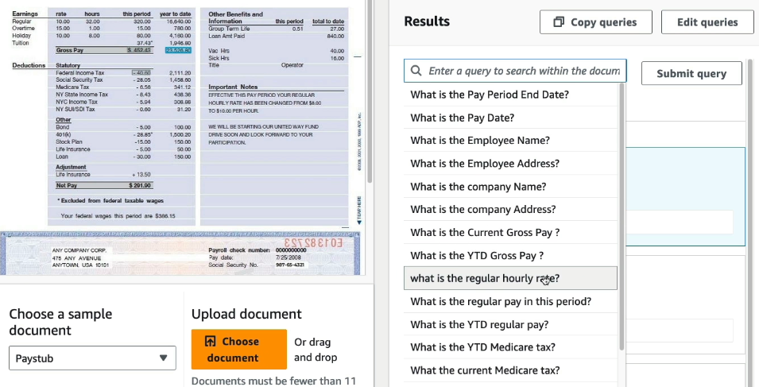

**Amazon Textract features**

  - 1. Analye Docs
    - You can extract data from docs and make queries on it to ask questions and fetch correct ans.

  - 2. Analyze Expense

    - You can upload your bill photo to this svc, it will extarct all data from that bill.
  
  - 3. Analyze ID

    - From Gov ID, it can fetch all data.

Amazon Kendra
---

- Fully managed `Docs Search Svc` by ML.

- **It gives us Natural Language Capabilities** which Allows users to ask natural questions (e.g., "Where is the IT support desk?") and returns precise answers (e.g., "1st floor") along with relevant source extracts.

- Extract ans from within a docs like Text, Pdf, HTML, PPT, Word, FAQs

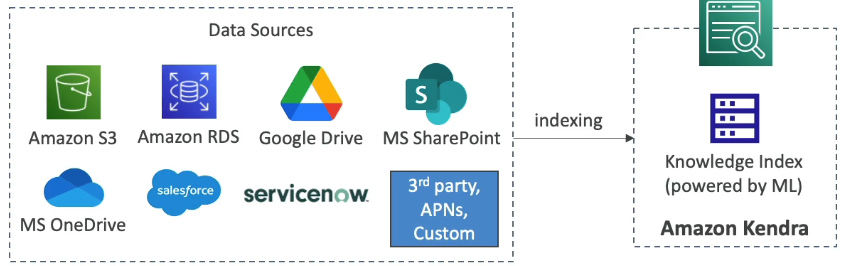

- Kendra will take data from data source and make it indexing.

**Exam Tips**

- **Use Case Trigger Words**: Look for keywords like "internal search," "search across multiple document repositories," "natural language search over company docs," or "extract answers from FAQs/PDFs."

**Kendra Vs Comprehend**

- Amazon Kendra is a **search engine** that **indexes content and ans questions**.

- Comprehend is **NLP Service** used for **Extracting metadata, entities, sentiment from text**.

- `Kendra will **Learn from user feedback/interctions** - Incremental learning`.

Amazon Mechanical Turk
---

- If you have dataset of 1 Million Images and you want to **labels** this **1M Images** manually.

- You can do it by using `Amazon Mechanical Turk` which will connect You (Requester) with Global Individual People (Worker) which is really **Humans** will be `Tag those 1M Images`.

- You would have to set `reward per images like $0.10`.

**USE CASE** 
  
  - Img Classifications,
  - Data Collections,
  - Business Processing

**Key Trigger Words**: Look for scenarios asking about 

  - "crowdsourced workforce," 
  - "distributed human workers," 
  - "manual data labeling at scale," or "outsourcing simple repetitive human tasks."

Amazon Augemented AI (A2I)
---

- Once you build or trained your model, That model will be predicting somethings which you will have to varify by HUMAN Only.

- `Human` will have to varify that Model is working and predicting correctly.

- But you can handover this task to AI Service called **Amazon Augmented AI**.

- `Input Data` - You have Input data to feed to your `Custom ML Model` or `AWS AI Service`.

- Augmented AI service will integrated with Custom ML Model and even its High-confidential predictions , it will returened immediatly to clint applications

Amazon Heathcare
---

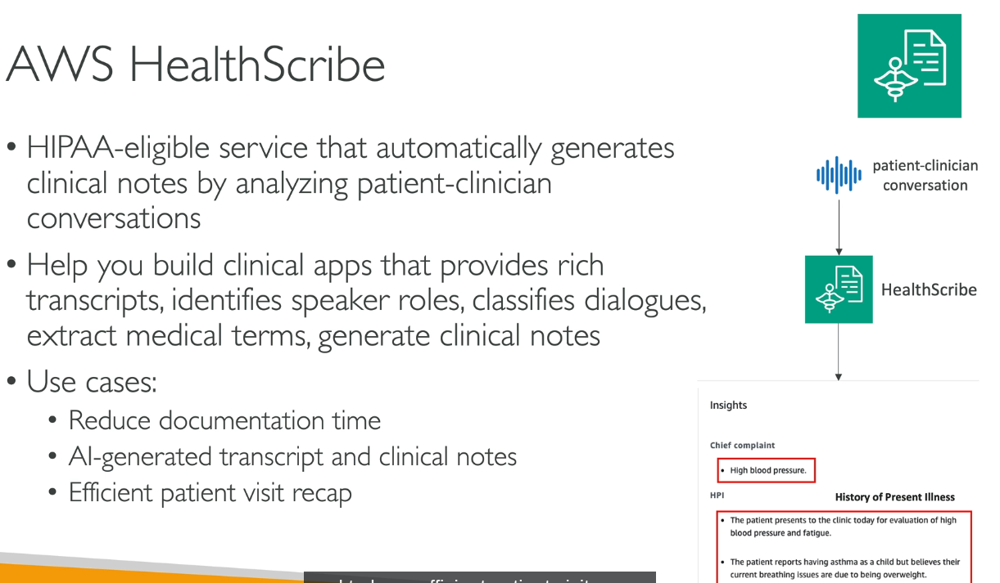

