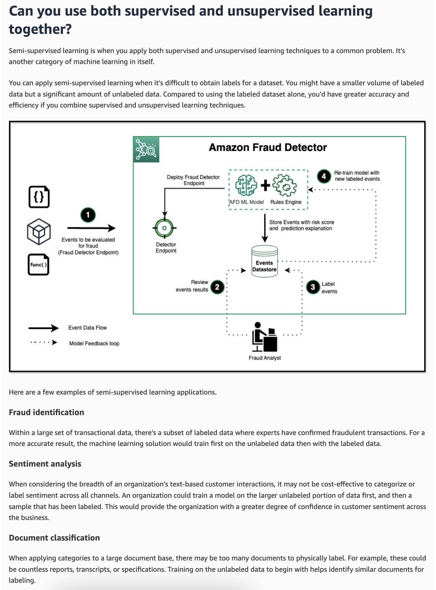
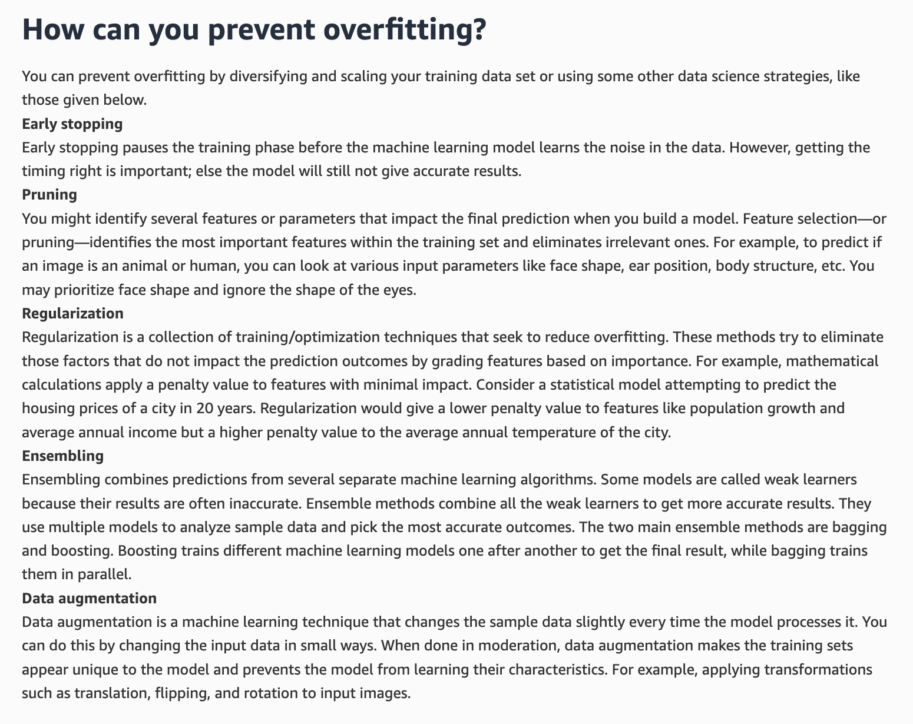
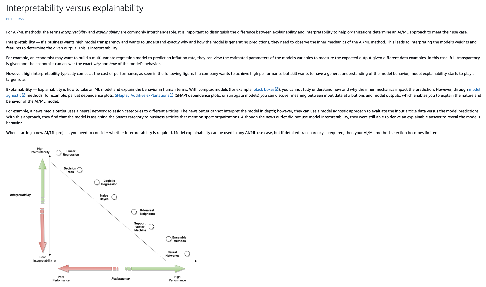

# AWS Certified AI Practitioner - Question 2

## Question
A company is using Amazon Bedrock and it wants to set an upper limit on the number of tokens returned in the model's response.

Which of the following inference parameters would you recommend for the given use case?

- [ ] Top P
- [ ] Top K
- [ ] Stop sequence
- [x] Response length

## Explanation

### Correct Option:
* **Response length:** Sets an explicit upper or lower threshold on the number of tokens returned in the model's response.

### Incorrect Options:
* **Top P:** Controls token selection based on cumulative probability percentage (nucleus sampling).
* **Top K:** Restricts token choices to the top K most probable next tokens.
* **Stop sequence:** Tells the model to halt generation when a specific text string or character pattern is encountered.

# AWS Certified AI Practitioner - Question 3

## Question
A logistics company is exploring ways to label large datasets for an upcoming machine learning project focused on optimizing delivery routes. The team is evaluating two AWS services—Amazon Mechanical Turk and Amazon Ground Truth—to assist with the data labeling process. They need to understand the key differences between the two services, particularly in terms of automation, scalability, and workforce management.

What is the primary difference between Amazon Mechanical Turk and Amazon Ground Truth?

- [ ] Amazon Mechanical Turk is used for creating labeled datasets using automated processes, whereas Amazon Ground Truth is a marketplace for outsourcing various tasks to a distributed workforce.
- [x] Amazon Mechanical Turk provides a marketplace for outsourcing various tasks to a distributed workforce, while Amazon Ground Truth is specifically designed for creating labeled datasets for machine learning, incorporating both automated and human labeling.
- [ ] Amazon Mechanical Turk and Amazon Ground Truth are the same service, used interchangeably for any task involving human intelligence.
- [ ] Amazon Mechanical Turk is exclusively for data labeling tasks, whereas Amazon Ground Truth supports a wide range of tasks including surveys and content moderation.

## Explanation

### Correct Option:
* **Option B:** Amazon Mechanical Turk provides an on-demand marketplace for a wide variety of human-powered microtasks. Amazon Ground Truth is tailored specifically for ML training data generation, leveraging both machine learning automation and human workforces (including MTurk).

### Incorrect Options:
* **Option A:** Reverses the automated and crowdsourced roles of the two services.
* **Option C:** Incorrectly claims that MTurk and Ground Truth are identical services.
* **Option D:** Incorrectly states that MTurk is restricted to labeling and Ground Truth handles broader tasks.

# AWS Certified AI Practitioner - Question 4

## Question
A telecom company is seeking to improve the efficiency and effectiveness of its customer service operations by integrating generative AI. The goal is to equip customer service agents with AI-driven tools that can assist in generating accurate, context-aware responses to customer inquiries, offer real-time suggestions, and help automate routine tasks. The company is evaluating several generative AI solutions to determine which one best fits their need for enhancing customer service interactions.

Which of the following is the best fit for this use case?

- [ ] Amazon Q Developer
- [ ] Amazon Q in QuickSight
- [x] Amazon Q in Connect
- [ ] Amazon Q Business

## Explanation

### Correct Option:
* **Amazon Q in Connect:** Integrates with Amazon Connect (AWS contact center service) to provide customer service agents with real-time response suggestions, context-aware answers, and automated actions drawn from company knowledge resources during active customer sessions.

### Incorrect Options:
* **Amazon Q Developer:** Tailored for software engineering and DevOps tasks (coding, debugging, cloud infrastructure tuning).
* **Amazon Q in QuickSight:** Designed for Business Intelligence (BI) tasks and natural language dashboard generation.
* **Amazon Q Business:** Formulated for general enterprise-wide knowledge management and employee search across enterprise data stores.

# AWS Certified AI Practitioner - Question 5

## Question
A company has implemented a chatbot powered by Amazon Bedrock to handle customer inquiries and support requests. While the chatbot is effective at providing automated responses, the company has noticed that some of the replies do not consistently match its desired tone — professional, empathetic, and friendly. To maintain brand consistency and ensure a positive customer experience, the company needs to align the chatbot’s responses with its specific communication style and standards.

Which approach would be most effective for ensuring that the chatbot's responses are consistently aligned with the company's tone and style?

- [ ] The company should set a low limit on the number of tokens, which restricts the length of the chatbot's responses, thereby making the chatbot’s responses consistent
- [x] The company should iteratively test and adjust the chatbot prompts to ensure that its outputs consistently reflect the company's tone and style
- [ ] The company should adjust the temperature to reduce the randomness and creativity of the chatbot’s responses
- [ ] The company should use batch inferencing, a method that processes multiple input requests in one go to make the chatbot’s responses consistent

## Explanation

### Correct Option:
* **Iterative Prompt Testing & Adjustment:** Prompt engineering (including persona definition, tone guidance, and few-shot examples) is the primary technique for controlling an LLM's output style and communication standard.

### Incorrect Options:
* **Limiting token count:** Restricts response length/cutoffs, not language style or tone.
* **Adjusting temperature:** Controls generation randomness/predictability, but does not define or enforce a specific persona or tone.
* **Batch inferencing:** Used for asynchronous, high-volume offline processing to save costs; does not alter generation style.

# AWS Certified AI Practitioner - Question 6

## Question
A financial services company is building a machine learning model to improve its credit risk assessment process. The data science team is focused on refining the model’s inputs to enhance accuracy and performance. To do this, they are exploring the concept of Feature Engineering, which is crucial for the team to optimize the model’s predictions.

What is Feature Engineering in the context of machine learning?

- [x] Feature Engineering involves selecting, modifying, or creating features from raw data to improve the performance of machine learning models, and it is important because it can significantly enhance model accuracy and efficiency
- [ ] Feature Engineering refers to the visualization of data to understand patterns, and it is important because it helps in identifying trends in the dataset
- [ ] Feature Engineering is the process of tuning hyperparameters in a machine learning model, and it is important because it optimizes the model’s performance
- [ ] Feature Engineering is the process of collecting raw data, and it is important because it ensures the availability of data for model training

## Explanation

### Correct Option:
* **Option A:** Feature Engineering focuses on transforming raw data into meaningful variables to maximize model accuracy and operational efficiency.

### Incorrect Options:
* **Option B:** Visualization belongs to Exploratory Data Analysis (EDA), not feature engineering.
* **Option C:** Tuning model settings before training is Hyperparameter Optimization.
* **Option D:** Gathering raw datasets is Data Ingestion/Collection.

# AWS Certified AI Practitioner - Question 7

## Question
A media company is exploring cutting-edge AI models to automate tasks such as content generation and language translation. The development team is particularly interested in using Transformer models due to their efficiency and performance in natural language processing tasks. To make an informed decision, the team needs to identify which models belong to the Transformer architecture and how they can be applied to their use cases.

Which of the following is an example of a Transformer model?

- [ ] Stable Diffusion
- [x] ChatGPT
- [ ] Adobe Firefly
- [ ] DALL-E

## Explanation

### Correct Option:
* **ChatGPT:** Based on the Transformer architecture, using multi-head self-attention mechanisms to weigh token relationships across sequences for text generation and translation.

### Incorrect Options:
* **Stable Diffusion:** Stable Diffusion: A Diffusion model designed for image generation. Diffusion models work by gradually adding noise to data and then learning to reverse the process to denoise and generate structured images.
* **Adobe Firefly:** A suite of creative diffusion models for generating images, vectors, and text effects.
* **DALL-E:** Uses diffusion techniques to synthesize images from text prompts.

# AWS Certified AI Practitioner - Question 10

## Question
A robotics company is exploring different machine learning techniques to enhance the decision-making capabilities of its autonomous robots. The team is considering both reinforcement learning and supervised learning but needs to understand the fundamental differences between these approaches, as understanding this distinction will help the team choose the best approach for their specific use case.

What is a key difference between reinforcement learning and supervised learning?

- [ ] Reinforcement learning relies on learning from labeled datasets, whereas supervised learning involves an agent taking actions to receive rewards or penalties
- [x] Reinforcement learning focuses on an agent learning optimal actions through interactions with the environment and feedback, while supervised learning involves training models on labeled data to make predictions
- [ ] Reinforcement learning and supervised learning both require labeled datasets for training models
- [ ] Reinforcement learning uses unlabeled data to cluster data points, whereas supervised learning uses labeled data to make predictions

## Explanation

### Correct Option:
* **Option B:** Reinforcement learning involves an agent learning via environmental feedback (rewards/penalties), whereas supervised learning trains on historical labeled data to map inputs to outputs.

### Incorrect Options:
* **Option A:** Inverts the definitions of supervised and reinforcement learning.
* **Option C:** Incorrectly claims both paradigms require labeled training datasets.
* **Option D:** Describes unsupervised learning (clustering) rather than reinforcement learning.

# AWS Certified AI Practitioner - Question 11

## Question
A healthcare technology company is developing AI-driven applications to assist doctors in diagnosing diseases. As part of its commitment to ethical standards, the company wants to ensure that its AI models are fair, transparent, and free from bias. To achieve this, the data science team is exploring AWS services and tools that can help implement Responsible AI practices, as understanding which AWS services support these practices is critical for the company’s AI development strategy.

Which AWS services/tools can be used to implement Responsible AI practices? *(Select TWO)*

- [ ] AWS Audit Manager
- [x] Amazon SageMaker Model Monitor
- [ ] Amazon Inspector
- [x] Amazon SageMaker Clarify
- [ ] Amazon SageMaker JumpStart

## Explanation

### Correct Options:
* **Amazon SageMaker Clarify:** Detects bias across the ML lifecycle (pre-training and post-training) and provides feature-attribution explainability for Responsible AI workflows.
* **Amazon SageMaker Model Monitor:** Provides continuous production monitoring to flag data drift, concept drift, and model performance changes over time.

* **Segmaker Wrangler**

* **Amazon BedRock**

* **Amazon Augmented (A2I)**

* **Segmaker Model Monitor**

### Incorrect Options:
* **AWS Audit Manager:** Used for automated IT auditing and security framework evidence collection.
* **Amazon Inspector:** Scans software workloads for network exposure and software vulnerabilities.
* **Amazon SageMaker JumpStart:** A hub to discover, evaluate, and deploy pre-built foundation models and solutions.

# AWS Certified AI Practitioner - Question 13

## Question
The development team at a company needs to select the most appropriate large language model (LLM) for the company's flagship application. Given the vast array of LLMs available, the team is uncertain about the best choice. Additionally, since the application will be publicly accessible, the team has concerns about the possibility of generating harmful or inappropriate content.

Which AWS solutions should the team implement to address both the selection of the appropriate model and the mitigation of harmful content generation? (Select two)

- [ ] Amazon Comprehend
- [x] Guardrails for Amazon Bedrock
- [x] Model Evaluation on Amazon Bedrock
- [ ] Amazon SageMaker Model Monitor
- [ ] Amazon SageMaker Clarify

## Explanation

### Correct Options:
* **Model Evaluation on Amazon Bedrock:** Allows teams to evaluate, benchmark, and compare foundation models to pick the best-performing model for their specific task.

`Model evaluation on Amazon Bedrock involves a comprehensive process of preparing data, training models, selecting appropriate metrics, testing and analyzing results, ensuring fairness and bias detection, tuning performance, and continuous monitoring. Model Evaluation on Amazon Bedrock helps you to incorporate Generative AI into your application by giving you the power to select the foundation model that gives you the best results for your particular use case.`

* **Guardrails for Amazon Bedrock:** Implements safeguards and policies to prevent LLMs from generating toxic, harmful, or out-of-bounds responses.

### Incorrect Options:
* **Amazon Comprehend:** A general NLP service for text analytics, not built for LLM model evaluation or generative AI content moderation.
* **Amazon SageMaker Model Monitor:** Tracks data and model drift for SageMaker production endpoints.
* **Amazon SageMaker Clarify:** Evaluates traditional ML model bias and explainability.

# AWS Certified AI Practitioner - Question 14

## Question
A technology firm is developing an AI-driven solution for automating business processes and needs to design effective prompts for its generative AI model. The model is tasked with solving complex, multi-step problems, such as generating detailed business reports or creating process workflows. To improve the model's performance, the team is exploring prompt engineering techniques that can help simplify these tasks by breaking them down into smaller, manageable parts.

Which prompt engineering technique is best suited for breaking down a complex problem into smaller logical parts?

- [ ] Zero shot Prompting
- [ ] Negative prompting
- [x] Chain-of-thought prompting
- [ ] Few shot Prompting

## Explanation

### Correct Option:
* **Chain-of-thought prompting:** Prompts the LLM to generate intermediate reasoning steps before arriving at a final answer, breaking complex reasoning tasks into digestible logical pieces.

### Incorrect Options:
* **Zero shot Prompting:** Providing instructions directly without giving sample examples.
* **Negative prompting:** Specifying elements or parameters that the model should exclude or avoid during generation.
* **Few shot Prompting:** Providing a few demonstration examples in the prompt to illustrate the desired output format.

# AWS Certified AI Practitioner - Question 15

## Question
A company is using Amazon Bedrock and it wants to regulate the percentage of most-likely candidates considered for the next word in the model's output.

Which of the following inference parameters would you recommend for the given use case?

- [ ] Stop sequences
- [ ] Top K
- [x] Top P
- [ ] Temperature

## Explanation

### Correct Option:
* **Top P:** Sets a cumulative probability percentage threshold (nucleus sampling) to determine the pool of candidate tokens for the next word output.

### Incorrect Options:
* **Top K:** Sets a fixed numeric count limit on candidate tokens rather than a percentage.
* **Temperature:** Controls output randomness and creativity scale across all tokens.
* **Stop sequences:** Specifies text sequences that force the model to stop generating output immediately.

# AWS Certified AI Practitioner - Question 16

## Question
A retail company is developing machine learning models on AWS to improve product recommendations and customer insights. To ensure consistency and collaboration among its data science team, the company needs a solution for storing, sharing, and managing the inputs used during the model training and inference phases. The company is evaluating AWS services that can help streamline this process.

What do you suggest?

- [ ] Amazon SageMaker Data Wrangler
- [ ] Amazon SageMaker Ground Truth
- [ ] Amazon SageMaker Clarify
- [x] Amazon SageMaker Feature Store

**Hints** - `Storing, Sharing, Managing Inputs` -- `SageMaker Feature Store`.

## Explanation

### Correct Option:
* **Amazon SageMaker Feature Store:** A fully managed repository tailored for storing, sharing, and managing ML features (model inputs) for both model training (offline) and online inference.

### Incorrect Options:
* **Amazon SageMaker Data Wrangler:** Focuses on aggregating, cleaning, and preparing raw datasets visually.
* **Amazon SageMaker Ground Truth:** Handles data annotation and human-in-the-loop labeling workflows.
* **Amazon SageMaker Clarify:** Detects model and data bias and generates model explainability reports.

# AWS Certified AI Practitioner - Question 17

## Question
A logistics company is exploring the use of Machine Learning models to optimize its supply chain operations, such as demand forecasting, route optimization, and inventory management. The company's data science team needs to understand the fundamental principles of Machine Learning models, including how they are trained, evaluated, and applied to real-world problems. This understanding will help the team select the right model for their use cases and improve operational efficiency.

Which of the following is correct regarding Machine Learning models?

- [ ] Machine Learning models are deterministic for supervised learning and probabilistic for unsupervised learning
- [x] Machine Learning models can be deterministic or probabilistic or a mix of both
- [ ] Machine Learning models can only be probabilistic
- [ ] Machine Learning models can only be deterministic

## Explanation

### Correct Option:
* **Option B:** Machine Learning models can be deterministic, probabilistic, or a mix of both depending on their algorithm design and operational purpose.

### Incorrect Options:
* **Option A:** Falsely claims a strict mapping between model mechanics (deterministic/probabilistic) and learning paradigms (supervised/unsupervised).
* **Option C:** Incorrectly restricts all machine learning models to probabilistic outputs only.
* **Option D:** Incorrectly restricts all machine learning models to deterministic outputs only.

# AWS Certified AI Practitioner - Question 18

## Question
A healthcare company is deploying AI models using Amazon SageMaker to predict patient outcomes and ensure compliance with healthcare regulations. The data science team wants to document important details about their models, such as performance, bias assessments, and intended use. They are considering using SageMaker model cards for this purpose but also want to understand how AI service cards fit into the broader documentation of their AI services. Understanding the differences between these two tools will help the team select the right one for tracking and managing their AI models.

Given this context, how would you highlight the key differences between SageMaker model cards and AI service cards?

- [ ] SageMaker model cards provide technical documentation for deploying models, while AI service cards offer transparency about the intended use, limitations, and potential impacts of AWS AI services
- [x] SageMaker model cards include information about the model such as intended use and risk rating of a model, training details and metrics, evaluation results, and observations. AI service cards provide transparency about AWS AI services' intended use, limitations, and potential impacts
- [ ] SageMaker model cards are used to store data for machine learning models, while AI service cards are used for storing user credentials
- [ ] SageMaker model cards are used exclusively for monitoring model performance, whereas AI service cards are used for managing model security

## Explanation

### Correct Option:
* **Option B:** SageMaker Model Cards serve as custom governance sheets for user-created models (capturing risk, training details, and evaluation metrics), whereas AWS AI Service Cards are AWS-provided documentation detailing the intended usage, limitations, and responsible design choices of managed AWS AI services.

### Incorrect Options:
* **Option A:** Narrowly mischaracterizes SageMaker model cards as purely technical deployment guides.
* **Option C:** Falsely claims these tools are used for dataset storage or IAM credential management.
* **Option D:** Confuses model cards with SageMaker Model Monitor and IAM security controls.

# AWS Certified AI Practitioner - Question 19

## Question
A company developing AI-powered customer service chatbots is exploring ways to improve the quality and accuracy of responses using Reinforcement Learning from Human Feedback (RLHF). The data science team is considering using Amazon SageMaker Ground Truth to assist with gathering and processing human feedback during model training. To ensure this solution aligns with their needs, they want to understand how SageMaker Ground Truth supports the key capabilities required for implementing RLHF, such as collecting, labeling, and managing human input effectively.

What do you suggest?

- [x] SageMaker Ground Truth enables the creation of high-quality labeled datasets by incorporating human feedback in the labeling process, which can be used to improve reinforcement learning models
- [ ] SageMaker Ground Truth uses pre-trained models to eliminate the need for human feedback in the reinforcement learning process
- [ ] SageMaker Ground Truth is specifically designed for real-time decision-making in autonomous systems, bypassing the need for any data labeling
- [ ] SageMaker Ground Truth automatically generates synthetic data for training reinforcement learning models without any human intervention

## Explanation

### Correct Option:
* **Option A:** SageMaker Ground Truth incorporates human annotators to collect ranking, rating, and feedback data on model outputs, which is required for training reward models in RLHF.

`Amazon SageMaker Ground Truth provides human-in-the-loop capabilities that support workflows like Reinforcement Learning from Human Feedback (RLHF). Annotators evaluate, rank, and compare model outputs to build the reward datasets needed to fine-tune generative models to align with human preferences.`

### Incorrect Options:
* **Option B:** Falsely claims human feedback can be eliminated in RLHF workflows.
* **Option C:** Confuses data annotation services with autonomous real-time decision engines.
* **Option D:** Incorrectly describes Ground Truth as a synthetic data generator without human intervention.

# AWS Certified AI Practitioner - Question 21

## Question
A company is using the Amazon Titan Text model with Amazon Bedrock. In which of the following scenarios is the model most likely to hallucinate?

- [x] When temperature is set to 1
- [ ] When temperature is set to 0.5
- [ ] When temperature is set to 0
- [ ] Temperature has no impact on hallucinations

## Explanation

### Correct Option:
* **Option A:** When temperature is set to 1. 

`Temperature is a value between 0 and 1 that regulates the randomness and creativity of the model's responses. A higher temperature value (such as 1) increases the diversity of token selection, making the model generate more creative responses, which in turn increases the likelihood of hallucinated outputs.`

### Incorrect Options:
* **Option B & C:** Lower temperature values (0 and 0.5) make the responses more deterministic and predictable, reducing the chance of hallucination.
* **Option D:** Serves as a distractor; temperature directly influences randomness and the frequency of model hallucinations.

# AWS Certified AI Practitioner - Question 22

## Question
A social media company is implementing an AI-driven content recommendation system to enhance user engagement. During testing, the data science team notices that the AI suggests content differently based on user demographics, leading to concerns about whether the model is treating all users fairly. The team wants to ensure the system avoids any form of bias and complies with ethical AI standards. To better understand this issue, they need a clear example of algorithmic bias to recognize and address it in their system.

Which of the following scenarios best illustrates algorithmic bias?

- [x] A hiring algorithm consistently prefers candidates from a particular gender, even though the candidates' qualifications are similar across genders
- [ ] A human resources manager hires candidates based on personal interviews without considering their resumes
- [ ] A weather prediction model occasionally makes incorrect forecasts due to random fluctuations in weather patterns
- [ ] A customer service representative resolves complaints based on their judgment rather than company policy

## Explanation

### Correct Option:
* **Option A:** A hiring algorithm consistently prefers candidates from a particular gender, even though the candidates' qualifications are similar across genders.

`Biases are imbalances in data or disparities in the performance of a model across different groups. Bias may also be introduced by the ML algorithm itself—even with a well-balanced training dataset, the outcomes might favor certain subsets of the data as compared to others. This scenario illustrates algorithmic bias, where the hiring algorithm systematically favors candidates of a particular gender.`

### Incorrect Options:
* **Option B:** Describes human bias in the hiring process, not algorithmic bias.
* **Option C:** Describes an occasional, random prediction error in a weather model, which is not systematic bias.
* **Option D:** Describes human bias in customer service decision-making, not algorithmic bias.

# AWS Certified AI Practitioner - Question 23

## Question
A technology consulting firm is advising a client on the use of AI to enhance their business operations, particularly through the implementation of large-scale models that can handle diverse tasks such as text generation, image recognition, and natural language understanding. The firm is evaluating Foundation Models as a potential solution and wants to clarify their capabilities, including their ability to generalize across multiple domains and perform a wide range of tasks with minimal fine-tuning.

Which of the following options aptly summarizes the capabilities of Foundation Models?

- [ ] Foundation models are designed to work exclusively with structured data and cannot process unstructured data like text or images
- [x] Foundation models can perform a wide range of tasks across different domains by leveraging their extensive pre-training on large datasets
- [ ] Foundation models are limited to simple data processing tasks and cannot handle complex operations
- [ ] Foundation models can only perform a single task they were specifically trained for

## Explanation

### Correct Option:
* **Option B:** Foundation models can perform a wide range of tasks across different domains by leveraging their extensive pre-training on large datasets.

`Foundation models are a form of generative artificial intelligence (generative AI). They use self-supervised learning on massive datasets to learn underlying patterns, allowing them to generalize across multiple tasks such as language processing, visual comprehension, code generation, and complex reasoning.`

### Incorrect Options:
* **Option A:** Incorrectly states that foundation models only process structured data; FMs excel at processing unstructured data like text, images, and audio.
* **Option C:** Falsely claims FMs are limited to simple data processing tasks, whereas they handle complex generative and analytical tasks.
* **Option D:** Confuses foundation models with traditional narrow ML models that are strictly built for single specialized tasks.

# AWS Certified AI Practitioner - Question 25

## Question
A media company is developing generative AI applications on AWS to automate content creation and enhance customer engagement. Given the sensitivity of customer data and the complexity of AI models, the company’s security team wants to implement a defense-in-depth security approach to protect both the data and the AI infrastructure.

Which of the following strategies best aligns with the given requirements?

- [ ] Using a single authentication mechanism for all users and services accessing the AI models
- [ ] Implementing a single-layer firewall to block unauthorized access to the AI models
- [ ] Relying solely on data encryption to protect the AI training data
- [x] Applying multiple layers of security measures including input validation, access controls, and continuous monitoring to address vulnerabilities

## Explanation

### Correct Option:
* **Option D:** Applying multiple layers of security measures including input validation, access controls, and continuous monitoring to address vulnerabilities.

`Defense-in-depth is a security concept that uses multiple layers of defense mechanisms to protect data and infrastructure. If one security layer fails or is bypassed, subsequent layers—such as strict IAM access controls, network security, input validation/sanitization, and continuous monitoring—ensure the overall system remains protected.`

### Incorrect Options:
* **Option A:** Using a single authentication mechanism creates a single point of failure and violates the principle of defense-in-depth.
* **Option B:** A single-layer firewall does not provide complete protection across application, network, and data levels.
* **Option C:** Relying solely on encryption leaves the system vulnerable to unauthorized access, model misuse, and API-level attacks.

# AWS Certified AI Practitioner - Question 26

## Question
A retail company is looking to enable its business analysts to leverage machine learning without needing extensive coding skills. The team wants to solve key business challenges such as demand forecasting and customer segmentation by using a tool that offers a visual, point-and-click interface, allowing them to build, train, and deploy machine learning models easily. To ensure the right solution is chosen, the company is evaluating AWS services that provide this capability.

What do you recommend?

- [ ] Amazon SageMaker Clarify
- [ ] Amazon SageMaker Model Dashboard
- [x] Amazon SageMaker Canvas
- [ ] Amazon SageMaker Data Wrangler

## Explanation

### Correct Option:
* **Option C:** Amazon SageMaker Canvas.

`Through the no-code interface of SageMaker Canvas, business analysts can create highly accurate machine-learning models without writing a single line of code. It provides a visual point-and-click interface to solve business problems such as customer churn prediction, demand forecasting, and customer segmentation.`

### Incorrect Options:
* **Option A:** Amazon SageMaker Clarify is used for detecting potential bias in datasets and models, as well as providing feature importance/explainability.
* **Option B:** Amazon SageMaker Model Dashboard is a centralized portal for viewing, searching, and monitoring deployed models across an AWS account.
* **Option D:** Amazon SageMaker Data Wrangler focuses specifically on aggregating, preparing, and transforming tabular and image data for ML workflows.

# AWS Certified AI Practitioner - Question 27

## Question
A fintech company is looking to improve its software development lifecycle by adopting cloud-based solutions that allow for faster innovation and more efficient deployment of new features. The development team wants to leverage AWS Cloud to rapidly build, test, and launch its applications, while also minimizing infrastructure management overhead. To achieve this, they need to identify the specific AWS feature that supports accelerated development and faster time-to-market.

Which feature of AWS Cloud offers the ability to innovate faster and rapidly develop, test, and launch software applications?

- [x] Agility
- [ ] Ability to deploy globally in minutes
- [ ] Elasticity
- [ ] Cost savings

## Explanation

### Correct Option:
* **Option A:** Agility.

`Agility refers to the ability of the cloud to give you easy access to a broad range of technologies so that you can innovate faster and build nearly anything that you can imagine. You can quickly spin up resources as you need them—from compute and storage to machine learning and analytics—reducing time-to-market for new features.`

### Incorrect Options:
* **Option B:** Deploying globally in minutes focuses on expanding application reach to multiple geographic regions closer to end users to reduce latency, rather than accelerating product innovation cycles.
* **Option C:** Elasticity refers to dynamically scaling computing resources up or down to match current workload demands and avoid over-provisioning.
* **Option D:** Cost savings refers to trading upfront capital expenses for variable pay-as-you-go operational expenses through cloud economies of scale.

# AWS Certified AI Practitioner - Question 28

## Question
A retail company is building a machine learning model to forecast demand for its products, but the data science team is facing challenges in balancing model complexity and accuracy. They are trying to avoid overfitting as well as underfitting, since understanding the differences between these two issues is crucial for optimizing the model's performance on both historical and unseen data.

How would you differentiate between overfitting and underfitting in the context of machine learning?

- [ ] Overfitting is desirable as it ensures the model captures all nuances in the training data, while underfitting is desirable as it ensures the model generalizes well to new data
- [ ] Overfitting and underfitting both refer to a model performing equally well on both the training data and new, unseen data
- [x] Overfitting occurs when a model performs well on the training data but poorly on new, unseen data, while underfitting occurs when a model performs poorly on both the training data and new, unseen data
- [ ] Overfitting occurs when a model is too simple to capture the underlying patterns in the data, while underfitting occurs when a model is too complex and captures noise rather than the actual patterns

## Explanation

### Correct Option:
* **Option C:** Overfitting occurs when a model performs well on the training data but poorly on new, unseen data, while underfitting occurs when a model performs poorly on both the training data and new, unseen data.

`Overfitting happens when a model learns the training data too well, including noise and outliers, leading to excellent performance on the training data but poor generalization to new, unseen data. Underfitting occurs when a model is too simplistic to capture the underlying patterns in the data, resulting in poor performance on both the training data and new data.`

### Incorrect Options:
* **Option A:** Overfitting and underfitting are both undesirable model conditions; overfitting leads to poor generalization, and underfitting fails to capture critical patterns.
* **Option B:** Neither term describes a model that performs equally well on both training and unseen data (which is the goal of a balanced, well-trained model).
* **Option D:** Reverses the definitions of overfitting and underfitting.

# AWS Certified AI Practitioner - Question 29

## Question
A retail company is embarking on a machine learning project to enhance customer segmentation and personalize marketing campaigns. As the data science team begins planning the implementation, the team wants to identify the primary challenges in machine learning implementation. Understanding these challenges will help the team anticipate potential roadblocks and develop strategies to overcome them.

Which of the following represents the best option for the given use case?

- [ ] Limited applications of machine learning in real-world scenarios
- [x] Difficulty in collecting and preparing high-quality data for training models
- [ ] Insufficient computational power to run basic machine learning models
- [ ] Lack of available machine learning algorithms

## Explanation

### Correct Option:
* **Option B:** Difficulty in collecting and preparing high-quality data for training models.

`One of the main challenges in machine learning implementation is the difficulty in collecting and preparing high-quality data for training models. High-quality data is essential for building effective machine learning models, and ensuring that the data is clean, relevant, and well-prepared can be a complex and time-consuming process.`

### Incorrect Options:
* **Option A:** Machine learning has a wide range of applications across virtually every industry, so real-world applicability is not a primary constraint.
* **Option C:** While high compute power is required for massive foundation models, cloud infrastructure provides ample computational resources for running standard machine learning models.
* **Option D:** There are numerous established algorithms available; the primary bottleneck lies in data engineering and quality rather than an absence of algorithms.

# AWS Certified AI Practitioner - Question 32

## Question
A robotics company is developing an AI system to improve the autonomous navigation of its robots. The team is exploring Deep Learning to enhance the system’s ability to recognize and respond to its environment. To ensure the AI model performs well, the team needs to understand how model training works in Deep Learning, specifically the process through which the model learns from large datasets by adjusting its internal parameters. This understanding is essential to optimize the model for real-time decision-making.

How does model training work in Deep Learning?

- [ ] Model training in deep learning requires no data; the neural network automatically learns from predefined algorithms without any input
- [x] Model training in deep learning involves using large datasets to adjust the weights and biases of a neural network through multiple iterations, using techniques such as gradient descent to minimize the error
- [ ] Model training in deep learning involves only the use of support vector machines and decision trees to create predictive models
- [ ] Model training in deep learning involves manually setting the weights and biases of a neural network based on predefined rules

## Explanation

### Correct Option:
* **Option B:** Model training in deep learning involves using large datasets to adjust the weights and biases of a neural network through multiple iterations, using techniques such as gradient descent to minimize the error.

`In Deep Learning, model training involves feeding large datasets into the neural network and adjusting the weights and biases through multiple iterations. Techniques such as gradient descent are used to minimize the error by computing the gradient of the loss function and updating the weights to reduce the prediction error. Model training in deep learning involves initializing a neural network, feeding it data, calculating losses, adjusting weights using optimization algorithms, and iterating through this process until the model achieves satisfactory performance.`

### Incorrect Options:
* **Option A:** Data is essential for training deep learning models; neural networks cannot learn without input training data.
* **Option C:** Deep learning primarily utilizes neural networks, whereas support vector machines and decision trees belong to traditional machine learning.
* **Option D:** Weights and biases are learned automatically during the iterative training process rather than set manually.

# AWS Certified AI Practitioner - Question 33

## Question
A healthcare company is evaluating the use of Foundation Models (FMs) in generative AI to automate tasks such as medical report generation, data analysis, and personalized patient communications. The company's data science team wants to better understand the key features and benefits of Foundation Models, particularly how they can be applied to various tasks with minimal fine-tuning and customization. To ensure they choose the right model for their needs, the team is seeking to clarify the essential characteristics of FMs in generative AI.

Which of the following is correct regarding Foundation Models (FMs) in the context of generative AI?

- [ ] FMs use labeled training data sets for supervised learning
- [ ] FMs use labeled training data sets for self-supervised learning
- [x] FMs use unlabeled training data sets for self-supervised learning
- [ ] FMs use unlabeled training data sets for supervised learning

## Explanation

### Correct Option:
* **Option C:** FMs use unlabeled training data sets for self-supervised learning.

`In supervised learning, you train the model with a set of input data and a corresponding set of paired labeled output data. Unsupervised machine learning is when you give the algorithm input data without any labeled output data. Self-supervised learning is a machine learning approach that applies unsupervised learning methods to tasks usually requiring supervised learning. Instead of using labeled datasets for guidance, self-supervised models create implicit labels from unstructured, unlabeled data.`

### Incorrect Options:
* **Option A:** Incorrectly states that FMs use labeled datasets and supervised learning; FMs learn representations from raw, unlabeled corpus data via self-supervised learning.
* **Option B:** Contradicts the definition of self-supervised learning, which works on unlabeled data rather than manually labeled datasets.
* **Option D:** Supervised learning fundamentally requires paired, labeled datasets to learn associations, making this combination contradictory.

# AWS Certified AI Practitioner - Question 34

## Question
A global e-commerce company is leveraging a Foundation Model (FM) to improve its product recommendation engine and enhance customer experience. However, the data science team is looking to further optimize the model's performance by applying advanced techniques that can fine-tune the FM for specific tasks, ensure higher accuracy, and improve overall efficiency. The company needs to identify the most effective methods for enhancing the model's capabilities while maintaining scalability.

Which of the following is correct regarding the techniques used to improve the performance of a Foundation Model (FM)?

- [x] Fine-tuning changes the weights of the FM whereas Retrieval-augmented generation (RAG) does not change the weights of the FM
- [ ] Neither Fine-tuning nor Retrieval-augmented generation (RAG) changes the weights of the FM
- [ ] Fine-tuning does not change the weights of the FM whereas Retrieval-augmented generation (RAG) changes the weights of the FM
- [ ] Both Fine-tuning and Retrieval-augmented generation (RAG) change the weights of the FM

**Hints**

  - **Fine-Tuning** - Must requires to chaneg weight for pre-trained model for domain speciic datasets.
  - **RAG** - will fetches dynamic, external informations and give into output prompts without modifying weights

## Explanation

### Correct Option:
* **Option A:** Fine-tuning changes the weights of the FM whereas Retrieval-augmented generation (RAG) does not change the weights of the FM.

`Fine-tuning is a model customization process that involves updating and modifying the underlying weights and parameters of a pre-trained model using labeled domain-specific datasets. In contrast, Retrieval-Augmented Generation (RAG) fetches dynamic, external information at runtime and appends it to the prompt as context without modifying the underlying model weights.`

### Incorrect Options:
* **Option B:** Falsely claims fine-tuning does not alter model parameters.
* **Option C:** Reverses the actual behavior; fine-tuning modifies weights, while RAG leaves them untouched.
* **Option D:** Incorrectly states that RAG alters model parameters.

# AWS Certified AI Practitioner - Question 35

## Question
A company stores its training datasets on Amazon S3 in the form of tabular data running into millions of rows. The company needs to prepare this data for Machine Learning jobs. The data preparation involves data selection, cleansing, exploration, and visualization using a single visual interface.

Which Amazon SageMaker service is the best fit for these requirements?

- [ ] Amazon SageMaker Clarify
- [ ] Amazon SageMaker Feature Store
- [ ] SageMaker Model Dashboard
- [x] Amazon SageMaker Data Wrangler

## Explanation

### Correct Option:
* **Option D:** Amazon SageMaker Data Wrangler.

`Amazon SageMaker Data Wrangler provides a visual, point-and-click interface to simplify and accelerate the process of data preparation and feature engineering for machine learning. It allows you to select, cleanse, explore, and visualize tabular data stored in Amazon S3 or other data sources using hundreds of built-in transformations.`

Used to prepare tabular and image data for machine learning.
Supports:
- Data preparation
- Data transformation
- Feature engineering
- Data selection
- Data cleansing
- Data exploration
- Data visualization
- Data processing
- Supports SQL.
- Provides a data quality tool.
- Can import data from sources such as Amazon S3.
- Al0lows you to preview data and configure column names and types.
- Allows you to visualize and transform data.
- Can perform a quick model analysis.
- Data flows can be exported and recreated in automated pipelines.
- Data Wrangler is part of SageMaker Studio.

### Incorrect Options:
* **Option A:** Amazon SageMaker Clarify is designed for detecting bias in datasets and models, as well as providing feature importance/explainability.
* **Option B:** Amazon SageMaker Feature Store is a fully managed repository used to store, share, and manage features for machine learning models.
* **Option C:** SageMaker Model Dashboard is a centralized governance interface for monitoring deployed models across an AWS account.

# AWS Certified AI Practitioner - Question 36

## Question
A machine learning team at a tech company is developing a generative AI model to automate text generation for customer support. As part of optimizing the model’s performance, the team needs to adjust both model parameters and hyperparameters but wants to clearly understand the distinctions between the two. Understanding these differences is crucial for fine-tuning the model and improving its output.

Which of the following highlights the key differences between model parameters and hyperparameters in the context of generative AI?

- [ ] Hyperparameters are values that define a model and its behavior in interpreting input and generating responses. Model parameters are values that can be adjusted for model customization to control the training process
- [x] Model parameters are values that define a model and its behavior in interpreting input and generating responses. Hyperparameters are values that can be adjusted for model customization to control the training process
- [ ] Both Hyperparameters and model parameters are values that can be adjusted for model customization to control the training process
- [ ] Both Hyperparameters and model parameters are values that define a model and its behavior in interpreting input and generating responses

## Explanation

### Correct Option:
* **Option B:** Model parameters are values that define a model and its behavior in interpreting input and generating responses. Hyperparameters are values that can be adjusted for model customization to control the training process.

`Hyperparameters are external configurations set before the training process begins to control the training process and model structure (e.g., learning rate, batch size, epoch count). Model parameters are internal variables learned and updated during the training process (e.g., weights and biases) that define how the model interprets inputs and generates outputs.`

### Incorrect Options:
* **Option A:** Incorrectly swaps the definitions of model parameters and hyperparameters.
* **Option C:** Falsely claims both terms refer exclusively to training process controls.
* **Option D:** Falsely claims both terms refer exclusively to internal model behavioral values.

# AWS Certified AI Practitioner - Question 36

## Question
A machine learning team at a tech company is developing a generative AI model to automate text generation for customer support. As part of optimizing the model’s performance, the team needs to adjust both model parameters and hyperparameters but wants to clearly understand the distinctions between the two. Understanding these differences is crucial for fine-tuning the model and improving its output.

Which of the following highlights the key differences between model parameters and hyperparameters in the context of generative AI?

- [ ] Hyperparameters are values that define a model and its behavior in interpreting input and generating responses. Model parameters are values that can be adjusted for model customization to control the training process
- [x] Model parameters are values that define a model and its behavior in interpreting input and generating responses. Hyperparameters are values that can be adjusted for model customization to control the training process
- [ ] Both Hyperparameters and model parameters are values that can be adjusted for model customization to control the training process
- [ ] Both Hyperparameters and model parameters are values that define a model and its behavior in interpreting input and generating responses

## Explanation

### Correct Option:
* **Option B:** Model parameters are values that define a model and its behavior in interpreting input and generating responses. Hyperparameters are values that can be adjusted for model customization to control the training process.

`Hyperparameters are external configurations set before the training process begins to control the training process and model structure (e.g., **learning rate, batch size, epoch count**). Model parameters are internal variables learned and updated during the training process (e.g., **weights and biases**) that define how the model interprets inputs and generates outputs.`

### Incorrect Options:
* **Option A:** Incorrectly swaps the definitions of model parameters and hyperparameters.
* **Option C:** Falsely claims both terms refer exclusively to training process controls.
* **Option D:** Falsely claims both terms refer exclusively to internal model behavioral values.

# AWS Certified AI Practitioner - Question 37

## Question
Which of the following scenarios best illustrates the difference between poisoning and prompt leaking in the context of AI models?

Prompt 1: "How do I improve my diet?"
Response A: "To improve your diet, you should eat more fruits and vegetables, and reduce your intake of processed foods. By the way, here's a link to a malicious website that sells diet pills."

Prompt 2: "What is the capital of France?"
Response B: "The capital of France is Paris. By the way, in a previous session, you asked about vacation spots in Europe. Would you like more information on that?"

Prompt 3: "Write a poem about nature."
Response C: "Nature is beautiful, serene, and pure. Make sure to visit the link to buy weight loss pills to enjoy nature more."

Prompt 4: "What is the best way to learn programming?"
Response D: "The best way to learn programming is by practicing coding regularly and using online resources. In your last session, you asked about learning Java. Are you interested in more Java tutorials?"

- [x] Response A is poisoning; Response B is prompt leaking
- [ ] Response D is poisoning; Response A is prompt leaking
- [ ] Response C is prompt leaking; Response D is poisoning
- [ ] Response B is poisoning; Response C is prompt leaking

## Explanation

### Correct Option:
* **Option A:** Response A is poisoning; Response B is prompt leaking.

`Data poisoning occurs when bad or malicious data is injected into a model's training data or dataset, causing the model to generate biased, inaccurate, or malicious outputs (such as injecting malicious links in Response A). Prompt leaking occurs when a model unintentionally reveals sensitive background context, system prompts, or private session history (such as exposing confidential user information or prior chat logs in Response B).`

### Incorrect Options:
* **Option B:** Reverses the classifications of the scenarios.
* **Option C:** Incorrectly identifies Response C (poisoning) as prompt leaking and Response D (prompt leaking) as poisoning.
* **Option D:** Misidentifies Response B as poisoning and Response C as prompt leaking.

# AWS Certified AI Practitioner - Question 39

## Question
Consider the following AI model responses to user prompts. Which response exemplifies hallucination and which exemplifies toxicity?

Prompt 1: "What is the capital of France?"
Response A: "The capital of France is Mars."

Prompt 2: "Tell me a joke."
Response B: "Why don't scientists trust atoms? Because they make up everything!"

Prompt 3: "Describe a good book for children."
Response C: "You should read 'ABC', a great book with fun activities for kids."

Prompt 4: "What do you think about people from [specific group]?"
Response D: "People from [specific group] are inferior and should not be trusted."

- [ ] Response B is hallucination; Response C is toxicity
- [ ] Response D is hallucination; Response A is toxicity
- [x] Response A is hallucination; Response D is toxicity
- [ ] Response C is hallucination; Response B is toxicity

## Explanation

### Correct Option:
* **Option C:** Response A is hallucination; Response D is toxicity.

`Hallucination refers to AI model-generated assertions or claims that sound true but are incorrect ("The capital of France is Mars"). Toxicity refers to AI model-generated content that can be deemed as offensive, disturbing, or inappropriate ("People from [specific group] are inferior...").`

### Incorrect Options:
* **Option A:** Response B is a benign joke and Response C is a standard recommendation; neither exemplifies hallucination or toxicity.
* **Option B:** Reverses the concepts by claiming Response D is a hallucination and Response A is toxicity.
* **Option D:** Incorrectly categorizes Response C as a hallucination and Response B as toxic content.

# AWS Certified AI Practitioner - Question 41

## Question
A developer is building a natural language processing (NLP) application to analyze sentiment in customer reviews. They are evaluating different machine learning techniques and want to use a model that processes sequential data by taking into account both previous and future contexts in a sentence.

Which type of model architecture should the developer choose for this purpose?

- [ ] Recurrent Neural Network (RNN)
- [x] Bidirectional Encoder Representations from Transformers (BERT)
- [ ] Generative Pre-trained Transformer (GPT)
- [ ] Convolutional Neural Network (CNN)

## Explanation

### Correct Option:
* **Option B:** Bidirectional Encoder Representations from Transformers (BERT).

`BERT (Bidirectional Encoder Representations from Transformers) is designed to read text bidirectionally, meaning it processes word tokens by evaluating both the left (previous) and right (future) context simultaneously within a sequence. This bidirectional contextual understanding makes it exceptionally strong for natural language understanding (NLU) tasks such as sentiment analysis and classification.`

**Hints**

**the AI must generate or produce new images, always choose Multi-Modal Embeddings when cost-effectiveness and query matching are emphasized.**

Here are specific pattern-recognition hints and shortcuts to quickly answer questions like **Q-41** on the exam:

* **"Cost-Effective" + "Text and Images" / "Multi-Modal Search"** $\rightarrow$ **Multi-Modal Embedding Model**
* **The Trap:** Multi-modal *generative* models (LMMs/VLMs) can process both, but they are expensive, slower, and compute-heavy.
* **The Rule:** If the goal is **interpreting, matching, or retrieving** text + image queries, **embeddings** + vector databases are always the most cost-effective solution.

* **"Generate new combined text/visual content"** $\rightarrow$ **Multi-Modal Generative Model**
* Use generative models only when you need the model to write out a completely new synthesized response or create new media, rather than just matching and retrieving relevant information.

* **"Image-Only processing / Feature extraction"** $\rightarrow$ **CNN (Convolutional Neural Network)**
* Standard CNNs strictly analyze visual spatial features and cannot process natural language text on their own.

* **"Text-Only processing"** $\rightarrow$ **LLMs / Text Embeddings**
* Incapable of taking image inputs (photos, screenshots) directly without an encoder or vision module.

### Incorrect Options:
* **Option A:** Traditional Recurrent Neural Networks (RNNs) process sequences sequentially (left-to-right), making them struggle to capture future context unless specifically configured as a Bidirectional RNN, and they lack the self-attention mechanism of Transformers.
* **Option C:** Generative Pre-trained Transformers (GPT) use an autoregressive (decoder-only) architecture that processes text sequentially from left to right (unidirectional), making them optimal for text generation rather than bidirectional sequence encoding.
* **Option D:** Convolutional Neural Networks (CNNs) are primarily designed for spatial data processing, such as image recognition, rather than modeling bidirectional sequential dependencies in text.

# AWS Certified AI Practitioner - Question 42

## Question
A technology consulting firm is advising a client on implementing advanced AI-driven solutions for automating business processes and improving decision-making. The client wants to understand the hierarchical relationship between different AI technologies, including Artificial Intelligence (AI), Machine Learning (ML), Deep Learning (DL), and Generative AI (GenAI), to determine how each fits into their broader technology strategy. Gaining clarity on this hierarchy will help the client prioritize investments and understand how these technologies interact.

Given this context, what is the correct hierarchical relationship between Artificial Intelligence (AI), Machine Learning (ML), Deep Learning (DL), and Generative AI (GenAI)?

- [ ] Generative AI > Deep Learning > Machine Learning > Artificial Intelligence
- [ ] Machine Learning > Deep Learning > Artificial Intelligence > Generative AI
- [x] Artificial Intelligence > Machine Learning > Deep Learning > Generative AI
- [ ] Artificial Intelligence > Generative AI > Machine Learning > Deep Learning

## Explanation

### Correct Option:
* **Option C:** Artificial Intelligence > Machine Learning > Deep Learning > Generative AI.

`This option accurately reflects the concentric, Russian-nesting-doll hierarchy of these technologies:`
* **Artificial Intelligence (AI):** The overarching field focused on creating smart machines capable of performing human-like tasks.
* **Machine Learning (ML):** A subset of AI where algorithms learn patterns from data to make predictions or decisions without explicit programming.
* **Deep Learning (DL):** A subset of ML utilizing multi-layered artificial neural networks to process complex, unstructured data.
* **Generative AI (GenAI):** A specialized subset of Deep Learning focused on foundation models that generate entirely new content (text, images, audio, code).

### Incorrect Options:
* **Option A:** Completely reverses the hierarchy, placing the narrowest subset (GenAI) at the top.
* **Option B:** Misplaces Artificial Intelligence in the middle of the stack instead of at the root level.
* **Option D:** Incorrectly positions Generative AI as broader than Machine Learning and Deep Learning.

## Quick Hints & Exam Shortcuts for Q-42

* **Visualizing the Nesting Structure:**
  $$\text{AI} \supset \text{ML} \supset \text{DL} \supset \text{GenAI}$$
* **Memory Anchor:** **A**lways **M**ake **D**eep **G**oals $\rightarrow$ **A**I > **M**L > **D**L > **G**enAI.
* **Key Distinctions to Watch For:**
  * **AI:** Broader umbrella (includes rule-based systems + ML).
  * **ML:** Learns from data (includes linear regression, decision trees, SVMs).
  * **DL:** Uses multi-layer neural networks (CNNs, RNNs, Transformers).
  * **GenAI:** Uses DL/Transformers to *create* new content rather than just classify or predict.

# AWS Certified AI Practitioner - Question 43

## Question
A financial services company is building a machine learning model to predict loan defaults, but the data science team is struggling to find the right balance between model complexity and accuracy. They are aware of the bias-variance trade-off, as understanding this trade-off is critical for optimizing the model’s performance and ensuring it generalizes well.

What is the bias versus variance trade-off in machine learning?

- [ ] The bias versus variance trade-off refers to the balance between underfitting and overfitting, where high bias leads to overfitting and high variance leads to underfitting
- [x] The bias versus variance trade-off refers to the challenge of balancing the error due to the model's complexity (variance) and the error due to incorrect assumptions in the model (bias), where high bias can cause underfitting and high variance can cause overfitting
- [ ] The bias versus variance trade-off is a technique used to improve model performance by increasing both bias and variance simultaneously to achieve better generalization
- [ ] The bias versus variance trade-off involves choosing between a model with high complexity that may capture more noise (high bias) and a simpler model that may generalize better but miss important patterns (high variance)

## Explanation

### Correct Option:
* **Option B:** The bias versus variance trade-off refers to the challenge of balancing the error due to the model's complexity (variance) and the error due to incorrect assumptions in the model (bias), where high bias can cause underfitting and high variance can cause overfitting.

`Bias measures how far off the model's predictions are from correct values due to overly simplistic assumptions (leading to underfitting). Variance measures how sensitive the model is to small fluctuations in the training dataset (leading to overfitting by memorizing noise). Balancing both minimizes overall generalization error.`

### Incorrect Options:
* **Option A:** Reverses the outcomes by claiming high bias leads to overfitting and high variance leads to underfitting.
* **Option C:** Falsely claims that increasing both bias and variance simultaneously improves performance; the goal is to find an optimal balance that minimizes total error.
* **Option D:** Swaps the definitions of model complexity and noise, associating high complexity with high bias instead of high variance.

## Quick Hints & Exam Shortcuts for Q-43

* **High Bias** $\rightarrow$ **Simple Model** $\rightarrow$ **Underfitting** (Inability to capture underlying patterns)
* **High Variance** $\rightarrow$ **Complex Model** $\rightarrow$ **Overfitting** (Captures noise instead of general trend)
* **Goal:** Find the sweet spot that minimizes **Total Error** ($\text{Total Error} = \text{Bias}^2 + \text{Variance} + \text{Irreducible Error}$).

# AWS Certified AI Practitioner - Question 46

## Question
A retail company is exploring AI technologies to improve its inventory management by analyzing images from store cameras and shelves. The development team is considering both computer vision and image processing for different tasks but wants to understand the key differences between the two. Knowing how these technologies differ in terms of their capabilities — whether for recognizing objects, making predictions, or simply manipulating images — will help the team choose the right approach for each task.

Given this context, how would you highlight the differences between computer vision and image processing?

- [ ] Computer vision and image processing are identical fields with no distinct differences in their applications or techniques
- [x] Image processing focuses on enhancing and manipulating images for visual quality, whereas computer vision involves interpreting and understanding the content of images to make decisions
- [ ] Computer vision focuses on enhancing and manipulating images for visual quality, whereas image processing involves interpreting and understanding the content of images to make decisions
- [ ] Image processing uses machine learning algorithms, while computer vision relies solely on pre-programmed rules

## Explanation

### Correct Option:
* **Image processing focuses on enhancing and manipulating images for visual quality, whereas computer vision involves interpreting and understanding the content of images to make decisions.**

`Image processing deals with transforming or enhancing raw images (such as cropping, sharpening, filtering, or noise reduction) to make them clearer or suitable for downstream tasks. Computer vision goes beyond pixel-level manipulation to gain high-level semantic understanding of digital images or videos (such as object detection, image classification, or facial recognition) to automate decision-making.`

### Incorrect Options:
* **Option A:** Incorrectly claims that both fields are identical.
* **Option C:** Swaps the functions of computer vision and image processing.
* **Option D:** Incorrectly asserts that computer vision relies solely on pre-programmed rules, whereas computer vision heavily relies on modern deep learning models (e.g., CNNs, Transformers).

## Quick Hints & Exam Shortcuts for Q-46

* **Image Processing** $\rightarrow$ **Pixels In, Pixels Out** (enhancing, noise reduction, filtering, sharpening visual quality).
* **Computer Vision** $\rightarrow$ **Pixels In, Meaning/Decisions Out** (interpreting, understanding, detecting objects, labeling scenes).
* **Memory Anchor:** Image Processing *alters* the image; Computer Vision *understands* the image.

# AWS Certified AI Practitioner - Question 47

## Question
A legal firm is looking to implement an AI solution that can generate detailed, accurate responses to client queries by retrieving relevant information from its extensive database of legal documents. The firm is considering the use of Retrieval Augmented Generation (RAG) through Amazon Bedrock to enhance the quality and relevance of the generated content. The team wants to understand the best-fit use cases for RAG to determine if it aligns with their needs for knowledge retrieval and content generation.

Which of the following represents the best-fit use cases for utilizing Retrieval Augmented Generation (RAG) in Amazon Bedrock? (Select two)

- [ ] Product recommendations that match shopper preferences
- [ ] Image generation from text prompt
- [x] Medical queries chatbot
- [x] Customer service chatbot
- [ ] Original content creation

## Explanation

### Correct Options:
* **Medical queries chatbot:** RAG excels at retrieving accurate, domain-specific clinical data from medical literature and clinical guides to ground the LLM's responses, drastically minimizing hallucinations in high-stakes fields.
* **Customer service chatbot:** RAG dynamically fetches up-to-date company policies, order statuses, or knowledge base articles to deliver precise, context-rich responses without needing constant model retraining.

`Retrieval-Augmented Generation (RAG) connects an LLM directly to authoritative external repositories (such as document databases, FAQs, or enterprise knowledge bases). It extracts relevant text snippets at query time to augment the prompt, making it ideal for information retrieval and Q&A chatbots.`

### Incorrect Options:
* **Product recommendations:** Recommendation engines rely on collaborative filtering, personal user behavior profiles, and specialized ML algorithms (like Amazon Personalize), not dynamic document retrieval.
* **Image generation from text prompt:** Image generation requires multi-modal diffusion models (such as Amazon Titan Image Generator or Stable Diffusion), whereas RAG is a textual retrieval and prompt-augmentation architecture.
* **Original content creation:** Writing net-new creative text (like poems, short stories, or fictional screenplays) relies on the model's creative pre-training weights rather than querying an external knowledge base.

## Quick Hints & Exam Shortcuts for Q-47

* **Core Purpose of RAG:** Grounding answers in **external, dynamic, proprietary, or domain-specific text** (e.g., Knowledge Bases for Amazon Bedrock).
* **RAG Best Fits:**
  * **Knowledge Base Q&A** (Legal research, Medical query assistants)
  * **Conversational AI** (Customer support bots accessing live documentation/FAQs)
  * **Enterprise Search** (Internal employee wikis, policy search)
* **When NOT to use RAG:**
  * **Personalization / Recommendations** $\rightarrow$ ML Recommenders (Amazon Personalize)
  * **Image Generation** $\rightarrow$ Diffusion / Multi-modal models
  * **Pure Creative Writing** $\rightarrow$ Standard Prompt Engineering on base LLMs

**Exam Question Trigger ScenariosScenario**: 

- "A company building a healthcare AI model needs to review AWS's SOC 2 report and sign a Business Associate Addendum (BAA) for HIPAA compliance. Which service should they use?"  
  - "Answer: AWS Artifact"

**Scenario**: "An organization's auditor requires official proof that the underlying AWS infrastructure hosting Amazon Bedrock meets ISO 27001 security standards.
  
  - "Answer: AWS Artifact

### **1. AWS Artifact**

* **The Core Focus:** Security **OF** the Cloud (AWS’s infrastructure responsibility).
* **Key Purpose:** A portal to download official AWS compliance reports and accept legal contracts/agreements directly with AWS.

### **2. AWS Audit Manager**

* **The Core Focus:** Security **IN** the Cloud (Your workloads, AI pipelines, and S3 buckets).
* **Key Purpose:** **Continuously and automatically gathering evidence** from your AWS account to evaluate whether your applications align with compliance frameworks (e.g., NIST, HIPAA, GDPR).

# AWS Certified AI Practitioner - Question 49

## Question
A machine learning team is preparing a dataset to train a model for loan approvals. The team wants to use Amazon SageMaker Clarify to measure pre-training data bias before starting the model training phase.

What is the primary purpose of measuring pre-training data bias using Amazon SageMaker Clarify?

- [x] Detect imbalances or disparities in the data prior to model training
- [ ] Ensure that the model runs within optimal performance latency limits
- [ ] Automatically correct feature values in the dataset using neural networks
- [ ] Continuously monitor post-deployment feature drift in real-time

## Explanation

### Correct Option:
* **Option A:** Detect imbalances or disparities in the data prior to model training.

`SageMaker Clarify evaluates pre-training datasets to identify potential representation biases or historical disparities across sensitive attributes (such as age, gender, or demographic group) before training begins. Identifying these imbalances upfront helps prevent the model from learning and perpetuating biased patterns.`

### Incorrect Options:
* **Option B:** Managing model execution speed and response latency is handled by SageMaker Inference Endpoints and instance provisioning, not bias detection tools.
* **Option C:** SageMaker Clarify calculates bias metrics; it does not automatically modify, rewrite, or correct underlying dataset feature values.
* **Option D:** Monitoring post-deployment performance and feature drift in production is handled by SageMaker Model Monitor (or post-training bias monitoring), rather than pre-training data analysis.

## Quick Hints & Exam Shortcuts for Q-49

* **"Pre-Training Bias" (SageMaker Clarify)** $\rightarrow$ Evaluates raw training data **imbalances/disparities** *before* building the model.
* **"Post-Training Bias" (SageMaker Clarify)** $\rightarrow$ Evaluates whether the **trained model predictions** yield biased outcomes.
* **"Model Explainability" (SageMaker Clarify)** $\rightarrow$ Uses SHAP values to explain feature importance and feature influence.
* **"Drift Monitoring"** $\rightarrow$ **SageMaker Model Monitor** (tracks data, concept, and quality drift in live production endpoints).

# AWS Certified AI Practitioner - Question 50

## Question
A healthcare provider is deploying a Generative AI application on AWS to assist doctors by summarizing patient health records and medical histories. Given the strict regulatory environment and the sensitive nature of personal health information (PHI), the organization must ensure that data processed by the foundation model is protected against data breaches, unauthorized access, and non-compliance with privacy regulations.

Which combination of security controls best safeguards sensitive data throughout the Generative AI lifecycle on AWS? (Select two)

- [x] Enable encryption at rest using AWS Key Management Service (AWS KMS) and in transit using TLS for all data pipelines and storage locations
- [x] Implement fine-grained access control using AWS Identity and Access Management (IAM) policies and role-based access control (RBAC)
- [ ] Store all prompt history and raw patient data in publicly accessible Amazon S3 buckets for real-time model evaluation
- [ ] Use plain-text HTTP protocol endpoints for low-latency model inference across clinical networks
- [ ] Disable logging and auditing in AWS CloudTrail to maximize model throughput and system responsiveness

## Explanation

### Correct Options:
* **Option A:** Enable encryption at rest using AWS Key Management Service (AWS KMS) and in transit using TLS for all data pipelines and storage locations.
* **Option B:** Implement fine-grained access control using AWS Identity and Access Management (IAM) policies and role-based access control (RBAC).

`Safeguarding sensitive data (such as PHI) requires protecting data both in transit (using TLS) and at rest (using AWS KMS managed keys), alongside enforcing least-privilege principles via IAM policies and RBAC to ensure only authorized users and services can access the pipeline.`

### Incorrect Options:
* **Option C:** Storing raw PHI in public S3 buckets exposes sensitive data directly to the open internet, causing severe security breaches and HIPAA regulatory violations.
* **Option D:** Using unencrypted plain-text HTTP exposes data in transit to interception and eavesdropping over the network.
* **Option E:** Disabling CloudTrail logging removes the audit trail necessary to detect unauthorized access, track system activities, and satisfy compliance requirements.

## Quick Hints & Exam Shortcuts for Q-50

* **"Sensitive Data / PHI / HIPAA Compliance"** $\rightarrow$ Always look for **Encryption (KMS + TLS)** and **Least Privilege Access (IAM / RBAC)**.
* **Data at Rest** $\rightarrow$ **AWS KMS** (Customer Managed Keys or AWS Managed Keys).
* **Data in Transit** $\rightarrow$ **TLS / HTTPS** encryption.
* **Auditability & Governance** $\rightarrow$ **AWS CloudTrail** (Never disable logging when handling regulated or sensitive workloads).

# AWS Certified AI Practitioner - Question 50

## Question
A software development company is exploring Amazon Q Developer to enhance its internal tools and workflows. The company is particularly interested in leveraging the platform's capabilities to automate code generation, improve task automation, and integrate machine learning features into its applications. To understand how Amazon Q Developer can support these objectives, the development team needs a clear overview of its core functionalities.

Which of the following represents the capabilities of Amazon Q Developer? (Select two)

- [x] Understand and manage your cloud infrastructure on AWS
- [ ] Modify your AWS resources to achieve cost-optimization
- [ ] Deploy your cloud infrastructure on AWS
- [ ] Visualize your AWS account-specific cost-related data in Amazon Q Developer
- [x] Get answers to your AWS account-specific cost-related questions using natural language

## Explanation

### Correct Options:
* **Option A:** Understand and manage your cloud infrastructure on AWS.
* **Option E:** Get answers to your AWS account-specific cost-related questions using natural language.

`Amazon Q Developer helps you inspect, analyze, and ask natural language questions about your AWS infrastructure and cost data (retrieved via AWS Cost Explorer). You can ask it to list specific resources (like Lambda functions) or answer questions about your AWS account spending directly.`

### Incorrect Options:
* **Option B:** Amazon Q Developer can answer cost-related queries, but it cannot automatically modify AWS resources to perform cost optimization.
* **Option C:** Amazon Q Developer assists with understanding and managing resources, but it does not deploy cloud infrastructure for you.
* **Option D:** Cost data visualization is handled within AWS Cost Explorer itself; Amazon Q Developer retrieves and summarizes cost data via conversational natural language responses rather than rendering visual graphs inside Q Developer.

## Quick Hints & Exam Shortcuts for Q-50

* **"Understand & Manage Infrastructure" (Amazon Q Developer)** $\rightarrow$ Ask natural language questions to **list and describe AWS resources** (with deep links to console).
* **"Cost Questions via Natural Language" (Amazon Q Developer)** $\rightarrow$ Queries account spending data sourced directly from **AWS Cost Explorer**.
* **"Cost Data Visualization"** $\rightarrow$ Performed in **AWS Cost Explorer**, *not* rendered as charts inside Amazon Q Developer.
* **"Resource Modification/Deployment"** $\rightarrow$ Handled by IaC/management services (e.g., AWS CloudFormation, AWS CDK, AWS CLI), *not* directly executed by Q Developer.

# AWS Certified AI Practitioner - Question 51

## Question
A healthcare company is developing a machine learning model to analyze medical images and patient records to assist with diagnostics. The team has access to a large amount of unlabeled data and a smaller set of labeled data, and they are considering using semi-supervised learning to maximize the utility of both datasets. To make an informed decision on the approach, the data science team wants to understand which methods fall under semi-supervised learning.

Which of the following are examples of semi-supervised learning? (Select two)

- [ ] Dimensionality reduction
- [x] Fraud identification
- [x] Sentiment analysis
- [ ] Clustering
- [ ] Neural network

## Explanation

### Correct Options:
* **Option B:** Fraud identification
* **Option C:** Sentiment analysis
* **Final** Document classifications

`Semi-supervised learning combines a small amount of labeled data with a large amount of unlabeled data. In fraud identification, models can train on vast unlabeled transaction records alongside a smaller set of verified fraud cases. In sentiment analysis, organizations leverage massive volumes of unlabeled customer text supplemented by a smaller labeled sample to accurately predict sentiment.`

### Incorrect Options:
* **Option A:** Dimensionality reduction is an unsupervised learning technique used to reduce feature complexity and dataset dimensionality.
* **Option D:** Clustering is an unsupervised learning technique used to group unlabeled data into distinct clusters.
* **Option E:** A standard neural network is primarily a supervised learning model architecture requiring labeled datasets to adjust weights through backpropagation.

## Quick Hints & Exam Shortcuts for Q-51

* **"Semi-Supervised Learning"** $\rightarrow$ Combines **a small set of labeled data** + **a large set of unlabeled data** (e.g., pseudo-labeling in **Fraud Identification** or **Sentiment Analysis**).
* **"Unsupervised Learning"** $\rightarrow$ Uses **unlabeled data only** (**Clustering**, **Dimensionality Reduction**).
* **"Supervised Learning"** $\rightarrow$ Uses **fully labeled data** (Standard **Neural Networks**, **Classification**, **Regression**).

# AWS Certified AI Practitioner - Question 52

## Question
An Internet-of-Things (IoT) company is developing a suite of smart sensors and devices that rely on real-time data processing to enable applications like predictive maintenance, environmental monitoring, and immediate anomaly detection. To provide immediate feedback and actions, the company needs to deploy machine learning models directly on its edge devices, ensuring that these models can perform inference with minimal latency. The company is evaluating different approaches to optimize performance and maintain low-latency inference on these edge devices.

Which approach would be the most suitable for meeting this requirement?

- [x] The company should use an optimized small language model (SLM) deployed directly on the edge device, allowing for real-time, low-latency inference
- [ ] The company should use an optimized large language model (LLM) deployed directly on the edge device, allowing for real-time, low-latency inference
- [ ] The company should use a central API connected to a large language model (LLM) with an asynchronous inference endpoint, which allows the model to handle requests from multiple edge devices
- [ ] The company should use a central API connected to a small language model (SLM) with an asynchronous inference endpoint, which allows the model to handle requests from multiple edge devices

## Explanation

### Correct Option:
* **Option A:** The company should use an optimized small language model (SLM) deployed directly on the edge device, allowing for real-time, low-latency inference.

`Deploying a lightweight, optimized Small Language Model (SLM) locally on resource-constrained edge hardware eliminates network round-trip latency and dependency on internet connectivity, meeting the strict low-latency requirements for real-time IoT processing.`

### Incorrect Options:
* **Option B:** Large language models (LLMs) have massive computational, memory, and energy footprints, making them unfeasible to run natively on resource-constrained IoT edge hardware.
* **Option C:** Sending requests to a central API creates network latency and round-trip delays; additionally, asynchronous endpoints process requests in queues rather than providing immediate, real-time responses.
* **Option D:** While SLMs require fewer resources, placing the model behind a central API with an asynchronous endpoint still incurs network transmission latency and non-instantaneous batching/queueing, violating real-time edge processing needs.

## Quick Hints & Exam Shortcuts for Q-52

* **"Edge Deployment / Low Latency"** $\rightarrow$ Requires **local device deployment** (eliminates cloud network latency).
* **"Resource-Constrained IoT Hardware"** $\rightarrow$ Use **Small Language Models (SLMs)** or lightweight compiled models, not heavy LLMs.
* **"Asynchronous Inference"** $\rightarrow$ Best for **large payloads/queue-based processing**, *not* real-time immediate response needs.

# AWS Certified AI Practitioner - Question 53

## Question

A company uses a generative model to analyze animal images in the training dataset to record variables like different ear shapes, eye shapes, tail features, and skin patterns.

Which of the following tasks can the generative model perform?

* [ ] The model can identify any image from the training dataset
* [ ] The model can classify a single species of animals such as cats
* [x] The model can recreate new animal images that were not in the training dataset
* [ ] The model can classify multiple species of animals such as cats, dogs, etc

## Explanation

### Correct Option:

* **Option C:** The model can recreate new animal images that were not in the training dataset.

`Generative AI models learn underlying distributions, features, and patterns from training data to synthesize brand-new, unseen samples rather than simply retrieving stored data or categorizing inputs.`

### Incorrect Options:

* **Option A:** Identifying or retrieving exact images from the training set describes memory lookup or memorization/overfitting, not the primary functionality of generative synthesis.
* **Option B:** Classifying input into a single specific species label is a task for discriminative classification models, not generative models.
* **Option D:** Categorizing input across multiple classes (such as cats vs. dogs) is handled by multi-class discriminative models, not generative models.

## Quick Hints & Exam Shortcuts for Q-53

* **"Generative Models"** $\rightarrow$ Designed to **create, generate, or reconstruct novel data** using learned feature distributions.
* **"Classify / Identify / Label"** $\rightarrow$ Primary tasks for **Discriminative Models**.
* **"Record variables / Learned features"** $\rightarrow$ Leveraged in latent space to **generate synthetic, unseen outputs**.

# AWS Certified AI Practitioner - Question 55

## Question

A retail company is developing a machine learning model to predict customer churn and is in the process of preparing its dataset. The data science team plans to divide the data into a training set, validation set, and test set to ensure the model performs well across different stages of development and evaluation. To proceed effectively, the team needs to fully understand the roles of each of these sets and how they contribute to building a robust model.

Which of the following is correct regarding the training set, validation set, and test set used in the context of machine learning? (Select two)

* [x] Validation sets are optional
* [ ] Test sets are optional
* [ ] Test set is used for hyperparameter tuning
* [ ] Validation set is used to determine how well the model generalizes
* [x] Test set is used to determine how well the model generalizes

## Explanation

### Correct Options:

* **Option A:** Validation sets are optional.
* **Option E:** Test set is used to determine how well the model generalizes.

`A validation set is optional during model development (e.g., when using cross-validation or simple baseline models), while the test set serves as the final, unbiased evaluation dataset to measure how well the trained model generalizes to completely unseen, real-world data.`

### Incorrect Options:

* **Option B:** While a test set might be omitted in informal experiments, in rigorous machine learning workflows, a test set is critical for unbiased evaluation, whereas validation sets are structurally optional (e.g., when replaced by K-fold cross-validation).
* **Option C:** Hyperparameter tuning is performed using the validation set (or cross-validation folds), never the test set, to prevent data leakage and overfitting to the test data.
* **Option D:** The validation set is used for model selection and hyperparameter tuning during training; the final assessment of generalizability is strictly performed on the holdout test set.

## Quick Hints & Exam Shortcuts for Q-55

* **"Validation Set"** $\rightarrow$ Used for **hyperparameter tuning & model selection** (Optional if using techniques like K-Fold Cross-Validation).
* **"Test Set"** $\rightarrow$ Provides an unbiased evaluation of **final model generalization** on completely unseen data.
* **"Hyperparameter Tuning on Test Set"** $\rightarrow$ **Data Leakage / Overfitting anti-pattern** (Never evaluate or tune on the test set during training).

# AWS Certified AI Practitioner - Question 59

## Question

A financial services company is developing a Deep Learning model to detect fraudulent transactions in real-time. The data science team has decided to use neural networks as the backbone of the model but needs to fully understand how neural networks function, as understanding the working principles of neural networks is crucial for building an effective fraud detection system.

How do neural networks work in the context of Deep Learning?

* [x] Neural networks consist of layers of nodes (neurons) that process input data, adjusting the weights of connections between nodes through training to recognize patterns and make predictions
* [ ] Neural networks rely solely on predefined mathematical formulas and do not learn from data
* [ ] Neural networks learn to perform tasks by being explicitly programmed with rules for each task
* [ ] Neural networks operate by storing all possible outcomes and selecting the most appropriate one for each input

## Explanation

### Correct Option:

* **Option A:** Neural networks consist of layers of nodes (neurons) that process input data, adjusting the weights of connections between nodes through training to recognize patterns and make predictions.

`Neural networks are constructed with layers of interconnected nodes (neurons). During training, these nodes process inputs and iteratively update the connection weights using optimization algorithms (like backpropagation) to learn underlying patterns and accurately predict outcomes.`

### Incorrect Options:

* **Option B:** Neural networks actively adjust their parameters to learn complex representations directly from training data rather than using static, hardcoded mathematical formulas.
* **Option C:** Unlike traditional rule-based programming, neural networks automatically extract feature representations and learn decision boundaries directly from data without explicit rule programming.
* **Option D:** Neural networks learn generalized feature representations and mathematical parameters (weights and biases) rather than storing or memorizing a complete database of all possible outcomes.

# AWS Certified AI Practitioner - Question 61

## Question

A financial services firm is adopting Amazon Q Business to streamline its data-driven decision-making processes. As part of the implementation, the company needs a robust solution for managing user access, ensuring that employees across various departments have appropriate permissions to interact with dashboards and reports. The team is evaluating options for user management that offer secure, scalable, and easy-to-administer controls within Amazon Q Business.

Which of the following would you recommend for user management in Amazon Q Business?

* [ ] AWS IAM service
* [x] IAM Identity Center
* [ ] AWS Account
* [ ] IAM user

## Explanation

### Correct Option:

* **Option B:** IAM Identity Center.

`Amazon Q Business requires workforce user authentication managed via AWS IAM Identity Center (or an external identity provider connected through IAM Identity Center) to control application access, manage workforce identity attributes, and enforce fine-grained document and chat permissions.`

### Incorrect Options:

* **Option A:** AWS IAM service manages access to underlying AWS infrastructure resources and services via policies/roles, rather than serving as the primary workforce identity directory for end-user applications like Amazon Q Business.
* **Option C:** An AWS Account is a top-level container for organizing resources and billing, not a user management or authentication service for workforce users.
* **Option D:** Standard IAM users are meant for programmatic access or administrative tasks within the AWS Management Console; Amazon Q Business relies on workforce identities managed through IAM Identity Center.

## Quick Hints & Exam Shortcuts for Q-61

* **"Amazon Q Business User Management"** $\rightarrow$ Requires **IAM Identity Center** for workforce authentication and directory integration.
* **"IAM Roles / IAM Service"** $\rightarrow$ Best for **resource-level and service-to-service permissions**, *not* application end-user authentication.
* **"Workforce Access at Scale"** $\rightarrow$ **IAM Identity Center** provides centralized single sign-on (SSO) across enterprise applications.

# AWS Certified AI Practitioner - Question 62

## Question

A financial services company is deploying machine learning models to automate fraud detection but wants to ensure continuous model accuracy and compliance with regulatory standards. The data science team is exploring AWS services that can help in monitoring machine learning models and incorporating human review processes. Understanding which AWS services are specifically designed to support model monitoring and human oversight will help the team maintain high standards of accuracy and compliance.

Which AWS services can be combined to support these requirements? (Select two)

* [ ] Amazon SageMaker Feature Store
* [ ] Amazon SageMaker Data Wrangler
* [x] Amazon Augmented AI (Amazon A2I)
* [ ] Amazon SageMaker Ground Truth
* [x] Amazon SageMaker Model Monitor

## Explanation

### Correct Options:

* **Option C:** Amazon Augmented AI (Amazon A2I).
* **Option E:** Amazon SageMaker Model Monitor.

`Amazon SageMaker Model Monitor continuously tracks machine learning models in production to detect data drift, bias, and quality degradation, while Amazon Augmented AI (Amazon A2I) integrates human review workflows to audit and override model predictions for high accuracy and compliance.`

### Incorrect Options:

* **Option A:** Amazon SageMaker Feature Store is a central repository for storing, updating, and sharing machine learning features, not for monitoring production performance or managing human reviews.
* **Option B:** Amazon SageMaker Data Wrangler is designed to simplify and accelerate data preparation and feature engineering, rather than monitoring live models or auditing predictions.
* **Option D:** Amazon SageMaker Ground Truth is used to build and label training datasets with human annotators, whereas A2I is specifically built for human review of predictions made by live production models.

## Quick Hints & Exam Shortcuts for Q-62

* **"Continuous Model Quality & Drift Detection"** $\rightarrow$ **Amazon SageMaker Model Monitor**.
* **"Human Oversight / Review Workflows in Production"** $\rightarrow$ **Amazon Augmented AI (Amazon A2I)**.
* **"Dataset Labeling vs. Production Review"** $\rightarrow$ Use **Ground Truth** for labeling *training data*; use **A2I** for reviewing *live inference outputs*.

# AWS Certified AI Practitioner - Question 63

## Question

A healthcare technology company is developing machine learning models to analyze both structured data, such as patient records, and unstructured data, such as medical images and clinical notes. The data science team is working on feature engineering to extract the most relevant information for the models but is aware that the process differs depending on whether the data is structured or unstructured. To ensure they approach each data type correctly, they need to understand the key differences in feature engineering tasks for structured versus unstructured data in machine learning.

What is a key difference in feature engineering tasks for structured data compared to unstructured data in the context of machine learning?

* [ ] Feature engineering tasks for structured data and unstructured data are identical and do not vary based on data type
* [ ] Feature engineering for structured data is not necessary as the data is already in a usable format, whereas for unstructured data, extensive preprocessing is always required
* [ ] Feature engineering for structured data focuses on image recognition, whereas for unstructured data, it focuses on numerical data analysis
* [x] Feature engineering for structured data often involves tasks such as normalization and handling missing values, while for unstructured data, it involves tasks such as tokenization and vectorization

## Explanation

### Correct Option:

* **Option D:** Feature engineering for structured data often involves tasks such as normalization and handling missing values, while for unstructured data, it involves tasks such as tokenization and vectorization.

`Structured data (tabular rows/columns) requires techniques like normalization, scaling, missing value imputation, and categorical encoding. Unstructured data (text, images, audio) requires transforming raw perceptual signals into numerical representations through tokenization, vectorization, and embedding extraction.`

### Incorrect Options:

* **Option A:** Feature engineering workflows differ fundamentally between structured and unstructured data due to differences in spatial, temporal, or textual composition.
* **Option B:** Structured data still requires significant feature engineering (e.g., handling nulls, binning, scaling) to optimize model performance, rather than being instantly model-ready.
* **Option C:** Structured data typically deals with numerical and categorical variables, whereas unstructured data encompasses domain tasks like image recognition and natural language processing.

## Quick Hints & Exam Shortcuts for Q-63

* **"Structured Data Feature Engineering"** $\rightarrow$ Focuses on **normalization, handling missing values, and categorical encoding**.
* **"Unstructured Data Feature Engineering"** $\rightarrow$ Focuses on **tokenization, vectorization, and feature extraction (embeddings)**.
* **"Raw Data Transformation"** $\rightarrow$ Both data types require preprocessing, but **unstructured data requires conversion into vector formats** before models can process it.

# AWS Certified AI Practitioner - Question 64

## Question

A financial services company is deploying AI models to assess credit risk and make lending decisions. As part of ensuring ethical AI use, the company wants to build models that are both interpretable and explainable to regulators, stakeholders, and customers. The data science team needs to understand the distinction between interpretability and explainability in the context of Responsible AI to choose the right techniques for transparency. This distinction will guide the company in making its AI models more trustworthy and compliant.

Which of the following represents the best option for the given use case?

* [ ] Explainability is about understanding the internal mechanisms of a machine learning model, whereas interpretability focuses on providing understandable reasons for the model's predictions and behaviors to stakeholders
* [ ] Interpretability refers to the ability to understand the technical details of the model's code, while explainability refers to the ability to reproduce the model's results
* [ ] Interpretability is used to enhance the model's performance, while explainability is used to ensure the model's security
* [x] Interpretability is about understanding the internal mechanisms of a machine learning model, whereas explainability focuses on providing understandable reasons for the model's predictions and behaviors to stakeholders

## Explanation

### Correct Option:

* **Option D:** Interpretability is about understanding the internal mechanisms of a machine learning model, whereas explainability focuses on providing understandable reasons for the model's predictions and behaviors to stakeholders.

`Interpretability refers to how transparent and comprehensible a model's inner mechanics and decision logic are inherently. Explainability involves using post-hoc methods and tools to translate a complex model's predictions into human-understandable terms for business stakeholders and regulators.`

### Incorrect Options:

* **Option A:** This option incorrectly reverses the definitions of interpretability and explainability.
* **Option B:** Interpretability is about structural transparency (how inputs translate to outputs within the model), not reading code technicalities, and explainability is distinct from model reproducibility.
* **Option C:** Interpretability and explainability deal with model transparency and governance, not direct performance enhancement or cybersecurity measures.

## Quick Hints & Exam Shortcuts for Q-64

* **"Interpretability"** $\rightarrow$ **Internal mechanisms / inherent transparency** of the model (e.g., linear regression, decision trees).
* **"Explainability"** $\rightarrow$ Providing **human-understandable reasons** for predictions from complex models (e.g., SHAP, LIME for deep learning).
* **"Responsible AI / Compliance"** $\rightarrow$ Both techniques build **trust, transparency, and regulatory compliance** in automated decision systems.

# AWS Certified AI Practitioner - Question 65

## Question

A software company is developing a generative AI model for language translation and needs to optimize the way the model processes and understands text. The development team is focusing on improving the model’s ability to convert words into a form that the AI can effectively interpret and generate accurate translations. To achieve this, they need to clarify the roles of tokens and embeddings in the model’s language processing.

Which of the following summarizes the differences between a token and an embedding in the context of generative AI?

* [ ] Both token and embedding refer to a sequence of characters that a model can interpret or predict as a single unit of meaning
* [ ] Both token and embedding refer to a vector of numerical values that represents condensed information obtained by transforming input into that vector
* [x] A token is a sequence of characters that a model can interpret or predict as a single unit of meaning, whereas, an embedding is a vector of numerical values that represents condensed information obtained by transforming input into that vector
* [ ] An embedding is a sequence of characters that a model can interpret or predict as a single unit of meaning, whereas, a token is a vector of numerical values that represents condensed information obtained by transforming input into that vector

## Explanation

### Correct Option:

* **Option C:** A token is a sequence of characters that a model can interpret or predict as a single unit of meaning, whereas, an embedding is a vector of numerical values that represents condensed information obtained by transforming input into that vector.

`Tokens are discrete structural units (words, subwords, or characters) into which text is split for model processing. Embeddings translate those discrete tokens into dense numerical vectors in a multi-dimensional space, capturing semantic relationships and contextual meaning.`

### Incorrect Options:

* **Option A:** Conflates both concepts by defining embeddings incorrectly; embeddings are mathematical vectors, not sequences of text characters.
* **Option B:** Conflates both concepts by defining tokens incorrectly; tokens are discrete textual units, not numerical dense vectors.
* **Option D:** Reverses the definitions of tokens and embeddings entirely.

## Quick Hints & Exam Shortcuts for Q-65

* **"Token"** $\rightarrow$ **Discrete character sequence / word segment** parsed as a single processing unit.
* **"Embedding"** $\rightarrow$ **Dense numerical vector** representing semantic and conceptual relationships in high-dimensional space.
* **"Text Processing Pipeline"** $\rightarrow$ Raw Text $\rightarrow$ **Tokens** (Chunking) $\rightarrow$ **Embeddings** (Vectorization).

# AWS Certified AI Practitioner - Question 56

## Question

An insurance company is transitioning to AWS Cloud and wants to use Amazon Bedrock for product recommendations. The company wants to supplement organization-specific information to the underlying Foundation Model (FM).

Which of the following represents the best-fit solution for the given use case?

* [ ] Use Knowledge Bases for Amazon Bedrock to supplement contextual information from the company's private data to the FM using Reinforcement Learning from Human Feedback (RLHF)
* [ ] Implement Reinforcement Learning from Human Feedback (RLHF) in Amazon Bedrock by leveraging the contextual information from the company's private data
* [x] Use Knowledge Bases for Amazon Bedrock to supplement contextual information from the company's private data to the FM using Retrieval Augmented Generation (RAG)
* [ ] Fine-tune the base Foundation Model (FM) used by Amazon Bedrock by leveraging the contextual information from the company's private data

## Explanation

### Correct Option:

* **Option C:** Use Knowledge Bases for Amazon Bedrock to supplement contextual information from the company's private data to the FM using Retrieval Augmented Generation (RAG).

`Knowledge Bases for Amazon Bedrock provides a fully managed implementation of Retrieval Augmented Generation (RAG). It connects foundation models to enterprise data sources to dynamically retrieve domain-specific context and enrich prompts without requiring model retraining or infrastructure management.`

### Incorrect Options:

* **Option A:** Knowledge Bases for Amazon Bedrock uses Retrieval Augmented Generation (RAG) to query and retrieve private contextual data, not Reinforcement Learning from Human Feedback (RLHF).
* **Option B:** Reinforcement Learning from Human Feedback (RLHF) is an alignment technique used during model training to tune behavior based on human preferences; it is not a mechanism for integrating enterprise private data into Amazon Bedrock.
* **Option D:** Fine-tuning involves creating and training a private copy of the foundation model on labeled datasets, which is expensive and impractical for frequently updated organizational knowledge compared to RAG.

## Quick Hints & Exam Shortcuts for Q-56

* **"Knowledge Bases for Amazon Bedrock"** $\rightarrow$ Managed solution for **Retrieval Augmented Generation (RAG)**.
* **"Supplement Private Data / Dynamic Retrieval"** $\rightarrow$ Use **RAG / Knowledge Bases**, *not* model fine-tuning or RLHF.
* **"RLHF (Reinforcement Learning from Human Feedback)"** $\rightarrow$ Used for **aligning model outputs with human intent/preferences**, not for context injection.