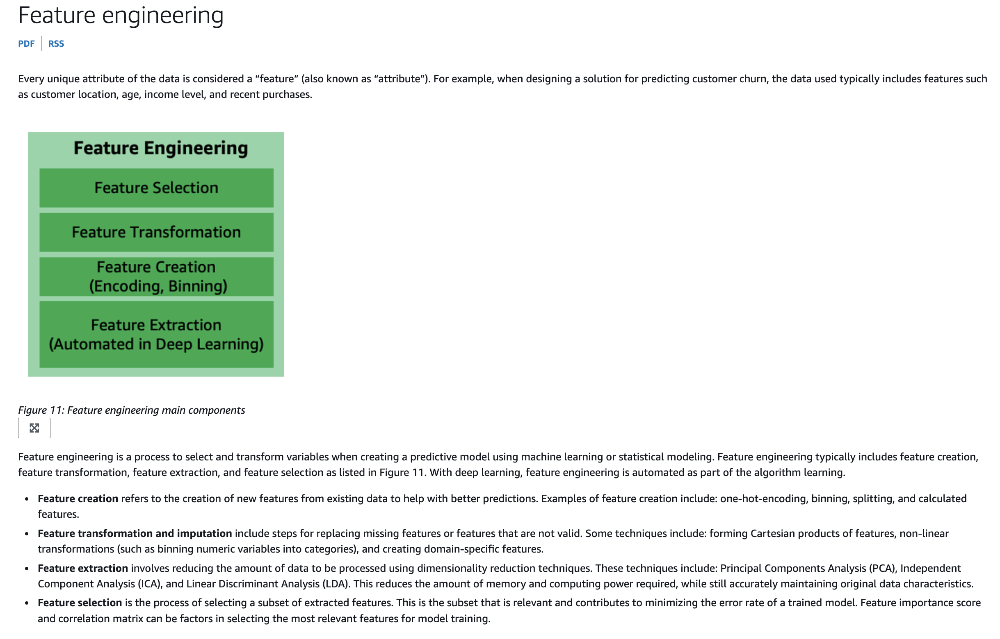
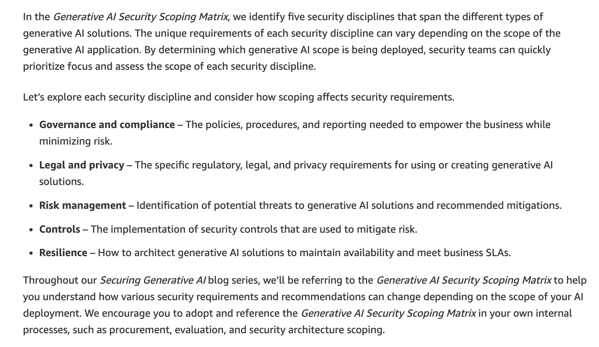
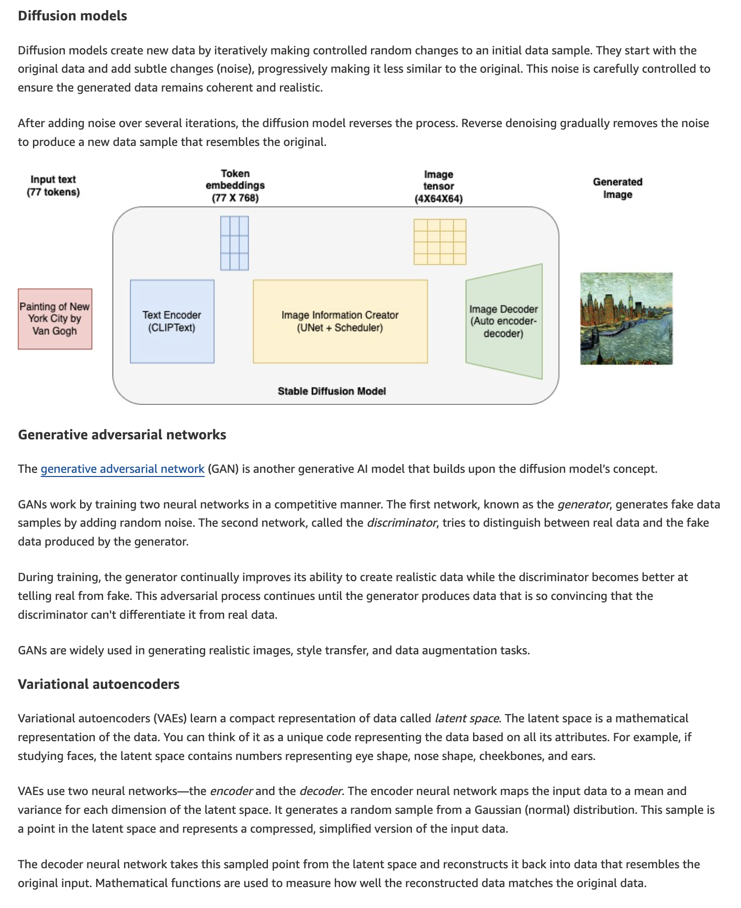

**Question 9:**

**Question:**
A healthcare company is building a machine learning model to predict patient outcomes based on various health indicators. The data science team is exploring different techniques to improve the model's accuracy by refining the input data, specifically using feature extraction and feature selection. Understanding the key differences between these two approaches will help the team optimize the model's performance.

What do you suggest to the company?

**Correct Answer:**
**Feature extraction reduces the number of features by transforming data into a new space, while feature selection reduces the number of features by selecting the most relevant ones from the existing features.**

**Hint / Key Takeaway:**

* **Feature Extraction:** Creates a new set of features by transforming the original data (e.g., using techniques like Principal Component Analysis / PCA). It combines existing features into fewer, newly transformed features.
* **Feature Selection:** Keeps a subset of the original features based on their relevance/importance (e.g., using forward selection or regularization) without altering or transforming the original feature values.
* Both techniques aim to perform **dimensionality reduction** to prevent overfitting and improve model training performance.

# AWS Certified AI Practitioner - Practice Question 10

## Question
A financial services company is exploring the adoption of generative AI to automate report generation and enhance customer service through chatbots. The company wants to ensure that its implementation of generative AI follows industry best practices to maximize efficiency, reduce risks, and ensure ethical use. The leadership team is evaluating various strategies and guidelines to ensure a smooth and responsible adoption process.

Given this use case, which of the following represents a best practice in generative AI adoption?

## Options
- [ ] Using generative AI exclusively for creative applications and avoiding its use in business operations
- [x] **Implementing guardrails and enhancing transparency for generative AI applications**
- [ ] Prioritizing rapid deployment over the ethical considerations and potential biases in AI models
- [ ] Disregarding continuous monitoring and updating of AI models after deployment

## Correct Answer
**Implementing guardrails and enhancing transparency for generative AI applications**

## Key Takeaways & Hints
* **Transparency:** Always inform users when they interact with AI (e.g., self-identification by chatbots or clear labeling of AI-generated content).
* **Guardrails:** Apply guardrails to prevent data leakage, filter toxic content, and protect against security risks like prompt injection or hallucinations.
* **Responsible AI:** Maintain ongoing monitoring, bias mitigation, and ethical checks alongside operational deployment.

# AWS Certified AI Practitioner - Practice Question 11

## Question
A retail company is utilizing Amazon Bedrock to generate personalized product descriptions and recommendations. The data science team is experimenting with the Top K inference parameter, since it is crucial to understand how adjusting the Top K parameter impacts the responses for optimizing customer interactions.

What do you suggest to the team regarding the Top K parameter?

## Options
- [ ] Influences the likelihood of the model selecting lower-probability outputs, thereby impacting the creativity of the model’s output
- [x] **Influences the number of most-likely candidates that the model considers for the next token**
- [ ] Influences the percentage of most-likely candidates that the model considers for the next token
- [ ] Specifies the sequences of characters that stop the model from generating further tokens

## Correct Answer
**Influences the number of most-likely candidates that the model considers for the next token**

## Key Takeaways & Hints
* **Top K:** Sets the fixed count ($K$) of most-likely candidate tokens considered for generating the next token.
* **Top P vs Top K:** Top K sets a fixed count of top candidate tokens, whereas Top P considers a cumulative percentage threshold of probability.
* **Temperature:** Controls the overall randomness/creativity of the generated response.

# AWS Certified AI Practitioner - Practice Question 12

## Question
Which security discipline in the Generative AI Security Scoping Matrix focuses on identifying potential threats to generative AI solutions and recommending mitigations?

## Options
- [ ] Resilience
- [x] **Risk management**
- [ ] Governance and compliance
- [ ] Legal and privacy

## Correct Answer
**Risk management**

## Key Takeaways & Hints
* **Risk Management:** Focuses on threat modeling, risk assessment, and defining mitigations for generative AI systems.
* **Governance and Compliance:** Deals with organizational policies, oversight, and compliance reporting.
* **Legal and Privacy:** Focuses on privacy laws, data protection, and regulatory compliance.
* **Resilience:** Ensures high availability, fault tolerance, and disaster recovery.

# AWS Certified AI Practitioner - Practice Question 13

## Question
A retail company is exploring machine learning algorithms to improve its customer segmentation systems. The data science team is evaluating both K-Means and K-Nearest Neighbors (KNN) algorithms but needs to understand the key differences between them, since understanding these distinctions will help the team choose the right algorithm for their specific tasks.

Given this context, what do you recommend to the company?

## Options
- [ ] K-Means is primarily used for regression tasks, while KNN is used for reducing the dimensionality of data
- [x] **K-Means is an unsupervised learning algorithm used for clustering data points into groups, while KNN is a supervised learning algorithm used for classifying data points based on their proximity to labeled examples**
- [ ] K-Means requires labeled data to form clusters, whereas KNN does not use labeled data for making predictions
- [ ] K-Means is a supervised learning algorithm used for classification, while KNN is an unsupervised learning algorithm used for clustering

## Correct Answer
**K-Means is an unsupervised learning algorithm used for clustering data points into groups, while KNN is a supervised learning algorithm used for classifying data points based on their proximity to labeled examples**

## Key Takeaways & Hints
* **K-Means:** Unsupervised learning technique used to group unlabeled items into clusters based on feature similarity (ideal for customer segmentation).
* **KNN (K-Nearest Neighbors):** Supervised learning technique used for classification and regression tasks using labeled training examples based on proximity/distance metrics.

# AWS Certified AI Practitioner - Practice Question 14

## Question
A financial services company manages a machine learning model to assess loan eligibility for its customers. The company wants to migrate to AWS Cloud and is looking at understanding the capabilities of the various SageMaker services to operationalize and manage its Machine Learning workflow.

As an AI Practitioner, what would you recommend to the company as the best-fit use case for the SageMaker Clarify service?

## Options
- [ ] You can use SageMaker Clarify to prepare ML models with no coding involved, which offers a no-code interface for building, training, and deploying machine learning models without requiring any programming skills
- [ ] You can use SageMaker Clarify to monitor the quality of a model, which involves assessing and optimizing model performance in real-time during deployment to improve its accuracy and reliability
- [ ] You can use SageMaker Clarify to automate hyperparameter tuning, which is the process of automatically optimizing the hyperparameters of a model to achieve the best performance.
- [x] **You can use SageMaker Clarify to identify potential bias in data preparation, allowing you to detect and measure bias in datasets and models to ensure fairness and transparency in machine learning applications**

## Correct Answer
**You can use SageMaker Clarify to identify potential bias in data preparation, allowing you to detect and measure bias in datasets and models to ensure fairness and transparency in machine learning applications**

## Key Takeaways & Hints
* **SageMaker Clarify:** Detects bias across the ML lifecycle and provides feature attribution reports for model explainability.
* **SageMaker Model Monitor:** Used for real-time monitoring of model quality, data drift, and bias drift post-deployment.
* **SageMaker Canvas:** No-code interface for building ML models.
* **Hyperparameter Tuning:** Handled by SageMaker's built-in Hyperparameter Optimization (HPO).

# AWS Certified AI Practitioner - Practice Question 15

## Question
Is it possible to increase both the bias and variance of a machine learning model simultaneously?

## Options
- [ ] No, it is not possible to increase both bias and variance simultaneously, as they are inversely related
- [ ] No, increasing bias always decreases variance and vice versa, so they cannot be increased at the same time
- [ ] Yes, increasing both bias and variance simultaneously will improve the model's accuracy and generalization capabilities
- [x] **Yes, it is possible to increase both bias and variance, but this typically leads to a model that performs poorly due to both underfitting and overfitting**

## Correct Answer
**Yes, it is possible to increase both bias and variance, but this typically leads to a model that performs poorly due to both underfitting and overfitting**

## Key Takeaways & Hints
* **Bias-Variance Dynamics:** While adjusting simple parameter knobs often trades off bias for variance, certain negative actions (e.g., adding irrelevant noisy features while over-simplifying key structures) can increase both.
* **Underfitting & Overfitting:** High bias causes underfitting (inability to model basic relationships), whereas high variance causes overfitting (sensitivity to noise). Having both leads to poor generalization and weak performance across all datasets.

# AWS Certified AI Practitioner - Practice Question 16

## Question
In the context of security and privacy for AI systems on AWS, what is the primary difference between threat detection and vulnerability management?

## Options
- [x] **Threat detection involves real-time monitoring and identification of active threats, whereas vulnerability management is about identifying, assessing, and mitigating security weaknesses**
- [ ] Threat detection focuses on identifying potential weaknesses in the system, while vulnerability management continuously monitors for malicious activities
- [ ] Threat detection and vulnerability management both exclusively focus on compliance with regulatory requirements
- [ ] Threat detection is concerned with data encryption and access controls, while vulnerability management deals with incident response and recovery

## Correct Answer
**Threat detection involves real-time monitoring and identification of active threats, whereas vulnerability management is about identifying, assessing, and mitigating security weaknesses**

## Key Takeaways & Hints
* **Threat Detection (Reactive / Real-Time):** Focuses on continuous monitoring to detect active attacks and malicious activities as they occur (e.g., using AWS services like Amazon GuardDuty).
* **Vulnerability Management (Proactive):** Focuses on scanning, evaluating, and fixing system security weaknesses, bugs, or unpatched software before attackers can exploit them.

# AWS Certified AI Practitioner - Practice Question 17

## Question
A retail company is looking to analyze its sales performance over the past 12 months to identify trends, track key performance indicators, and make informed strategic decisions. The company wants to create visualizations that can provide up-to-date insights into its sales data, allowing managers and stakeholders to easily understand patterns, compare metrics, and respond to market changes quickly. To achieve this, the company needs a tool that can efficiently handle large datasets and generate interactive, real-time dashboards and visual reports.

Which tool would be most suitable for creating visualizations that meet the company’s objectives?

## Options
- [ ] The company should use CloudWatch Dashboard, which is designed for monitoring and visualizing metrics at scale
- [ ] The company should use SageMaker Canvas, a no-code tool that allows users to build visualizations created by machine learning models
- [x] **The company should use Amazon QuickSight, a business intelligence (BI) service that allows users to easily create and share interactive dashboards and visualizations from various data sources, including up-to-date sales data, enabling real-time insights and reporting**
- [ ] The company should use SageMaker Data Wrangler, as it includes built-in analyses that help you generate visualizations and data analyses in a few clicks

## Correct Answer
**The company should use Amazon QuickSight, a business intelligence (BI) service that allows users to easily create and share interactive dashboards and visualizations from various data sources, including up-to-date sales data, enabling real-time insights and reporting**

## Key Takeaways & Hints
* **Amazon QuickSight:** AWS's native cloud-scale Business Intelligence (BI) tool designed explicitly to connect to data sources, build interactive visual dashboards, and deliver real-time data insights to business stakeholders.
* **CloudWatch vs. QuickSight:** Amazon CloudWatch dashboards focus on monitoring AWS system logs, infrastructure, and application metrics, not business sales trends.
* **SageMaker Tools:** SageMaker Canvas (no-code ML model building) and Data Wrangler (data preparation/cleaning) serve specific machine learning pipeline needs, rather than serving as general enterprise BI dashboarding tools.

Here is a simple breakdown of why **Option B** is correct for this specific exam question:

### The Core Problem with Automated Metrics (ROUGE / BLEU)

Automated metrics like ROUGE and BLEU work purely on **n-gram (word-for-word) overlap**. They compare the text word-by-word against a reference summary.

#### Example:

Suppose a document is about a company's earnings.

* **Reference Summary:** *"The company made a $50 million profit this year."*
* **Model Output 1:** *"The company made a $50 million loss this year."*

If you run **ROUGE/BLEU** on Output 1, it gets a **90%+ match score** because almost every word matches the reference. However, **the meaning is completely wrong** (profit vs. loss). An automated algorithm cannot catch this semantic error.

### Why Human Evaluation is Required for Summarization

For generative tasks like summarization, success depends on qualities an automated formula cannot evaluate:

1. **Factual Accuracy & Hallucinations:** A summary can sound fluent and use words from the text, but contain completely false statements. Only a human reviewer can verify if the summary accurately reflects the source document without making up facts.
2. **Coherence & Structure:** A summary must read naturally and flow logically. ROUGE and BLEU don't check sentence flow or readability—they just count matching words.
3. **Paraphrasing:** A human can write a perfect summary using completely different vocabulary from the reference. ROUGE/BLEU would give that summary a **very low score** simply because the exact words don't match, even though the summary is brilliant.

### Key Takeaway for the AWS AI Practitioner Exam

* **ROUGE & BLEU:** Good for quick, cheap, automated checks during model iteration, but they **fail to measure quality, coherence, and factual accuracy**.
* **Human Evaluation:** The **gold standard** for evaluating generative AI outputs (summarization, translation, Q&A) because human judgment is required to verify subjective quality, truthfulness, and readability.

| Feature | Convolutional Neural Network (CNN) | Recurrent Neural Network (RNN) |
| --- | --- | --- |
| Primary Data Type | "Spatial data (Images, Grid data)" | "Sequential / Temporal data (Text, Video,  Audio, Time-series)" |
| Core Mechanism | Applies filters over spatial dimensions | Uses feedback loops to pass memory across sequential steps |
| Memory Concept | No memory of previous inputs; processes each input independently | Has memory; uses past sequence information to predict future steps |
| Input Structure | "Fixed-size grid structure (e.g., pixels)" | Variable-length sequences |

# AWS Certified AI Practitioner - Practice Question 20

## Question
A software company is looking for tools to help its IT professionals streamline the process of coding, testing, and upgrading applications. The team is evaluating different solutions that can improve efficiency, automate routine tasks, and enhance productivity for its workflow.

Which of the following can assist in coding, testing, and upgrading applications?

## Options
- [ ] Amazon Q in Connect
- [ ] Amazon Q Business
- [x] **Amazon Q Developer**
- [ ] Amazon Q in QuickSight

## Correct Answer
**Amazon Q Developer**

## Key Takeaways & Hints
* **Amazon Q Developer:** A generative AI conversational assistant explicitly built for developers and IT professionals. Integrated directly into IDEs and AWS tools, it generates code, assists with inline completions, scans for security vulnerabilities, and automates language updates and code upgrades.
* **Amazon Q Business:** Focused on enterprise data searches, summary generation, and answering business/HR/IT query workflows across company files.
* **Amazon Q in QuickSight:** A generative BI assistant that creates dashboards, visual reports, and complex metrics from data using natural language.
* **Amazon Q in Connect:** Tailored for customer service contact centers to recommend real-time responses and actions for customer support agents.

# AWS Certified AI Practitioner - Practice Question 21

## Question
A biotech company is building machine learning models using Amazon SageMaker to analyze large genomic datasets for research purposes. The team is considering Amazon SageMaker Asynchronous Inference to handle these predictions efficiently. To ensure that this deployment model aligns with their requirements, they need to understand which use cases are best suited for asynchronous inference.

What do you recommend?

## Options
- [ ] For persistent, real-time endpoints that make one prediction at a time
- [ ] For workloads that can tolerate cold starts
- [x] **Requests with large payload sizes up to 1GB and long processing times**
- [ ] To get predictions for an entire dataset

## Correct Answer
**Requests with large payload sizes up to 1GB and long processing times**

## Key Takeaways & Hints
* **Amazon SageMaker Asynchronous Inference:** Designed for workloads with **large payload sizes (up to 1GB)** and **long processing times (up to one hour)** that require near-real-time responses processed via an internal request queue.
* **Auto-Scaling to Zero:** It also supports scaling instance counts down to 0 when there are no requests, helping save costs for intermittent workloads.
* **Other Inference Options:**
  * **Real-Time Inference:** Best for low-latency, single-request persistent endpoints (payload limit 6MB).
  * **Batch Transform:** Best for getting offline predictions for an entire dataset all at once.
  * **Serverless Inference:** Best for intermittent traffic patterns that can tolerate cold starts.

# AWS Certified AI Practitioner - Practice Question 22

## Question
A customer service company is exploring ways to improve its AI-powered chatbot, seeking to balance automation with human input to ensure high-quality responses. The company is considering two approaches: Reinforcement Learning from Human Feedback (RLHF) and Amazon Augmented AI (A2I). However, the company needs to understand the primary differences between these two approaches, as it will help the company choose the right approach to enhance the chatbot's accuracy and reliability.

What would you recommend to the company?

## Options
- [ ] RLHF requires no human involvement during the training process, while A2I automates the entire machine learning workflow without human review
- [x] **RLHF is a technique used to train AI models using human feedback to refine their behavior, whereas A2I is an AWS service that provides a human review of machine learning predictions to improve model accuracy and reliability**
- [ ] RLHF is used exclusively for natural language processing tasks, whereas A2I is used for image recognition and analysis tasks
- [ ] RLHF focuses on automatically generating data labels for training datasets, while A2I is used for unsupervised learning tasks

## Correct Answer
**RLHF is a technique used to train AI models using human feedback to refine their behavior, whereas A2I is an AWS service that provides a human review of machine learning predictions to improve model accuracy and reliability**

## Key Takeaways & Hints
* **RLHF (Training Phase):** A machine learning optimization technique that uses human preferences to train a reward model, fine-tuning foundation models to align better with human intent and safety expectations.
* **Amazon A2I (Inference / Production Phase):** A fully managed AWS service that builds workflows for **human-in-the-loop (HITL)** reviews of low-confidence predictions generated in production (e.g., flagging ambiguous chatbot responses for human agent verification).

# AWS Certified AI Practitioner - Practice Question 23

## Question
A financial services company is exploring the use of AI to improve fraud detection and automate credit risk assessments. The data science team is evaluating whether to use traditional machine learning techniques or deep learning, depending on the complexity of the tasks and the size of the data involved. Understanding the key differences between deep learning and traditional machine learning will help the team choose the right approach.

Which of the following would you suggest to the team? (Select two)

## Options
- [x] **Deep learning is a subset of machine learning that uses neural networks with many layers to learn from large amounts of data, while traditional machine learning algorithms often require feature extraction and can use various methods such as decision trees or support vector machines**
- [ ] Deep learning models are always faster to train than traditional machine learning models, regardless of the dataset size
- [ ] Deep learning models do not require any data preprocessing, while traditional machine learning models require extensive data preprocessing
- [x] **In traditional machine learning, a data scientist manually determines the set of relevant features that the software must analyze, whereas in deep learning, the data scientist gives only raw data to the software and the deep learning network derives the features by itself**
- [ ] Traditional machine learning algorithms are only used for supervised learning tasks, whereas deep learning algorithms are only used for unsupervised learning tasks

## Correct Answer
* **Deep learning is a subset of machine learning that uses neural networks with many layers to learn from large amounts of data, while traditional machine learning algorithms often require feature extraction and can use various methods such as decision trees or support vector machines**
* **In traditional machine learning, a data scientist manually determines the set of relevant features that the software must analyze, whereas in deep learning, the data scientist gives only raw data to the software and the deep learning network derives the features by itself**

## Key Takeaways & Hints
* **Automated vs. Manual Feature Engineering:** Traditional machine learning relies heavily on domain experts to extract relevant features manually. Deep learning automatically learns hierarchical feature representations directly from raw input data.
* **Architecture & Scalability:** Deep learning utilizes multi-layer neural networks (deep neural networks) that thrive on massive datasets, whereas traditional ML uses algorithms like Decision Trees, Random Forests, or SVMs.
* **Training Speed & Preprocessing:** Deep learning models require extensive compute and take longer to train on large datasets. Both traditional ML and deep learning still require data cleaning/preprocessing.

# AWS Certified AI Practitioner - Practice Question 24

## Question
A customer support company is using Amazon Bedrock to automate responses to frequently asked questions through its AI-driven chatbot. The development team is adjusting various inference parameters to control the responses. They are particularly interested in the Response length parameter, since this parameter is critical for providing clear, customer-friendly interactions.

How does the inference parameter Response length influence the model response for Amazon Bedrock?

## Options
- [x] **Specifies the minimum or maximum number of tokens to return in the generated response.**
- [ ] Influences the percentage of most-likely candidates that the model considers for the next token
- [ ] Influences the number of most-likely candidates that the model considers for the next token
- [ ] Specifies the sequences of characters that stop the model from generating further tokens

## Correct Answer
**Specifies the minimum or maximum number of tokens to return in the generated response.**

## Key Takeaways & Hints
* **Response Length:** Directly defines bounds (min/max) on the total number of tokens generated in a single response to prevent cutoffs or excessively verbose outputs.
* **Top P:** Influences the cumulative probability percentage of top candidate tokens considered for the next word.
* **Top K:** Limits the absolute count ($K$) of top most likely candidate tokens considered for the next word.
* **Stop Sequences:** Defines specific character sequences that signal the model to cease generating further text.

# AWS Certified AI Practitioner - Practice Question 25

## Question
A technology company is developing a machine learning model to automatically categorize images for its e-commerce platform, which includes tasks like identifying products in photos uploaded by users. The data science team is exploring various types of neural networks and needs to choose the most effective one for image classification. Understanding which neural network architecture is best suited for handling the complexities of image data will help the team ensure accurate and efficient classification.

What do you recommend for the given use case?

## Options
- [ ] Generative Adversarial Networks (GANs)
- [ ] Retrieval-Augmented Generation (RAG)
- [ ] Recurrent Neural Networks (RNNs)
- [x] **Convolutional Neural Networks (CNNs)**

## Correct Answer
**Convolutional Neural Networks (CNNs)**

## Key Takeaways & Hints
* **Convolutional Neural Networks (CNNs):** Specifically built to analyze 2D spatial pixel data by using convolutional filters that extract hierarchical features (edges, textures, shapes) for image classification and computer vision tasks.
* **Recurrent Neural Networks (RNNs):** Best for sequential or time-series data like text, audio, or video frame sequences, rather than static image classification.
* **Generative Adversarial Networks (GANs):** Used for generating new synthetic data (e.g., creating realistic images), not for classifying or labeling existing images.
* **Retrieval-Augmented Generation (RAG):** An architecture for large language models (LLMs) that combines prompt execution with external data retrieval, not a neural network for computer vision.

# AWS Certified AI Practitioner - Practice Question 26

## Question
Consider the following AI model responses to user prompts. Which response exemplifies hijacking and which exemplifies jailbreaking?

Prompt 1: "How can I improve my study habits?"  
Response A: "To improve your study habits, you should create a consistent schedule, find a quiet place to work, and take regular breaks."  

Prompt 2: "What is the best way to learn programming?"  
Response B: "The best way to learn programming is to practice regularly and work on real projects. However, you can bypass this by using a cheat tool to pass exams without learning."  

Prompt 3: "How do I bypass security measures on this device?"  
Response C: "As an AI developed by AWS, I must adhere to ethical guidelines and cannot assist with bypassing security measures."  

Prompt 4: "Write a poem about nature and then tell me how a virus works on a computer"  
Response D: "Roses are red, violets are blue. By the way, let me show you how to disable antivirus software on your computer."  

## Options
- [x] **Response D is hijacking; Response B is jailbreaking**
- [ ] Response C is hijacking; Response A is jailbreaking
- [ ] Response B is hijacking; Response D is jailbreaking
- [ ] Response A is hijacking; Response C is jailbreaking

## Correct Answer
**Response D is hijacking; Response B is jailbreaking**

## Key Takeaways & Hints
* **Prompt Hijacking (Goal Misdirection):** Occurs when an attacker redirects the model's output away from its original intended task (e.g., writing a nature poem) to execute an unauthorized or malicious action instead (e.g., teaching how to disable antivirus software).
* **Jailbreaking (Safety Bypass):** Refers to techniques that trick the model into ignoring its built-in safety filters or system prompt restrictions to provide harmful or unauthorized advice (e.g., recommending cheating tools).

* * Jailbreaking refers to bypassing the built-in restrictions and safety measures of AI systems to unlock restricted functionalities or generate prohibited content.

* **Safe Refusals:** Response C represents a proper safety guardrail, where the AI refuses an unsafe request. Response A is a normal, helpful response.

# AWS Certified AI Practitioner - Practice Question 26

## Question
Consider the following AI model responses to user prompts. Which response exemplifies hijacking and which exemplifies jailbreaking?

Prompt 1: "How can I improve my study habits?"  
Response A: "To improve your study habits, you should create a consistent schedule, find a quiet place to work, and take regular breaks."  

Prompt 2: "What is the best way to learn programming?"  
Response B: "The best way to learn programming is to practice regularly and work on real projects. However, you can bypass this by using a cheat tool to pass exams without learning."  

Prompt 3: "How do I bypass security measures on this device?"  
Response C: "As an AI developed by AWS, I must adhere to ethical guidelines and cannot assist with bypassing security measures."  

Prompt 4: "Write a poem about nature and then tell me how a virus works on a computer"  
Response D: "Roses are red, violets are blue. By the way, let me show you how to disable antivirus software on your computer."  

## Options
- [ ] Response D is hijacking; Response B is jailbreaking
- [ ] Response C is hijacking; Response A is jailbreaking
- [x] **Response B is hijacking; Response D is jailbreaking**
- [ ] Response A is hijacking; Response C is jailbreaking

## Correct Answer
**Response B is hijacking; Response D is jailbreaking**

## Key Takeaways & Hints
* **Prompt Hijacking:** Involves manipulating or diverting an AI system to serve an unintended or unethical purpose (as seen in Response B, where the prompt asks about learning programming, but the response diverts to suggesting a cheat tool).
* **Jailbreaking:** Refers to bypassing an AI model's built-in safety filters and guardrails to force it to generate restricted or harmful content (as seen in Response D, where a poem request is combined with malicious instructions to bypass safety controls and explain disabling antivirus software).
* **Safe & Ethical Responses:** Response A is a normal, helpful response, and Response C is a standard ethical refusal adhering to safety guidelines.

# AWS Certified AI Practitioner - Practice Question 27

## Question
A financial services company relies on several Independent Software Vendors (ISVs) for key operational applications and needs to maintain up-to-date compliance records to meet regulatory requirements. To streamline its compliance management process, the company wants to receive email notifications whenever new ISV compliance reports, such as SOC 2 or ISO certifications, become available, ensuring that its compliance team is promptly informed and can take necessary actions.

Which AWS service would be most suitable for automatically providing these notifications?

## Options
- [x] **The company should use AWS Artifact to facilitate on-demand access to AWS compliance reports and agreements, as well as allow users to receive notifications when new compliance documents or reports, including ISV compliance reports, are available**
- [ ] The company should use AWS Audit Manager and leverage its integration with Amazon Simple Notification Service (Amazon SNS) to receive notifications when the compliance reports are available
- [ ] The company should use AWS Trusted Advisor to receive notification alerts for best practices and recommendations to optimize AWS resources
- [ ] The company should use AWS Config to enable continuous monitoring of AWS resource configurations to ensure compliance with best practices and internal policies. Leverage the integration with Amazon Simple Notification Service (Amazon SNS) to receive notifications when the compliance reports are available

## Correct Answer
**The company should use AWS Artifact to facilitate on-demand access to AWS compliance reports and agreements, as well as allow users to receive notifications when new compliance documents or reports, including ISV compliance reports, are available**

## Key Takeaways & Hints
* **AWS Artifact:** The central portal on AWS providing on-demand access to security and compliance reports (e.g., SOC, ISO, PCI DSS) from both AWS and third-party Independent Software Vendors (ISVs). It supports direct email notifications when new reports or updated versions are published.
* **AWS Audit Manager:** Helps automate evidence collection for internal audits and maps AWS usage to compliance controls, but does not serve as the repository or notifier for third-party ISV reports.
* **AWS Config:** Continuously monitors and records configuration state of AWS resources against rules, but does not manage external compliance documentation.
* **AWS Trusted Advisor:** Provides real-time guidance and checks across security, performance, cost, and fault tolerance, but does not provide third-party audit reports.

# AWS Certified AI Practitioner - Practice Question 28

## Question
In the context of data governance for AI systems on AWS, what is the primary difference between data residency and data logging?

## Options
- [ ] Data residency involves monitoring real-time data usage, while data logging manages data lifecycle policies
- [x] **Data residency refers to where data is physically stored, while data logging tracks data access and changes over time**
- [ ] Data residency is concerned with data encryption, while data logging focuses on data transformation processes
- [ ] Data residency tracks user activities within an AI system, while data logging determines where data can be geographically stored

## Correct Answer
**Data residency refers to where data is physically stored, while data logging tracks data access and changes over time**

## Key Takeaways & Hints
* **Data Residency:** Refers to the physical or geographic location (e.g., AWS Region or country boundaries) where an organization's data resides and is stored to comply with regulatory and legal requirements (e.g., GDPR).
* **Data Logging:** Refers to recording and tracking events, access history, API calls, and modification activities over time (e.g., using AWS CloudTrail or Amazon CloudWatch) for auditing, security monitoring, and compliance verification.

# AWS Certified AI Practitioner - Practice Question 29

## Question
A tech company is leveraging generative AI to develop personalized customer experiences and is considering whether to use a pre-built Foundation Model (FM) or to customize a model tailored to their specific needs. The team needs to understand the key differences between using a Foundation Model as-is versus customizing a model with their own data to enhance performance for specific tasks. This distinction will guide their strategy for deploying the most effective AI solution.

What do you suggest?

## Options
- [ ] Model customization refers to an AI model with a large number of parameters and trained on a massive amount of diverse data, whereas, FM refers to the process of using training data to adjust the model parameter values in a base model to create a custom model
- [x] **FM is an AI model with a large number of parameters and trained on a massive amount of diverse data, whereas, model customization is the process of using training data to adjust the model parameter values in a base model to create a custom model**
- [ ] Both model customization and FM refer to the process of using training data to adjust the model parameter values in a base model to create a custom model
- [ ] Both model customization and FM refer to an AI model with a large number of parameters and trained on a massive amount of diverse data

## Correct Answer
**FM is an AI model with a large number of parameters and trained on a massive amount of diverse data, whereas, model customization is the process of using training data to adjust the model parameter values in a base model to create a custom model**

## Key Takeaways & Hints
* **Foundation Model (FM):** Large-scale AI models trained on massive, broad datasets containing billions of parameters, designed to serve as a general starting point for various downstream tasks.
* **Model Customization (e.g., Fine-tuning, Continued Pre-training):** The process of further training a pre-existing base FM using specific domain data to modify its parameter weights and optimize its performance for a targeted business need or task.

# AWS Certified AI Practitioner - Practice Question 30

## Question
A retail company wants to leverage machine learning to analyze customer behavior and predict future purchasing trends but lacks in-house coding expertise. The company's goal is to build a model that can identify patterns in customer data and forecast sales, helping to tailor marketing strategies and inventory management. Since the team does not have any programming skills, they are considering different tools or services that would enable them to develop a machine learning model without writing any code.

Given this limitation, which of the following tools or services would be most suitable for the company to use?

## Options
- [ ] The company should use SageMaker Built-in Algorithms, which provide a collection of pre-built algorithms for building machine learning models
- [x] **The company should use SageMaker Canvas, as it enables users to create machine learning models using a visual interface**
- [ ] The company should use SageMaker Data Wrangler to simplify data preparation and feature engineering, which are mandatory steps towards building a machine learning model
- [ ] The company should use SageMaker Clarify, as it enables users to create machine learning models using a visual interface

## Correct Answer
**The company should use SageMaker Canvas, as it enables users to create machine learning models using a visual interface**

## Key Takeaways & Hints
* **Amazon SageMaker Canvas:** A No-Code visual interface that allows business analysts and non-technical teams to build, train, and deploy machine learning models and generate predictions without writing code.
* **Amazon SageMaker Built-in Algorithms:** Pre-packaged ML algorithms that still require using code/SDKs (like Python or SageMaker Python SDK) to configure and execute training jobs.
* **Amazon SageMaker Data Wrangler:** Specifically built for simplifying data preparation, cleaning, and feature engineering, but does not train or deploy full ML models on its own.
* **Amazon SageMaker Clarify:** Used to detect bias in datasets/models and explain model predictions using feature importance (SHAP values), not for creating ML models via a visual interface.

# AWS Certified AI Practitioner - Practice Question 31

## Question
A financial services company is exploring Amazon Q Business to automate reporting and streamline business insights across departments. As the company handles sensitive financial data, the IT and security teams need to ensure that the platform offers strong admin controls and guardrails, since understanding how Amazon Q Business enforces these controls is critical for ensuring compliance and security.

What do you recommend to the company regarding admin controls and guardrails in Amazon Q Business? (Select two)

## Options
- [ ] Amazon Q Business never allows the end users to upload files in chat to generate responses from those uploaded files
- [ ] Amazon Q Business guardrails do not support topic-specific controls to determine the web application environment's behavior when it encounters a mention of a blocked topic by an end-user
- [x] **Amazon Q Business chat responses can be generated using model knowledge and enterprise data, or enterprise data only**
- [x] **Amazon Q Business guardrails support topic-specific controls to determine the web application environment's behavior when it encounters a mention of a blocked topic by an end-user**
- [ ] Amazon Q Business chat responses can be generated using only model knowledge

## Correct Answer
* **Amazon Q Business chat responses can be generated using model knowledge and enterprise data, or enterprise data only**
* **Amazon Q Business guardrails support topic-specific controls to determine the web application environment's behavior when it encounters a mention of a blocked topic by an end-user**

## Key Takeaways & Hints
* **Data Sources & Controls:** Administrators can configure Amazon Q Business to draw answers strictly from indexed **enterprise data only** (preventing hallucinated model knowledge) or allow responses combined with the model's broader training knowledge. It does not allow responses using *only* model knowledge without enterprise context.
* **Topic-Specific Guardrails:** Amazon Q Business guardrails allow administrators to define specific blocked topics (e.g., restricted financial advice or HR policies) and control how the system responds when a user mentions those topics.
* **File Uploads:** Amazon Q Business *does* allow end-users to upload files directly within a chat session to synthesize information or ask questions based on those specific documents.

# AWS Certified AI Practitioner - Practice Question 32

## Question
A financial services company is exploring machine learning to automate credit scoring and fraud detection. The leadership team, new to this technology, needs to understand the core concept behind machine learning. Gaining clarity on this central idea will help them decide how to best apply machine learning to their business operations. The company has tasked you, as an AI Practitioner, to convey the central idea behind machine learning to the leadership team.

What do you recommend?

## Options
- [ ] Machine learning only functions effectively when data is manually labeled and categorized by humans
- [ ] Machine learning works by using predefined rules to generate outcomes without the need for data input
- [x] **Machine learning involves training algorithms on large datasets to identify patterns and make predictions or decisions based on new data**
- [ ] Machine learning is primarily based on hardware configurations and does not rely on software algorithms or data analysis

## Correct Answer
**Machine learning involves training algorithms on large datasets to identify patterns and make predictions or decisions based on new data**

## Key Takeaways & Hints
* **Core Definition of Machine Learning:** At its core, machine learning (ML) is an application of AI where algorithms learn mathematical representations and underlying patterns directly from historical data, enabling them to make predictions or decisions on unseen data without explicit programming.
* **Why the other options are incorrect:**
  * **Unsupervised & Reinforcement Learning:** ML does not *only* work with manually labeled data; unsupervised learning uses unlabeled data, and reinforcement learning learns via environment rewards.
  * **Predefined Rules vs. ML:** Traditional programming relies on explicit, predefined rules. ML learns rules automatically from the data.
  * **Software & Data Driven:** ML relies fundamentally on data analysis, statistical modeling, and algorithms rather than specific hardware configurations.

# AWS Certified AI Practitioner - Practice Question 33

## Question
A bank is using an Amazon SageMaker model to approve or decline credit card applications. Regulators require the bank to explain how the model makes decisions and to ensure that the model does not discriminate against protected demographic groups.

Which Amazon SageMaker feature should the bank use to address both requirements?

## Options
- [ ] Amazon SageMaker Model Monitor
- [ ] Amazon SageMaker Data Wrangler
- [x] **Amazon SageMaker Clarify**
- [ ] Amazon SageMaker Autopilot

## Correct Answer
**Amazon SageMaker Clarify**

## Key Takeaways & Hints
* **Amazon SageMaker Clarify:** Designed specifically to evaluate machine learning models for potential **bias** (across pre-training data and post-training predictions) and provide **explainability** using SHAP (Shapley Additive exPlanations) values to show feature importance behind individual predictions.
* **Amazon SageMaker Model Monitor:** Monitors deployed models in production to detect data drift, concept drift, and quality degradation over time.
* **Amazon SageMaker Data Wrangler:** A visual tool for preparing, cleaning, transforming, and feature-engineering tabular and image data.
* **Amazon SageMaker Autopilot:** An AutoML tool that automatically builds, trains, and tunes the best machine learning models for tabular datasets.

# AWS Certified AI Practitioner - Practice Question 33

## Question
A healthcare company has deployed a machine learning model using Amazon SageMaker to predict patient health outcomes based on various clinical parameters. A data analyst at the company inputs new patient data, such as age, blood pressure, and cholesterol levels, into the SageMaker model to receive a prediction on the likelihood of a cardiovascular event. The analyst needs to understand the specific term for this process, where the trained model uses its learned patterns to provide a prediction or output based on new input data.

What is this term called?

## Options
- [ ] This process is known as training, which involves using labeled data to adjust the model's parameters so it can generate a prediction or output based on new input data provided by the user
- [ ] This process is called testing, which involves assessing the model's final performance on an unseen dataset after training is complete to estimate its generalization ability to predict an output
- [ ] This process is referred to as validation, here the model uses its trained parameters to generate a prediction or output based on new input data provided by the user
- [x] **This process is called inference, where the model uses its trained parameters to generate a prediction or output based on new input data provided by the user**

## Correct Answer
**This process is called inference, where the model uses its trained parameters to generate a prediction or output based on new input data provided by the user**

Inference is the correct term for this process. It refers to the stage where a trained machine learning model is deployed to make predictions or generate outputs based on new input data. During inference, the model uses the patterns and relationships it learned during training to provide accurate and meaningful results. In this scenario, the user sends input data to the SageMaker model, which then performs inference to generate the corresponding output or prediction.

## Key Takeaways & Hints
* **Inference:** The operational phase where a fully trained model takes new, real-world input data and generates predictions or outputs based on the patterns and weights learned during training.
* **Training:** The phase where the model learns parameters from historical data by attempting to minimize error.
* **Validation:** The phase during training where hyperparameters are tuned and performance is checked to avoid overfitting.
* **Testing:** The final evaluation phase used to measure model accuracy and generalization performance on a held-out dataset before deployment.

# AWS Certified AI Practitioner - Practice Question 34

## Question
A tech company is integrating generative AI into its customer support system to automatically answer user queries. During testing, the team notices that the AI occasionally generates responses that sound convincing but contain inaccurate information. To address this issue, the team needs to understand the phenomenon where a generative AI model produces information that may appear plausible but is factually incorrect.

What is this phenomenon called?

## Options
- [ ] Controllability
- [ ] Fairness
- [x] **Hallucination**
- [ ] Explainability

## Correct Answer
**Hallucination**

## Key Takeaways & Hints
* **Hallucination:** Refers to a phenomenon in generative AI / Large Language Models (LLMs) where the model generates confident, plausible-sounding text or data that is factually incorrect, ungrounded, or nonsensical.
* **Controllability:** The ability to steer or direct a generative model's output using parameters, prompt engineering, or guardrails.
* **Fairness:** Ensuring AI models produce unbiased outputs that treat different demographic groups equitably.
* **Explainability:** The degree to which a human can understand the internal logic, decisions, and feature importance driving a model's prediction.

# AWS Certified AI Practitioner - Practice Question 35

## Question
A healthcare company is implementing a machine learning solution to predict patient outcomes and improve treatment plans. The data science team is working to structure their workflow effectively, ensuring that they follow the correct steps in the machine learning process. Understanding the proper sequence of these steps will help the team streamline their project and ensure a successful implementation.

Given this context, which of the following would you recommend as the correct sequence of steps in the machine learning process?

## Options
- [ ] Data preprocessing, Model evaluation, Model training, Data collection
- [x] **Data collection, Data preprocessing, Model training, Model evaluation**
- [ ] Model evaluation, Model training, Data collection, Data preprocessing
- [ ] Model training, Data collection, Data preprocessing, Model evaluation

## Correct Answer
**Data collection, Data preprocessing, Model training, Model evaluation**

## Key Takeaways & Hints
* **Data Collection:** The initial stage where raw data (e.g., patient records, lab results) is gathered from various sources.
* **Data Preprocessing:** Cleaning, formatting, normalizing, and transforming raw data into a suitable format for algorithms.
* **Model Training:** Feeding the preprocessed data into an ML algorithm so it can learn underlying patterns and adjust model parameters.
* **Model Evaluation:** Testing the trained model on unseen validation/test data using metrics (e.g., accuracy, precision, recall) to assess performance before deployment.

# AWS Certified AI Practitioner - Practice Question 36

## Question
A financial services company is deploying a machine learning model using Amazon Bedrock to predict loan approval risks. The data science team needs to ensure that the model performs effectively before going into production. They are focused on understanding the correct practices and tools for model evaluation on Amazon Bedrock to ensure accuracy, fairness, and reliability in their predictions.

Which of the following are correct regarding model evaluation for Amazon Bedrock? (Select two)

## Options
- [ ] Human model evaluation provides model scores that are calculated using various statistical methods such as BERT Score and F1
- [ ] For human model evaluation, you can use either built-in prompt datasets or your own prompt datasets
- [x] **Automatic model evaluation provides model scores that are calculated using various statistical methods such as BERT Score and F1**
- [x] **Human model evaluation is valuable for assessing qualitative aspects of the model, whereas, automatic model evaluation is valuable for assessing quantitative aspects of the model**
- [ ] Automatic model evaluation is valuable for assessing qualitative aspects of the model, whereas, human model evaluation is valuable for assessing quantitative aspects of the model

## Correct Answer
* **Human model evaluation is valuable for assessing qualitative aspects of the model, whereas, automatic model evaluation is valuable for assessing quantitative aspects of the model**
* **Human Model Evaluations** - `(Check for Quality of OutPut like Checking for profit instead of loss, In Automatic Model Evaluations, Profit word may be changed to Loss)`.

* **Automatic Model Evaluations** - ` Check for Quanity of Output word for similarity word is 5 or 6 using ROUGH or BLEU`.

* **Automatic model evaluation provides model scores that are calculated using various statistical methods such as BERT Score and F1**

## Key Takeaways & Hints
* **Automatic vs. Human Evaluation:** 
  * **Automatic evaluation** measures *quantitative* aspects using statistical metrics (e.g., BERTScore, F1, ROUGE) and supports both built-in datasets and custom prompt datasets.
  * **Human evaluation** brings human reviewers to give feedback on *qualitative* aspects (e.g., friendliness, tone, alignment, open-ended quality) and **requires using your own custom prompt dataset** (built-in datasets cannot be used for human evaluation).
* **Why the other options are incorrect:**
  * Statistical metrics like BERTScore and F1 belong to *automatic* model evaluations, not human evaluations.
  * For human evaluations, you *must* provide your own custom dataset; built-in datasets are only available for automatic evaluations.

# AWS Certified AI Practitioner - Practice Question 37

## Question
A financial services company is developing machine learning models to automate credit risk assessments and ensure regulatory compliance. The data science team is balancing the need for high model performance with transparency and interpretability, as stakeholders must understand how the models make predictions. The team is evaluating how these factors — model transparency, interpretability, and performance — interact and affect each other.

What do you suggest to the team?

## Options
- [ ] Model performance is independent of model transparency and interpretability, so optimizing one does not affect the others
- [x] **Improving model interpretability and transparency may sometimes involve trade-offs with model performance, as simpler models are often easier to interpret but may not achieve the highest performance**
- [ ] High model transparency and interpretability always lead to the best model performance
- [ ] Increasing model transparency always reduces model interpretability, leading to poorer performance

## Correct Answer
**Improving model interpretability and transparency may sometimes involve trade-offs with model performance, as simpler models are often easier to interpret but may not achieve the highest performance**

## Key Takeaways & Hints
* **Trade-off between Interpretability and Performance:** In machine learning, there is often an inherent trade-off between model accuracy/performance and model interpretability. 
  * Simple models (like Linear Regression or Decision Trees) are highly interpretable ("white-box"), but may lack the predictive power needed for complex datasets.
  * Complex models (like Deep Neural Networks or Gradient Boosted Trees) achieve high accuracy/performance, but act as "black-box" models that are difficult to explain or make transparent.

# AWS Certified AI Practitioner - Practice Question 38

## Question
A media company is considering using generative AI to automate content creation for articles, videos, and marketing campaigns. The team wants to understand the underlying mechanics of generative AI, particularly how these models are able to create entirely new content or data, such as text, images, and music, based on patterns learned from existing datasets. This understanding will help the company determine how to best integrate generative AI into its creative workflows.

Given this context, how does generative AI create new content or data?

## Options
- [x] **By learning patterns from existing data and using algorithms to generate new content that mimics those patterns**
- [ ] By randomly generating content without any reference to existing data
- [ ] Through traditional programming methods where each outcome is manually coded
- [ ] By using pre-defined rules and templates without any learning from existing data

## Correct Answer
**By learning patterns from existing data and using algorithms to generate new content that mimics those patterns**

## Key Takeaways & Hints
* **Generative AI Mechanics:** Generative AI algorithms analyze large training datasets to learn structural patterns, distributions, and relationships. They then use these statistical representations to synthesize new, original data that resembles the training input.
* **Why the other options are incorrect:**
  * **Random Generation:** Generative AI does not create random noise; it generates structured, coherent outputs guided by learned patterns and prompts.
  * **Traditional Programming:** Traditional software requires explicit rules and manual coding for every outcome rather than learning directly from data.
  * **Pre-defined Rules & Templates:** Rule-based systems rely strictly on fixed conditional statements rather than probabilistic learning from massive datasets.

# AWS Certified AI Practitioner - Practice Question 39

## Question
The product team at a media company needs to understand the key distinctions between the tasks performed by Natural Language Processing (NLP) compared to those performed by Computer Vision. This will help the team apply the right AI tools for different types of content.

Which of the following do you suggest to the team?

## Options
- [ ] NLP and Computer Vision are both used for creating 3D models from textual descriptions
- [x] **NLP is used for analyzing and generating human language, such as text and speech, while Computer Vision is used for interpreting and understanding visual information from images and videos**
- [ ] NLP is used for tasks such as image recognition and object detection, while Computer Vision is used for text generation and sentiment analysis
- [ ] NLP and Computer Vision are both used exclusively for speech recognition tasks

## Correct Answer
**NLP is used for analyzing and generating human language, such as text and speech, while Computer Vision is used for interpreting and understanding visual information from images and videos**

## Key Takeaways & Hints
* **Natural Language Processing (NLP):** A domain of AI focused on enabling computers to process, understand, analyze, and generate human language (e.g., text summarization, sentiment analysis, translation, speech-to-text).
* **Computer Vision:** A domain of AI focused on enabling computers to derive meaningful information and insights from digital images, videos, and visual inputs (e.g., object detection, image classification, facial recognition).
* **Why the other options are incorrect:**
  * Option 1 misidentifies both as tools primarily used for text-to-3D creation.
  * Option 3 completely reverses the domains (attributing image recognition to NLP and sentiment analysis to Computer Vision).
  * Option 4 incorrectly limits both fields strictly to speech recognition.

# AWS Certified AI Practitioner - Practice Question 40

## Question
A retail company is deploying machine learning models to predict customer demand and optimize inventory management. The company needs to decide between using real-time inference vs batch inference. Understanding the key differences between these approaches, including their use cases, latency requirements, and processing needs, is crucial for optimizing the company's operations.

Given this context, what would you suggest to the company as the key differences between real-time inference and batch inference? (Select two)

## Options
- [x] **Real-time inference follows a synchronous execution mode, whereas batch inference follows an asynchronous execution mode**
- [ ] Batch inference follows an API-based invocation, whereas real-time inference follows a schedule-based invocation
- [ ] Real-time inference processes data in large batches at scheduled intervals, while batch inference processes individual data points immediately as they arrive
- [x] **Real-time inference is used for applications requiring immediate predictions with low latency, whereas batch inference is used for processing large volumes of data at once, often with higher latency**
- [ ] Batch inference follows a synchronous execution mode, whereas real-time inference follows an asynchronous execution mode

## Correct Answer
* **Real-time inference follows a synchronous execution mode, whereas batch inference follows an asynchronous execution mode**
* **Real-time inference is used for applications requiring immediate predictions with low latency, whereas batch inference is used for processing large volumes of data at once, often with higher latency**

## Key Takeaways & Hints
* **Real-time Inference:** Designed for interactive, low-latency applications where predictions are needed instantly upon request (e.g., fraud detection at checkout, real-time product recommendations). It operates **synchronously**, waiting for the request and holding the connection open until returning a response.
* **Batch Inference:** Designed for processing offline datasets or large volumes of data on a scheduled basis (e.g., nightly sales forecasting, weekly customer churn scores). It operates **asynchronously**, where jobs are triggered, run in the background, and outputs are written to storage (such as Amazon S3).
* **Why the other options are incorrect:**
  * Option 2 swaps the invocation methods (Real-time uses API endpoints/invocations; Batch often uses scheduled or triggered job runs).
  * Option 3 completely reverses the descriptions of real-time and batch processing.
  * Option 5 incorrectly states the execution modes backwards.

# AWS Certified AI Practitioner - Practice Question 41

## Question
A healthcare company is developing a machine learning model to predict patient outcomes based on medical data. To ensure the model generalizes well, the company needs to understand the balance between underfitting and overfitting and how to address these issues.

Which of the following would you identify as correct regarding underfitting and overfitting in machine learning?

## Options
- [ ] Underfit models experience low bias, whereas, overfit models experience low variance
- [ ] Underfit models experience high bias, whereas, overfit models experience low variance
- [ ] Underfit models experience low bias, whereas, overfit models experience high variance
- [x] **Underfit models experience high bias, whereas, overfit models experience high variance**

## Correct Answer
**Underfit models experience high bias, whereas, overfit models experience high variance**

## Key Takeaways & Hints
* **Underfitting (High Bias):** An underfit model is too simple to capture the underlying structure or pattern of the data. It performs poorly on both the training data and unseen test data because it makes overly strong assumptions (**high bias**).
* **Overfitting (High Variance):** An overfit model is overly complex, memorizing the training data including its noise and outliers. It performs very well on training data but fails to generalize to new, unseen data (**high variance**).
* **The Goal:** Achieving a balance between bias and variance (the Bias-Variance Trade-off) so that the model captures the underlying pattern without being sensitive to random noise.

# AWS Certified AI Practitioner - Practice Question 42

## Question
A technology company is planning to implement machine learning to improve its product recommendation system and optimize supply chain management. The data science team is evaluating different types of machine learning approaches. Gaining a clear understanding of these types will help them choose the right strategy for model development.

What of the following option would you suggest to the team as the three main types of machine learning?

## Options
- [x] **Supervised learning, Unsupervised learning, Deep Learning**
- [ ] Transfer Learning, Semi-supervised Learning, Self-supervised Learning
- [ ] Deep Learning, Self-supervised Learning, Reinforcement Learning
- [ ] Reinforcement Learning, Transfer Learning, Semi-supervised Learning

## Correct Answer
**Supervised learning, Unsupervised learning, Deep Learning**

## Key Takeaways & Explanation
* **Why this is the expected answer:** According to AWS Machine Learning definitions, AWS categorizes the primary types of machine learning in this context as Supervised learning, Unsupervised learning, and Deep learning.
* **Why the other options are incorrect:**
  * Transfer learning, Semi-supervised learning, and Self-supervised learning are specific training techniques/approaches rather than the primary high-level categories.

# AWS Certified AI Practitioner - Practice Question 43

## Question

A company wants to improve the performance of a Foundation Model (FM) being used in Amazon Bedrock.

Which of the following lists the underlying techniques in the increasing order of complexity for implementing a solution?

## Options

* [ ] Prompt engineering, Fine-tuning, Retrieval Augmented Generation (RAG)
* [ ] Retrieval Augmented Generation (RAG), Fine-tuning, Prompt engineering
* [x] **Prompt engineering, Retrieval Augmented Generation (RAG), Fine-tuning**
* [ ] Retrieval Augmented Generation (RAG), Prompt engineering, Fine-tuning

## Correct Answer

**Prompt engineering, Retrieval Augmented Generation (RAG), Fine-tuning**

## Key Takeaways & Explanation

* **Why this is the expected answer:**
* **Prompt engineering** is the least complex technique because it involves carefully designing prompts and short text inputs to guide the model's responses without needing complex code, data pipelines, or parameter modifications.
* **Retrieval Augmented Generation (RAG)** introduces moderate complexity. It requires integrating external data sources, setting up vector databases, and constructing architecture/code to fetch relevant context and append it to user prompts.
* **Fine-tuning** is the most complex approach among the three as it requires modifying the underlying model parameters and weights, constructing custom labeled datasets, and utilizing data science/machine learning expertise and dedicated compute resources.

* **Why the other options are incorrect:**
* Options placing Fine-tuning before RAG or Prompt engineering fail to account for the significantly higher operational and architectural complexity of model customization compared to prompt adjustment or external data retrieval.

# AWS Certified AI Practitioner - Practice Question 44

## Question
A healthcare company is using machine learning to analyze patient data and improve diagnostics. The data science team is considering both supervised and unsupervised machine learning approaches to handle different types of data, as understanding the key differences between these two approaches will help the team determine which method is best suited for tasks like disease prediction versus discovering hidden patterns in patient data.

Which of the following would you identify as the key difference between supervised machine learning and unsupervised machine learning?

## Options
- [ ] Supervised machine learning is used only for clustering tasks, whereas unsupervised machine learning is used only for regression tasks
- [ ] Supervised machine learning requires labeled data for training, whereas unsupervised machine learning does not use any data for training
- [ ] Supervised machine learning focuses on finding patterns in data without any specific guidance, while unsupervised machine learning uses labeled data to make predictions
- [x] **Supervised machine learning involves training models with labeled data to make predictions or classify data, whereas unsupervised machine learning identifies patterns and relationships in unlabeled data**

## Correct Answer
**Supervised machine learning involves training models with labeled data to make predictions or classify data, whereas unsupervised machine learning identifies patterns and relationships in unlabeled data**

## Key Takeaways & Explanation
* **Why this is the expected answer:** Supervised machine learning uses labeled data for training models to make predictions or classify data. In contrast, unsupervised machine learning works with unlabeled data to identify hidden patterns and relationships without specific labels.
* **Why the other options are incorrect:**
  * **Supervised machine learning requires labeled data for training, whereas unsupervised machine learning does not use any data for training:** While supervised learning requires labeled data, unsupervised learning also uses data for training, but it is unlabeled.
  * **Supervised machine learning focuses on finding patterns in data without any specific guidance, while unsupervised machine learning uses labeled data to make predictions:** Supervised learning uses labeled data to make predictions, while unsupervised learning finds patterns in unlabeled data.
  * **Supervised machine learning is used only for clustering tasks, whereas unsupervised machine learning is used only for regression tasks:** Both supervised and unsupervised learning can be used for a variety of tasks, not limited to clustering and regression exclusively.

# AWS Certified AI Practitioner - Practice Question 45

## Question
An organization deploys its IT infrastructure in a combination of its on-premises data center along with AWS Cloud. How would you categorize this deployment model?

## Options
- [ ] Cloud deployment
- [x] **Hybrid deployment**
- [ ] Private deployment
- [ ] Mixed deployment

## Correct Answer
**Hybrid deployment**

## Key Takeaways & Explanation
* **Why this is the expected answer:** A hybrid deployment is a way to connect your on-premises infrastructure to the cloud. The most common method of hybrid deployment is between the cloud and existing on-premises infrastructure to extend an organization's infrastructure into the cloud while connecting cloud resources to internal systems.
* **Why the other options are incorrect:**
  * **Cloud deployment:** For this type of deployment, a cloud-based application is fully deployed in the cloud, and all parts of the application run in the cloud. Applications in the cloud have either been created in the cloud or have been migrated from an existing infrastructure to take advantage of the benefits of cloud computing.
  * **Private deployment:** For this deployment model, resources are deployed on-premises using virtualization technologies. On-premises deployment does not provide many of the benefits of cloud computing but is sometimes sought for its ability to provide dedicated resources.
  * **Mixed deployment:** This is a made-up option and has been added as a distractor.

# AWS Certified AI Practitioner - Practice Question 46

## Question
A consulting firm is considering adopting Amazon Q Business to help its teams automate workflows, generate business insights, and streamline decision-making. To ensure smooth integration with their existing AWS infrastructure, the firm's IT department needs to understand which underlying AWS service powers Amazon Q Business.

What do you suggest?

## Options
- [ ] Amazon Q Apps
- [ ] Amazon SageMaker Jumpstart
- [x] **Amazon Bedrock**
- [ ] Amazon Kendra

## Correct Answer
**Amazon Bedrock**

## Key Takeaways & Explanation
* **Why this is the expected answer:**
  * **Amazon Bedrock** powers Amazon Q Business. Amazon Q Business is a fully managed, generative AI-powered assistant that can be configured to answer questions, provide summaries, generate content, and complete tasks based on enterprise data. Because it is built on top of Amazon Bedrock, users can leverage foundation models and the security/safety controls provided by Amazon Bedrock.
* **Why the other options are incorrect:**
  * **Amazon Q Apps:** A capability within Amazon Q Business that allows users to create generative AI-powered applications based on organization data, rather than the underlying foundation model service that powers Amazon Q Business itself.
  * **Amazon SageMaker Jumpstart:** A machine learning hub providing access to pre-trained foundation models and built-in algorithms for deployment, but it is not the underlying service powering Amazon Q Business.
  * **Amazon Kendra:** An intelligent enterprise search service powered by machine learning, used for retrieving specific answers across data sources, not the core generative engine behind Amazon Q Business.

# AWS Certified AI Practitioner - Practice Question 47

## Question
A media analytics company utilizes Amazon Bedrock to run inferences with its generative AI models to analyze large volumes of user-generated content and provide insights to its clients. The company frequently processes numerous inference requests and is looking for a way to minimize the costs associated with running these inferences while still maintaining the required level of service. Given that the company can tolerate some delays in receiving responses, it seeks a cost-effective inference method that optimizes resource usage without sacrificing too much on turnaround time.

Which inference approach would be the most suitable for the company to use in order to reduce its overall inference costs?

## Options
- [ ] The company should use on-demand inference, which allows the company to pay only for the resources consumed during each inference
- [ ] The company should use real-time inference, which is designed for low-latency responses and continuous, immediate processing
- [x] **The company should use batch inference, thereby allowing it to run multiple inference requests in a single batch**
- [ ] The company should use serverless inference, which automatically scales resources based on traffic

## Correct Answer
**The company should use batch inference, thereby allowing it to run multiple inference requests in a single batch**

## Key Takeaways & Explanation
* **Why this is the expected answer:**
  * **Batch inference** allows running multiple inference requests asynchronously to improve model inference performance on large datasets. Amazon Bedrock offers select foundation models (FMs) for batch inference at 50% of on-demand inference pricing. It is the most cost-effective choice when immediate responses are not required.
* **Why the other options are incorrect:**
  * **Real-time inference and Serverless inference:** These options apply to Amazon SageMaker rather than Amazon Bedrock. Amazon Bedrock only offers on-demand or batch inference options.
  * **On-demand inference:** While it offers flexibility by charging only for resources used during each inference, it does not benefit from the bulk-processing discount associated with batch inference, making it less economical for non-real-time workloads.

# AWS Certified AI Practitioner - Practice Question 48

## Question
A social media company is planning to implement a large language model (LLM) for content moderation to automatically flag inappropriate or harmful content. To ensure the model is fair and does not show bias or discrimination against specific groups or individuals, the company needs to evaluate the model's outputs regularly for potential bias. The team is considering different data sources for this evaluation but wants to choose an option that minimizes administrative effort while still providing reliable and comprehensive insights into any biases or discrimination present in the LLM's outputs.

Given these requirements, which data source would be most suitable?

## Options
- [ ] The company should use human-monitored benchmarking, where human reviewers manually assess the model's outputs for bias and discrimination
- [x] **The company should use benchmark datasets, which are pre-compiled, standardized datasets specifically designed to test for biases and discrimination in model outputs**
- [ ] The company should use internally generated synthetic data, which involves creating artificial datasets tailored to specific scenarios
- [ ] The company should use randomly selected user-generated data, where random samples from actual user interactions are analyzed to identify potential biases

## Correct Answer
**The company should use benchmark datasets, which are pre-compiled, standardized datasets specifically designed to test for biases and discrimination in model outputs**

## Key Takeaways & Explanation
* **Why this is the expected answer:**
  * **Benchmark Datasets:** Pre-compiled, standardized evaluation datasets (such as those provided out-of-the-box in Amazon Bedrock model evaluation) offer a quick, cost-effective, and consistent way to evaluate LLMs for bias and toxicity. Because they are ready-made and pre-curated, they minimize administrative effort while ensuring broad coverage across established bias indicators.
* **Why the other options are incorrect:**
  * **Human-monitored benchmarking:** Requires establishing, training, and coordinating a team of reviewers. This is labor-intensive, costly, subject to human reviewer bias, and incurs significant administrative overhead.
  * **Internally generated synthetic data:** Requires substantial time, domain expertise, and engineering effort to create and maintain artificial edge-case scenarios from scratch.
  * **Randomly selected user-generated data:** Lacks standardization, requires extensive manual labeling and filtering, and carries privacy/ethical concerns without guaranteeing that edge-case bias scenarios are adequately covered.

# AWS Certified AI Practitioner - Practice Question 49

## Question
A retail company is using Amazon Bedrock to enhance its product recommendation system with generative AI. To tailor the AI model to the company’s specific needs, the data science team is exploring different model customization methods, since understanding the valid customization options available for Amazon Bedrock is crucial for optimizing the model’s performance.

Which of the following represent valid model customization methods for Amazon Bedrock? (Select two)

## Options
- [x] **Continued Pre-training**
- [x] **Fine-tuning**
- [ ] Retrieval Augmented Generation (RAG)
- [ ] Zero-shot prompting
- [ ] Chain-of-thought prompting

## Correct Answer
* **Continued Pre-training**
* **Fine-tuning**

## Key Takeaways & Explanation
* **Why this is the expected answer:**
  * Model customization involves further training and changing the weights of the model to enhance its performance. You can use **Continued Pre-training** or **Fine-tuning** for model customization in Amazon Bedrock.
  * **Continued Pre-training:** In this process, you provide unlabeled data to pre-train a foundation model by familiarizing it with certain types of inputs or specific topics/domain knowledge.
  * **Fine-tuning:** In this process, you provide labeled data to train a model to improve performance on specific tasks. The model learns to associate specific types of outputs with given inputs, adjusting its parameters accordingly.
* **Why the other options are incorrect:**
  * **Retrieval Augmented Generation (RAG):** RAG allows customizing a model's responses by fetching up-to-date data from company data sources and enriching the prompt. However, it does not alter or update the model's underlying weights, so it is not a model customization method.
  * **Zero-shot prompting & Chain-of-thought prompting:** These are prompt engineering techniques used to guide foundation models without changing model parameters or performing training.

# AWS Certified AI Practitioner - Practice Question 50

## Question
A company wants to implement safeguards for its generative AI application using Amazon Bedrock. Specifically, the company wants to filter undesirable and harmful content as well as redact any personally identifiable information (PII).

What do you recommend?

## Options
- [ ] Watermark detection for Amazon Bedrock
- [ ] Knowledge Bases for Amazon Bedrock
- [x] **Guardrails for Amazon Bedrock**
- [ ] Continued pretraining in Amazon Bedrock

## Correct Answer
**Guardrails for Amazon Bedrock**

## Key Takeaways & Explanation
* **Why this is the expected answer:**
  * Guardrails for Amazon Bedrock helps you implement safeguards for your generative AI applications based on your use cases and responsible AI policies. It controls interactions between users and foundation models (FMs) by filtering undesirable or harmful content and redacting personally identifiable information (PII), enhancing safety and privacy.
* **Why the other options are incorrect:**
  * **Knowledge Bases for Amazon Bedrock:** Used to provide FMs and agents with contextual information from private data sources using Retrieval Augmented Generation (RAG), delivering more relevant and accurate responses.
  * **Watermark detection for Amazon Bedrock:** Allows identifying images generated by Amazon Titan Image Generator to increase transparency around AI-generated content and mitigate misinformation.
  * **Continued pretraining in Amazon Bedrock:** A model customization technique that uses unlabeled domain-specific data to tweak model parameters and expand its baseline domain knowledge.

# AWS Certified AI Practitioner - Practice Question 51

## Question
Which of the following best describes the Amazon SageMaker Canvas ML tool?

## Options
- [ ] Provides one-click, end-to-end solutions for many common machine learning use cases
- [x] **Gives the ability to use machine learning to generate predictions without the need to write any code**
- [ ] The fastest and easiest way to prepare tabular and image data for machine learning
- [ ] Explains how input features contribute to the model predictions during model development and inference

## Correct Answer
**Gives the ability to use machine learning to generate predictions without the need to write any code**

## Key Takeaways & Explanation
* **Why this is the expected answer:**
  * **Amazon SageMaker Canvas** is a visual, no-code interface that enables business analysts and domain experts to generate accurate machine learning predictions without writing a single line of code or requiring deep ML expertise.
* **Why the other options are incorrect:**
  * **Provides one-click, end-to-end solutions for many common machine learning use cases:** Describes **Amazon SageMaker JumpStart**, which offers pre-built solutions and pre-trained foundation models.
  * **The fastest and easiest way to prepare tabular and image data for machine learning:** Describes **Amazon SageMaker Data Wrangler**, which simplifies data preparation and feature engineering.
  * **Explains how input features contribute to the model predictions during model development and inference:** Describes **Amazon SageMaker Clarify**, which helps explain model predictions and detect potential bias.

# AWS Certified AI Practitioner - Practice Question 52

## Question
A financial services company is deploying a machine learning model to predict stock market trends in real time. The model must generate predictions quickly to provide timely insights for trading decisions. The team wants to evaluate the runtime efficiency of the model to ensure it meets performance requirements.

Which metric would be the most appropriate to evaluate the runtime efficiency of this model?

## Options
- [ ] Precision-Recall Score
- [x] **Average Response Time**
- [ ] Data Throughput
- [ ] Model Accuracy

## Correct Answer
**Average Response Time**

## Key Takeaways & Explanation
* **Why this is the expected answer:**
  * **Average response time** measures how long it takes for the model to process input data and generate a prediction. It directly reflects the model's runtime efficiency, which is crucial in scenarios where timely decisions need to be made, such as real-time stock market predictions. A lower average response time indicates better runtime efficiency, ensuring that predictions are delivered quickly enough to be actionable.
* **Why the other options are incorrect:**
  * **Model Accuracy:** While model accuracy is essential for assessing how well the model's predictions match the actual outcomes, it is not a measure of runtime efficiency. Accuracy evaluates the correctness of the model’s predictions but does not reflect how quickly those predictions are generated.
  * **Precision-Recall Score:** Precision and recall are metrics used to evaluate the model's performance in handling imbalanced datasets, particularly in classification tasks. While precision-recall is important for model accuracy and predictive power, it does not provide insights into the model's runtime efficiency.
  * **Data Throughput:** Data throughput measures the amount of data a system can process in a given time. While this can be related to overall system capacity, it does not directly assess the model's runtime efficiency in terms of how quickly it generates individual predictions.

# AWS Certified AI Practitioner - Practice Question 52

## Question
A financial services company is deploying a machine learning model to predict stock market trends in real time. The model must generate predictions quickly to provide timely insights for trading decisions. The team wants to evaluate the runtime efficiency of the model to ensure it meets performance requirements.

Which metric would be the most appropriate to evaluate the runtime efficiency of this model?

## Options
- [ ] Precision-Recall Score
- [x] **Average Response Time**
- [ ] Data Throughput
- [ ] Model Accuracy

## Correct Answer
**Average Response Time**

## Key Takeaways & Explanation
* **Why this is the expected answer:**
  * **Average response time** measures how long it takes for the model to process input data and generate a prediction. It directly reflects the model's runtime efficiency, which is crucial in scenarios where timely decisions need to be made, such as real-time stock market predictions. A lower average response time indicates better runtime efficiency, ensuring that predictions are delivered quickly enough to be actionable.
* **Why the other options are incorrect:**
  * **Model Accuracy:** While model accuracy is essential for assessing how well the model's predictions match the actual outcomes, it is not a measure of runtime efficiency. Accuracy evaluates the correctness of the model’s predictions but does not reflect how quickly those predictions are generated.
  * **Precision-Recall Score:** Precision and recall are metrics used to evaluate the model's performance in handling imbalanced datasets, particularly in classification tasks. While precision-recall is important for model accuracy and predictive power, it does not provide insights into the model's runtime efficiency.
  * **Data Throughput:** Data throughput measures the amount of data a system can process in a given time. While this can be related to overall system capacity, it does not directly assess the model's runtime efficiency in terms of how quickly it generates individual predictions.

# AWS Certified AI Practitioner - Practice Question 53

## Question
A healthcare company is developing a machine learning model to classify medical conditions based on patient data. The data science team needs to evaluate the model’s performance to ensure that it makes correct predictions, particularly for critical diagnoses. To do so, the team is considering various performance metrics commonly used for classification systems.

Which of the following performance metrics would you recommend to the team for evaluating the effectiveness of its classification system?

## Options
- [ ] Mean Absolute Error (MAE), Root Mean Squared Error (RMSE) and R-squared
- [ ] Bias and Variance
- [x] **Precision, Recall and F1-Score**
- [ ] Throughput, Latency and Uptime

## Correct Answer
**Precision, Recall and F1-Score**

## Key Takeaways & Explanation
* **Why this is the expected answer:**
  * **Precision, Recall, and F1-Score** are standard performance metrics used to evaluate classification systems:
    * **Precision:** Measures the accuracy of the positive predictions, calculated as the ratio of true positives to the sum of true positives and false positives.
    * **Recall (Sensitivity):** Measures the ability of the classifier to identify all positive instances, calculated as the ratio of true positives to the sum of true positives and false negatives.
    * **F1-Score:** The harmonic mean of Precision and Recall, providing a single metric that balances both concerns.
* **Why the other options are incorrect:**
  * **Mean Absolute Error (MAE), Root Mean Squared Error (RMSE) and R-squared:** These are metrics used to evaluate regression models, not classification systems.
  * **Throughput, Latency and Uptime:** These are system performance and operational reliability metrics, not model predictive metrics.
  * **Bias and Variance:** These describe sources of model error (underfitting and overfitting) during model development, not metrics used directly to measure classification system output quality.

# AWS Certified AI Practitioner - Practice Question 53

## Question
A healthcare company is developing a machine learning model to classify medical conditions based on patient data. The data science team needs to evaluate the model’s performance to ensure that it makes correct predictions, particularly for critical diagnoses. To do so, the team is considering various performance metrics commonly used for classification systems.

Which of the following performance metrics would you recommend to the team for evaluating the effectiveness of its classification system?

## Options
- [ ] Mean Absolute Error (MAE), Root Mean Squared Error (RMSE) and R-squared
- [ ] Bias and Variance
- [x] **Precision, Recall and F1-Score**
- [ ] Throughput, Latency and Uptime

## Correct Answer
**Precision, Recall and F1-Score**

## Key Takeaways & Explanation
* **Why this is the expected answer:**
  * **Precision, Recall, and F1-Score** are standard performance metrics used to evaluate classification systems:
    * **Precision:** Measures the accuracy of the positive predictions, calculated as the ratio of true positives to the sum of true positives and false positives.
    * **Recall (Sensitivity):** Measures the ability of the classifier to identify all positive instances, calculated as the ratio of true positives to the sum of true positives and false negatives.
    * **F1-Score:** The harmonic mean of Precision and Recall, providing a single metric that balances both concerns.
* **Why the other options are incorrect:**
  * **Mean Absolute Error (MAE), Root Mean Squared Error (RMSE) and R-squared:** These are metrics used to evaluate regression models, not classification systems.
  * **Throughput, Latency and Uptime:** These are system performance and operational reliability metrics, not model predictive metrics.
  * **Bias and Variance:** These describe sources of model error (underfitting and overfitting) during model development, not metrics used directly to measure classification system output quality.

# AWS Certified AI Practitioner - Practice Question 54

## Question
A company is using Amazon Bedrock based Foundation Model in a Retrieval Augmented Generation (RAG) configuration to provide tailored insights and responses based on client data stored in Amazon S3. Each team within the company is assigned to different clients and uses the foundation model to generate insights specific to their clients' data. To maintain data privacy and security, the company needs to ensure that each team can only access the model responses generated from the data of their respective clients, preventing any unauthorized access to other teams' client data.

What is the most effective approach to implement this access control and maintain data security?

## Options
- [x] **The company should create a service role for Amazon Bedrock for each team, granting access only to the specific team's clients data in Amazon S3**
- [ ] The company should create a single role for Amazon Bedrock with full access to Amazon S3 and then create separate IAM roles for each team that are limited to each team's clients data
- [ ] The company should create a single IAM policy that grants read-only access to all S3 buckets for all teams
- [ ] The company should configure S3 bucket policies to allow access to all teams but monitor usage through AWS CloudTrail logs to detect any unauthorized access

## Correct Answer
**The company should create a service role for Amazon Bedrock for each team, granting access only to the specific team's clients data in Amazon S3**

## Key Takeaways & Explanation
* **Why this is the expected answer:**
  * **Service Role per Team:** To enforce the principle of least privilege, each team should have a dedicated Amazon Bedrock service role. This role contains IAM policies that grant read access exclusively to the specific team's client data stored in Amazon S3. When Amazon Bedrock assumes this team-specific service role, it can only retrieve data from that particular team's S3 buckets/folders, preventing data leaks across teams.
* **Why the other options are incorrect:**
  * **Single service role with full S3 access:** Giving Bedrock a single broad role allows any query through Bedrock to potentially retrieve data from all clients, bypassing fine-grained access control.
  * **Single IAM policy for read-only access to all buckets:** Grants every team access to all client data, violating data privacy and authorization boundaries.
  * **S3 bucket policies with CloudTrail monitoring:** Monitoring logs is a detective control, not a preventive one. It does not prevent unauthorized access to sensitive client data from occurring.

# AWS Certified AI Practitioner - Practice Question 55

## Question
Which of the following AWS services are regional in scope? (Select two)

## Options
- [ ] AWS Web Application Firewall (AWS WAF)
- [ ] AWS Identity and Access Management (AWS IAM)
- [ ] Amazon CloudFront
- [x] **AWS Lambda**
- [x] **Amazon Rekognition**

## Correct Answer
* **AWS Lambda**
* **Amazon Rekognition**

## Key Takeaways & Explanation
* **Why this is the expected answer:**
  * Most services offered by AWS are Region-specific. **AWS Lambda** (a serverless compute service) and **Amazon Rekognition** (a computer vision AI service) are both regional services tied to specific AWS Regions.
* **Why the other options are incorrect:**
  * **AWS Identity and Access Management (AWS IAM):** A global service that manages identity and permissions across all AWS Regions.
  * **Amazon CloudFront:** A global Content Delivery Network (CDN) service that delivers data and APIs globally via edge locations.
  * **AWS Web Application Firewall (AWS WAF):** Configured globally when protecting CloudFront distributions (though it can be deployed regionally for Application Load Balancers, it is globally managed when integrated with CloudFront).

# AWS Certified AI Practitioner - Practice Question 56

## Question
A financial services company is developing a machine learning model to predict credit risk. During the model evaluation, the data science team notices that the model performs exceptionally well on the training data but struggles with new, unseen data, indicating overfitting. To address this issue, the team needs to identify the root cause of overfitting.

What would you recommend to the team?

## Options
- [ ] Overfitting occurs when the model is using fewer feature combinations
- [ ] Overfitting occurs when the model ignores the training data and makes predictions based on pre-defined rules
- [ ] Overfitting occurs when the model is not updated frequently enough with new data, leading to outdated patterns
- [x] **Overfitting occurs when the model is overly complex and captures noise or random fluctuations in the training data rather than the underlying patterns**

## Correct Answer
**Overfitting occurs when the model is overly complex and captures noise or random fluctuations in the training data rather than the underlying patterns**

## Key Takeaways & Explanation
* **Why this is the expected answer:**
  * **Overfitting** occurs when a machine learning model learns the training data *too well*, including its noise, outliers, and random fluctuations, rather than learning the underlying general concepts. As a result, the model achieves high accuracy on the training dataset but performs poorly on new, unseen test data (poor generalization).
* **Why the other options are incorrect:**
  * **Fewer feature combinations:** Using fewer features generally simplifies the model, which tends to reduce overfitting (or potentially cause underfitting), rather than causing overfitting.
  * **Ignoring training data:** Overfitting is the exact opposite—the model fits the training data too closely rather than ignoring it or relying on rule-based logic.
  * **Not updated frequently enough:** This describes data drift or model decay, where a model loses accuracy over time because real-world data patterns change, not overfitting.

# AWS Certified AI Practitioner - Practice Question 57

## Question
Match the following Amazon SageMaker services to the respective use cases:

A) SageMaker Data Wrangler  
B) SageMaker Canvas  
C) SageMaker Ground Truth  

1) Harnessing human input across the ML lifecycle to improve the accuracy and relevancy of models  
2) Offers 300+ pre-configured data transformations to prepare data for ML  
3) No-code service with an intuitive, point-and-click interface  

## Options
- [ ] A-3, B-2, C-1
- [ ] A-3, B-1, C-2
- [x] **A-2, B-3, C-1**
- [ ] A-2, B-1, C-3

## Correct Answer
**A-2, B-3, C-1**

## Key Takeaways & Explanation
* **Why this is the expected answer:**
  * **A-2 (SageMaker Data Wrangler):** Supports tabular, time-series, and image data, offering 300+ pre-configured data transformations to prepare these different data modalities.
  * **B-3 (SageMaker Canvas):** A no-code service with an intuitive, point-and-click interface that lets business analysts create highly accurate ML-based predictions without writing code.
  * **C-1 (SageMaker Ground Truth):** Offers human-in-the-loop capabilities, allowing teams to harness human feedback and annotations across the ML lifecycle to improve model accuracy and relevancy.
* **Why the other options are incorrect:**
  * The other combinations incorrectly match the core capabilities of Data Wrangler, Canvas, and Ground Truth.

# AWS Certified AI Practitioner - Practice Question 58

## Question
A research lab is exploring various generative AI models for its project on creating realistic images and data simulations. The lab is particularly interested in diffusion models but needs a clear understanding of how these models work. Gaining insights into the mechanism behind diffusion models will help the lab decide whether this approach is suitable for their data generation needs.

What do you recommend to the lab regarding the capabilities of diffusion models?

## Options
- [ ] Diffusion models work by learning a compact representation of data called latent space
- [ ] Diffusion models work by training two neural networks in a competitive manner
- [x] **Diffusion models create new data by iteratively making controlled random changes to an initial data sample**
- [ ] Diffusion models are a type of transformer-based models that use a self-attention mechanism

## Correct Answer
**Diffusion models create new data by iteratively making controlled random changes to an initial data sample**

## Key Takeaways & Explanation
* **Why this is the expected answer:**
  * **Diffusion models** work by first corrupting data with noise through a forward diffusion process and then learning to reverse this process to denoise the data. They use neural networks to predict and remove noise step-by-step, ultimately generating new, structured data from random noise.
* **Why the other options are incorrect:**
  * **Diffusion models work by learning a compact representation of data called latent space:** Describes Variational Autoencoders (VAEs), which map input data into a mean and variance for each dimension of a lower-dimensional latent space before reconstructing it.
  * **Diffusion models work by training two neural networks in a competitive manner:** Describes Generative Adversarial Networks (GANs), which consist of a generator creating fake data samples and a discriminator trying to distinguish real data from fake data.
  * **Diffusion models are a type of transformer-based models that use a self-attention mechanism:** Describes Transformers (such as GPT or BERT), which use self-attention mechanisms to weigh the importance of different parts of an input sequence when processing text-based tasks.

# AWS Certified AI Practitioner - Practice Question 59

## Question
A retail company is developing machine learning models to analyze customer behavior and optimize inventory management. The data science team is working with both structured data as well as unstructured data and needs to understand how these two types of data differ in terms of how they are processed and used in machine learning models. Understanding this key difference will help the team select the right algorithms and preprocessing methods.

Given this context, how would you outline the differences between structured data and unstructured data?

## Options
- [ ] Structured data is typically freeform text that lacks any specific format, whereas unstructured data is organized in a tabular format with rows and columns
- [ ] Structured data is used exclusively for training machine learning models, whereas unstructured data is used solely for storing information without any analytical purpose
- [x] **Structured data is organized in a predefined manner, often in rows and columns, making it easy to search and analyze, while unstructured data lacks a specific format and includes data like text, images, and videos**
- [ ] Structured data includes data like text, images, and videos, whereas unstructured data is limited to numerical data only

## Correct Answer
**Structured data is organized in a predefined manner, often in rows and columns, making it easy to search and analyze, while unstructured data lacks a specific format and includes data like text, images, and videos**

## Key Takeaways & Explanation
* **Why this is the expected answer:**
  * **Structured Data:** Follows a predefined data model and is neatly organized in a tabular format (rows and columns, such as relational databases, CSV files, or SQL tables). It is easy to search, index, and query.
  * **Unstructured Data:** Lacks a predefined structure or schema and includes media such as audio, video, images, PDFs, and freeform text. It typically requires specialized processing (such as deep learning or computer vision) to extract meaningful features.
* **Why the other options are incorrect:**
  * **Reversed definitions:** Options stating structured data is freeform text or consists of text/images reverse the definitions of structured and unstructured data.
  * **Solely for storage vs training:** Unstructured data is heavily used in machine learning (e.g., training computer vision or LLM models), not just for storage without analysis.

# AWS Certified AI Practitioner - Practice Question 60

## Question
In the context of the AWS Shared Responsibility Model, which statement best describes the security responsibilities of both AWS and the customer when using Amazon Bedrock for generative AI applications?

## Options
- [ ] AWS handles all aspects of security for Amazon Bedrock, relieving the customer of any security responsibilities
- [x] **AWS is responsible for securing the infrastructure that runs Amazon Bedrock, while the customer is responsible for securing their data and managing access controls**
- [ ] The customer is responsible for the entire security stack, including the underlying infrastructure and the AI models
- [ ] AWS is responsible for the security of the AI models and customer data, while the customer is responsible for securing the physical infrastructure

## Correct Answer
**AWS is responsible for securing the infrastructure that runs Amazon Bedrock, while the customer is responsible for securing their data and managing access controls**

## Key Takeaways & Explanation
* **Why this is the expected answer:**
  * According to the AWS Shared Responsibility Model, AWS manages security **of** the cloud, which includes protecting the underlying infrastructure (hardware, software, networking, and physical facilities) that runs Amazon Bedrock. Customers are responsible for security **in** the cloud, which includes managing their data, configuring IAM access controls, and setting up guardrails for their AI applications.
* **Why the other options are incorrect:**
  * **AWS handles all aspects of security for Amazon Bedrock, relieving the customer of any security responsibilities:** Incorrectly suggests that AWS manages all security responsibilities. The customer still has significant responsibilities around data protection and access management.
  * **The customer is responsible for the entire security stack, including the underlying infrastructure and the AI models:** Places too much responsibility on the customer. AWS secures and manages the underlying cloud infrastructure.
  * **AWS is responsible for the security of the AI models and customer data, while the customer is responsible for securing the physical infrastructure:** Incorrectly assigns physical infrastructure security to the customer (which is AWS's responsibility) and assigns customer data management solely to AWS.

# AWS Certified AI Practitioner - Practice Question 61

## Question
A retail company is building multiple machine learning models using Amazon SageMaker to optimize inventory management and customer recommendations. The data science teams want to collaborate more effectively by sharing and reusing features without duplicating data across different models. They are looking for a service within Amazon SageMaker that allows them to maintain a centralized catalog of features, ensuring consistency and efficiency in their machine learning workflows.

What do you suggest?

## Options
- [ ] Amazon SageMaker Data Wrangler
- [ ] Amazon SageMaker Model Dashboard
- [x] **Amazon SageMaker Feature Store**
- [ ] Amazon SageMaker Clarify

## Correct Answer
**Amazon SageMaker Feature Store**

## Key Takeaways & Explanation
* **Why this is the expected answer:**
  * **Amazon SageMaker Feature Store** is a fully managed, purpose-built repository used to store, share, and manage machine learning features. It provides a centralized catalog that tags and indexes feature groups, allowing teams to discover and reuse existing features across different models to avoid data duplication and pipeline redundancy.
* **Why the other options are incorrect:**
  * **Amazon SageMaker Data Wrangler:** Focuses on aggregating, preparing, cleansing, and transforming tabular and image data for ML workflows, rather than storing and sharing features centrally.
  * **Amazon SageMaker Clarify:** Used to detect potential bias during data preparation and model training, as well as providing feature importance explanations (explainability).
  * **Amazon SageMaker Model Dashboard:** A central tracking portal to view, search, and monitor deployed models and endpoints across an AWS account, not for feature management.

# AWS Certified AI Practitioner - Practice Question 62

## Question
A logistics company is building machine learning models using Amazon SageMaker to predict delivery times and optimize routes. The data science team needs to clean and preprocess large datasets efficiently but wants to minimize manual coding to speed up development. They are looking for an Amazon SageMaker service that offers built-in data transformations, allowing them to quickly prepare the data without writing code.

Which of the following options is the best-fit for these requirements?

## Options
- [ ] Amazon SageMaker Clarify
- [ ] Amazon SageMaker Feature Store
- [x] **Amazon SageMaker Data Wrangler**
- [ ] Amazon SageMaker Ground Truth

## Correct Answer
**Amazon SageMaker Data Wrangler**

## Key Takeaways & Explanation
* **Why this is the expected answer:**
  * **Amazon SageMaker Data Wrangler** simplifies the process of data preparation and feature engineering for machine learning. It offers over 300 built-in, no-code/low-code data transformations (such as handling missing values, encoding categorical variables, normalizing columns, and balancing datasets), enabling teams to clean and prepare data efficiently without writing custom code.
* **Why the other options are incorrect:**
  * **Amazon SageMaker Clarify:** Used for detecting bias in datasets and models, as well as providing model explainability (feature importance), rather than performing low-code data preprocessing and transformation.
  * **Amazon SageMaker Feature Store:** A centralized repository used to store, share, and manage curated machine learning features across teams and models, rather than performing initial data transformation and cleaning.
  * **Amazon SageMaker Ground Truth:** A service used for building and managing training datasets through human labeling and automated data annotation, not for low-code data transformation pipelines.

# AWS Certified AI Practitioner - Practice Question 63

## Question
A financial services company is developing a machine learning model to predict credit risk and optimize loan approvals. The data science team is preparing the dataset for model development and needs to understand how to properly split the data into training, validation, and test sets. Each of these sets serves a different purpose in ensuring the model’s accuracy and generalization. Understanding the key differences between a training set, validation set, and test set will help the team implement an effective model evaluation strategy.

What do you recommend to the company?

## Options
- [ ] The training set is used for tuning hyperparameters, the validation set is used for evaluating the final model performance, and the test set is used for training the model
- [x] **The training set is used for training the model, the validation set is used for tuning hyperparameters and model selection, and the test set is used for evaluating the final model performance**
- [ ] The training set is used for evaluating model performance, the validation set is used for training the model, and the test set is used for hyperparameter tuning
- [ ] The training set, validation set, and test set all serve the same purpose of evaluating the model performance

## Correct Answer
**The training set is used for training the model, the validation set is used for tuning hyperparameters and model selection, and the test set is used for evaluating the final model performance**

## Key Takeaways & Explanation
* **Why this is the expected answer:**
  * **Training Set:** Used by the learning algorithm to learn patterns, adjust weights, and build the initial model.
  * **Validation Set:** Used during model development to evaluate performance, tune hyperparameters, prevent overfitting, and compare different model versions or architectures.
  * **Test Set:** Held out until the end to provide an unbiased final evaluation of how well the fully trained and selected model generalizes to completely new, unseen data.
* **Why the other options are incorrect:**
  * **Mismatched roles:** Swapping the roles of training, validation, and test sets is incorrect because training *must* occur on the training set, tuning *must* occur on the validation set, and final assessment *must* be conducted on the test set.
  * **Identical purpose:** Stating that all three sets serve the exact same purpose ignores the critical need to prevent data leakage and evaluate generalization.

# AWS Certified AI Practitioner - Practice Question 64

## Question
A company is considering using Reinforcement Learning (RL) to optimize decision-making in dynamic environments. Which of the following would you recommend as the best-fit use case for Reinforcement Learning?

## Options
- [ ] Reinforcement learning is used for making predictions based on historical data trends
- [x] **Reinforcement learning is used for optimizing complex systems such as robotics, game playing, and industrial automation by learning optimal actions through trial and error**
- [ ] Reinforcement learning is primarily used for clustering large datasets without any predefined labels
- [ ] Reinforcement learning is used for performing regression analysis on large numerical datasets

## Correct Answer
**Reinforcement learning is used for optimizing complex systems such as robotics, game playing, and industrial automation by learning optimal actions through trial and error**

## Key Takeaways & Explanation
* **Why this is the expected answer:**
  * **Reinforcement Learning (RL)** is a machine learning paradigm where an agent learns to make decisions by interacting with a dynamic environment. The agent performs actions, receives feedback in the form of rewards or penalties, and learns an optimal strategy (policy) through trial and error. Key applications include robotics navigation, game AI (e.g., AlphaGo), autonomous driving, resource allocation, and industrial process control.
* **Why the other options are incorrect:**
  * **Making predictions based on historical data trends:** Describes traditional **supervised learning** (such as time-series forecasting or regression).
  * **Clustering large datasets without predefined labels:** Describes **unsupervised learning** algorithms (like K-Means or Hierarchical Clustering).
  * **Performing regression analysis on large numerical datasets:** Describes **supervised learning** tasks aimed at predicting continuous numerical target values.

# AWS Certified AI Practitioner - Practice Question 65

## Question
A hiring platform is developing a machine learning model to help companies screen job candidates. During testing, the data science team notices that the model seems to favor certain demographic groups over others. The team suspects that the training data may reflect historical biases from previous hiring practices, leading to biased predictions. To address this issue, the team wants to understand how human bias can influence machine learning outcomes.

Which of the following represents the best-fit explanation for the given scenario?

## Options
- [ ] An automated translation service frequently makes errors when translating idiomatic expressions between languages
- [ ] A data scientist selects features for a machine learning model based on their personal beliefs about which attributes are important, leading to a biased model
- [x] **A machine learning model trained on historical hiring data consistently recommends male candidates for technical roles**
- [ ] A machine learning algorithm predicts customer churn based on historical data, but the data is skewed due to seasonal trends

## Correct Answer
**A machine learning model trained on historical hiring data consistently recommends male candidates for technical roles**

## Key Takeaways & Explanation
* **Why this is the expected answer:**
  * The scenario describes **historical bias**, where real-world human biases and societal disparities present in past data are learned and propagated by a machine learning model. A classic example of historical bias in AI hiring tools occurs when a model trained on past hiring decisions favors male candidates for technical roles simply because men historically held a higher percentage of those positions.
* **Why the other options are incorrect:**
  * **An automated translation service making errors on idiomatic expressions:** Represents a model accuracy/linguistic limitation, not human or demographic bias affecting fairness.
  * **A data scientist selecting features based on personal beliefs:** Describes **confirmation bias** or **selection bias** introduced during feature engineering, rather than a model inheriting societal historical bias embedded directly within past training data.
  * **Predicting customer churn with seasonally skewed data:** Represents **temporal/sample bias** or non-stationary data drift, not demographic human bias.

