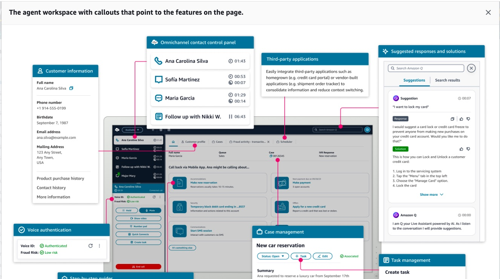

Here is the formatted content for Question 3 to add or save as a `.md` (Markdown) file:

# Question 3

A large e-commerce company uses a language model (LLM) to assist its customer service agents by generating responses to customer queries. However |  the company is concerned about prompt engineering attacks |  where malicious users craft inputs to manipulate the LLM into producing incorrect or harmful responses.

What is the best approach to mitigate this issue?

* Disable user-generated inputs and rely solely on internal data for prompts
* Restrict LLM output to a fixed set of predefined responses
* Monitor the length of the prompts to prevent overly long inputs
* Create a prompt template that teaches the LLM to detect attack patterns

**Correct Answer:** Create a prompt template that teaches the LLM to detect attack patterns

**Hint:** Think about how you can embed defense mechanisms directly inside the prompt instructions to guide model behavior without sacrificing flexibility or core functionality.

### Why?

* **Correct Option:**
Creating a prompt template that specifically guides the LLM to detect and respond appropriately to potential attack patterns is an effective way to mitigate prompt engineering attacks. This template can include predefined instructions that condition the LLM to recognize malicious patterns and avoid generating unintended or harmful responses. By embedding defense mechanisms within the prompts themselves |  the system becomes more robust and resilient to such attacks. Additionally |  continuous refinement of these templates based on known attack techniques further strengthens defenses.

# Question 4

A company is using Amazon Personalize to build a recommendations engine for its e-commerce application. As part of the process |  the data from ten different sources needs to be processed and imported into Amazon Personalize.

Which AWS service will help import |  prepare |  and transform data before it is fed into Amazon Personalize?

* Amazon SageMaker Clarify
* Amazon SageMaker Ground Truth
* Amazon SageMaker Feature Store
* Amazon SageMaker Data Wrangler

**Correct Answer:** Amazon SageMaker Data Wrangler

**Exam Trigger Words & Hints:**

* **Trigger Phrase in Question:** "import |  prepare |  and transform data" + "from ten different sources".
* **Exam Shortcut:** Whenever a question asks for a visual or low-code tool specifically to **clean |  aggregate |  prepare |  or transform** raw data prior to model consumption or ingestion into other services |  the answer is almost always **SageMaker Data Wrangler**.
* **Key Concept:** Data Wrangler simplifies data preparation workflows (data selection |  cleansing |  visualization |  and transformations) across disparate data sources.

### Why?

* **Correct Option:**

**Amazon SageMaker Data Wrangler** reduces the time it takes to aggregate and prepare tabular and image data for machine learning. It allows you to select |  clean |  explore |  visualize |  and transform data from multiple sources within a single visual interface before feeding it into downstream systems or ML pipelines.

* **Incorrect Options:**
* **Amazon SageMaker Ground Truth:** Used for dataset labeling and annotation using human-in-the-loop workflows |  not for programmatic data transformation or data preparation.

Here is the `.md` content formatted for Question 5:

# Question 5

Which type of Machine Learning algorithm is used by the models that are trained |  evaluated |  and tuned on AWS DeepRacer?

* Deep Learning
* Reinforcement Learning
* Semi-supervised Learning
* Unsupervised Learning

**Correct Answer:** Reinforcement Learning

**Exam Trigger Words & Hints:**

* **Trigger Word in Question:** "AWS DeepRacer"
* **Exam Shortcut:** Whenever you see **AWS DeepRacer** |  immediately associate it with **Reinforcement Learning** (RL). DeepRacer is AWS's 1/18th scale autonomous race car specifically designed as a hands-on platform to learn and experiment with RL.
* **Key Concept:** Reinforcement Learning uses an agent operating in an environment to learn optimal actions based on rewards and penalties (e.g. |  staying on a track to earn maximum reward).

**Deep Racer** is a platform for do HandsOn and Learn and Experiment with `Reinforcement Learning`.

### Why?

* **Correct Option:**
**Reinforcement Learning (RL)** is an advanced ML technique where an agent learns to make decisions by taking actions in an environment to maximize a cumulative reward. AWS DeepRacer uses RL to train models that control the speed and steering of an autonomous vehicle on a simulated or physical track.
* **Incorrect Options:**
* **Deep Learning:** While DeepRacer uses deep neural networks to process visual inputs |  Deep Learning is an underlying architecture/approach |  not the core *learning paradigm* (reward-based learning) governing DeepRacer's algorithm choices.
* **Unsupervised Learning:** Used to discover hidden patterns or groupings in unlabeled data (e.g. |  clustering). It does not use rewards/penalties to train autonomous agents.
* **Semi-supervised Learning:** Combines a small amount of labeled data with a large amount of unlabeled data |  which is not how trial-and-error reward systems in autonomous navigation function.

Here is the formatted `.md` content for Question 6:

# Question 6

Which AWS service helps you set up a cloud contact center in just a few clicks and onboard agents to help customers?

* Amazon Connect
* Amazon SageMaker Clarify
* Amazon Lex
* Amazon Personalize

**Correct Answer:** Amazon Connect

**Exam Trigger Words & Hints:**

* **Trigger Phrase in Question:** "cloud contact center" + "onboard agents to help customers".
* **Exam Shortcut:** Anytime an AWS exam question mentions building or running an omnichannel **contact center** or customer service desk |  the answer is **Amazon Connect**.
* **Key Concept:** Amazon Connect is AWS’s cloud-based contact center service that supports voice |  chat |  and automated customer service agents.

### Why?

* **Correct Option:**
**Amazon Connect** 

Amazon Connect is an AI-powered cloud contact center. It automatically detects customer issues |  and provides agents with contextual customer information and suggested responses and actions for faster resolution of issues.

You can set up a contact center in a few steps |  add agents who are located anywhere |  and start engaging with your customers. Amazon Connect supports the following communication channels:

  - Voice (phone)
  - Chat/SMS
  - Web calling/video
  - Tasks

An agent workspace in Amazon Connect:

* **Incorrect Options:**
* **Amazon Lex:** A service for building conversational interfaces (chatbots) using voice and text. While it integrates with Amazon Connect to build interactive voice response (IVR) systems |  it is not an end-to-end cloud contact center platform itself.
* **Amazon SageMaker Clarify:** Used to detect bias in machine learning models and provide model explainability |  completely unrelated to contact center management.
* **Amazon Personalize:** A real-time personalization and recommendation service |  not a contact center application.

Here is the formatted `.md` content for Question 7:

# Question 7

Consider a scenario where a fully-managed AWS service needs to be used for automating the extraction of insights from legal briefs such as contracts and court records.

What do you recommend?

* Amazon Rekognition
* Amazon Transcribe
* Amazon Comprehend
* Amazon Translate

**Correct Answer:** Amazon Comprehend

**Exam Trigger Words & Hints:**

* **Trigger Phrase in Question:** "extraction of insights" + "legal briefs such as contracts and court records" (unstructured text).
* **Exam Shortcut:** When the scenario involves extracting insights |  entities |  sentiment |  or key phrases from **unstructured text documents** (like contracts |  emails |  or articles) |  the answer is **Amazon Comprehend**.
* **Key Concept:** Amazon Comprehend is AWS's Natural Language Processing (NLP) service built specifically to extract meaning |  key entities |  and topics from textual data.

### Why?

* **Correct Option:**
**Amazon Comprehend** is a fully managed Natural Language Processing (NLP) service that uses machine learning to uncover insights |  entities |  key phrases |  and sentiment within text documents like legal briefs and contracts.
* **Incorrect Options:**
* **Amazon Transcribe:** Used for automatic speech recognition (converting audio files or audio streams to text) |  not for analyzing text documents.
* **Amazon Translate:** Used for translating text from one language to another |  not for analyzing or extracting insights from documents.
* **Amazon Rekognition:** A computer vision service used for image and video analysis (object detection |  facial analysis) |  not for text NLP analytics.

Here is the formatted `.md` content for Question 8 read directly from your screen:

# Question 8

A company needs a solution that can convert text into human speech so that it can offer audio courses in multiple languages.

Which AWS service is the best fit for this use case ?

* Amazon Lex
* Amazon Comprehend
* Amazon Polly
* Amazon Translate

**Correct Answer:** Amazon Polly

**Exam Trigger Words & Hints:**

* **Trigger Phrase in Question:** "convert text into human speech".
* **Exam Shortcut:** When an AWS exam question specifies turning written **text into lifelike speech/audio** |  the service is always **Amazon Polly**. (The reverse—audio to text—is **Amazon Transcribe**).
* **Key Concept:** Amazon Polly uses deep learning technologies to synthesize natural-sounding human speech from text input across dozens of languages.

### Why?

* **Correct Option:**
**Amazon Polly** is a cloud service that converts text into lifelike speech. It enables applications to play synthesized voice audio in various languages and speech styles |  making it ideal for creating audiobooks |  audio courses |  or voice-enabled applications.
* **Incorrect Options:**
* **Amazon Lex:** Used for building conversational interfaces (chatbots) using voice and text |  not specifically for converting long text documents/courses into audio files.

Here is the formatted `.md` content for Question 9 from your screen:

# Question 9

A financial services company is building machine learning models on AWS to automate loan approval processes. As an AI Practitioner |  you have been tasked to build and maintain data lineage in the context of these machine learning models on AWS.

Which of the following would you identify as the key reason to maintain data lineage?

* It improves the performance of machine learning models by optimizing data processing
* It reduces the storage costs by efficiently managing data
* It enhances the visualization capabilities of the data
* It ensures data privacy and compliance by tracking the flow and transformation of data

**Correct Answer:** It ensures data privacy and compliance by tracking the flow and transformation of data

**Exam Trigger Words & Hints:**

* **Trigger Phrase in Question:** "key reason to maintain data lineage" + "financial services / loan approval processes".
* **Exam Shortcut:** **Data Lineage** = **Auditability |  Governance |  Privacy |  & Compliance**. Whenever an exam question asks *why* we track data lineage (where data comes from |  how it transforms |  where it goes) |  think regulatory compliance and audit trails.
* **Key Concept:** Data lineage records the origin |  movement |  transformation |  and destination of data over its lifecycle to verify data integrity |  enforce privacy standards |  and meet regulatory compliance requirements.

### Why?

* **Correct Option:**
**It ensures data privacy and compliance by tracking the flow and transformation of data:** Data lineage provides complete visibility into the lifecycle of data |  making it possible to audit how financial or sensitive data is collected |  processed |  and used in ML models. This transparency is critical for complying with regulations (like GDPR or financial auditing rules) and ensuring privacy standards are met.

# Question 10

A healthcare company is using machine learning models in Amazon SageMaker to predict patient outcomes based on various health indicators. To comply with regulatory requirements and build trust with medical professionals |  the company needs to understand and explain how different input features |  such as age |  blood pressure |  and medical history |  contribute to the model’s predictions. The company is exploring which Amazon SageMaker service can provide this level of transparency and interpretability for their machine learning models.

Which Amazon SageMaker service will help the company understand how an input feature contributes to the predictions of a machine learning model?

* Amazon SageMaker Ground Truth
* Amazon SageMaker Canvas
* Amazon SageMaker Clarify
* Amazon SageMaker JumpStart

**Correct Answer:** Amazon SageMaker Clarify

**Exam Trigger Words & Hints:**

* **Trigger Phrase in Question:** "explain how different input features... contribute to the model's predictions" + "transparency and interpretability".
* **Exam Shortcut:** Whenever a question asks about **explainability** |  **interpretability** |  **feature attribution/contributions (SHAP values)** |  or **detecting bias** in ML models |  the correct answer is **Amazon SageMaker Clarify**.
* **Key Concept:** SageMaker Clarify provides visibility into model behavior by measuring potential bias during data preparation and model evaluation |  as well as providing feature attribution reports to explain individual predictions.

### Why?

* **Correct Option:**
**Amazon SageMaker Clarify** helps improve machine learning models by detecting potential bias during data preparation |  training |  and inference |  and by providing model explainability reports. It calculates feature attribution scores (using SHAP values) to show how much each input feature contributes to the final prediction |  fulfilling compliance and transparency requirements.
* **Incorrect Options:**
* **Amazon SageMaker Ground Truth:** A fully managed data labeling service that helps build high-quality datasets using human annotators |  not a tool for model explainability or feature attribution.
* **Amazon SageMaker Canvas:** A visual |  point-and-click interface that enables non-technical users to build and generate ML predictions without writing code.
* **Amazon SageMaker JumpStart:** A machine learning hub that provides pre-trained models |  built-in algorithms |  and pre-built solution templates to quickly deploy models.

Here is the formatted `.md` content for Question 11 read directly from your screen:

# Question 11

A customer support system frequently encounters database errors that result in incomplete sentences in the logs. The company wants to implement a machine learning model to automatically suggest missing words in these sentences to help resolve issues faster.

Which type of model should be used to suggest the missing words?

* Prescriptive AI Model
* Bidirectional Encoder Representations from Transformers (BERT) based Model
* Clustering Model
* Rule-based NLP Model

**Correct Answer:** Bidirectional Encoder Representations from Transformers (BERT) based Model

**Exam Trigger Words & Hints:**

* **Trigger Phrase in Question:** "suggest missing words" + "incomplete sentences" / "context of words".
* **Exam Shortcut:** Whenever a question asks about **filling in missing words (Masked Language Modeling)** or understanding bidirectional context in a sentence |  think **BERT** (Encoder-only architecture).
* **Key Concept:** BERT looks at context from both left and right directions simultaneously |  making it ideal for predicting masked/missing words in incomplete text.

### Why?

* **Correct Option:**
A **BERT-based model** is specifically designed for understanding the bidirectional context of words in a sentence. BERT uses deep learning techniques to predict missing words by considering the words both before and after the gap |  making it ideal for suggesting missing text in incomplete logs.
* **Incorrect Options:**
* **Rule-based NLP Model:** Operates on fixed linguistic rules and cannot effectively predict missing words based on complex contextual variations.
* **Prescriptive AI Model:** Focuses on recommending business actions or decisions using optimization algorithms |  not analyzing and completing natural language text.
* **Clustering Model:** An unsupervised learning approach used to group similar data points together; it cannot generate or predict missing words within a sentence.

Here is the formatted `.md` content for Question 12 from your screen:

# Question 12

A company needs to support human reviews and audits for its ML model predictions. The solution should be easy to implement and have the facility to add multiple reviewers.

Which AWS service do you recommend for this use case?

* Amazon Augmented AI (A2I)
* AWS DeepRacer
* Amazon Forecast
* Amazon SageMaker Ground Truth

**Correct Answer:** Amazon Augmented AI (A2I)

**Exam Trigger Words & Hints:**

* **Trigger Phrase in Question:** "human reviews and audits for its ML model predictions".
* **Exam Shortcut:** Distinguish between labeling raw data vs. reviewing model outputs:
* **Human review of ML predictions / low-confidence outputs** = **Amazon A2I (Augmented AI)**
* **Building/labeling training datasets** = **Amazon SageMaker Ground Truth**

* **Key Concept:** Amazon A2I automates workflow routing for human review when machine learning models generate low-confidence predictions or require ongoing auditing.

### Why?

* **Correct Option:**
**Amazon Augmented AI (Amazon A2I)** makes it easy to build the workflows required for human review of machine learning predictions. It allows human reviewers to step in when a model is unable to make a high-confidence prediction or to audit model predictions on an ongoing basis.
* **Incorrect Options:**
* **Amazon SageMaker Ground Truth:** Designed specifically for creating and annotating high-quality *training datasets* (data labeling) |  not for building workflows to review/audit live model predictions.
* **Amazon Forecast:** A fully managed service that uses ML algorithms to deliver accurate time-series forecasts (demand planning |  metrics) |  not a human review workflow service.
* **AWS DeepRacer:** A 1/18th scale autonomous race car used for learning and experimenting with reinforcement learning |  unrelated to reviewing predictions.
Here is the formatted `.md` content for Question 13 read directly from your screen:

# Question 13

A financial services company is developing machine learning models to improve fraud detection and credit risk assessment. However |  given the complexity of these tasks |  the team wants to incorporate human input at key stages of the machine learning lifecycle to ensure that the models are accurate and relevant. The company is looking for an AWS service that allows human input and feedback to be integrated into the model development process |  improving the overall performance and trustworthiness of the models.

What do you suggest?

* Amazon SageMaker Clarify
* Amazon SageMaker Ground Truth
* Amazon SageMaker Role Manager
* Amazon SageMaker Feature Store

**Correct Answer:** Amazon SageMaker Ground Truth

**Exam Trigger Words & Hints:**

* **Trigger Phrase in Question:** "incorporate human input... in the machine learning lifecycle" + "human input and feedback to be integrated into the model development process".
* **Exam Shortcut:** When an AWS exam question focuses on using human annotators |  reviewers |  or active learning (human-in-the-loop) during the **data preparation and model development stages** |  the answer is **Amazon SageMaker Ground Truth** (or Ground Truth Plus).
* **Key Concept:** SageMaker Ground Truth uses human feedback (via internal teams |  vendors |  or Amazon Mechanical Turk) to annotate datasets and refine model quality during development.

### Why?

* **Correct Option:**
**Amazon SageMaker Ground Truth** helps build highly accurate training datasets for machine learning. It offers easy access to human labelers through Amazon Mechanical Turk |  third-party vendors |  or private workforces. Ground Truth integrates human feedback directly into the model development pipeline to generate |  label |  and review data accurately.
* **Incorrect Options:**
* **Amazon SageMaker Clarify:** Used for detecting potential bias during data preparation and training |  as well as providing model explainability (feature attributions) |  not for collecting human labeling/feedback.
* **Amazon SageMaker Role Manager:** A security tool that simplifies defining minimum required permissions (IAM roles) for ML activities |  unrelated to human feedback on models.
* **Amazon SageMaker Feature Store:** A centralized repository to store |  share |  and manage curated ML features for training and inference |  not a human review/labeling workflow tool.

Here is the formatted `.md` content for Question 14 read directly from your screen:

# Question 14

Which of the following use cases is addressed by Amazon Personalize?

* Extract layout elements such as paragraphs |  titles |  lists |  and more from documents
* Offers highly accurate and easy-to-use enterprise search service that’s powered by machine learning
* Generate recommendations for items that are similar to an item you specify
* To offer personalized experiences for mobile subscriber activities such as activating a SIM card |  adding a phone line |  purchasing prepaid cards |  requesting a service change

**Correct Answer:** Generate recommendations for items that are similar to an item you specify

**Exam Trigger Words & Hints:**

* **Trigger Phrase in Question:** "Amazon Personalize" / "use cases".
* **Exam Shortcut:** **Amazon Personalize** = **Recommendation Engine** (similar items |  personalized rankings |  user recommendations).
* **Key Concept:** Amazon Personalize allows developers to build applications with real-time personalized recommendations |  such as product recommendations |  customized search results |  and tailored direct marketing.

### Why?

* **Correct Option:**
**Generate recommendations for items that are similar to an item you specify:** Amazon Personalize uses machine learning to create real-time item recommendations |  similar item suggestions |  and personalized user feeds based on historical customer interaction data.
* **Incorrect Options:**
* **Extract layout elements such as paragraphs |  titles |  lists |  and more from documents:** This describes the capability of **Amazon Textract** (or Amazon Comprehend for textual analysis) |  not Amazon Personalize.
* **Offers highly accurate and easy-to-use enterprise search service that's powered by machine learning:** This is the definition of **Amazon Kendra** |  AWS’s intelligent enterprise search engine.
* **To offer personalized experiences for mobile subscriber activities...:** This is an overly narrow and specific telecom operational workflow that is not a generic native feature or definition of Amazon Personalize.

Here is the formatted `.md` content for Question 15 read directly from your screen:

# Question 15

A company is creating a custom search solution that will bring together the company's data repositories |  FAQs |  and support tickets. The support tickets might contain personally identifiable information (PII) that needs to be redacted before the tickets are processed to create the search indexes.

Which AWS service will help you redact the PII in support tickets?

* Amazon Kendra
* Amazon Textract
* Amazon Lex
* Amazon Comprehend

**Correct Answer:** Amazon Comprehend

**Exam Trigger Words & Hints:**

* **Trigger Phrase in Question:** "redact the PII" / "personally identifiable information".
* **Exam Shortcut:** Whenever an AWS exam question asks about **detecting or redacting PII** (names |  SSNs |  credit cards |  emails) in natural language text |  the answer is **Amazon Comprehend** (specifically its PII detection/redaction API).
* **Key Concept:** Amazon Comprehend uses Natural Language Processing (NLP) to inspect unstructured text for entity extraction |  sentiment analysis |  and automatically detecting or redacting sensitive PII entities.

### Why?

* **Correct Option:**
**Amazon Comprehend** offers built-in PII (Personally Identifiable Information) detection and redaction capabilities. It can analyze raw text to locate PII entities—such as social security numbers |  email addresses |  phone numbers |  and financial details—and redact or mask them automatically before indexing or storage.
* **Incorrect Options:**
* **Amazon Kendra:** An enterprise search service powered by machine learning. While Kendra indexes and searches across data repositories |  it relies on upstream services (like Comprehend) to redact or clean sensitive data before or during ingestion pipelines.
* **Amazon Textract:** Used for extracting text |  forms |  and tables from scanned documents or PDFs |  but it does not natively inspect text semantics to redact PII automatically.
* **Amazon Lex:** Used for building conversational AI bots and voice/text chat interfaces |  not for scanning and redacting documents or support tickets.

# Question 16

A retail company is developing a machine learning model to improve its customer segmentation and targeting strategies. The data science team is working with both labeled and unlabeled customer data to train their models but needs to clearly understand the distinction between these two types of data to decide how best to use them. Understanding this difference is critical for selecting the appropriate machine learning techniques |  such as supervised or unsupervised learning |  for different stages of the project.

What is a key difference between labeled data and unlabeled data in the context of machine learning?

* Labeled data is annotated with output labels that provide specific information about each data point and is used for supervised learning |  whereas |  unlabeled data lacks such annotations and is used for unsupervised learning
* Labeled data is inherently more complex to process due to the lack of structure |  whereas unlabeled data is easier to handle because it has clear annotations
* Labeled data consists of raw information with no tags or annotations |  while unlabeled data includes tags that provide meaning to the data
* Labeled data can only be used for unsupervised learning algorithms |  whereas |  unlabeled data is exclusively for supervised learning algorithms

**Correct Answer:** Labeled data is annotated with output labels that provide specific information about each data point and is used for supervised learning |  whereas |  unlabeled data lacks such annotations and is used for unsupervised learning

**Exam Trigger Words & Hints:**

* **Trigger Phrase in Question:** "key difference between labeled data and unlabeled data".
* **Exam Shortcut:**
* **Labeled Data** = Annotations / Target variables $\rightarrow$ **Supervised Learning** (Classification |  Regression).
* **Unlabeled Data** = Raw inputs / No target labels $\rightarrow$ **Unsupervised Learning** (Clustering |  Anomaly Detection).

* **Key Concept:** Supervised learning algorithms rely on input-output pairs (ground truth labels) to learn predictive mappings |  whereas unsupervised learning algorithms discover natural patterns or groupings within unlabeled data without explicit answers.

### Why?

* **Correct Option:**
**Labeled data is annotated with output labels that provide specific information about each data point and is used for supervised learning |  whereas |  unlabeled data lacks such annotations and is used for unsupervised learning:** Labeled data explicitly contains ground-truth targets (e.g. |  customer churn status |  spending categories) used by supervised learning models to learn associations. Unlabeled data only contains features without known target outcomes and is analyzed using unsupervised techniques to find underlying structures or clusters.
* **Incorrect Options:**
* **Labeled data is inherently more complex to process due to the lack of structure...:** Incorrect because labeled data includes annotations |  making it structured and straightforward to evaluate against ground truth compared to raw unlabeled data.
* **Labeled data consists of raw information with no tags or annotations...:** Incorrect because this flips the definitions; labeled data contains tags/annotations |  while unlabeled data consists of raw information without tags.
* **Labeled data can only be used for unsupervised learning algorithms...:** Incorrect because it completely reverses the paradigms; labeled data is paired with supervised learning |  and unlabeled data with unsupervised learning.

# Question 16

A retail company is developing a machine learning model to improve its customer segmentation and targeting strategies. The data science team is working with both labeled and unlabeled customer data to train their models but needs to clearly understand the distinction between these two types of data to decide how best to use them. Understanding this difference is critical for selecting the appropriate machine learning techniques |  such as supervised or unsupervised learning |  for different stages of the project.

What is a key difference between labeled data and unlabeled data in the context of machine learning?

* Labeled data is annotated with output labels that provide specific information about each data point and is used for supervised learning |  whereas |  unlabeled data lacks such annotations and is used for unsupervised learning
* Labeled data is inherently more complex to process due to the lack of structure |  whereas unlabeled data is easier to handle because it has clear annotations
* Labeled data consists of raw information with no tags or annotations |  while unlabeled data includes tags that provide meaning to the data
* Labeled data can only be used for unsupervised learning algorithms |  whereas |  unlabeled data is exclusively for supervised learning algorithms

**Correct Answer:** Labeled data is annotated with output labels that provide specific information about each data point and is used for supervised learning |  whereas |  unlabeled data lacks such annotations and is used for unsupervised learning

**Exam Trigger Words & Hints:**

* **Trigger Phrase in Question:** "key difference between labeled data and unlabeled data".
* **Exam Shortcut:**
* **Labeled Data** = Annotations / Target variables $\rightarrow$ **Supervised Learning** (Classification |  Regression).
* **Unlabeled Data** = Raw inputs / No target labels $\rightarrow$ **Unsupervised Learning** (Clustering |  Anomaly Detection).

* **Key Concept:** Supervised learning algorithms rely on input-output pairs (ground truth labels) to learn predictive mappings |  whereas unsupervised learning algorithms discover natural patterns or groupings within unlabeled data without explicit answers.

### Why?

* **Correct Option:**
**Labeled data is annotated with output labels that provide specific information about each data point and is used for supervised learning |  whereas |  unlabeled data lacks such annotations and is used for unsupervised learning:** Labeled data explicitly contains ground-truth targets (e.g. |  customer churn status |  spending categories) used by supervised learning models to learn associations. Unlabeled data only contains features without known target outcomes and is analyzed using unsupervised techniques to find underlying structures or clusters.
* **Incorrect Options:**
* **Labeled data is inherently more complex to process due to the lack of structure...:** Incorrect because labeled data includes annotations |  making it structured and straightforward to evaluate against ground truth compared to raw unlabeled data.
* **Labeled data consists of raw information with no tags or annotations...:** Incorrect because this flips the definitions; labeled data contains tags/annotations |  while unlabeled data consists of raw information without tags.
* **Labeled data can only be used for unsupervised learning algorithms...:** Incorrect because it completely reverses the paradigms; labeled data is paired with supervised learning |  and unlabeled data with unsupervised learning.

Here is the formatted `.md` content for Question 17 read directly from your screen:

# Question 17

A global e-commerce company is utilizing a foundation model through Amazon Bedrock to enhance its customer service chatbot |  providing automated support and answering user queries. However |  the company is concerned about the potential for the model to generate inappropriate |  sensitive |  or malicious content that could harm its reputation or negatively impact customer experience. To mitigate these risks |  the company seeks to implement safety measures that ensure the model consistently produces safe |  relevant |  and context-appropriate responses.

Given this goal |  what would be the most effective approach to control these risks and maintain model safety?

* The company should adjust the model hyperparameters to safeguard the output
* The company should develop an API that processes all responses from the model and checks for any risks of exposure |  which involves creating a custom layer that monitors and filters all model outputs |  scanning them for inappropriate or unsafe content before they are delivered to the end-user
* The company should instruct the model to stick to the prompt by adding explicit instructions to ignore any unrelated or potentially malicious content
* The company should retrain the underlying foundation model (FM) from scratch to prevent exposure

**Correct Answer:** The company should develop an API that processes all responses from the model and checks for any risks of exposure |  which involves creating a custom layer that monitors and filters all model outputs |  scanning them for inappropriate or unsafe content before they are delivered to the end-user

**Exam Trigger Words & Hints:**

* **Trigger Phrase in Question:** "mitigate these risks" + "generate inappropriate |  sensitive |  or malicious content" / "ensure the model consistently produces safe |  relevant |  and context-appropriate responses".
* **Exam Shortcut:** When evaluating safeguards without relying solely on model prompt adherence |  look for an **independent moderation |  guardrail |  or filtering layer** (such as Amazon Bedrock Guardrails or a custom filtering API) that inspects inputs and outputs outside the model context window.
* **Key Concept:** Relying purely on prompt instructions is vulnerable to prompt injection or jailbreaking. Implementing an explicit moderation layer/API downstream provides programmatic enforcement and safety filtering before reaching end-users.

### Why?

* **Correct Option:**
**Developing an API/layer to scan and filter model outputs:** Implementing a post-processing or output-filtering layer ensures that all generated text is programmatically evaluated against safety guidelines before being returned to end-users. This provides an enforceable safety layer that does not depend on the model's self-governance. (Note: On AWS |  this pattern is natively provided via Guardrails for Amazon Bedrock).
* **Incorrect Options:**
* **The company should adjust the model hyperparameters to safeguard the output:** Hyperparameters (like temperature |  top_p |  or max tokens) control creativity |  randomness |  and length |  but they cannot evaluate or block malicious |  offensive |  or sensitive content.
* **The company should instruct the model to stick to the prompt...:** System prompts alone are insufficient guardrails because adversarial users can easily bypass or override instructions via jailbreaking or prompt injection techniques.
* **The company should retrain the underlying foundation model (FM) from scratch...:** Retraining a foundational LLM from scratch is computationally expensive |  time-consuming |  and unnecessary for output content filtering and guardrails.

# Question 18

A healthcare analytics company is developing a machine learning model to provide patient risk assessments based on incoming medical data. The team needs to deploy the model in a way that supports continuous |  low-latency predictions |  where each request receives a response immediately |  such as during patient check-ins. The team is evaluating deployment options within Amazon SageMaker and needs a solution that offers persistent endpoints to handle these individual prediction requests.

What do you recommend?

* Batch transform
* Serverless Inference
* Asynchronous Inference
* Real-time hosting services

**Correct Answer:** Real-time hosting services

**Exam Trigger Words & Hints:**

* **Trigger Phrase in Question:** "continuous |  low-latency predictions" + "each request receives a response immediately" + "persistent endpoints".
* **Exam Shortcut:**
* **Interactive / Low-Latency / Immediate:** Real-time hosting services.
* **Intermittent / Idle periods / Cold start tolerable:** Serverless Inference.
* **Large payload (up to 1GB) / Long processing time / Queued:** Asynchronous Inference.
* **Offline / Large batch datasets / No persistent endpoint:** Batch transform.

* **Key Concept:** SageMaker Real-time endpoints provide persistent |  dedicated computing instances running fully managed HTTPS endpoints that deliver low-latency responses for real-time applications.

### Why?

* **Correct Option:**
**Real-time hosting services** are ideal for inference workloads with real-time |  interactive |  and low-latency requirements. You deploy your model to SageMaker hosting services to get a persistent endpoint capable of auto-scaling to meet incoming traffic instantly.
* **Incorrect Options:**
* **Batch transform:** Used when you need predictions for an entire offline dataset at once without needing a persistent endpoint or real-time interactive latency.
* **Serverless Inference:** Designed for application traffic that is intermittent or has idle periods between traffic spikes and can tolerate cold starts.
* **Asynchronous Inference:** Designed for requests with large payload sizes (up to 1GB) and long processing times (up to 1 hour) that get queued |  rather than immediate real-time responses.

Here is the formatted `.md` content for Question 19 read directly from your screen:

# Question 19

A technology company is considering using Large Language Models (LLMs) to enhance its AI-driven customer support system. The development team is particularly interested in understanding the nature of LLMs |  as this knowledge will help the team make decisions on how to manage the variability of responses and how best to apply the models in customer-facing applications.

Which of the following is correct regarding Large Language Models (LLMs)?

* The Large Language Models (LLMs) are deterministic
* The Large Language Models (LLMs) are discriminative
* Foundation Models (FMs) are a class of Large Language Models (LLMs)
* The Large Language Models (LLMs) are non-deterministic

**Correct Answer:** The Large Language Models (LLMs) are non-deterministic

**Exam Trigger Words & Hints:**

* **Trigger Phrase in Question:** "manage the variability of responses" + "nature of LLMs".
* **Exam Shortcut:**
* **LLMs / Generative AI** = **Generative** |  **Probabilistic** |  and **Non-deterministic** (the same prompt can yield different outputs unless sampling temperature is strictly zero).
* **Traditional ML Classifiers** = **Discriminative** and **Deterministic**.

* **Key Concept:** LLMs generate response tokens probabilistically based on internal probability distributions |  making their behavior inherently non-deterministic.

### Why?

* **Correct Option:**
**The Large Language Models (LLMs) are non-deterministic:** Because LLMs are generative probabilistic models |  they sample tokens from a probability distribution. Due to sampling mechanisms (like temperature and top-p/top-k settings) |  giving the exact same prompt multiple times can produce varied responses |  making their behavior inherently non-deterministic.
* **Incorrect Options:**
* **The Large Language Models (LLMs) are deterministic:** Incorrect because deterministic models always produce the exact same output for a given input |  which is not how probabilistic language models function by default.
* **The Large Language Models (LLMs) are discriminative:** Incorrect because LLMs are **generative** models (generating new content/sequence data) rather than discriminative models (which classify data into pre-defined categories).
* **Foundation Models (FMs) are a class of Large Language Models (LLMs):** Incorrect because the hierarchy is reversed: Large Language Models (LLMs) are actually a specific subset/class of **Foundation Models (FMs)** (which also include multimodal |  vision |  and audio foundation models) |  not the other way around.

# Question 20

A retail company is exploring the use of generative AI to improve its customer experience by personalizing recommendations and automating product descriptions. The company is interested in leveraging pre-built |  high-performing Foundation Models (FMs) to accelerate development but also needs the ability to customize these models with its proprietary data to meet specific business needs. The company is seeking an AWS service that not only provides access to a variety of Foundation Models but also offers the option to privately fine-tune and customize these models for their unique use case.

Which AWS service/feature offers a choice of high-performing Foundation Models (FMs) and the ability to privately customize the FMs with your data?

* AWS Inferentia
* Amazon Bedrock
* Amazon Q Developer
* Amazon Q in QuickSight

**Correct Answer:** Amazon Bedrock

**Exam Trigger Words & Hints:**

* **Trigger Phrase in Question:** "choice of high-performing Foundation Models (FMs)" + "privately customize the FMs with your data".
* **Exam Shortcut:** Whenever a question asks for a single fully managed API-based service to **access multiple third-party/AWS Foundation Models** AND **privately fine-tune/customize** them using your own data |  the answer is **Amazon Bedrock**.
* **Key Concept:** Amazon Bedrock provides access to leading FMs (from AI21 |  Anthropic |  Cohere |  Meta |  Stability AI |  and Amazon) via an API |  with options for private model customization (fine-tuning and continued pre-training) without sharing data back with model providers.

### Why?

* **Correct Option:**
**Amazon Bedrock** is a fully managed service that offers a choice of high-performing foundation models from leading AI startups and Amazon via a single API. It allows you to privately customize FMs using your own proprietary data through fine-tuning and continued pre-training while ensuring data privacy and security.
* **Incorrect Options:**
* **AWS Inferentia:** A custom hardware accelerator chip (machine learning inference chip) designed by AWS to provide high performance and low latency inference |  not a managed service offering foundation models or fine-tuning APIs.
* **Amazon Q Developer:** A generative AI powered assistant specifically built to assist developers and IT professionals with coding |  debugging |  and managing AWS infrastructure.
* **Amazon Q in QuickSight:** A generative AI assistant integrated into Amazon QuickSight to help business analysts create data visualizations |  stories |  and executive summaries using natural language queries.

# Question 21

A call center has introduced a chatbot to help employees respond to customer inquiries more efficiently during calls. The goal is to improve overall efficiency and reduce time spent on calls.

Which of the following metrics should be monitored to evaluate the success of this initiative?

* Average Chat Sessions per Day
* Average Call Duration
* Chat API Calls per Day
* First-Call Resolution Rate

**Correct Answer:** Average Call Duration

**Exam Trigger Words & Hints:**

* **Trigger Phrase in Question:** "reduce time spent on calls" + "evaluate the success of this initiative".
* **Exam Shortcut:** Always map the target KPI metric directly to the primary business goal stated in the prompt. If the goal is explicitly to **reduce time spent on calls** |  the success metric is **Average Call Duration** (or Average Handle Time / AHT).
* **Key Concept:** Business goal alignment in AI project evaluation—measuring operational performance improvements (time saved per call) rather than raw usage/system volume metrics.

### Why?

* **Correct Option:**
**Average Call Duration** directly measures whether the initiative achieved its stated objective ("reduce time spent on calls"). By providing agents with quick chatbot answers during live calls |  agents spend less time searching for information |  thereby shortening the average duration of each customer call.
* **Incorrect Options:**
* **Average Chat Sessions per Day / Chat API Calls per Day:** These are operational usage and system throughput metrics. They track how often the tool is used |  but they do not show whether the call center is actually saving time per call or meeting its business goal.
* **First-Call Resolution Rate:** Measures the percentage of customer issues resolved during the first contact without requiring a follow-up. While a beneficial metric |  the primary stated goal of *this specific initiative* was to **reduce time spent on calls** |  making Average Call Duration the direct metric to monitor.

# Question 22

A software development company is migrating its operations to the AWS Cloud and is evaluating its security responsibilities under different generative AI use cases as outlined in the Generative AI Security Scoping Matrix. The company wants to identify the scenario where it would have the highest level of security ownership |  including managing data protection |  overseeing the underlying infrastructure |  and ensuring compliance with relevant regulations. Understanding these security implications is critical for the company to implement appropriate controls and safeguard its operations.

Which of the following scenarios would require the company to assume the maximum level of security ownership?

* Consuming a public third-party generative AI service
* Building its own application using an existing third-party generative AI foundation model
* Building and training a generative AI model from scratch
* Refining an existing third-party generative AI foundation model by fine-tuning it with data specific to the company

**Correct Answer:** Building and training a generative AI model from scratch

**Exam Trigger Words & Hints:**

* **Trigger Phrase in Question:** "Generative AI Security Scoping Matrix" + "maximum level of security ownership".
* **Exam Shortcut:** On the Generative AI Security Scoping Matrix (AWS Scope 1 to Scope 5) |  the customer assumes **maximum security responsibility** when they build and train models **from scratch** (Scope 5) |  as they own the data |  algorithms |  infrastructure |  training pipeline |  and deployment controls.
* **Key Concept:** Under the Shared Responsibility Model for Generative AI |  moving from consuming managed services to building custom models shifts control and security ownership of data |  infrastructure |  and model training entirely to the customer.

### Why?

* **Correct Option:**
**Building and training a generative AI model from scratch:** This scenario requires managing the entire machine learning lifecycle—including data collection |  cleaning |  preprocessing |  architecture design |  training clusters |  storage |  access controls |  and compliance. Because the customer manages everything from the ground up rather than relying on a managed service provider |  they assume the maximum degree of security responsibility.
* **Incorrect Options:**
* **Refining an existing third-party generative AI foundation model by fine-tuning it with data specific to the company:** While this requires securing proprietary training data and the fine-tuning environment |  the underlying foundational model architecture and pre-training data are provided and secured by the third party.
* **Building its own application using an existing third-party generative AI foundation model:** The customer only secures the application layer and prompt inputs/outputs. The model provider manages the base model security |  weights |  and infrastructure.
* **Consuming a public third-party generative AI service:** This represents the lowest level of customer security ownership (SaaS model) |  where the cloud provider manages almost all security aspects |  and the customer is only responsible for user access and input data hygiene.

# Question 23

A healthcare analytics company has recently migrated to AWS Cloud and it is preparing to build several Machine Learning (ML) models to predict patient outcomes |  optimize treatment plans |  and analyze health data trends. The company wants to leverage the capabilities of various tools offered by Amazon SageMaker.

Which of the following is a key use case addressed by Amazon SageMaker Data Wrangler?

* Fix bias by balancing the dataset
* Build ML models with no code
* Monitor the quality of a model
* Store and share the features used for model development

**Correct Answer:** Fix bias by balancing the dataset

**Exam Trigger Words & Hints:**

* **Trigger Phrase in Question:** "key use case addressed by Amazon SageMaker Data Wrangler".
* **Exam Shortcut:** **SageMaker Data Wrangler** = **Data preparation |  cleaning |  feature transformation |  & balancing imbalanced datasets**.
* **Key Concept:** SageMaker Data Wrangler simplifies tabular and image data preparation and feature engineering with built-in data transformation tools |  including techniques to rebalance imbalanced classes and mitigate dataset bias.

### Why?

* **Correct Option:**
**Fix bias by balancing the dataset:** When a dataset has significantly more samples in one class than another (e.g. |  majority vs. minority classes) |  training algorithms tend to favor the majority class. SageMaker Data Wrangler provides built-in balance data transforms (such as oversampling |  undersampling |  or SMOTE) to rebalance datasets and resolve data bias during preparation.
* **Incorrect Options:**
* **Build ML models with no code:** This describes **Amazon SageMaker Canvas** |  a visual point-and-click interface that enables business analysts to build ML models without writing code.
* **Monitor the quality of a model:** This is a core feature of **Amazon SageMaker Model Monitor** |  which continuously tracks models in production for data drift |  concept drift |  and quality degradation.
* **Store and share the features used for model development:** This is the function of **Amazon SageMaker Feature Store** |  a fully managed repository to curate |  store |  share |  and reuse ML features across teams.

# Question 24

A media company is developing a machine learning model to categorize its vast library of content. The data science team is trying to decide between using multi-class or multi-label classification based on the complexity of the content categories. Understanding the differences between multi-class and multi-label classification will help the team choose the most appropriate approach for organizing their content effectively.

What do you recommend to the company?

* Multi-class classification allows each instance to belong to multiple classes simultaneously |  whereas multi-label classification restricts each instance to one class only

* Multi-class classification assigns each instance to one of several possible classes |  while multi-label classification assigns each instance to one or more classes

* Multi-class classification does not require labeled data |  whereas multi-label classification requires labeled data for training

* Multi-class classification is used exclusively for image data |  whereas multi-label classification is used exclusively for text data

**Correct Answer:** Multi-class classification assigns each instance to one of several possible classes |  while multi-label classification assigns each instance to one or more classes

[MultiClass and Multi-Lable-Class Difference](https://www.geeksforgeeks.org/machine-learning/multiclass-classification-vs-multi-label-classification/)

**MultiClass Classfification** 

  -  each input is assigned to only one class | 
  - Each instance has one and only one correct label.
  - Classes are mutually exclusive.
  - Prediction output is typically a single class index or label.
  - Often implemented using softmax activation for probabilistic outputs.

**Multi Lable Classification** 

  -  an input can be associated with multiple classes at the same time.
  -  Is a supervised learning problem where each data instance can be assigned multiple labels simultaneously. 
  - Unlike multiclass classification |  labels are not mutually exclusive and the presence of one label does not prevent the presence of another.
  - Often implemented using sigmoid activation for independent label probabilities.
  - Output is typically a binary vector indicating the presence or absence of each label.

**Exam Trigger Words & Hints:**

* **Trigger Phrase in Question:** "differences between multi-class and multi-label classification".
* **Exam Shortcut:**
* **Multi-Class Classification:** Exactly **1 class** chosen out of $N$ mutually exclusive classes (e.g. |  classifying an article as either "Sports" OR "Politics" OR "Tech").
* **Multi-Label Classification:** **1 or more classes** assigned simultaneously (e.g. |  tagging a video with both "Action" |  "Comedy" |  and "Sci-Fi").

* **Key Concept:** Multi-class classification enforces a single categorical output per item |  whereas multi-label classification treats each class assignment as an independent binary decision |  allowing multiple tags/labels to apply to a single data sample.

### Why?

* **Correct Option:**
**Multi-class classification assigns each instance to one of several possible classes |  while multi-label classification assigns each instance to one or more classes:** In multi-class classification |  the categories are mutually exclusive |  so each data instance is mapped to exactly one class. In multi-label classification |  categories are not mutually exclusive |  allowing a single sample to have multiple labels assigned to it at the same time.
* **Incorrect Options:**
* **Multi-class classification allows each instance to belong to multiple classes simultaneously...:** Incorrect because this reverses the definitions of multi-class and multi-label classification.
* **Multi-class classification does not require labeled data...:** Incorrect because both multi-class and multi-label classification are supervised learning techniques that strictly require labeled training datasets.
* **Multi-class classification is used exclusively for image data...:** Incorrect because both classification types apply across any data modality |  including images |  text |  audio |  and tabular data.

# Question 25

A tech startup is customizing a Foundation Model using Amazon Bedrock to enhance its machine learning capabilities for analyzing customer behavior and predicting market trends. As part of this customization |  the company needs to perform model validation to ensure the model is accurately trained and tuned for its specific use case. To facilitate this |  the company must choose an appropriate dataset storage location that is fully supported by Amazon Bedrock for storing and accessing the large datasets required for validation.

Which of the following storage options would be the most suitable for this task?

* The company should use Amazon S3 |  which is a scalable object storage service fully integrated with Amazon Bedrock
* The company should use Amazon RDS |  which is a managed relational database service for structured data
* The company should use Amazon EFS |  which is a managed file storage service that allows shared access to file data for Amazon Bedrock
* The company should use Amazon EBS |  a block storage service designed to provide persistent storage for Amazon Bedrock

**Correct Answer:** The company should use Amazon S3 |  which is a scalable object storage service fully integrated with Amazon Bedrock

**Exam Trigger Words & Hints:**

* **Trigger Phrase in Question:** "customizing a Foundation Model using Amazon Bedrock" + "dataset storage location that is fully supported by Amazon Bedrock".
* **Exam Shortcut:** **Amazon Bedrock Dataset / Model Output / Knowledge Base Storage** = **Amazon S3** (Simple Storage Service).
* **Key Concept:** Amazon Bedrock natively reads training |  fine-tuning |  and validation datasets directly from Amazon S3 bucket URIs and writes evaluation/output logs back to S3.

### Why?

* **Correct Option:**
**Amazon S3:** Amazon Bedrock integrates directly with Amazon S3 (Simple Storage Service) to access training data |  fine-tuning datasets |  validation datasets |  and to store custom model evaluation outputs. You provide S3 bucket paths (`s3://...`) when setting up customization and evaluation jobs.
* **Incorrect Options:**
* **Amazon RDS:** This option is incorrect because Amazon RDS is designed for managing relational databases and is not intended for storing large |  unstructured datasets typically used in machine learning and model validation. It is not integrated with Amazon Bedrock for storing datasets required for model customization and validation tasks.

# Question 26

A media company is planning to leverage AWS for its AI and machine learning projects |  and the development team is evaluating both Amazon Bedrock and Amazon SageMaker JumpStart to accelerate their workflows. The team needs to understand the primary differences between these two services |  particularly in how they provide access to pre-trained models and offer customization options. This knowledge will help the company choose the right tool for their content generation and optimization tasks.

Which of the following best addresses these requirements?

* Amazon Bedrock provides foundational models for generative AI applications |  whereas Amazon SageMaker JumpStart offers pre-built solutions and one-click deployment for various machine learning models
* Amazon Bedrock is designed for building and scaling machine learning models |  whereas Amazon SageMaker JumpStart is used for real-time data analytics
* Amazon SageMaker JumpStart provides foundational models for generative AI applications |  whereas Amazon Bedrock offers pre-built solutions and one-click deployment for various machine learning models
* Amazon SageMaker JumpStart is designed for building and scaling machine learning models |  whereas Amazon Bedrock is used for real-time data analytics

**Correct Answer:** Amazon Bedrock provides foundational models for generative AI applications |  whereas Amazon SageMaker JumpStart offers pre-built solutions and one-click deployment for various machine learning models

**Exam Trigger Words & Hints:**

* **Trigger Phrase in Question:** "differences between Amazon Bedrock and Amazon SageMaker JumpStart".
* **Exam Shortcut:**
* **Amazon Bedrock:** Fully managed API service for foundational models (serverless access without managing infrastructure).
* **SageMaker JumpStart:** Machine learning hub within SageMaker offering pre-built ML algorithms |  notebook templates |  and one-click model deployment on dedicated SageMaker infrastructure.

* **Key Concept:** Bedrock is serverless and API-first for Foundation Models |  while SageMaker JumpStart provides deployable model artifacts |  end-to-end solution templates |  and customizable infrastructure setup within SageMaker.

### Why?

* **Correct Option:**
**Amazon Bedrock provides foundational models for generative AI applications |  whereas Amazon SageMaker JumpStart offers pre-built solutions and one-click deployment for various machine learning models:** [Amazon Bedrock](https://aws.amazon.com/bedrock/?utm_source=gemini) allows serverless consumption of top foundation models via a single API. In contrast |  [SageMaker JumpStart](https://aws.amazon.com/sagemaker/jumpstart/?utm_source=gemini) serves as an ML hub providing ready-to-deploy open-source models |  pre-built solutions |  and customizable training/inference code managed directly within your SageMaker environment.
* **Incorrect Options:**
* **Amazon Bedrock is designed for building and scaling machine learning models |  whereas Amazon SageMaker JumpStart is used for real-time data analytics:** Incorrect because neither service is a dedicated real-time data analytics tool (like Amazon Kinesis or Managed Streaming for Apache Kafka).
* **Amazon SageMaker JumpStart provides foundational models... whereas Amazon Bedrock offers pre-built solutions...:** Incorrect because it reverses the core value propositions of both services.
* **Amazon SageMaker JumpStart is designed for building and scaling machine learning models |  whereas Amazon Bedrock is used for real-time data analytics:** Incorrect because it mischaracterizes Amazon Bedrock as a data analytics engine.

# Question 27

A tech startup is developing a new foundation model (FM) for image classification |  aiming to deploy it for use in various applications |  from identifying product defects to recognizing objects in photos. The team needs to assess the accuracy of the model to ensure it meets performance requirements before deployment.

What is the best way to assess the accuracy of the foundation model for image classification?

* Evaluate the model using only a small subset of the training data
* Use a benchmark dataset for evaluation
* Manually test the model by running random images through it
* Deploy the model in a live production environment and gather user feedback

**Correct Answer:** Use a benchmark dataset for evaluation

**Exam Trigger Words & Hints:**

* **Trigger Phrase in Question:** "assess the accuracy of the foundation model" + "before deployment".
* **Exam Shortcut:** Standardized |  objective evaluation of Foundation Models before deployment requires using established **benchmark datasets** (e.g. |  ImageNet for computer vision |  MMLU/HELM for LLMs).
* **Key Concept:** Benchmark datasets provide standardized |  unbiased |  and reproducible grounds to evaluate and compare model accuracy and generalization across tasks before going to production.

### Why?

* **Correct Option:**
**Use a benchmark dataset for evaluation:** The most reliable way to assess the accuracy of a foundation model for image classification is by evaluating it on a benchmark dataset. Benchmark datasets consist of standardized sets of labeled images that are widely used in the research community for model comparison and performance evaluation. These datasets |  such as ImageNet or CIFAR-10 |  provide a controlled environment to test the model's accuracy and allow developers to compare their model's performance against other existing models. Using a benchmark dataset ensures the evaluation process is consistent |  objective |  and provides a clear indication of how the model will perform in real-world scenarios.
* **Incorrect Options:**
* **Evaluate the model using only a small subset of the training data:** Evaluating on training data causes data leakage and overestimating performance due to overfitting. Models must be evaluated on unseen test or benchmark data.
* **Manually test the model by running random images through it:** Manual ad-hoc testing is subjective |  unstandardized |  non-reproducible |  and insufficient for quantifying model accuracy systematically.
* **Deploy the model in a live production environment and gather user feedback:** Deploying an unverified foundation model into production introduces significant operational and reputational risk if the model performs poorly or accurately fails on critical tasks. Accuracy should be validated prior to production release.

# Question 28

A software development company is evaluating Amazon Q Developer to enhance its application development process by leveraging AI-driven tools for automation |  code generation |  and workflow optimization. The company is looking to understand the key features and capabilities of Amazon Q Developer. Gaining clarity on its core functionalities will help the company decide if it aligns with their development needs.

What would you suggest to the company regarding the capabilities of Amazon Q Developer?

* Amazon Q Developer can only be used in the integrated development environments (IDEs)
* Amazon Q Developer can neither be used in the integrated development environments (IDEs) nor the AWS Management Console
* Amazon Q Developer can only be used in the AWS Management Console
* Amazon Q Developer can be used in integrated development environments (IDEs) as well as the AWS Management Console

**Correct Answer:** Amazon Q Developer can be used in integrated development environments (IDEs) as well as the AWS Management Console

**Exam Trigger Words & Hints:**

* **Trigger Phrase in Question:** "capabilities of Amazon Q Developer" / "where it can be used".
* **Exam Shortcut:** **Amazon Q Developer** is versatile and available across **both IDEs** (VS Code |  JetBrains |  Visual Studio) for coding/refactoring **and the AWS Management Console** for infrastructure troubleshooting |  resource queries |  and cost analysis.
* **Key Concept:** Amazon Q Developer seamlessly bridges application development (in the IDE/CLI) and cloud infrastructure management (in the AWS Management Console).

### Why?

* **Correct Option:**
**Amazon Q Developer can be used in integrated development environments (IDEs) as well as the AWS Management Console:** Amazon Q Developer integrates into IDEs (like VS Code |  JetBrains |  Visual Studio |  and Eclipse) to help developers write |  transform |  test |  and debug code. Simultaneously |  it is built directly into the AWS Management Console to help teams inspect AWS resources |  diagnose service errors |  manage costs |  and convert console steps into code/IaC templates.
* **Incorrect Options:**
* **Amazon Q Developer can only be used in the integrated development environments (IDEs):** Incorrect because it excludes its extensive cloud management |  support |  and troubleshooting features natively built into the AWS Management Console.
* **Amazon Q Developer can only be used in the AWS Management Console:** Incorrect because it ignores its core generative AI coding assistant features integrated into developer IDEs and text editors.
* **Amazon Q Developer can neither be used in the integrated development environments (IDEs) nor the AWS Management Console:** Incorrect because both IDEs and the AWS Console are the primary supported deployment environments for Amazon Q Developer.

# Question 29

A retail company is seeking to empower its business analysts to create data-driven dashboards without needing technical expertise in coding or data query languages. The company wants a solution that allows analysts to use natural language to generate reports |  visualize key metrics |  and build Business Intelligence (BI) dashboards to inform decision-making across departments. They are exploring options within AWS that can help streamline this process for non-technical users.

Which of the following solutions allows business analysts to use natural language to build BI dashboards?

* Amazon Q in Connect
* Amazon Q in QuickSight
* Amazon Q Developer
* Amazon Q Business

**Correct Answer:** Amazon Q in QuickSight

**Exam Trigger Words & Hints:**

* **Trigger Phrase in Question:** "business analysts" + "natural language to build BI dashboards" / "visualize key metrics".
* **Exam Shortcut:** **Business Intelligence (BI) + Natural Language / Generative AI** = **Amazon Q in QuickSight**.
* **Key Concept:** Amazon Q in QuickSight provides generative AI capabilities directly inside Amazon QuickSight |  enabling business users to generate visual insights |  create executive summaries |  and build interactive dashboards using conversational natural language prompts.

### Why?

* **Correct Option:**
**Amazon Q in QuickSight** is designed specifically to bring generative AI capabilities to business intelligence. It allows analysts and business users to create data visualizations |  author reports |  build complete dashboards |  and generate executive summaries using simple natural language prompts without needing SQL or coding knowledge.
* **Incorrect Options:**
* **Amazon Q in Connect:** Tailored for customer service contact centers (integrated with Amazon Connect) to assist customer service agents with real-time response recommendations during calls.
* **Amazon Q Developer:** Designed for software engineers and IT professionals to assist with writing |  testing |  transforming code |  and managing AWS infrastructure resources.
* **Amazon Q Business:** A generative AI assistant intended for enterprise search and answering questions across company documents and internal data repositories |  rather than building structured BI dashboards.

# Question 30

An ecommerce company is transitioning to AWS Cloud and wants to use Amazon Bedrock for product recommendations. The company wants to provide its own labeled training dataset to improve the selected Foundation Model's (FM) performance.

Which of the following represents the best-fit solution for the given use case?

* Leverage Amazon Bedrock to train the base FM itself using the labeled training dataset
* Leverage Amazon Bedrock to discard the selected FM and create a new model from scratch by using the labeled training dataset
* Leverage Amazon Bedrock to make a separate copy of the base FM model and train this private copy of the model using the labeled training dataset
* Leverage Amazon Bedrock to make a public copy of the base FM model and train this public copy of the model using the labeled training dataset

**Correct Answer:** Leverage Amazon Bedrock to make a separate copy of the base FM model and train this private copy of the model using the labeled training dataset

**Exam Trigger Words & Hints:**

* **Trigger Phrase in Question:** "labeled training dataset to improve the selected Foundation Model's (FM) performance".
* **Exam Shortcut:** Fine-tuning in **Amazon Bedrock** creates a **separate private copy** of the base foundation model. The original base model is never directly overwritten |  and custom model copies remain strictly private to your AWS account.
* **Key Concept:** Amazon Bedrock model customization (fine-tuning) securely makes a private copy of the chosen FM within your account boundaries and trains that copy on your proprietary labeled data. Your data and fine-tuned weights are never shared publicly or used to train base models.

### Why?

* **Correct Option:**
**Leverage Amazon Bedrock to make a separate copy of the base FM model and train this private copy of the model using the labeled training dataset:** When you fine-tune a foundation model in Amazon Bedrock using labeled data |  Bedrock creates a private customized copy of the base model tied specifically to your AWS account. This ensures data privacy and keeps the base model untouched while serving customized predictions.
* **Incorrect Options:**
* **Leverage Amazon Bedrock to train the base FM itself using the labeled training dataset:** Incorrect because base foundation models in Bedrock are read-only and shared across tenants; you cannot directly edit or re-train the global base model.
* **Leverage Amazon Bedrock to discard the selected FM and create a new model from scratch...:** Incorrect because fine-tuning adapts an existing pre-trained model rather than training a brand-new architecture from scratch.
* **Leverage Amazon Bedrock to make a public copy of the base FM model...:** Incorrect because custom models created in Amazon Bedrock are strictly private to your tenant and account and are never exposed publicly or used to train third-party models.

# Question 31

A media company is developing generative AI models using Amazon Bedrock for content creation and wants to ensure the responsible use of AI by implementing safeguards to prevent misuse. The data science team is evaluating the use of Guardrails and watermark detection |  since understanding the differences between these two approaches will help the company choose the right measures for content security and ethical AI practices.

Given this context |  which of the following summarizes the differences between Guardrails for Amazon Bedrock and watermark detection for Amazon Bedrock?

* Both Guardrails and watermark detection help identify if an image was created by the Amazon Titan Image Generator model on Bedrock
* Both Guardrails and watermark detection help control the interaction between users and FMs by filtering undesirable and harmful content
* Guardrails helps control the interaction between users and FMs by filtering undesirable and harmful content |  whereas |  watermark detection identifies if an image was created by the Amazon Titan Image Generator model on Bedrock
* Watermark detection helps control the interaction between users and FMs by filtering undesirable and harmful content |  whereas |  Guardrails identifies if an image was created by the Amazon Titan Image Generator model on Bedrock

**Correct Answer:** Guardrails helps control the interaction between users and FMs by filtering undesirable and harmful content |  whereas |  watermark detection identifies if an image was created by the Amazon Titan Image Generator model on Bedrock

`Watermark detection is a security feature in Amazon Bedrock that identifies if an image was created by the Amazon Titan Image Generator model on Bedrock.`

**Exam Trigger Words & Hints:**

* **Trigger Phrase in Question:** "differences between Guardrails for Amazon Bedrock and watermark detection".
* **Exam Shortcut:**
* **Guardrails for Amazon Bedrock** = Content filtering |  blocking toxic/inappropriate content |  PII redacting |  prompt injection protection.
* **Watermark Detection** = Identifying/verifying AI-generated media created specifically by **Amazon Titan Image Generator** models.

* **Key Concept:** Guardrails protect user-model interactions in real time via safety policies |  while digital watermarking provides post-generation origin verification and authenticity tracking for AI-generated images.

### Why?

* **Correct Option:**
**Guardrails helps control the interaction between users and FMs by filtering undesirable and harmful content |  whereas |  watermark detection identifies if an image was created by the Amazon Titan Image Generator model on Bedrock:** Guardrails enforces customizable safety |  topic |  and PII policies across user inputs and model outputs. Watermark detection relies on invisible digital signatures embedded into images generated by Amazon Titan Image Generator to verify authenticity and trace AI-generated visual content.
* **Incorrect Options:**
* **Both Guardrails and watermark detection help identify if an image was created...:** Incorrect because Guardrails does not detect watermarks; it evaluates and filters text/content policy violations.
* **Both Guardrails and watermark detection help control the interaction between users and FMs...:** Incorrect because watermark detection is a post-processing origin verification mechanism |  not a real-time conversational filter.
* **Watermark detection helps control... whereas |  Guardrails identifies...:** Incorrect because it completely reverses the functions of Guardrails and watermark detection.

# Question 32

A company has recently migrated to AWS Cloud and it wants to optimize the hardware used for its AI workflows.

Which of the following would you suggest?

- Leverage AWS Inferentia for high-performance, cost-effective Deep Learning training. Leverage AWS Trainium for the deep learning (DL) and generative AI inference applications

- Leverage either AWS Trainium or AWS Inferentia for high-performance, cost-effective Deep Learning training

- Leverage either AWS Trainium or AWS Inferentia for the deep learning (DL) and generative AI inference applications

- Leverage AWS Trainium for high-performance, cost-effective Deep Learning training. Leverage AWS Inferentia for the deep learning (DL) and generative AI inference applications

Overall explanation

**Correct option:**

- **Leverage AWS Trainium for high-performance, cost-effective Deep Learning training. Leverage AWS Inferentia for the deep learning (DL) and generative AI inference - applications**

AWS Inferentia accelerators are designed by AWS to deliver high performance at the lowest cost in Amazon EC2 for your deep learning (DL) and generative AI inference applications. The first-generation AWS Inferentia accelerator powers Amazon Elastic Compute Cloud (Amazon EC2) Inf1 instances, which deliver up to 2.3x higher throughput and up to 70% lower cost per inference than comparable Amazon EC2 instances.

AWS Trainium is the machine learning (ML) chip that AWS purpose-built for deep learning (DL) training of 100B+ parameter models. Each Amazon Elastic Compute Cloud (Amazon EC2) Trn1 instance deploys up to 16 Trainium accelerators to deliver a high-performance, low-cost solution for DL training in the cloud.

# Question 33

A retail company needs a solution that can help in forecasting foot traffic |  visitor counts |  and channel demand to efficiently manage the operating costs.

Which AWS ML service is the right fit for this use case?

* Amazon Lex
* Amazon SageMaker Feature Store
* Amazon Forecast
* Amazon Personalize

**Correct Answer:** Amazon Forecast

**Exam Trigger Words & Hints:**

* **Trigger Phrase in Question:** "forecasting foot traffic |  visitor counts |  and channel demand".
* **Exam Shortcut:** **Time-series metrics & demand prediction** = **Amazon Forecast**.
* **Key Concept:** Amazon Forecast is a fully managed service that uses statistical and machine learning algorithms to generate accurate time-series forecasts from historical sequential data without requiring deep ML expertise.

### Why?

* **Correct Option:**
**[Amazon Forecast](https://aws.amazon.com/forecast/?utm_source=gemini):** Uses machine learning to deliver highly accurate time-series forecasts. It analyzes historical time-series data to predict future metrics such as foot traffic |  inventory demand |  workforce needs |  and financial performance.

* **Incorrect Options:**

* **Amazon Lex:** A conversational AI service used to build chatbots and voice/text interfaces using natural language understanding (NLU).
* **Amazon SageMaker Feature Store:** A managed repository used to store |  share |  and manage feature engineering datasets for machine learning models.
* **Amazon Personalize:** A real-time recommendation engine used to create personalized product recommendations |  content feeds |  and targeted marketing campaigns.

# Question 34

A wildlife research organization has gathered thousands of images from camera traps in natural reserves worldwide |  capturing various animal species. To support their research and conservation efforts |  the organization wants to build a system that can automatically identify and categorize each animal in these images accurately and efficiently. The organization is evaluating different AI and machine learning techniques to achieve this goal.

Which approach would you suggest to effectively recognize and categorize the various animal species in their image dataset?

* The company should use thermal imaging |  a technique that detects heat patterns and variations |  which can identify living beings in low-visibility conditions
* The company should use object detection |  which involves identifying and locating specific objects within an image
* The company should use named entity recognition |  a technique for identifying entities like names |  places |  or dates
* The company should use face recognition |  a computer vision technique specifically designed to identify faces in images or videos

**Correct Answer:** The company should use object detection |  which involves identifying and locating specific objects within an image

**Exam Trigger Words & Hints:**

* **Trigger Phrase in Question:** "automatically identify and categorize each animal in these images" + "recognize and categorize".
* **Exam Shortcut:**
* **Identify/Locate items in images (e.g. |  animals |  cars |  products):** **Object Detection** (computer vision technique |  e.g. |  Amazon Rekognition detect-labels/custom-labels).
* **Identify textual entities (names |  places |  dates) in text:** **Named Entity Recognition (NER)** (NLP technique |  e.g. |  Amazon Comprehend).

* **Key Concept:** Object detection locates bounding boxes around instances of target entities (such as animals) within an image and classifies them into specific categories/labels.

### Why?

* **Correct Option:**
**The company should use object detection |  which involves identifying and locating specific objects within an image:** Object detection is a computer vision technique that recognizes objects (e.g. |  various animal species) inside an image |  draws bounding boxes around them |  and assigns appropriate class labels. Services like Amazon Rekognition utilize object detection models to accurately identify and tag objects across large image collections.
* **Incorrect Options:**
* **The company should use thermal imaging...:** Thermal imaging is a hardware sensor technology for capturing heat signatures |  not an AI software algorithm or computer vision model for identifying and categorizing animal species from standard camera trap photos.
* **The company should use named entity recognition...:** Named Entity Recognition (NER) is a Natural Language Processing (NLP) technique used on unstructured text (like extracting names |  dates |  or addresses from documents) |  not on visual image data.
* **The company should use face recognition...:** Facial recognition algorithms are specifically trained to identify human faces and biometric features |  which will not generalize to identifying and categorizing wild animal species in diverse outdoor settings.

# Question 35

Which AWS service is specifically designed for converting medical speech to text |  ensuring compliance with healthcare regulations such as HIPAA?

* Amazon Polly
* Amazon Rekognition
* Amazon Transcribe Medical
* Amazon Transcribe

**Correct Answer:** Amazon Transcribe Medical

**Exam Trigger Words & Hints:**

* **Trigger Phrase in Question:** "medical speech to text" + "compliance with healthcare regulations such as HIPAA".
* **Exam Shortcut:** **Medical Audio/Speech to Text** = **Amazon Transcribe Medical**.
* **Key Concept:** Amazon Transcribe Medical is a specialized automatic speech recognition (ASR) service pre-trained on complex medical terminology (pharmaceuticals |  clinical procedures |  conditions) to transcribe clinical conversations accurately and securely.

### Why?

* **Correct Option:**
**[Amazon Transcribe Medical](https://aws.amazon.com/transcribe/medical/?utm_source=gemini):** An automatic speech recognition (ASR) service specifically designed and trained to accurately transcribe medical speech and clinical terminology (such as drug names |  medical conditions |  and treatments) into text while remaining compliant with healthcare standards like HIPAA.

- Driven by state-of-the-art machine learning |  Amazon Transcribe Medical accurately transcribes medical terminologies such as medicine names |  procedures |  and even conditions or diseases. Amazon Transcribe Medical can serve a diverse range of use cases such as transcribing physician-patient conversations for clinical documentation |  capturing phone calls in pharmacovigilance |  or subtitling telehealth consultations.

* **Incorrect Options:**
* **Amazon Transcribe:** While it is a general-purpose speech-to-text service |  standard Amazon Transcribe is not optimized out-of-the-box for specialized medical jargon or clinical documentation workflows.
* **Amazon Rekognition:** A computer vision service used to analyze image and video files (detecting faces |  objects |  and text in images) |  not an audio speech recognition service.
* **Amazon Polly:** A text-to-speech (TTS) synthesizer that converts written text into natural-sounding speech audio |  which is the exact reverse of converting speech to text.

# Question 36

A software development team is exploring tools to improve their coding efficiency and streamline their workflow. They are particularly interested in leveraging Amazon Q Developer to support their development processes |  but they want to understand its specific capabilities.

Which of the following accurately describes what Amazon Q Developer can do to enhance the team's development efforts?

* Amazon Q Developer can create Large Language Model (LLM) chatbots |  enabling the design and deployment of large language model-based conversational agents
* Amazon Q Developer can suggest code snippets |  providing developers with recommendations for code based on specific tasks or requirements
* Amazon Q Developer can deploy applications |  automating the entire process of application deployment from development to production environments
* Amazon Q Developer can create SageMaker models |  allowing users to develop |  train |  and deploy machine learning models within the Amazon SageMaker environment

**Correct Answer:** Amazon Q Developer can suggest code snippets |  providing developers with recommendations for code based on specific tasks or requirements

**Exam Trigger Words & Hints:**

* **Trigger Phrase in Question:** "Amazon Q Developer" + "improve coding efficiency and streamline workflow".
* **Exam Shortcut:** **Amazon Q Developer** = **AI coding assistant** that provides inline code completions |  function generation |  code transformations |  and real-time code snippet suggestions.
* **Key Concept:** Amazon Q Developer acts as an AI pair programmer directly inside your IDE or text editor |  analyzing surrounding comments and existing code to generate inline code snippets and function recommendations.

### Why?

* **Correct Option:**

**Amazon Q Developer can suggest code snippets |  providing developers with recommendations for code based on specific tasks or requirements:** [Amazon Q Developer](https://aws.amazon.com/q/developer/?utm_source=gemini) integrates directly into IDEs (like VS Code |  JetBrains |  and Visual Studio) to deliver real-time inline code suggestions |  complete function implementations |  unit tests |  and debugging advice based on developers' natural language prompts and code context.

* **Incorrect Options:**

* **Amazon Q Developer can create Large Language Model (LLM) chatbots...:** Chatbot design and deployment workflows are handled using tools like **Amazon Lex** or conversational AI frameworks built on **Amazon Bedrock**.

* **Amazon Q Developer can deploy applications |  automating the entire process...:** End-to-end continuous deployment is managed by CI/CD pipeline tools like **AWS CodePipeline** |  **AWS CodeDeploy** |  or infrastructure-as-code orchestration tools |  not directly by Amazon Q Developer.

* **Amazon Q Developer can create SageMaker models...:** Machine learning model development |  training |  tuning |  and hosting are core features of **Amazon SageMaker** |  not Amazon Q Developer.

# Question 37

A company is using a generative AI model to summarize a text based on a given prompt without providing specific examples in the prompt instructions.

What type of prompting technique does the given use case represent?

* Chain-of-thought prompting
* Few shot Prompting
* Negative prompting
* Zero shot Prompting

**Correct Answer:** Zero shot Prompting

**Exam Trigger Words & Hints:**

* **Trigger Phrase in Question:** "without providing specific examples in the prompt instructions".
* **Exam Shortcut:**
* **0 examples provided** = **Zero-shot prompting**.
* **1 to a few examples provided** = **Few-shot prompting**.
* **Step-by-step reasoning instructions** = **Chain-of-thought prompting**.

* **Key Concept:** Zero-shot prompting relies entirely on the pre-trained knowledge and capabilities of a Large Language Model (LLM) to carry out an instruction directly without requiring training or demonstration examples inside the prompt.

### Why?

* **Correct Option:**
**Zero shot Prompting:** In zero-shot prompting |  you directly give the model an instruction or task (e.g. |  "Summarize the following text:") without giving it any prior examples showing how the task should be performed. The model relies entirely on its pre-trained understanding to execute the task.
* **Incorrect Options:**
* **Few shot Prompting:** Requires providing one or more contextual examples within the prompt instructions (e.g. |  input $\rightarrow$ output pairs) to demonstrate how the model should format or solve the query.
* **Chain-of-thought prompting:** A technique that encourages the model to break down complex problems into intermediate logical steps (e.g. |  "Let's think step-by-step") before producing the final answer.
* **Negative prompting:** Used primarily in generative image models (and some text applications) to specify what content or style features the model *should avoid* generating in its final output.

# Question 38

A financial services company is scaling its machine learning operations on AWS to automate loan approvals and detect fraud. To ensure compliance with industry regulations and maintain model transparency |  the data science team needs to implement governance tools provided by Amazon SageMaker to ensure models are used responsibly.

Which of the following would you recommend as governance tools for the given use case?

* Amazon SageMaker Model Dashboard |  Amazon SageMaker Role Manager |  Amazon SageMaker Model Monitor

* Amazon SageMaker Model Dashboard |  Amazon SageMaker Role Manager |  Amazon SageMaker Clarify

* **Amazon SageMaker Role Manager |  Amazon SageMaker Model Cards |  Amazon SageMaker Model Dashboard**

* Amazon SageMaker Role Manager |  Amazon SageMaker Model Monitor |  Amazon SageMaker Studio

**Correct Answer:**

**Amazon SageMaker Role Manager |  Amazon SageMaker Model Cards |  Amazon SageMaker Model Dashboard**

### Key Concepts & Exam Hints (AWS AI Practitioner Perspective)

AWS categorizes **Amazon SageMaker Governance Tools** into three main pillars. Recognizing these three specific tools together will help you instantly spot the right answer on the exam:

1. **Amazon SageMaker Role Manager:**
* **Purpose:** Access control and permissions.
* **Exam Keyword / Signal:** *Define minimum permissions* |  *IAM policy baselines* |  *user personas* (e.g. |  data scientist |  MLOps engineer).

2. **Amazon SageMaker Model Cards:**
* **Purpose:** Documentation and transparency.
* **Exam Keyword / Signal:** *Document model details* |  *central repository* |  *model provenance* |  *intended use |  training data |  and performance metrics*.

3. **Amazon SageMaker Model Dashboard:**
* **Purpose:** Centralized monitoring and tracking.
* **Exam Keyword / Signal:** *Centralized view of all deployed models/endpoints* |  *track model behavior violations* |  *monitor across 4 dimensions (data quality |  model quality |  bias drift |  feature attribution drift)*.

| Feature| Amazon SageMaker Model Dashboard | Amazon SageMaker Model Monitor | 
| --- | --- | --- |
| Primary Focus | Governance & Visibility across all deployed endpoints in an account/organization. | Operational Execution (capturing data & computing metrics) for a specific endpoint. |
| Level of View | "Single-pane-of-glass dashboard displaying model health,  complianc e and violations." | "Low-level continuous checking for data drift,  model quality drift,  bias drift,  and feature attribution drift." |
| Relationship | The Dashboard aggregates and displays the outputs generated by Model Monitor. | The underlying engine that runs scheduled drift detection jobs. |

### Why Other Common Services Are Distractors

* **Amazon SageMaker Model Monitor:** Used specifically to set up automated alerts for data/concept drift on live endpoints. While related to monitoring |  it is an operational monitoring feature integrated *into* the **Model Dashboard** view rather than being one of the core three governance suite tools.
* **Amazon SageMaker Clarify:** Used specifically to detect bias and explain model predictions (feature attribution). While important for Responsible AI |  it is a bias/explainability tool |  not a governance/permissions/documentation suite framework.

### Question 39

A healthcare analytics company is using Amazon SageMaker Automatic Model Tuning (AMT) to optimize its machine learning models for predicting patient outcomes. To ensure the models are performing at their best, the data science team is configuring the autotune settings but needs to understand which parameters are mandatory for successful tuning. Properly setting these configurations will allow the team to enhance model accuracy and performance efficiently.

Which of the following options is mandatory for the given use case?

**Correct Answer:**

🔘 **Hyperparameter ranges**

### AWS AI Practitioner Exam Perspective & Key Hints

1. **Why "Hyperparameter ranges" is the Mandatory Configuration:**
* **Core Requirement for Tuning:** When executing a hyperparameter tuning job (also known as Automatic Model Tuning or AMT) in Amazon SageMaker, you must explicitly tell SageMaker *which parameters to search* and *what bounds to search within*.
* **SageMaker Autotune Feature:** SageMaker offers an **Autotune** capability that can automatically infer configurations like the tuning strategy and resource limits based on your input. However, defining the **hyperparameter ranges** (e.g., categorical, integer, or continuous parameter ranges) remains a fundamental requirement so the tuning engine knows what variables it is optimizing.

2. **Why Other Options Are Incorrect / Optional:**
* **Tuning strategy:** SageMaker Defaults or Autotune can automatically pick or infer search strategies (e.g., Bayesian, Random, or Hyperband) if not explicitly set.
* **Number of jobs:** SageMaker can use default limits or early stopping conditions depending on the autotune mode and resource strategy.
* **None:** Incorrect, as `Hyperparameter ranges` must be specified for a tuning job to know what values to evaluate.

### Exam Quick-Memory Shortcut:

* **Automatic Model Tuning (AMT):** Always requires **Objective Metric** (what to optimize, e.g., accuracy/loss) + **Hyperparameter Ranges** (the search boundaries).

### Question 40

**Correct Answer:**

🔘 **Amazon SageMaker Data Wrangler**

### AWS AI Practitioner Exam Perspective & Key Hints

1. **Why "Amazon SageMaker Data Wrangler" is the Correct Service:**
* **Purpose:** Built specifically for **data preparation, feature engineering, and data processing** via a visual interface or low-code steps within SageMaker Studio.
* **Exam Keywords / Signals:** *"Prepare datasets," "train/test/validation split," "transform data," "300+ built-in transformations."* Whenever a question focuses on tabular/ML data cleaning, sampling, splitting, or visual feature transformation before model training, **SageMaker Data Wrangler** is the target service.

2. **Why Other Options Are Incorrect:**
* **Amazon SageMaker Feature Store:** A central repository to *store, discover, and share* normalized feature data for reuse across models; it is not a tool used to generate train/test dataset splits.
* **Amazon SageMaker Ground Truth:** A human-in-the-loop and automated **data labeling** service used for annotating raw data (images, text, video, audio) to create labeled training data.
* **Amazon SageMaker Clarify:** Used to detect **bias** in datasets/models and explain predictions (using SHAP values); it does not handle dataset splitting or general data cleaning.

### Exam Quick-Memory Shortcut:

* **Labeling raw data:** Ground Truth
* **Preparing / Splitting / Transforming data:** Data Wrangler
* **Storing & sharing features:** Feature Store
* **Detecting bias & explainability:** Clarify

### Question 48

A law firm is handling an increasing volume of legal documents, including contracts, agreements, and case files, and seeks to streamline its document review process by automatically extracting key information such as important clauses, dates, and entities. The firm wants to implement an automated solution that can efficiently handle this task, reducing the time and effort required for manual review while ensuring accuracy in identifying critical details within the documents.

Which of the following options would you suggest for achieving this goal? (Select three)

- Amazon Comprehend

- Generative AI powered summarization chatbot

- Convolutional Neural Network (CNN)

- Amazon Personalize

- WaveNet

- Amazon Textract

**Correct Answers (Select Three):**

* **Amazon Textract**
* **Amazon Comprehend**
* **Generative AI powered summarization chatbot**

### AWS AI Practitioner Exam Perspective & Key Hints

1. **Understanding Intelligent Document Processing (IDP):**
* **The Goal:** Modern AWS architectures combine OCR, Natural Language Processing (NLP), and Generative AI to process complex documents end-to-end.
* **Amazon Textract (Extraction Stage):** Automatically extracts printed text, handwriting, forms, tables, and structured data from scanned documents or PDFs (e.g., pulling dates, numbers, and layout elements).
* **Amazon Comprehend (Analysis/NLP Stage):** Uses pre-trained NLP to perform entity recognition, key phrase extraction, and document classification across unstructured text (e.g., tagging contract types, identifying parties or specific clauses).
* **Generative AI / Large Language Models (Enrichment Stage):** Generative AI powered summarization chatbot leverages large language models to generate concise summaries of text. With prompt engineering, the summarization chatbot can be specifically tailored to accurately extract detailed key points, entities, or legal clauses from complex legal documents.

2. **Why Other Options Are Incorrect:**
* **Convolutional Neural Network (CNN):** A deep learning architecture primarily suited for computer vision tasks (grid-based spatial data like image classification or object detection), not for high-level textual document parsing and semantic extraction.
* **Amazon Personalize:** A fully managed machine learning service built specifically for generating **personalized product and content recommendations**, which is irrelevant for document processing.
* **WaveNet:** A deep generative model designed specifically for **raw audio waveform synthesis** (speech generation), which cannot analyze or extract information from legal documents.

### Exam Quick-Memory Shortcut:

* **Scanned/Image Text & Tables:** Amazon Textract
* **NLP & Entity Extraction:** Amazon Comprehend
* **Summarization & Contextual Synthesis:** Generative AI / FMs
* **Personalized Recommendations:** Amazon Personalize
* **Audio Synthesis:** WaveNet

### Question 50

A financial services company is developing a machine-learning model to classify loan applications as either "approved" or "denied." To ensure the model performs effectively, the company wants to evaluate how accurately it predicts these outcomes. Specifically, they are interested in knowing the overall percentage of correct predictions, including both approved and denied applications. The company is considering several metrics to assess the model's performance in terms of the number of correct outcomes.

Which metric would be most appropriate for this purpose?

- The company should use F1 Score, a metric that considers both precision and recall by calculating their harmonic mean

- The company should use Root Mean Squared Error (RMSE), a metric that calculates the square root of the average of the squared differences between predicted and actual values

- The company should use Accuracy, which measures the proportion of correctly predicted instances (both true positives and true negatives) out of the total number of instances

- The company should use R-squared, a statistical measure that indicates the proportion of variance in the dependent variable explained by the independent variables

**Correct Answer:**

🔘 **The company should use Accuracy, which measures the proportion of correctly predicted instances (both true positives and true negatives) out of the total number of instances**

### AWS AI Practitioner Exam Perspective & Key Hints

1. **Why "Accuracy" is the Correct Metric:**
* **Core Definition:** Accuracy measures the percentage of all predictions (both positive and negative) that the model got right:

$$\text{Accuracy} = \frac{\text{True Positives} + \text{True Negatives}}{\text{Total Instances}}$$

* **Exam Scenario Signal:** The question explicitly states they want to know the *overall percentage of correct predictions, including both approved and denied applications*. When looking for simple overall correctness across all classes without focusing on false alarms or missed detections, **Accuracy** is the primary choice.

2. **Why Other Options Are Incorrect:**
* **F1 Score:** Harmonic mean of precision and recall. Best used for **imbalanced datasets** (e.g., fraud detection where positive cases are rare) or when you care heavily about balancing false positives vs. false negatives.
* **Root Mean Squared Error (RMSE):** Used exclusively for **regression tasks** (predicting continuous numerical values like house prices or temperatures), not classification tasks.
* **R-squared ($R^2$):** A statistical measure used in **regression models** to determine how well independent variables explain the variance of a dependent variable.

### Exam Quick-Memory Shortcut:

* **Classification (Overall Correctness):** Accuracy
* **Classification (Imbalanced Data / Precision vs Recall Balance):** F1 Score
* **Classification (Minimize False Alarms):** Precision
* **Classification (Catch all Positives / Minimize Misses):** Recall
* **Regression (Continuous Values):** RMSE, MAE, MSE, $R^2$

### Question 52

A media company is deploying machine learning models using Amazon SageMaker to generate personalized content recommendations. Since the company has intermittent workloads and it does not want to configure or manage the underlying infrastructure, the development team is evaluating different deployment models that offer cost savings by allowing for cold starts. Understanding which deployment model suits this use case will help them balance cost efficiency with operational needs.

What do you suggest?

- Asynchronous Inference

- Serverless Inference

- Real-time hosting services

- Batch transform

**Correct Answer:**

🔘 **Serverless Inference**

### AWS AI Practitioner Exam Perspective & Key Hints

1. **Why "Serverless Inference" is the Correct Choice:**
* **Intermittent Workloads & Cold Starts:** Serverless Inference automatically manages compute capacity and scales down to zero instances when there is no incoming traffic. When a new request arrives after an idle period, it provisions capacity on the fly, which introduces a brief latency known as a **cold start**.
* **Pay-per-use Model:** You only pay for the exact compute processing time (duration in milliseconds and memory consumed) when serving predictions—making it extremely cost-effective for spiky or low-frequency traffic without paying for idle server time.
* **Exam Keywords / Signals:** *"Intermittent workloads," "scale to zero," "cold starts acceptable," "no infrastructure management."*

2. **Why Other Options Are Incorrect:**
* **Asynchronous Inference:** Designed for **large payload sizes** (up to 1 GB) or long processing times (up to 1 hour). It queues requests via Amazon SQS and processes them asynchronously. While it can scale down to zero, it is built for long-running batch-like inference requests rather than simple intermittent real-time calls.
* **Real-Time Hosting Services:** Keeps dedicated compute instances continuously running 24/7 to provide sub-second latency with low variance. There are no cold starts, but you pay constantly for idle infrastructure capacity.
* **Batch Transform:** Used for processing offline predictions on an **entire pre-existing dataset all at once** (e.g., nightly or weekly offline inference jobs), rather than serving on-demand application endpoints.

### Exam Quick-Memory Shortcut:

* **Intermittent / Idle periods + Cold starts acceptable:** Serverless Inference
* **Large payloads (up to 1GB) / Long processing time (up to 1hr):** Asynchronous Inference
* **Low latency / Persistent 24/7 traffic:** Real-time Inference
* **Offline processing over an entire dataset:** Batch Transform

### Question 53

An e-learning company is developing a Large Language Model (LLM) chatbot using Amazon Bedrock to enhance the personalized learning experience on its platform. The chatbot needs to dynamically tailor its responses based on the user's age group. By leveraging Amazon Bedrock's foundation models, the company aims to create an adaptive learning tool that delivers relevant, engaging, and age-appropriate support to a diverse user base.

As an AI Practitioner, which of the following solutions would you recommend?

- Perform fine-tuning for the model to adjust the style or tone of responses based on user age

- Leverage Retrieval-Augmented Generation (RAG) to customize responses based on user characteristics like age

- Perform model re-training for tailoring responses based on user age

- Implement dynamic prompt engineering to customize responses based on user characteristics like age

**Correct Answer:**

🔘 **Implement dynamic prompt engineering to customize responses based on user characteristics like age**

### AWS AI Practitioner Exam Perspective & Key Hints

1. **Why "Dynamic Prompt Engineering" is the Correct Choice:**
* **In-Context Customization:** Adjusting the style, tone, or reading level based on simple user metadata (such as age group, audience, or region) can be achieved instantly without changing model parameters or loading external knowledge bases.
* **Low Friction & Cost Effective:** Modifying input prompts dynamically (e.g., injecting system instructions like *"Explain this simply for a 10-year-old"* vs. *"Provide a detailed technical breakdown"*) requires zero model training, zero additional database infrastructure, and works out-of-the-box with Amazon Bedrock foundation models.

2. **Why Other Options Are Incorrect:**
* **Retrieval-Augmented Generation (RAG):** Used to inject **external/proprietary factual data** into the prompt context to prevent hallucinations and access up-to-date knowledge. It is not designed for altering linguistic tone or formatting based on user demographics.
* **Fine-Tuning:** Used to train a model on labeled datasets to learn specific domain tasks or deep formatting behavior over time. It is expensive, time-consuming, and unnecessary for simple style/tone adaptation across broad age groups.
* **Model Re-training:** Involves pre-training or updating all weights across the entire model on massive datasets, which is cost-prohibitive and completely excessive for tailoring responses.

### Exam Quick-Memory Shortcut:

* **Adapting tone/style/audience on the fly:** Prompt Engineering
* **Injecting specific internal factual data/knowledge:** RAG
* **Improving task performance/domain expertise:** Fine-tuning

### Question 54

A technology company is exploring AWS DeepRacer to introduce its employees to machine learning through an engaging and hands-on platform. The team wants to understand the key features and capabilities of AWS DeepRacer. Which of the following represents the CORRECT statement about AWS DeepRacer?

- The AWS DeepRacer vehicle is a Wi-Fi enabled, physical vehicle that can drive itself on a physical track

- AWS DeepRacer vehicle is only a virtual vehicle running on AWS DeepRacer simulator

- AWS DeepRacer car is based on a model that uses a supervised learning ML algorithm

- You need an AWS DeepRacer car to use the AWS DeepRacer simulator

**Correct option:**

- The AWS DeepRacer vehicle is a Wi-Fi enabled, physical vehicle that can drive itself on a physical track

- The AWS DeepRacer vehicle is a Wi-Fi-enabled, physical vehicle that can drive itself on a physical track by using a reinforcement learning model.

- You can manually control the vehicle or deploy a model for the vehicle to drive autonomously.

- The autonomous mode runs inference on the vehicle's compute module. Inference uses images that are captured from the camera that is mounted on the front.

- A Wi-Fi connection allows the vehicle to download software. The connection also allows the user to access the device console to operate the vehicle by using a computer or mobile device.

**Correct Answer:**

🔘 **The AWS DeepRacer vehicle is a Wi-Fi enabled, physical vehicle that can drive itself on a physical track**

### AWS AI Practitioner Exam Perspective & Key Hints

1. **Why "Wi-Fi enabled, physical vehicle" is the Correct Statement:**
* **Physical 1/18th Scale RC Car:** AWS DeepRacer is a real, physical scale car equipped with an onboard compute module, a front-facing camera, and Wi-Fi connectivity.
* **Onboard Inference:** Once you train a reinforcement learning (RL) model in the cloud, you can deploy it directly onto the physical car to run autonomous local inference on a physical track using camera inputs.

2. **Why Other Options Are Incorrect:**
* **"AWS DeepRacer vehicle is only a virtual vehicle..."** Incorrect, because while there is a 3D simulation environment, AWS also manufactures and sells the physical hardware car.
* **"AWS DeepRacer car is based on a model that uses a supervised learning ML algorithm"** Incorrect. AWS DeepRacer is designed specifically as a fun, hands-on way to learn **Reinforcement Learning (RL)** (agents, states, actions, and reward functions), not supervised learning.
* **"You need an AWS DeepRacer car to use the AWS DeepRacer simulator"** Incorrect. Developers can build, train, evaluate, and race models entirely within the virtual 3D AWS DeepRacer simulator without owning the physical car.

### Exam Quick-Memory Shortcut:

* **AWS DeepRacer core paradigm:** **Reinforcement Learning (RL)** + **Autonomous Driving** (available both virtually in a 3D simulator and physically via a 1/18th scale Wi-Fi car).

### Question 55

A healthcare organization is deploying machine learning models to assist in patient diagnosis and treatment planning. To ensure responsible use and compliance with healthcare regulations, the data science team needs a tool that offers clear guidance on how each model should be used, along with an assessment of the potential risks associated with its deployment. Understanding these factors is critical for maintaining transparency and trust in the AI models used in such sensitive applications.

Which AWS tool do you recommend for the given use case?

- Amazon SageMaker Canvas

- Amazon SageMaker Model Monitor

- Amazon SageMaker Model Cards

- Amazon SageMaker Ground Truth

**Correct Answer:**

🔘 **Amazon SageMaker Model Cards**

### AWS AI Practitioner Exam Perspective & Key Hints

1. **Why "Amazon SageMaker Model Cards" is the Correct Choice:**
* **Purpose:** Serves as a centralized repository to document essential facts, intended uses, risk ratings, training data, evaluation results, and compliance guidelines for machine learning models.
* **Exam Keywords / Signals:** *"Clear guidance on how each model should be used," "assessment of potential risks," "governance," "compliance," "transparency," "single place to document."* Whenever a scenario emphasizes auditing, regulatory compliance, risk documentation, or transparent model usage, **Model Cards** is the target tool.

2. **Why Other Options Are Incorrect:**
* **Amazon SageMaker Model Monitor:** Used for continuous operational tracking of deployed models in production to detect data drift, model quality degradation, bias, and feature attribution drift over time. It does not provide static governance documentation or risk rating cards.
* **Amazon SageMaker Canvas:** A visual, no-code interface designed for business analysts to build ML models or access foundation models without writing code.
* **Amazon SageMaker Ground Truth:** A human-in-the-loop and automated data labeling service used for annotating datasets before model training.

### Exam Quick-Memory Shortcut:

* **Model documentation, risk ratings, & compliance guidelines:** Model Cards
* **Detecting live endpoint drift & performance degradation:** Model Monitor
* **No-code visual ML modeling:** Canvas
* **Data annotation & labeling:** Ground Truth

### Question 56

A research-focused AI company is developing a suite of machine learning models for tasks such as classification and content generation. The data science team needs to choose between discriminative and generative models depending on the specific use case. To make the right decision, they need to understand the fundamental differences between these two types of models, particularly in the context of generative AI, and how each model type fits into their project goals.

What is the primary distinction between discriminative models and generative models in the context of generative AI?

- Generative models focus on generating new data from learned patterns, whereas discriminative models classify data by distinguishing between different classes

- Generative models are trained on labeled data, while discriminative models can be trained on both labeled and unlabeled data

- Discriminative models are used to generate new data, while generative models are used only for classification

- Discriminative models are only used for text classification, while generative models are only used for image classification

**Correct Answer:**

🔘 **Generative models focus on generating new data from learned patterns, whereas discriminative models classify data by distinguishing between different classes**

### AWS AI Practitioner Exam Perspective & Key Hints

1. **Core Distinction (Generative vs. Discriminative):**
* **Discriminative Models:** Learn the decision boundary between classes. They map inputs ($x$) directly to labels ($y$) to answer *"What class is this?"* (e.g., Logistic Regression, SVMs, CNNs used for classification).
* **Generative Models:** Learn the underlying probability distribution of the data itself. They model how data is generated to answer *"What does this data look like?"*, allowing them to create new samples (e.g., GPT-4, Stable Diffusion, GANs).

### Exam Quick-Memory Shortcut:

* **Discriminative:** Predicts labels / draws decision boundaries ($P(Y \mid X)$).
* **Generative:** Creates new data content from learned distributions ($P(X, Y)$ or $P(X)$).

### Question 57

A media production company is looking to enhance its creative workflows by using AI to generate high-quality images from text prompts for marketing materials, storyboards, and content development. The company plans to use Amazon Bedrock for this purpose and wants to identify the most suitable Foundation Model to generate realistic and detailed images based on text descriptions provided by the creative team.

Which of the following Foundation Models would you recommend for generating images from text prompts in this use case?

- Jurassic

- Stable Diffusion

- Claude

- Llama

Overall explanation
**Correct option:**

- Stable Diffusion

  - Stable Diffusion is a generative artificial intelligence (generative AI) model that produces unique photorealistic images from text and image prompts.

**Incorrect options:**

**Jurassic** - Jurassic family of models from AI21 Labs supported use cases such as question answering, summarization, draft generation, advanced information extraction, and ideation for tasks requiring intricate reasoning and logic.

**Claude** - Claude is Anthropic’s frontier, state-of-the-art large language model that offers important features for enterprises like advanced reasoning, vision analysis, code generation, and multilingual processing.

### Question 58:

A traffic monitoring application needs to detect license plate numbers for the vehicles that pass a certain location from 11 PM to 7 AM every day.

Which ML-powered AWS service is the right fit for this requirement?

- Amazon SageMaker image classification algorithm

Your answer is correct
- Amazon Rekognition

- Amazon SageMaker JumpStart

- Amazon Textract

**Correct option:**

**Amazon Rekognition**

- Amazon Rekognition is a cloud-based image and video analysis service that makes it easy to add advanced computer vision capabilities to your applications. The service is powered by proven deep learning technology and it requires no machine learning expertise to use. Amazon Rekognition includes a simple, easy-to-use API that can quickly analyze any image or video file that’s stored in Amazon S3.

- You can add features that detect objects, text, and unsafe content, analyze images/videos, and compare faces to your application using Rekognition's APIs. With Amazon Rekognition's face recognition APIs, you can detect, analyze, and compare faces for a wide variety of use cases, including user verification, cataloging, people counting, and public safety.

### Question 59

A large enterprise is looking to implement an AI-powered assistant to help employees across departments streamline their work by answering questions, summarizing reports, generating content, and securely accessing data from internal systems. The company needs a solution that can seamlessly integrate with its enterprise systems while ensuring data privacy and security. The team is exploring various generative AI-powered assistants that can fulfill these requirements.

Which of the following is a generative AI–powered assistant that can answer questions, provide summaries, generate content, and securely complete tasks based on data and information in the enterprise systems?

- Amazon Q Developer

- Amazon Q in Connect

- Amazon Q Business

- Amazon Q in QuickSight

**Correct Answer:**

🔘 **Amazon Q Business**

### AWS AI Practitioner Exam Perspective & Key Hints

1. **Why "Amazon Q Business" is the Correct Service:**
* **Purpose:** A generative AI–powered assistant built to connect securely to **internal enterprise data sources** (like SharePoint, Amazon S3, Salesforce, Google Drive, and Confluence) to answer employee questions, generate content, and execute workplace tasks.
* **Exam Keywords / Signals:** *"Employees across departments," "enterprise data/systems," "permissions-aware access," "HR / IT helpdesk," "summarizing internal reports."* Whenever a prompt describes a conversational assistant for general employees using corporate data, **Amazon Q Business** is the answer.

2. **Why Other Options Are Incorrect:**
* **Amazon Q Developer:** Designed specifically for **software engineers, developers, and IT operators** to assist with coding, debugging, security vulnerability fixes, and managing AWS infrastructure (in IDEs, terminal, and AWS console).
* **Amazon Q in QuickSight:** Tailored for **business analysts and BI users** to generate dashboards, create data visualizations, and perform natural-language queries directly on analytics data.
* **Amazon Q in Connect:** Built specifically for **contact center / customer service agents** inside Amazon Connect to provide real-time response recommendations during live customer service calls.

### Exam Quick-Memory Shortcut:

* **Internal Company Data / General Employees:** Amazon Q Business
* **Coding, Infrastructure & AWS DevOps:** Amazon Q Developer
* **BI Dashboards & Data Visualization:** Amazon Q in QuickSight
* **Contact Center & Call Center Agents:** Amazon Q in Connect

### Question 60

**Question:**

> A company is building an image recognition model to automate its quality assurance process. High accuracy in image annotation is critical to ensure the model can correctly identify defective products. To minimize the risk of incorrect annotations, the company needs a reliable labeling solution.
> What is the best approach to achieve high accuracy and reduce the risk of errors in image annotations?

**Correct Answer:**

🔘 **Use GroundTruth Plus to label the data**

### AWS AI Practitioner Exam Perspective & Key Hints

- Amazon SageMaker GroundTruth Plus provides a fully managed data labeling service that helps deliver high-quality annotations. It uses a combination of human labelers and machine learning-assisted labeling to ensure accuracy and consistency in the labels. GroundTruth Plus also offers the ability to monitor labeling workflows and conduct quality assurance checks, significantly reducing the risk of incorrect annotations. It is an ideal solution for businesses looking to create accurate training datasets at scale while minimizing manual errors.

1. **Why "Amazon SageMaker GroundTruth Plus" is the Correct Choice:**
* **Turnkey Managed Service:** Unlike standard SageMaker Ground Truth (where you manage the labeling workforce, UI, and workflows yourself), **GroundTruth Plus** is a fully managed service where AWS provides expert human labelers, custom workflows, and built-in quality control.
* **High-Accuracy Requirements:** When a scenario emphasizes **minimizing error rate, high precision/accuracy, quality assurance, and domain expertise** without needing your team to manage labeling operations, **GroundTruth Plus** is the AWS recommended choice.

2. **Why Other Options Are Incorrect:**
* **Automatically generate labels using an existing pre-trained model:** Pre-trained models often struggle with domain-specific defect detection (fine-grained anomalies) and can introduce unseen biases or errors.
* **Allow a small team of internal employees to manually label the images:** Internal small teams lack scalability, are prone to fatigue/inconsistency over large datasets, and divert key internal resources away from core engineering tasks.
* **Use a simple rule-based algorithm to assign labels based on image characteristics:** Rule-based heuristics are far too brittle for complex computer vision tasks where visual features vary broadly under different lighting, angles, and defect types.

### Exam Quick-Memory Shortcut:

* **Standard Ground Truth:** You build the workforce/workflows (In-house, Mechanical Turk, or 3rd-party vendors).
* **GroundTruth Plus:** AWS manages everything end-to-end with expert human teams and automated QA.

### Question 61

An AI-driven healthcare company is focused on reducing its carbon footprint while running machine learning models to analyze large datasets for patient outcomes and research. To achieve this, the company needs to select an Amazon EC2 instance type that offers the highest energy efficiency for its computational workloads, minimizing environmental impact while still delivering the required performance for training complex machine learning models.

Which of the following EC2 instance types would be the most suitable choice for achieving this goal?

- Compute Optimized C type instances

- Accelerated Computing G type instances

- Accelerated Computing P type instances

- AWS Trainium instances

Overall explanation
**Correct option:
**
- **AWS Trainium instances**

- AWS Trainium instances are designed with energy efficiency in mind, providing optimal performance per watt for machine learning workloads. Trainium, AWS's custom-designed machine learning chip, is specifically engineered to offer the best performance at the lowest power consumption, reducing the carbon footprint of training large-scale models. This makes Trainium instances the most environmentally friendly choice among the options listed. Trn1 instances powered by Trainium are up to 25% more energy efficient for DL training than comparable accelerated computing EC2 instances.

### Question 62

A media company is using Amazon Bedrock to generate content such as headlines, articles, and social media posts. The data science team is particularly interested in understanding how adjusting the Temperature parameter can influence the model’s behavior to meet the company’s content generation goals.

What do you recommend to the team regarding the Temperature parameter?

- Influences the number of most-likely candidates that the model considers for the next token

- Influences the percentage of most-likely candidates that the model considers for the next token

- Influences the likelihood of the model selecting lower-probability outputs, thereby impacting the creativity of the model’s output

- Specifies the sequences of characters that stop the model from generating further tokens

Overall explanation
**Correct option:**

- **Influences the likelihood of the model selecting lower-probability outputs, thereby impacting the creativity of the model’s output**

- Temperature is a value between 0 and 1, and it regulates the creativity of the model's responses. Use a lower temperature if you want more deterministic responses, and use a higher temperature if you want more creative or different responses for the same prompt on Amazon Bedrock.

### Question 63

Which Amazon SageMaker service aggregates and displays data from Amazon SageMaker Model Cards, SageMaker Model Monitor and SageMaker Endpoint services?

- Amazon SageMaker Data Wrangler

- Amazon SageMaker Feature Store

- Amazon SageMaker Model Dashboard

- Amazon SageMaker JumpStart

Overall explanation
**Correct option:**

**Amazon SageMaker Model Dashboard**

- Amazon SageMaker Model Dashboard is a centralized repository of all models created in your account. The models are generally the outputs of SageMaker training jobs, but you can also import models trained elsewhere and host them on SageMaker. Model Dashboard provides a single interface for IT administrators, model risk managers, and business leaders to track all deployed models and aggregate data from multiple AWS services to provide indicators about how your models are performing.

- Model risk managers, ML practitioners, data scientists, and business leaders can get a comprehensive overview of models using the Model Dashboard. The dashboard aggregates and displays data from Amazon SageMaker Model Cards, Endpoints, and Model Monitor services to display valuable information such as model metadata from the model card and model registry, endpoints where the models are deployed, and insights from model monitoring

### Question 64

**Question:**

> Which of the following represents the CORRECT statement regarding Amazon SageMaker Model Cards?

**Correct Answer:**

🔘 **Describes how a model should be used in a production environment**

### AWS AI Practitioner Exam Perspective & Key Hints

1. **Why "Describes how a model should be used in a production environment" is Correct:**
* **Purpose of Model Cards:** SageMaker Model Cards document the **intended uses**, ethical considerations, operational bounds, and responsible AI guidelines for a model. This goes beyond technical deployment requirements to explain *how, when, and under what conditions* the model should properly be used in production.
* **Governance Focus:** Model Cards serve as a single source of truth for governance and reporting, ensuring both developers and business stakeholders understand the model’s business scope and limitations.

2. **Why Other Options Are Incorrect / Distractors:**
* ❌ **"The purpose of a Model card is to describe the technical requirements to which an ML model should be deployed"**:
* *Why it's wrong:* Model Cards capture much broader information than just technical/deployment specs (e.g., training datasets, intended use cases, risk ratings, and evaluation metrics). Technical specs alone belong to instance configuration or deployment manifests.

* ❌ **"Model Cards can be customized to meet the business needs"**:
* *Why it's wrong:* Standard SageMaker Model Cards follow a fixed default framework/schema provided by AWS. While you can populate custom sections/fields inside the standard template, the core structural model card system has an AWS-defined schema to maintain standardized governance.

* ❌ **"Model cards cannot be created for models not trained on Amazon SageMaker"**:
* *Why it's wrong:* You **can** create Model Cards for external/custom models trained outside SageMaker (e.g., on EC2, locally, or from third-party frameworks), though metadata will not be auto-populated like it is for SageMaker-trained models.

### Exam Quick-Memory Shortcut:

* **Model Cards Purpose:** Governance, risk rating, intended business use, and transparency.
* **Flexibility:** Works with models trained in OR outside SageMaker.
* **Content:** Covers both technical metrics and prescriptive usage boundaries.

### Question 65

A healthcare company wants to extract relevant health information from unstructured clinical data such as physician's notes, discharge summaries, and test results from multiple hospitals.

Which ML-powered AWS service is the right fit to extract this data?

- Amazon SageMaker

- **Amazon Comprehend Medical**

- Amazon Rekognition

- Amazon Comprehend

