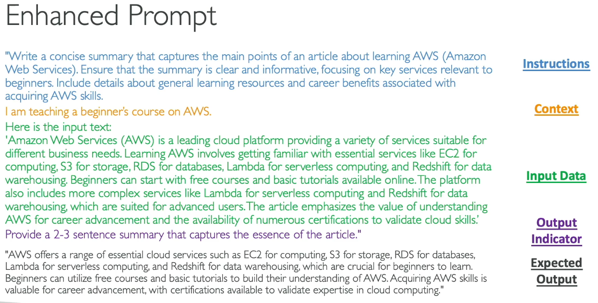
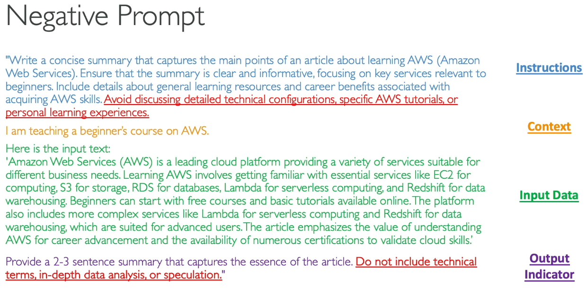

What is Prompt Engineering ?
---

- Prompt Engineering - Developing, designing, optimizing prompts to enhance the output of FMs Models for your requirements.

- We can Improve prompt by below techniques:

## 1. Enhanced Prompt

  - **Instructions** - A task for the model to do. How should model perform.

  - **Context** - Provie external informations to guide the model

  - **Input Data** - Input for which you want a response.

  - **Output Indicator** - The output type or format.

## 2. Negative Prompting

- This is another thechnique where we explicitly instruct the model on what **not** to include or **do in its response**.

- Negative Prompting helps to:

  - **Avoide Unwanted Content** - Explicitly state **What not to include**, **Reducing the chances of irrelevant or inappropriate content**.

  - **Maintain Focus** - Helpsthe model to stay on topic and not stray into areas that are not useful or desired

  - **Enhance Clarity** - Prevents the use of complex terminology or detailed data, making the output clearer and more accessbil.

