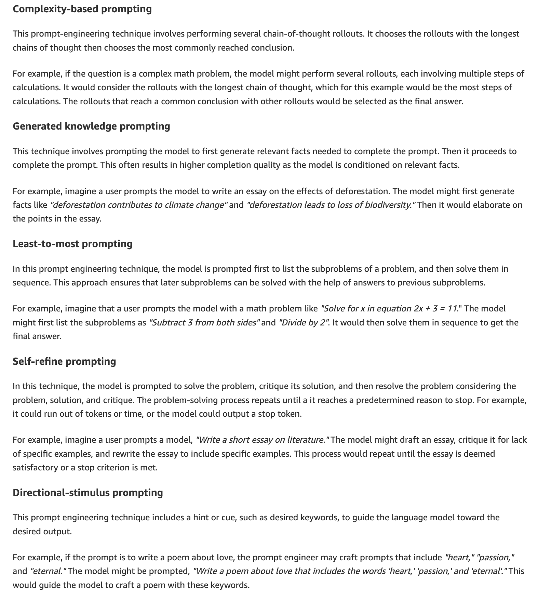
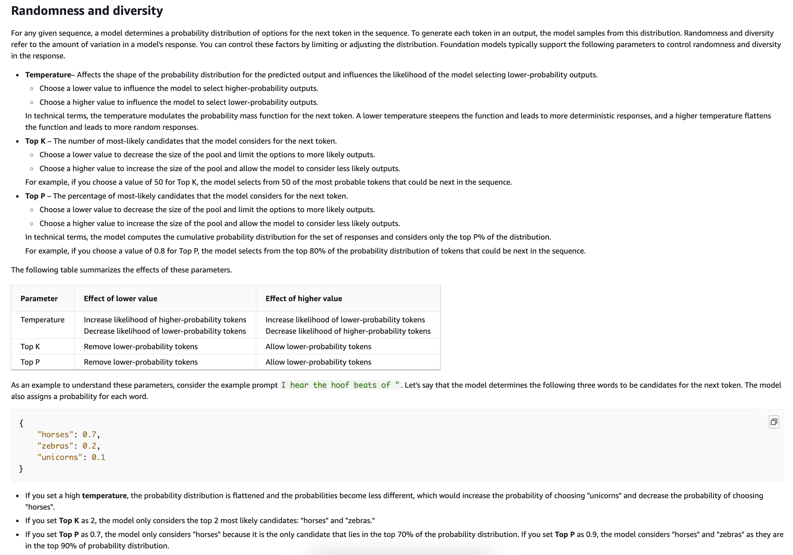
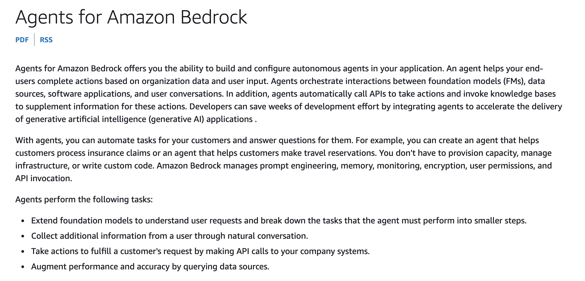

Q A company uses a foundation model (FM) from Amazon Bedrock for an AI search tool. The company wants to fine-tune the model to be more accurate by using the company's data.
Which strategy will successfully fine-tune the model?

**A. Provide labeled data with the prompt field and the completion field.**
B. Prepare the training dataset by creating a .txt file that contains multiple lines in .csv format.
C. Purchase Provisioned Throughput for Amazon Bedrock.
D. Train the model on journals and textbooks.

Correct Answer: A

Why A is correct:
To fine-tune a foundation model (FM) in Amazon Bedrock, **you must provide task-specific labeled training data**. Bedrock requires this dataset to be formatted **only as JSON Lines (.jsonl)**, where each line is a JSON object containing a prompt field (the input sample) and a completion field (the expected labeled output sample).   

Q Which feature of Amazon OpenSearch Service gives companies the ability to build vector database applications?

A. Integration with Amazon S3 for object storage
B. Support for geospatial indexing and queries
**C. Scalable index management and nearest neighbor search capability**
D. Ability to perform real-time analysis on streaming data
 
`OpenSearch is useful when you need search + vector similarity + filtering/analytics together.`

Q Which option is a use case for generative AI models?

A. Improving network security by using intrusion detection systems
`B. Creating photorealistic images from text descriptions for digital marketing`
C. Enhancing database performance by using optimized indexing
D. Analyzing financial data to forecast stock market trends

Q A company wants to use a large language model (LLM) on Amazon Bedrock for sentiment analysis. The company wants to classify the sentiment of text passages as positive or negative.

Which prompt engineering strategy meets these requirements?

`A. Provide examples of text passages with corresponding positive or negative labels in the prompt followed by the new text passage to be classified.`

- Providing input-output examples directly within the prompt before asking the model to perform the task is known as few-shot prompting. Giving the model sample text passages alongside their correct "positive" or "negative" labels gives it a clear pattern to follow for classifying the new input accurately.

B. Provide a detailed explanation of sentiment analysis and how LLMs work in the prompt.
C. Provide the new text passage to be classified without any additional context or examples.
D. Provide the new text passage with a few examples of unrelated tasks, such as text summarization or question answering.

Q A company has developed an ML model for image classification. The company wants to deploy the model to production so that a web application can use the model.
The company needs to implement a solution to host the model and serve predictions without managing any of the underlying infrastructure.
Which solution will meet these requirements?

**A. Use Amazon SageMaker Serverless Inference to deploy the model.**
B. Use Amazon CloudFront to deploy the model.
C. Use Amazon API Gateway to host the model and serve predictions.
D. Use AWS Batch to host the model and serve predictions.

Q An AI company periodically evaluates its systems and processes with the help of independent software vendors (ISVs). The company needs to receive email message notifications when an ISV's compliance reports become available.
Which AWS service can the company use to meet this requirement?

A. AWS Audit Manager
**B. AWS Artifact**
C. AWS Trusted Advisor
D. AWS Data Exchange

Q A company wants to use a large language model (LLM) to develop a conversational agent. The company needs to prevent the LLM from being manipulated with common prompt engineering techniques to perform undesirable actions or expose sensitive information.
Which action will reduce these risks?

**A. Create a prompt template that teaches the LLM to detect attack patterns.**
B. Increase the temperature parameter on invocation requests to the LLM.
C. Avoid using LLMs that are not listed in Amazon SageMaker.
D. Decrease the number of input tokens on invocations of the LLM.

Q A company is using the Generative AI Security Scoping Matrix to assess security responsibilities for its solutions. The company has identified four different solution scopes based on the matrix.
Which solution scope gives the company the MOST ownership of security responsibilities?

A. Using a third-party enterprise application that has embedded generative AI features.
B. Building an application by using an existing third-party generative AI foundation model (FM).
C. Refining an existing third-party generative AI foundation model (FM) by fine-tuning the model by using data specific to the business.
**D. Building and training a generative AI model from scratch by using specific data that a customer owns.**

Q Which AWS service or feature can help an AI development team quickly deploy and consume a foundation model (FM) within the team's VPC?

A. Amazon Personalize
**B. Amazon SageMaker JumpStart**
C. PartyRock, an Amazon Bedrock Playground
D. Amazon SageMaker endpoints

Q A company has terabytes of data in a database that the company can use for business analysis. The company wants to build an AI-based application that can build a SQL query from input text that employees provide. The employees have minimal experience with technology.
Which solution meets these requirements?

**A. Generative pre-trained transformers (GPT)**
B. Residual neural network
C. Support vector machine
D. WaveNet

- **GPT (Generative Pre-Trained Transformer) - Generate human text or computer code based on input prompts**

**Question 37:**

Q > *An AI practitioner is building a model to generate images of humans in various professions. The AI practitioner discovered that the input data is biased and that specific attributes affect the image generation and create bias in the model.*
> *Which technique will solve the problem?*
> * **A.** Data augmentation for imbalanced classes
> * **B.** Model monitoring for class distribution
> * **C.** Retrieval Augmented Generation (RAG)
> * **D.** Watermark detection for images
> 
> 

**Correct Answer: A**

**Why A is correct:**
Data augmentation for imbalanced classes helps mitigate dataset bias by creating additional, diverse training samples for underrepresented groups or attributes (e.g., adding more samples of various demographics in specific professions). Rebalancing the training dataset directly addresses the root cause of the bias during training.

**Why the other options are incorrect:**

* **B is incorrect:** Model monitoring tracks class distribution during deployment to observe behavior, but it does not fix or mitigate the underlying data bias during training.
* **C is incorrect:** Retrieval-Augmented Generation (RAG) is used to ground text models by pulling in relevant external knowledge, not for resolving class imbalance or bias in image generation models.
* **D is incorrect:** Watermark detection is used for identifying digital signatures or origin tags in images and plays no role in addressing algorithmic or data bias.

Ready whenever you are for Q38!

Q **Question 38:**

> *A company is implementing the Amazon Titan foundation model (FM) by using Amazon Bedrock. The company needs to supplement the model by using relevant data from the company's private data sources. Which solution will meet this requirement?*
> * **A.** Use a different FM.
> * **B.** Choose a lower temperature value.
> * **C.** Create an Amazon Bedrock knowledge base.
> * **D.** Enable model invocation logging.
> 
> 

**Correct Answer: C**

**Why C is correct:**
[Amazon Bedrock Knowledge Bases](https://www.examtopics.com/exams/amazon/aws-certified-ai-practitioner-aif-c01/view/4/#) implement Retrieval-Augmented Generation (RAG). They connect foundation models like Amazon Titan directly to your company's private data repositories (like Amazon S3), allowing the model to search, retrieve, and incorporate context from your internal documents to generate grounded, accurate answers.

**Why the other options are incorrect:**

* **A is incorrect:** Switching to another foundation model does not give the system access to your proprietary, private company data.
* **B is incorrect:** Lowering the temperature makes model responses more deterministic and less creative, but it cannot introduce new or external domain-specific knowledge that wasn't in the original training data.
* **D is incorrect:** Model invocation logging records prompt and response payload metadata for auditing and compliance, but it does not supply external data context to the model during inference.

Q **Question 38:**

> *A company is implementing the Amazon Titan foundation model (FM) by using Amazon Bedrock. The company needs to supplement the model by using relevant data from the company's private data sources. Which solution will meet this requirement?*
> * **A.** Use a different FM.
> * **B.** Choose a lower temperature value.
> * **C.** Create an Amazon Bedrock knowledge base.
> * **D.** Enable model invocation logging.
> 
> 

**Correct Answer: C**

**Why C is correct:**
[Amazon Bedrock Knowledge Bases](https://www.examtopics.com/exams/amazon/aws-certified-ai-practitioner-aif-c01/view/4/#) implement Retrieval-Augmented Generation (RAG). They connect foundation models like Amazon Titan directly to your company's private data repositories (like Amazon S3), allowing the model to search, retrieve, and incorporate context from your internal documents to generate grounded, accurate answers.

**Why the other options are incorrect:**

* **A is incorrect:** Switching to another foundation model does not give the system access to your proprietary, private company data.
* **B is incorrect:** Lowering the temperature makes model responses more deterministic and less creative, but it cannot introduce new or external domain-specific knowledge that wasn't in the original training data.
* **D is incorrect:** Model invocation logging records prompt and response payload metadata for auditing and compliance, but it does not supply external data context to the model during inference.

Q **Question 40:**

> *A company wants to deploy a conversational chatbot to answer customer questions. The chatbot is based on a fine-tuned Amazon SageMaker JumpStart model. The application must comply with multiple regulatory frameworks.*
> *Which capabilities can the company show compliance for? (Choose two.)*
> * **A.** Auto scaling inference endpoints
> * **B.** Threat detection
> * **C.** Data protection
> * **D.** Cost optimization
> * **E.** Loosely coupled microservices
> 
> 

**Correct Answers: B and C**

**Why B and C are correct:**

* **B (Threat Detection):** Regulatory frameworks require continuous security monitoring and the ability to detect malicious activities, such as prompt injection attempts, unauthorized access, or unusual traffic patterns.
* **C (Data Protection):** Safeguarding sensitive information (like PII) through mechanisms like encryption (in transit and at rest), access management, and privacy compliance is a foundational regulatory mandate.

**Why the other options are incorrect:**

* **A is incorrect:** Auto scaling inference endpoints manage system scalability and availability during high load, but it is an operational feature rather than a security or compliance control.
* **D is incorrect:** Cost optimization ensures efficient cloud spending, which is a business objective, not a regulatory framework compliance capability.
* **E is incorrect:** Using loosely coupled microservices is a software architecture pattern that aids maintainability and flexibility, but it does not satisfy compliance requirements on its own.

Q Question 21:
A company is using Amazon Bedrock and it wants to regulate the number of most-likely candidates considered for the next word in the model's output.

Which of the following inference parameters would you recommend for the given use case?

Correct answer
Top K

Top P

Stop sequences

Your answer is incorrect
Temperature

Overall explanation
Correct option:

Top K

Top K represents the number of most likely candidates that the model considers for the next token. Choose a lower value to decrease the size of the pool and limit the options to more likely outputs. Choose a higher value to increase the size of the pool and allow the model to consider less likely outputs.

Q A healthcare analytics company has developed a machine learning model to predict patient outcomes based on historical medical data. During testing, the model demonstrates high accuracy and performs well on the training dataset, but once deployed in a real-world production environment, its accuracy drops significantly when processing new, unseen patient records. The company needs to improve the model's ability to generalize and perform well on new data, ensuring reliable predictions in the production setting.

What would be the most effective approach to fix this problem?

Correct answer
**The company should use hyperparameters for model tuning, which involves adjusting parameters such as regularization, learning rates, and dropout rates to enhance the model's ability to generalize well to new data**

Your answer is incorrect
The company should increase the amount of training data, which can help the model learn more diverse patterns and improve its performance on new, unseen data by exposing it to a wider range of examples

The company should reduce the amount of training data, which can help eliminate noise in the data

The company should swap the existing model with a state-of-the-art generative AI model

Overall explanation
Correct option:

The company should use hyperparameters for model tuning, which involves adjusting parameters such as regularization, learning rates, and dropout rates to enhance the model's ability to generalize well to new data

Hyperparameter tuning is the most effective solution in this scenario because it allows the company to adjust the settings that control the learning process of the model. By fine-tuning hyperparameters, such as increasing regularization or early stopping or adjusting dropout rates, the model can avoid overfitting to the training data and better generalize to new, unseen data in production. This approach helps improve the model's performance across various data distributions.

Q A media company has developed an AI-based image generation model to create promotional materials, but it has noticed that the model consistently produces biased outputs, such as generating fewer images representing certain demographic groups. This issue stems from the input data used to train the model, which is imbalanced and underrepresents these groups. To ensure fair representation and mitigate bias in the generated images, the company needs to implement an effective approach to address the data imbalance in its training dataset.

What would be the most suitable strategy to achieve this goal?

- Apply model regularization techniques to address the imbalance in data

- Leverage human intervention to manually correct the imbalanced dataset

- Use another model that can handle the imbalance in data

- **Augment the data by generating new instances of data for underrepresented groups**

`Data Augmentations - Will expand the trainig dataset by automatically generate new instances for the under-represented groups.`

Q A retail company is looking to optimize its supply chain planning and reduce stockouts. The team is exploring various AWS services to support this effort and is particularly interested in using machine learning for accurate resource planning. The team needs to ensure that the service is well-suited to address their specific use cases.

Which of the following is the best-fit for the Amazon Forecast service?

- Detect and categorize toxic audio and foster a safe and inclusive online environment

- Design conversational solutions that respond to frequently asked questions for technical support, and HR benefits

- **Predict product demand to accurately vary inventory and pricing at different store locations**

- Recommendations tailored to a user’s profile, behavior, preferences, and history

- Amazon Forecast is a fully managed service that uses statistical and machine learning algorithms to deliver highly accurate time-series forecasts. Based on the same technology used for time-series forecasting at Amazon.com, Forecast provides state-of-the-art algorithms to predict future time-series data based on historical data and requires no machine learning experience.

Here are some common use cases for Amazon Forecast:

    - Retail demand planning – Predict product demand, allowing you to accurately vary inventory and pricing at different store locations.

    - Supply chain planning – Predict the quantity of raw goods, services, or other inputs required by manufacturing.

    - Resource planning – Predict requirements for staffing, advertising, energy consumption, and server capacity.

    - Operational planning – Predict levels of web traffic, AWS usage, and IoT sensor usage.

Q Which of the following embedding models would be most suitable for differentiating the contextual meanings of words when applied to different phrases?

- Word2Vec

- Singular Value Decomposition (SVD)

- Principal Component Analysis (PCA)

- **Bidirectional Encoder Representations from Transformers (BERT)**

Overall explanation
Correct option:

**Bidirectional Encoder Representations from Transformers (BERT)**

Embedding models are algorithms trained to encapsulate information into dense representations in a multi-dimensional space. Data scientists use embedding models to enable ML models to comprehend and reason with high-dimensional data.

BERT is the correct answer because it is specifically designed to capture the contextual meaning of words by looking at both the words that come before and after them (bidirectional context). Unlike older models that use static embeddings, BERT creates dynamic word embeddings that change depending on the surrounding text, allowing it to understand the different meanings of the same word in various contexts. This makes BERT ideal for tasks that require understanding the nuances and subtleties of language.

Q As a developer specializing in Large Language Models (LLMs) at a technology company, you have been tasked with migrating the company’s AI infrastructure to AWS Cloud to support the development of LLM-based solutions for various applications, such as natural language processing, text generation, and chatbots. The company is looking for AWS services that offer robust support for training, deploying, and managing LLMs while ensuring scalability, security, and integration with other cloud services.

Which AWS services would you recommend for developing LLM-based solutions in this environment? (Select two)

- **Amazon Bedrock**
- **Amazon SageMaker JumpStart**

Q A retail company needs to perform sentiment analysis for its customer service audio calls.

Which AWS services would you recommend for this requirement?

- Amazon Transcribe and Amazon Translate

- Amazon Translate and Amazon Comprehend

- **Amazon Transcribe and Amazon Comprehend**

- Amazon Rekognition and Amazon Transcribe

Amazon Transcribe converts audio input into text, which opens the door for various text analytics applications on voice input

Amazon Comprehend is a natural language processing (NLP) service that uses machine learning to find insights and relationships in text, no machine learning experience is required. Amazon Comprehend uses machine learning to help you uncover the insights and relationships in your unstructured data.

By using Amazon Comprehend on the converted text data from Amazon Transcribe, you can perform sentiment analysis or extract entities and key phrases.

Q A technology company is utilizing multiple machine learning models across different departments, such as marketing, customer support, and product development, to address various business needs. To enhance overall performance, the company wants these models to learn from each other by sharing the latest data insights and patterns discovered by each model. The goal is to optimize the models' accuracy and efficiency by effectively using the most up-to-date information available from all sources.

Given this objective, which approach would be the most suitable for achieving cross-model optimization?

- The company should use incremental training, an approach that allows models to be updated incrementally with new data without needing a complete retraining from scratch

- The company should use self-supervised learning, a technique where the model learns patterns and representations from unlabeled data without relying on explicit supervision or labeled datasets

- **The company should use transfer learning, a method where a model pre-trained on one task is adapted to improve performance on a different but related task by leveraging knowledge from the original task**

- The company should use reinforcement learning, a strategy where an agent learns to make decisions by interacting with an environment and receiving rewards or penalties based on its actions

`Transfer learning is the most suitable approach in this scenario. It allows a model to utilize the knowledge learned from one task or dataset to improve its performance on a new, but related task. For a company using multiple models for different use cases, transfer learning can help optimize performance by adapting insights from the latest data generated by other models. This approach reduces the need for extensive data and computational resources while ensuring that the models benefit from shared knowledge across related domains or tasks.`

Q A retail analytics company is analyzing a large dataset containing customer purchase history, product details, and sales trends to gain insights into customer behavior and optimize inventory management. To achieve this, the team is focused on calculating various statistical measures to summarize data characteristics and using visualizations to uncover patterns and trends. These tasks are critical for understanding the underlying structure and dynamics of the data before proceeding to model development or predictive analysis.

Which phase of the data science process does this work primarily belong to?

- Data Augmentation

- **Exploratory Data Analysis (EDA)**

`The company is in the Exploratory Data Analysis (EDA) phase, which involves examining the data through statistical summaries and visualizations to identify patterns, detect anomalies, and form hypotheses. This phase is crucial for understanding the dataset’s structure and characteristics, making it the most appropriate description of the current activities. Tasks like calculating statistics and visualizing data are fundamental to EDA, helping to uncover patterns, detect outliers, and gain insights into the data before any modeling is done. EDA serves as the foundation for building predictive models by providing a deep understanding of the data.`

- Data Preparation

- Model Evaluation

Q **Question 40**

**Question Breakdown**
A company using Amazon Bedrock models needs to monitor and log both the **input data (prompts)** sent to the models and the **output responses (predictions)** generated by them for compliance, auditing, and troubleshooting.

**Correct Answer**

> *The company should enable [model invocation logging](https://docs.aws.amazon.com/bedrock/latest/userguide/model-invocation-logging.html), which allows for detailed logging of all requests and responses during model invocations in Amazon Bedrock.*

**1. Model Invocation Logging**
We can Integrate CloudWatch with BedRock to Send all Invocations of BedRock Agents, All logs by using CloudWatch Insights to Amazon S3.

This can include text, images and embeddings

So we can analyze the logs in real time from cloudwatch logs.

We can get full tracing and monitoring of Bedrock.

Q **Question 49**

**Question Breakdown**
A developer is working on an AI application for predicting customer churn. The developer is collaborating with a research team to ensure the best model is selected for the application. The application needs to accurately identify customers who are likely to leave the service within the next six months. What should the developer ask the research team to do in order to ensure that the best model is selected for the AI application?

**Correct Answer**

> `A narrowly defined use case provides clear and specific requirements for the application, helping the research team understand exactly what the model needs to accomplish. This clarity is crucial for selecting the most appropriate model that fits the specific needs and constraints of the application.`

> *Define the use case of the application narrowly.*

**Why This Is Correct**

* A narrowly defined use case provides clear and specific requirements for the application, helping the research team understand exactly what the model needs to accomplish.
* Having strict clarity on goals and constraints allows the team to select and evaluate models based on precise performance metrics rather than vague requirements.

Q **Question 50**

**Question Breakdown**
A marketing analytics company is using generative AI to create custom reports and insights based on client data. The team is focused on improving the quality and relevance of the AI-generated content by refining how they interact with the model through prompts. To ensure the AI consistently produces high-quality and accurate outputs, they want to understand the best practices for crafting effective prompts that guide the model efficiently. What are the key constituents of a good prompting technique in this context?

---

**Correct Answer**

> *Instructions, Context, Input data, Output Indicator*

**Why This Is Correct**
According to [AWS Prompt Engineering documentation](https://aws.amazon.com/what-is/prompt-engineering/), a well-structured prompt relies on four core text elements:

* **Instructions:** A clear directive telling the model what task to perform or how to act.
* **Context:** Relevant background or domain information that guides the model's response.
* **Input Data:** The specific content or material you want the model to process or summarize.
* **Output Indicator:** Specifications defining the required structure, style, or format of the output (e.g., bullet points, JSON, concise summary).

**Why the Distractors Are Incorrect**

* **Hyperparameters (e.g., learning rate, batch size, epoch count):** These are external configuration settings adjusted before training or fine-tuning a model, not components of a text prompt.
* **Model Parameters (e.g., weights and biases):** These are internal variables learned during training that define how the model processes information, controlled by the model provider or updated during customization, not text elements supplied in a prompt.

Q An e-commerce company wants to analyze thousands of customer reviews it receives daily to understand customer sentiment — whether positive, negative, neutral, or mixed. The goal is to gain insights into customer opinions, identify potential issues, and refine product offerings and marketing strategies. To achieve this, the company's data science team is exploring AWS AI services that can perform sentiment analysis on the written customer reviews.

Which of the following would you recommend? (Select two)

- **Amazon Bedrock**

- Amazon Personalize

- Amazon Rekognition

- **Amazon Comprehend**

- Amazon Textract - Textract is an OCR (Optical Character Recognition) service that extracts printed or handwritten text from scanned documents, PDFs, and images. It is useful for digitizing text but does not offer any features for analyzing or interpreting the sentiment of the extracted text.

Q The marketing department at a retail company is working on a campaign for the upcoming Thanksgiving holidays. The department wants to exclude competitive brand names or sensitive topics from the content produced via generative AI prompts.

What type of prompting technique does the given use case represent?

- Few-shot Prompting

- Zero-shot Prompting

- Chain-of-thought prompting

- **Negative prompting**

Q A financial services company is developing machine learning models to predict customer credit risk and detect fraudulent transactions. After deploying the models, the company observes that the predictions are not as accurate as desired, leading to potential financial losses or missed fraud detections. To improve the accuracy of these models, the company has hired you as an AI Practitioner.

Which approach would you recommend to enhance the accuracy of the company's machine learning models?

- The company should increase regularization to improve the accuracy of the model

- The company should decrease the learning rate, which reduces the size of the steps taken during optimization

- **The company should increase the number of epochs, which involves training the model for more iterations over the dataset**

- The company should reduce the batch size, which means processing fewer samples in each training step

Q **Question 61**

**Question Breakdown**
A technology company developing a natural language processing (NLP) solution wants to understand how Transformer models function for tasks like translation, summarization, and text generation, ensuring they pick the right architecture for their generative AI application.

---

**Correct Answer**

> *Transformer models use a self-attention mechanism and implement contextual embeddings.*

**Why This Is Correct**

* **Self-Attention Mechanism:** Allows the model to evaluate and weigh the importance of different words in a sentence relative to one another, regardless of their distance apart.
* **Contextual Embeddings:** Captures word meanings dynamically based on the surrounding sentence context rather than relying on static definitions.

**Why the Distractors Are Incorrect**

* **Training two neural networks in a competitive manner:** Describes **Generative Adversarial Networks (GANs)**, where a generator and discriminator compete to create realistic data samples.
* **Learning a compact representation of data called latent space:** Describes **Variational Autoencoders (VAEs)**, which encode input data into a compressed latent space and decode it back to reconstruct images or data.
* **Creating new data by iteratively making controlled random changes:** Describes **Diffusion Models**, which generate data by learning to reverse a process of gradually adding noise.

Q A healthcare analytics company aims to enhance its AI capabilities by fine-tuning a foundation model (FM) in Amazon Bedrock to specialize in medical text analysis. To achieve this, the company plans to use its own task-specific labeled dataset, consisting of annotated clinical notes and medical records, to fine-tune the model for greater accuracy in extracting relevant information.

Given these requirements, which approach would be most suitable?

- **The company should use Provisioned Throughput mode, which allows the company to reserve a specific amount of capacity in advance**

- The company should use On-Demand mode, which provides flexibility by charging only for the resources consumed

- The company should leverage batch inference to facilitate fine-tuning of the model

- The company should leverage Amazon Bedrock playground to facilitate fine-tuning of the model

**Examp Hints**

  - **Fine-Tuned/Custom Model in Bedrock** - **Provisioned Throughput**

  - **Std Base Model with Pay-per-Token** - **On-Demand**

  - **Processing Large S3 Datasets Asychronously** - **Batch Inference**.

Q A company has developed an app that translates text from English to various other languages. To enhance the quality and accuracy of these translations, the company seeks to evaluate and improve its translation model's performance.

Which metric would be most appropriate for assessing the accuracy of the translations?

- **The company should use BLEU (Bilingual Evaluation Understudy) score, a metric specifically designed to evaluate the quality of text that has been machine-translated by comparing it with one or more reference translations**

- The company should use BERT score, a metric that leverages contextual embeddings from BERT to evaluate the semantic similarity between machine-generated translations and reference translations

- The company should use ROUGE (Recall-Oriented Understudy for Gisting Evaluation), a metric primarily used for evaluating the quality of text summarization and comparing the overlap between predicted and reference summaries

- The company should use Accuracy, a general metric that measures the proportion of correctly predicted outputs

**BERT** for Sementic similarity - Converts words into vector embeddings and measure similarity between words.

**BLEU (Bilingual Evaluations)** - Use for  machine transaltion / generated words Quality and it calculating the precision of overlapping words and n-grams phrases between the machine generated translation and human reference.

**ROUGH** - Used for **Evaluating Text Summarizations Model** rather than `Machine Translations words`.

Q **Question 64**

**Question Breakdown**
A retail company wants to implement AI-driven solutions to enhance in-store operations (such as automating inventory management and visual monitoring security). The company requires pre-trained computer vision (CV) models for rapid deployment, alongside the flexibility to customize these models for specific business needs.

---

**Correct Answer**

> *[Amazon Rekognition](https://docs.aws.amazon.com/rekognition/latest/dg/what-is.html)*

**Why This Is Correct**

* [Amazon Rekognition](https://docs.aws.amazon.com/rekognition/latest/dg/what-is.html) **provides fully managed, pre-trained computer vision capabilities** out of the box via simple APIs for image and video analysis (object detection, facial analysis, text detection).
* It also offers **Amazon Rekognition Custom Labels**, which gives non-ML experts the flexibility to customize pre-trained models to identify unique objects, logos, or brand-specific inventory items tailored to specific business needs.

**Why the Distractors Are Incorrect**

* **Amazon SageMaker:** While powerful, SageMaker is a general-purpose ML platform that requires building, training, and managing custom pipelines from scratch rather than offering ready-to-use, pre-trained computer vision APIs.
* **Amazon DeepRacer:** A physical $1/18\text{th}$ scale autonomous race car used primarily for learning reinforcement learning through gamified track racing.
* **Amazon Textract:** A specialized ML service focused exclusively on extracting text, tables, and data fields from documents, not general image or video surveillance analysis.

Q A financial services company is leveraging Amazon Bedrock to generate AI-driven insights and recommendations for its clients. The development team is fine-tuning the model's behavior to produce more accurate and relevant responses. As part of this process, they are experimenting with various inference parameters, including Top P, to control how the model generates text. The team needs to understand how adjusting the Top P parameter can influence the diversity and quality of the model's responses during inference.

How does the inference parameter Top P influence the model response for Amazon Bedrock?

- Influences the likelihood of the model selecting lower-probability outputs, thereby impacting the creativity of the model’s output

- Influences the number of most-likely candidates that the model considers for the next token

- Specifies the sequences of characters that stop the model from generating further tokens

- **Influences the percentage of most-likely candidates that the model considers for the next token**

Q A manufacturing company aims to leverage Amazon Bedrock to create a generative AI application that automates the monitoring of inventory levels, sales data, and supply chain information. The application should also recommend optimal reorder points and quantities to enhance operational efficiency.

What do you recommend?

- Watermark detection for Amazon Bedrock

- **Agents for Amazon Bedrock**

- **Hints** - **Optimal Reorder quantities**

- Knowledge Bases for Amazon Bedrock

- Guardrails for Amazon Bedrock

Q **Question 47**

**Question Breakdown**
A healthcare technology company is exploring Amazon Bedrock to develop AI-driven solutions for personalized patient care and predictive diagnostics. The team is particularly interested in customizing Foundation Models (FMs) to align with their proprietary medical data and specific use cases. To make an informed decision, they need to understand the available methods for customizing models within Amazon Bedrock to meet their unique requirements.

**Correct Answer**

> *Fine-tuning improves model accuracy for specific tasks using labeled datasets, whereas Continued Pre-training uses unlabeled domain data to accumulate broader domain knowledge.*

**Why This Is Correct**

* **Fine-Tuning:** Designed for supervised learning tasks using **labeled training data** (e.g., prompt-completion pairs in JSONL format) to improve performance on specific downstream functions or formatting requirements.
* **Continued Pre-Training:** Designed for unsupervised learning using **unlabeled raw text data** to expose the foundation model to new domain-specific jargon, vocabulary, and contextual patterns (such as specialized clinical jargon or medical literature).

**Why the Distractors Are Incorrect**

* **Reversing data usage (Fine-tuning with unlabeled data vs. Continued Pre-training with labeled data):** Fine-tuning strictly relies on supervised, labeled datasets, while Continued Pre-training relies on unlabeled datasets.
* **Fine-tuning creates a brand new foundation model from scratch:** Fine-tuning adapts an existing pre-trained model by updating/adapting specific parameters; it does not train a model from scratch.
* **Continued Pre-training replaces the need for Provisioned Throughput:** Custom models generated via either Fine-tuning or Continued Pre-training require **Provisioned Throughput** to run inference in Amazon Bedrock.

Q Which of the following services is specifically designed to provide insights into model predictions by explaining how input features contribute to the final output?

- Amazon SageMaker Canvas

- Amazon SageMaker Model Monitor

- Amazon SageMaker Feature Store

- **Amazon SageMaker Clarify**

Q A biotechnology company is using a Foundation Model (FM) in Amazon Bedrock to analyze complex genetic data and provide insights for new drug development. However, the company wants to enhance the model's performance to make it an expert specifically in the domain of genomics, enabling it to better understand domain-specific terminology, patterns, and datasets.

Which of these approaches would be the most effective for turning the Foundation Model into a domain-specific expert? (Select two)

The company should use Supervised Learning, which involves training the model using labeled data to predict specific outputs and improve the expertise of the model in the given domain

The company should use Incremental Learning, which allows the model to learn new data without forgetting the previously learned information for specializing in the given domain

The company should use Reinforcement Learning, a method where the model learns through trial and error by receiving rewards for correct actions, thereby adapting the model to a specific domain

- **The company should use Continued Pre-Training, which involves further training the model on a large corpus of domain-specific data, enhancing its ability to understand domain-specific terms, jargon, and context**

- **The company should use Domain Adaptation Fine-Tuning, which involves fine-tuning the model on domain-specific data to adapt its knowledge to that particular domain**

Q A software company is evaluating different AWS services to integrate AI-powered solutions into its applications. The team is particularly interested in Amazon Q for automating business workflows and Amazon Bedrock for leveraging pre-trained foundation models. To make an informed decision on which service to adopt for their specific use cases, they need to understand the core differences between the two, including their capabilities, target use cases, and how each service supports AI-driven tasks.

Which of the following represent the correct options for the given scenario? (Select two)

- **With Amazon Bedrock, you can choose the underlying Foundation Model. However, Amazon Q does not allow you to choose the underlying Foundation Model**

- **Amazon Q is a generative AI–powered assistant that allows you to create pre-packaged generative AI applications, whereas, Amazon Bedrock provides an environment to build and scale generative AI applications using a Foundation Model (FM)**

- Both Amazon Q and Amazon Bedrock are generative AI-powered assistants that allow you to create pre-packaged generative AI applications

- With Amazon Q, you can choose the underlying Foundation Model. However, Amazon Bedrock does not allow you to choose the underlying Foundation Model

- Amazon Bedrock is a generative AI–powered assistant that allows you to create pre-packaged generative AI applications, whereas, Amazon Q provides an environment to build and scale generative AI applications using a Foundation Model (FM)

Q A company is exploring Amazon Q to streamline its internal business processes through automation and generative AI capabilities. The team is particularly interested in understanding how Amazon Q integrates generative AI techniques within its web application workflow to enhance tasks such as automating report generation, creating summaries, and analyzing large datasets. They want to know which specific generative AI techniques are employed in Amazon Q to achieve these outcomes.

Which of the following generative AI techniques are used in the Amazon Q Business web application workflow? (Select two)

- Generative adversarial network (GAN)

- **Large Language Model (LLM)**

- Diffusion Model

- Variational autoencoders (VAE)

- **Retrieval-Augmented Generation (RAG)**

Q A financial services company is deploying multiple machine learning models on Amazon SageMaker to provide real-time credit risk assessments and fraud detection. The data science team needs a tool to monitor and track the performance and usage of these models hosted on endpoints, ensuring that they can easily manage and troubleshoot any issues related to real-time inference. To streamline this process, they are exploring which Amazon SageMaker service can help them track and manage their deployed models effectively.

What do you recommend?

- Amazon SageMaker JumpStart

- Amazon SageMaker Clarify

- Amazon SageMaker Ground Truth

- **azon SageMaker Model Dashboard**

Q A retail company is looking to streamline its machine learning workflows and improve collaboration between data science teams. The team is considering using MLflow with Amazon SageMaker to manage the end-to-end machine learning lifecycle. Understanding how MLflow integrates with Amazon SageMaker will help the team decide if this combination is the right fit for their machine learning project management needs.

Given this context, which statement best defines the use of MLflow with Amazon SageMaker?

- Label data using human-in-the-loop

- **Manage machine learning experiments**

- Leverage no-code ML

- Perform automatic model tuning

Q **Question:**

A retail company is looking to streamline its machine learning workflows and improve collaboration between data science teams. The team is considering using MLflow with Amazon SageMaker to manage the end-to-end machine learning lifecycle. Understanding how MLflow integrates with Amazon SageMaker will help the team decide if this combination is the right fit for their machine learning project management needs.

Given this context, which statement best defines the use of MLflow with Amazon SageMaker?

* Label data using human-in-the-loop
* **Manage machine learning experiments** *(Correct)*
* Leverage no-code ML
* Perform automatic model tuning

**Why "Manage machine learning experiments" is the correct answer:**

MLflow is an open-source platform specifically designed to manage the end-to-end machine learning lifecycle, primarily focusing on tracking, organizing, analyzing, and comparing iterative ML experimentation (parameters, metrics, code, and artifacts). When integrated with Amazon SageMaker, MLflow allows data science teams to log and track experiment runs, register models, and seamlessly evaluate and compare best-performing iterations.

**Why the other options are incorrect:**

* **Label data using human-in-the-loop:** Data labeling with human feedback is handled by **Amazon SageMaker Ground Truth**, not MLflow.
* **Leverage no-code ML:** SageMaker's no-code visual interface for building models is **Amazon SageMaker Canvas**.
* **Perform automatic model tuning:** Hyperparameter optimization and automatic model tuning are performed using **SageMaker Automatic Model Tuning (AMT)**.

Q A company wants a unified search solution that can connect the company's multiple data repositories, third-party document repositories, and FAQs to create a new search experience so that the employees can efficiently find the right answers for their queries.

Which Machine Learning powered AWS service offers these search features?

- Amazon SageMaker Data Wrangler

- **Amazon Kendra**0

- Amazon Comprehend

- Amazon Textract

Q A Large Language Model (LLM) chatbot is generating responses that appear plausible and factual but are actually incorrect. What is this phenomenon called?

- **This is known as a hallucination, where the model generates seemingly accurate information that is, in fact, incorrect or fabricated**

`The term "hallucination" refers to a phenomenon in which a language model generates responses that sound plausible and appear factual but are actually false or unsupported by any underlying data. Hallucinations occur because the model relies on patterns learned during training rather than verified knowledge. This is a known limitation of LLMs, which can create convincing text that may mislead users if not carefully monitored or verified against reliable sources.`

- This is referred to as overfitting, where the model performs exceptionally well on the training data but fails to generalize to new, unseen data

- This is known as data drift, where the statistical properties of the input data change over time, causing the model's predictions to become less accurate

- This is an example of underfitting, where the model fails to capture the underlying patterns in the data, resulting in poor performance on both training and new data

Q A company is deploying a generative AI model on Amazon Bedrock and needs to reduce the cost of usage while using prompt examples of up to 10 sample tasks as part of each input.

Which approach would be the most effective in minimizing the costs associated with model usage?

- **The company should reduce the number of tokens in the input**

- The company should reduce the batch size while training the model

- The company should reduce the top-P inference parameter for the model

- The company should reduce the temperature inference parameter for the model

`For the given use case, reducing the number of tokens in the input is the most effective way to minimize costs associated with the use of a generative AI model on Amazon Bedrock. Each token represents a piece of text that the model processes, and the cost is directly proportional to the number of tokens in the input. By reducing the input length, the company can decrease the amount of computational power required for each request, thereby lowering the cost of usage.`

**Incorrect**

- The company should reduce the temperature inference parameter for the model - Reducing the temperature affects the creativity and randomness of the model's output but has no effect on the cost related to input processing. The cost of using a generative AI model is primarily determined by the number of tokens processed, not by the temperature setting. Thus, adjusting the temperature is irrelevant to cost reduction.

Q The admissions committee at an Ivy League university has noticed an increasing use of generative AI tools, such as language models, by applicants to draft their application essays. Concerned that some students may be using these tools to produce content that is not their original work, the committee aims to implement measures to detect the use of AI in essay creation. Their goal is to ensure that all submissions reflect the genuine thoughts and abilities of the applicants, thus maintaining the integrity and fairness of the admissions process.

What specific issue is the admissions committee primarily trying to address by detecting the use of generative AI in application essays?

Your answer is correct
- **Plagiarism**

- Bias

- Hallucination

- Misinterpretation

Overall explanation
Correct option:

- Plagiarism

Plagiarism involves presenting someone else's work, ideas, or creations as one's own without proper attribution. Detecting the use of generative AI tools to produce essays would help the committee identify instances where applicants might have submitted content that is not genuinely their own, thus maintaining the integrity of the admissions process. Plagiarism detection tools are intended to identify copied or non-original content, and the use of generative AI to produce essays could result in plagiarism if applicants do not properly attribute the AI's role in generating the content.

**Incorrect options:**

- Hallucination - This option is incorrect because "hallucination" in AI refers to the creation of false information, which is not the main issue the admissions committee is dealing with. The committee is focused on detecting essays that are not genuinely authored by the applicants, not on the factual accuracy of the content itself.

- Bias - This option is incorrect because the admissions committee is not concerned with bias in this context. Bias in AI-generated outputs would involve content that unfairly favors or discriminates against certain groups, which is not the same issue as ensuring that essays are the original work of the applicants.

- Misinterpretation - Misinterpretation occurs when the meaning or intent of a text is misunderstood or conveyed incorrectly. While misinterpretation might affect how an essay is read, it is not the core issue the admissions committee is focused on; their primary goal is to verify that the content is original and authored by the applicant.

